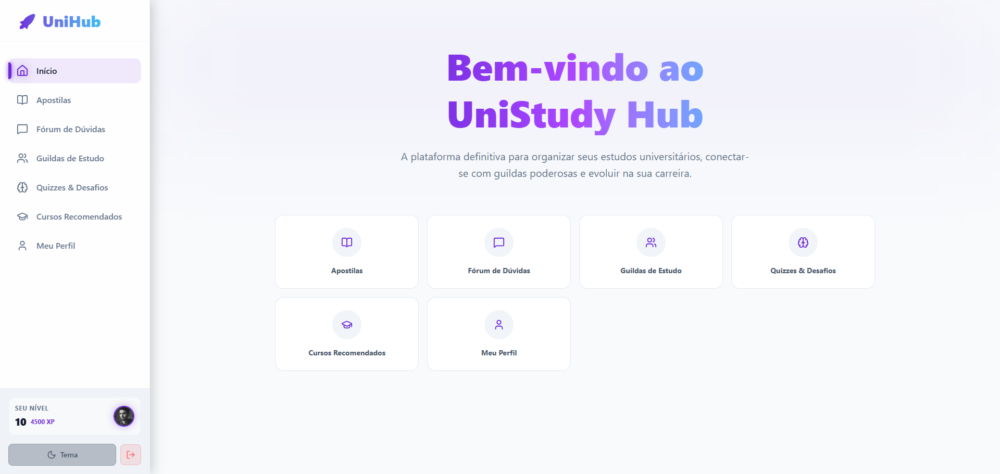
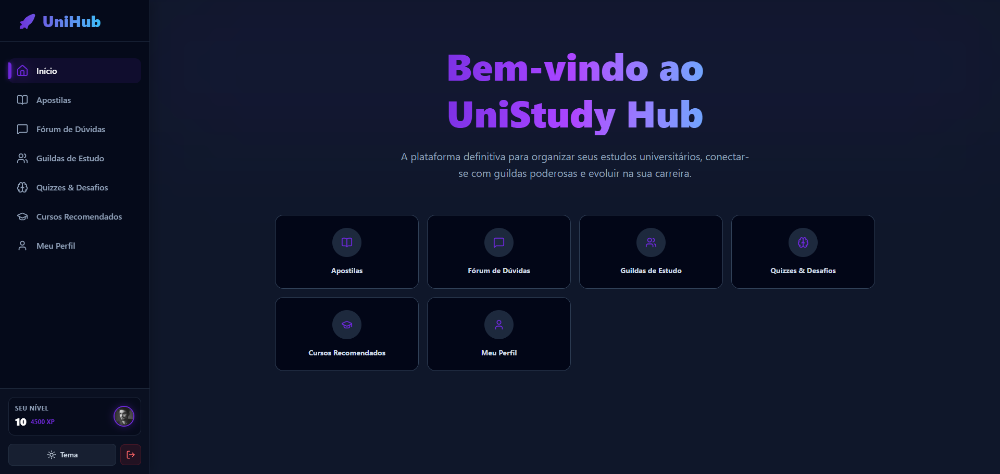
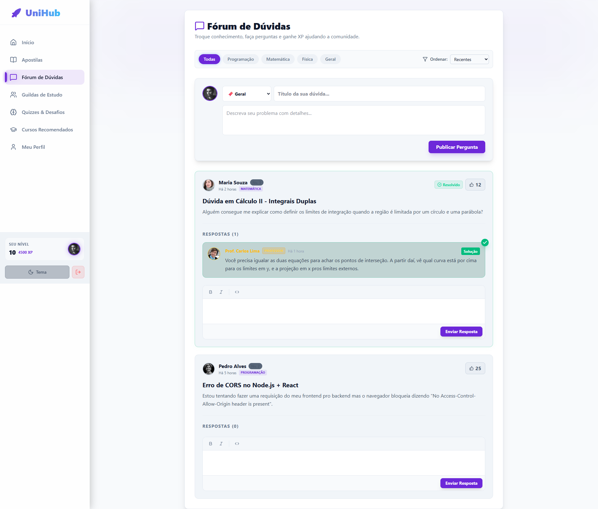
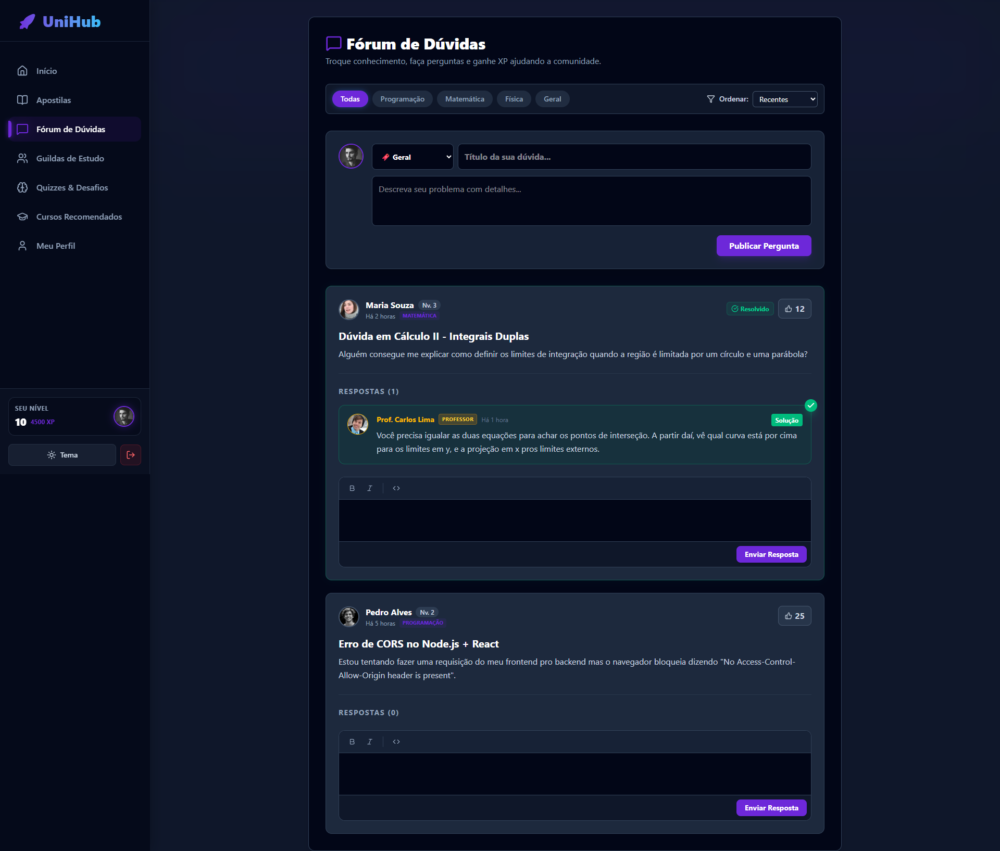

# 🎓 UniStudy Hub

O **UniStudy Hub** é uma plataforma acadêmica moderna focada em conectar alunos e professores através de um ambiente gamificado, fóruns ativos e grupos de estudos (Squads). 

### 🌞 Tema Claro vs 🌙 Tema Escuro



## 🚀 Principais Funcionalidades

- **Gamificação (XP e Níveis):** Alunos ganham experiência e sobem de nível ao ajudar colegas, responder dúvidas e interagir no fórum.
- **Fórum Acadêmico:** Um espaço colaborativo estilo "StackOverflow" acadêmico, onde dúvidas são separadas por disciplinas e podem ser marcadas como "Solução Verificada" por professores.
- **Squads de Estudo:** Criação de grupos de estudo focados em matérias específicas.
- **Mentoria Integrada:** Professores e alunos veteranos recebem selos de destaque.
- **Apostilas e Repositório:** Área para compartilhamento de materiais, links e anotações ricas.




## 🛠️ Tecnologias Utilizadas

O projeto foi construído separando as responsabilidades entre Front-end e Back-end:

**Frontend:**
- [React](https://reactjs.org/) + [Vite](https://vitejs.dev/)
- [TailwindCSS](https://tailwindcss.com/)
- React Router DOM
- Axios para comunicação com a API

**Backend:**
- [Django](https://www.djangoproject.com/) + [Django Rest Framework](https://www.django-rest-framework.org/)
- JWT para Autenticação (SimpleJWT)
- SQLite (desenvolvimento) / PostgreSQL (produção através do Render e dj-database-url)
- Gunicorn & Whitenoise (preparado para deploy)

## 💻 Como Rodar o Projeto Localmente

### Pré-requisitos
- Node.js (v18+)
- Python (3.10+)

### Início Rápido (Recomendado no Windows)
O projeto conta com scripts automáticos para facilitar sua vida. Na raiz do projeto, basta executar:

```bash
iniciar_projeto.bat
```
*(Esse script instalará todas as dependências do front e back, aplicará as migrações do banco de dados e ligará ambos os servidores simultaneamente).*

### Execução Manual

**1. Backend (Django)**
```bash
cd backend
python -m venv venv
venv\Scripts\activate
pip install -r requirements.txt
python manage.py migrate
python seed_data.py  # (Opcional) Popula o banco com dados de teste
python manage.py runserver
```

**2. Frontend (React)**
```bash
cd frontend
npm install
npm run dev
```

## 🌐 Deploy (Nuvem)
Este projeto está estruturado para rodar gratuitamente na web:
- Frontend otimizado para a **Vercel** (`VITE_API_URL` como variável de ambiente).
- Backend otimizado para o **Render.com** com script de build (`build.sh`) e banco de dados externo (PostgreSQL via **Neon.tech** ou **Supabase**).

---
*Desenvolvido com dedicação para a melhoria do ecossistema acadêmico.*
