# Programação Java

***⚠️  As imagens desta apostila foram geradas por Inteligência Artificial (ChatGPT) para fins de estudo.***

---

Autor: Renan Sergio

Curso: Programação Java

Ano: 2026

## 🔗 Links Uteis

[‣](https://app.notion.com/p/119226bb23fb80f899a3dd2a776215bb?pvs=21) 

[‣](https://app.notion.com/p/241226bb23fb80cbb9ddd932385e6b21?pvs=21) 

[‣](https://app.notion.com/p/bf31dd30493247229eba2923547a9267?pvs=21) 

[Notions.txt](Notions.txt)

## 🦾 Aulas Senai

# AULA 02 — INTRODUÇÃO AO JAVA (26/01/2026)

Java é uma linguagem para criar programas.

Tudo começa pelo método main.

```java
public class Main {
    public static void main(String[] args) {

        System.out.println("Bem vindo ao jogo, guerreiro Renan!");

    }
}
```

## COMENTÁRIOS

```java
// comentário simples

/*
comentário
grande
*/
```

# AULA 03 — SCANNER (27/01/2026)

Scanner lê dados do usuário.

```java
import java.util.Scanner;

public class Main {
    public static void main(String[] args) {

        Scanner sc = new Scanner(System.in);

        System.out.print("Nome: ");
        String nome = sc.next();

        System.out.print("Idade: ");
        int idade = sc.nextInt();

        System.out.println(nome + " tem " + idade + " anos");

    }
}
```

### EXERCICIOS

Ex01:

```java
import java.util.Scanner;

public class Main{
    public static void main(String[] args) {
        Scanner sc = new Scanner(System.in);

        String nome = sc.next();
        System.out.println(nome + " está frequentando o curso de Java");
    }
}
```

Ex02:

```java
import java.util.Scanner;

public class Main{
    public static void main(String[] args) {
        Scanner sc = new Scanner(System.in);

        System.out.print("Digite seu nome: ");
        String nome = sc.next();

        System.out.print("Digite o país que deseja visitar: ");
        String pais = sc.next();

        System.out.println(nome + " gostaria de visitar " + pais);
    }
}
```

Ex03:

```java
import java.util.Scanner;

public class Main {
    public static void main(String[] args) {
        Scanner sc = new Scanner(System.in);

        String nome1 = sc.next();
        String nome2 = sc.next();
        String nome3 = sc.next();

        System.out.println("Os nomes informados foram: " + nome1 + ", " + nome2 + " e, por fim, " + nome3);
    }
}
```

Ex04:

```java
import java.util.Scanner;

public class Main {
    public static void main(String[] args) {
        Scanner sc = new Scanner(System.in);

        int num1 = sc.nextInt();
        int num2 = sc.nextInt();

        int soma = num1 + num2;

        System.out.println("Resultado: " + soma);
    }
}
```

Ex05:

```java
import java.util.Scanner;

public class Main {
    public static void main(String[] args) {
        Scanner sc = new Scanner(System.in);

        int num1 = sc.nextInt();
        int num2 = sc.nextInt();

        int soma = num1 + num2;
        int dobro = soma * 2;

        System.out.println("Dobro da soma: " + dobro);
    }
}
```

Ex06:

```java
import java.util.Scanner;

public class Main {
    public static void main(String[] args) {
        Scanner sc = new Scanner(System.in);

        double salario, mercado, aluguel;
        double aumento = 298.0;

        System.out.print("Salário: ");
        salario = sc.nextDouble();

        System.out.print("Gasto mercado: ");
        mercado = sc.nextDouble();

        System.out.print("Gasto aluguel: ");
        aluguel = sc.nextDouble();

        double salarioFinal = salario + aumento - (mercado + aluguel);

        System.out.println("Salário líquido: " + salarioFinal);
    }
}
```

Ex07:

```java
import java.util.Scanner;

public class Main {
    public static void main(String[] args) {
        Scanner sc = new Scanner(System.in);

        String nome = sc.next();
        int tempoEmpresa = sc.nextInt();
        double salario = sc.nextDouble();

        double contribuicao = salario * (tempoEmpresa / 100.0);

        System.out.println("Contribuição de " + nome + ": " + contribuicao);
    }
}
```

# AULA 04 — BINÁRIO (28/01/2026)

### Binário → Decimal

| Binário | Decimal |
| --- | --- |
| 1011 | 11 |
| 11001 | 25 |
| 100101 | 37 |
| 111000 | 56 |
| 010101 | 21 |
| 1000001 | 65 |
| 111111 | 63 |
| 10101010 | 170 |
| 11001100 | 204 |
| 10000000000001 | 8193 |

### Decimal → Binário

| Decimal | Binário |
| --- | --- |
| 13 | 1101 |
| 25 | 11001 |
| 42 | 101010 |
| 64 | 1000000 |
| 31 | 11111 |
| 85 | 1010101 |
| 100 | 1100100 |
| 127 | 1111111 |
| 150 | 10010110 |
| 255 | 11111111 |

# AULA 05 — IF (29/01/2026)

IF = decisão.

```java
import java.util.Scanner;

public class Main {
    public static void main(String[] args) {

        Scanner sc = new Scanner(System.in);

        System.out.print("Velocidade: ");
        int velocidade = sc.nextInt();

        if (velocidade > 80) {
            System.out.println("Multado!");
        }

    }
}
```

## EXERCICIOS

Ex01:

```java
import java.util.Scanner;

public class Main {
    public static void main(String[] args) {
        Scanner sc = new Scanner(System.in);

        int numero = sc.nextInt();

        if (numero > 0) {
            System.out.println("Número positivo");
        }
    }
}
```

Ex02:

```java
import java.util.Scanner;

public class Main {
    public static void main(String[] args) {
        Scanner sc = new Scanner(System.in);

        int numero = sc.nextInt();

        if (numero % 2 == 0) {
            System.out.println("Número par");
        }
    }
}
```

Ex03:

```java
import java.util.Scanner;

public class Main {
    public static void main(String[] args) {
        Scanner sc = new Scanner(System.in);

        int idade = sc.nextInt();

        if (idade >= 18) {
            System.out.println("Maior de idade");
        }
    }
}
```

Ex04:

```java
import java.util.Scanner;

public class Main {
    public static void main(String[] args) {
        Scanner sc = new Scanner(System.in);

        double nota = sc.nextDouble();

        if (nota >= 7) {
            System.out.println("Aprovado");
        } else {
            System.out.println("Reprovado");
        }
    }
}
```

Ex05:

```java
import java.util.Scanner;

public class Main {
    public static void main(String[] args) {
        Scanner sc = new Scanner(System.in);

        int numero = sc.nextInt();

        if (numero > 0) {
            System.out.println("Positivo");
        } else {
            System.out.println("Negativo ou zero");
        }
    }
}
```

Ex06:

```java
import java.util.Scanner;

public class Main {
    public static void main(String[] args) {
        Scanner sc = new Scanner(System.in);

        int numero = sc.nextInt();

        if (numero > 10) {
            System.out.println("Maior que 10");
        } else if (numero == 10) {
            System.out.println("Igual a 10");
        } else {
            System.out.println("Menor que 10");
        }
    }
}
```

Ex07:

```java
import java.util.Scanner;

public class Main {
    public static void main(String[] args) {
        Scanner sc = new Scanner(System.in);

        double nota1 = sc.nextDouble();
        double nota2 = sc.nextDouble();

        double media = (nota1 + nota2) / 2;

        if (media >= 7) {
            System.out.println("Aprovado");
        } else if (media >= 5) {
            System.out.println("Recuperação");
        } else {
            System.out.println("Reprovado");
        }
    }
}
```

Ex08:

```java
import java.util.Scanner;

public class Main {
    public static void main(String[] args) {
        Scanner sc = new Scanner(System.in);

        int idade = sc.nextInt();

        if (idade < 12) {
            System.out.println("Criança");
        } else if (idade < 18) {
            System.out.println("Adolescente");
        } else {
            System.out.println("Adulto");
        }
    }
}
```

# AULA 06 — ELSE (02/02/2026)

ELSE = senão.

```java
import java.util.Scanner;

public class Main {
    public static void main(String[] args) {

        Scanner sc = new Scanner(System.in);

        System.out.print("Nota: ");
        int nota = sc.nextInt();

        if (nota >= 50) {
            System.out.println("Aprovado");
        } else {
            System.out.println("Reprovado");
        }

    }
}
```

## EXERCICIOS

Ex01:

```java
import java.util.Scanner;

public class Main {
    public static void main(String[] args) {
        Scanner sc = new Scanner(System.in);

        int numero = sc.nextInt();

        if (numero > 0) {
            System.out.println("Positivo");
        } else {
            System.out.println("Negativo ou zero");
        }
    }
}
```

Ex02:

```java
import java.util.Scanner;

public class Main {
    public static void main(String[] args) {
        Scanner sc = new Scanner(System.in);

        int numero = sc.nextInt();

        if (numero % 2 == 0) {
            System.out.println("Par");
        } else {
            System.out.println("Ímpar");
        }
    }
}
```

Ex03:

```java
import java.util.Scanner;

public class Main {
    public static void main(String[] args) {
        Scanner sc = new Scanner(System.in);

        int idade = sc.nextInt();

        if (idade >= 18) {
            System.out.println("Maior de idade");
        } else {
            System.out.println("Menor de idade");
        }
    }
}
```

Ex04:

```java
import java.util.Scanner;

public class Main {
    public static void main(String[] args) {
        Scanner sc = new Scanner(System.in);

        double nota = sc.nextDouble();

        if (nota >= 7) {
            System.out.println("Aprovado");
        } else {
            System.out.println("Reprovado");
        }
    }
}
```

Ex05:

```java
import java.util.Scanner;

public class Main {
    public static void main(String[] args) {
        Scanner sc = new Scanner(System.in);

        int numero = sc.nextInt();

        if (numero >= 0) {
            System.out.println("Não negativo");
        } else {
            System.out.println("Negativo");
        }
    }
}
```

Ex06:

```java
import java.util.Scanner;

public class Main {
    public static void main(String[] args) {
        Scanner sc = new Scanner(System.in);

        int temperatura = sc.nextInt();

        if (temperatura >= 30) {
            System.out.println("Quente");
        } else {
            System.out.println("Frio ou agradável");
        }
    }
}

```

Ex07:

```java
import java.util.Scanner;

public class Main {
    public static void main(String[] args) {
        Scanner sc = new Scanner(System.in);

        double saldo = sc.nextDouble();
        double saque = sc.nextDouble();

        if (saldo >= saque) {
            System.out.println("Saque realizado");
        } else {
            System.out.println("Saldo insuficiente");
        }
    }
}
```

ex08:

```java
import java.util.Scanner;

public class Main {
    public static void main(String[] args) {
        Scanner sc = new Scanner(System.in);

        int senha = sc.nextInt();

        if (senha == 1234) {
            System.out.println("Acesso permitido");
        } else {
            System.out.println("Senha incorreta");
        }
    }
}
```

# AULA 07 — ARRAY (04/02/2026)

Array guarda vários valores.

```java
public class Main {
    public static void main(String[] args) {

        String[] nomes = {"Renan", "Ryan", "Lorena"};

        for (int i = 0; i < nomes.length; i++) {
            System.out.println(nomes[i]);
        }

    }
}
```

## EXERCICIOS

ex01:

```java
public class Main {
    public static void main(String[] args) {
      
		String [] meses = new String[12];
	  meses[0] = "Janeiro";
    meses[1] = "Fevereiro";
    meses[2] = "Março";
    meses[3] = "Abril";meses[4] = "Maio";meses[5] = "Junho";meses[6] = "Julho";meses[7] = "Agosto";meses[8] = "Setembro";meses[9] = "Outubro";meses[10] = "Novembro";meses[11] = "Dezembro";
        
		}
	}
```

Ex02:

```java
	public class Main {
    public static void main(String[] args) {
			double[] numeros = new double[3];
			
				numeros[0] = 12.13;
				numeros[1] = 33.13;
				numeros[2] = 44.11;
				double media;
				
				media = (numeros[0]+numeros[1]+numeros[2])/numeros.length;
				
				System.out.println("Media: "+media);
	
```

Ex03:	

```java
public class Main {
    public static void main(String[] args) {
		Scanner sc= new Scanner(System.in);
		String[] nomes = new String[4];
		System.out.println("1 nome: ");
		nomes[0] = sc.nextLine();
		System.out.println("2 nome: ");
		nomes[1] = sc.nextLine();
		System.out.println("3 nome: ");
		nomes[2] = sc.nextLine();
		System.out.println("4 nome: ");
		nomes[3] = sc.nextLine();
		System.out.println("1: "+nomes[0]+" 2: "+nomes[1]+" 3: "+nomes[2]+" 4: "+nomes[3]);
			}
		}
```

Ex4:

```java
public class Main {
    public static void main(String[] args) {
		String[] carros = {"Camaro","lamborguini"};
		double[] precos = {153514.15,4560000.00};
		System.out.printf("%s custa R$%.2f%n",carros[0],precos[0]);
		System.out.printf("%s custa R$%.2f\n",carros[1],precos[1]);
			}
		}		
```

# AULA 08 — FOR (05/02/2026)

FOR percorre valores.

```java
public class Main {
    public static void main(String[] args) {

        for (int i = 1; i <= 5; i++) {
            System.out.println("Nivel " + i);
        }

    }
}
```

## EXERCICIOS

Ex01:

```java
public class Main {
    public static void main(String[] args) {
        for (int i = 0; i < 10; i++) {
            System.out.println("Ola Mundo");
        }
    }
}
```

Ex02:

```java
public class Main {
    public static void main(String[] args) {
        for (int i = 15; i <= 50; i++) {
            System.out.println(i);
        }
    }
}
```

ex03:

```java
import java.util.Scanner;

public class Main {
    public static void main(String[] args) {
        Scanner sc = new Scanner(System.in);

        for (int i = 0; i < 5; i++) {
            System.out.println("Informe seu nome:");
            String nome = sc.nextLine();
            System.out.println("Bom dia " + nome + "!");
        }
    }
}
```

ex04:

```java
import java.util.Scanner;

public class Main {
    public static void main(String[] args) {
        Scanner sc = new Scanner(System.in);

        for (int i = 0; i < 3; i++) {
            System.out.println("Informe o mês (1 a 12):");
            int mes = sc.nextInt();

            switch (mes) {
                case 1: System.out.println("Capricórnio"); break;
                case 2: System.out.println("Aquário"); break;
                case 3: System.out.println("Peixes"); break;
                case 4: System.out.println("Áries"); break;
                case 5: System.out.println("Touro"); break;
                case 6: System.out.println("Gêmeos"); break;
                case 7: System.out.println("Câncer"); break;
                case 8: System.out.println("Leão"); break;
                case 9: System.out.println("Virgem"); break;
                case 10: System.out.println("Libra"); break;
                case 11: System.out.println("Escorpião"); break;
                case 12: System.out.println("Sagitário"); break;
                default: System.out.println("Mês inválido");
            }
        }
    }
}
```

Ex05:

```java
public class Main {
    public static void main(String[] args) {
        int contador = 0;
        double total = 0;

        for (int cod = 700; contador < 60; cod -= 7) {
            contador++;

            double bonus;
            if (cod % 2 == 0) {
                bonus = cod * 4;
            } else {
                bonus = cod * 1;
            }

            total += bonus;

            System.out.println("Funcionario " + cod + " recebera R$" + bonus + " de bonus.");
        }

        System.out.println("Total gasto: R$" + total);
    }
}
```

ex06:

```java
import java.util.Scanner;

public class Main {
    public static void main(String[] args) {
        Scanner sc = new Scanner(System.in);

        System.out.println("Informe o numero inicial:");
        int inicio = sc.nextInt();

        System.out.println("Informe o numero final:");
        int fim = sc.nextInt();

        for (int i = inicio; i <= fim; i++) {
            if (i % 3 == 0) {
                System.out.println(i);

                if (i % 43 == 0) {
                    System.out.println("Jackpot");
                    break;
                }
            }
        }
    }
}
```

ex07:

```java
import java.util.Scanner;

public class Main {
    public static void main(String[] args) {
        Scanner sc = new Scanner(System.in);

        int[] numeros = new int[15];

        for (int i = 0; i < numeros.length; i++) {
            System.out.println("Informe o " + (i + 1) + "º número:");
            numeros[i] = sc.nextInt();
        }

        int maior = numeros[0];
        int menor = numeros[0];
        int posMaior = 0;
        int posMenor = 0;

        for (int i = 0; i < numeros.length; i++) {
            if (numeros[i] > maior) {
                maior = numeros[i];
                posMaior = i;
            }
            if (numeros[i] < menor) {
                menor = numeros[i];
                posMenor = i;
            }
        }

        System.out.println("Maior: " + maior + " na posição " + posMaior);
        System.out.println("Menor: " + menor + " na posição " + posMenor);

        for (int i = 0; i < numeros.length / 2; i++) {
            int temp = numeros[i];
            numeros[i] = numeros[numeros.length - 1 - i];
            numeros[numeros.length - 1 - i] = temp;
        }

        System.out.println("Vetor invertido (sem auxiliar):");
        for (int n : numeros) {
            System.out.print(n + " ");
        }

        int[] auxiliar = new int[numeros.length];

        for (int i = 0; i < numeros.length; i++) {
            auxiliar[i] = numeros[numeros.length - 1 - i];
        }

        System.out.println("\nVetor invertido (com auxiliar):");
        for (int n : auxiliar) {
            System.out.print(n + " ");
        }
    }
}
```

# AULA 09 — FOR + TABUADA (09/02/2026)

```java
import java.util.Scanner;

public class Main {
    public static void main(String[] args) {

        Scanner sc = new Scanner(System.in);

        System.out.print("Numero: ");
        int n = sc.nextInt();

        for (int i = 1; i <= 10; i++) {
            System.out.println(n + " x " + i + " = " + (n * i));
        }

    }
}
```

## Exercicios for com vetores:

ex01:

```java
public class Main {
    public static void main(String[] args) {
        String[] nomes = {"Ana", "Bruno", "Carlos", "Daniel", "Eduardo", "Fernanda", "Gabriel", "Helena", "Igor", "Julia"};

        for (int i = 0; i < nomes.length; i++) {
            System.out.println("Bem vindo " + nomes[i]);
        }
    }
}
```

ex02:

```java
import java.util.Scanner;

public class Main {
    public static void main(String[] args) {
        Scanner sc = new Scanner(System.in);
        String[] nomes = new String[4];

        for (int i = 0; i < nomes.length; i++) {
            System.out.println("Informe o nome:");
            nomes[i] = sc.nextLine();
        }

        for (int i = 0; i < nomes.length; i++) {
            System.out.println("Bem vindo " + nomes[i]);
        }
    }
}
```

ex03:

```java
public class Main {
    public static void main(String[] args) {
        String[] nomes = {"Ana", "Bruno", "Carlos", "Daniel", "Eduardo"};
        int[] idades = {20, 25, 30, 22, 28};

        System.out.println("Sem for:");
        System.out.println("A pessoa " + nomes[0] + " tem " + idades[0] + " anos");
        System.out.println("A pessoa " + nomes[1] + " tem " + idades[1] + " anos");
        System.out.println("A pessoa " + nomes[2] + " tem " + idades[2] + " anos");
        System.out.println("A pessoa " + nomes[3] + " tem " + idades[3] + " anos");
        System.out.println("A pessoa " + nomes[4] + " tem " + idades[4] + " anos");

        System.out.println("\nCom for:");
        for (int i = 0; i < nomes.length; i++) {
            System.out.println("A pessoa " + nomes[i] + " tem " + idades[i] + " anos");
        }

        System.out.println("\nExceto o terceiro:");
        for (int i = 0; i < nomes.length; i++) {
            if (i == 2) continue;
            System.out.println("A pessoa " + nomes[i] + " tem " + idades[i] + " anos");
        }
    }
}
```

ex04: 

```java
import java.util.Scanner;

public class Main {
    public static void main(String[] args) {
        Scanner sc = new Scanner(System.in);

        String[] produtos = new String[5];
        double[] precos = new double[5];

        for (int i = 0; i < 5; i++) {
            System.out.println("Informe o produto:");
            produtos[i] = sc.nextLine();

            System.out.println("Informe o preço:");
            precos[i] = sc.nextDouble();
            sc.nextLine();
        }

        for (int i = 0; i < 5; i++) {
            System.out.println(produtos[i] + " custa R$" + precos[i]);
        }
    }
}
```

ex05:

```java
import java.util.Scanner;

public class Main {
    public static void main(String[] args) {
        Scanner sc = new Scanner(System.in);

        String[] sabores = {"Calabresa", "Mussarela", "Frango", "Portuguesa", "Marguerita", "", "", "", "", ""};
        double[] precos = {30, 28, 32, 35, 29, 0, 0, 0, 0, 0};

        for (int i = 5; i < 10; i++) {
            System.out.println("Informe o sabor da pizza:");
            sabores[i] = sc.nextLine();

            System.out.println("Informe o preço:");
            precos[i] = sc.nextDouble();
            sc.nextLine();
        }

        double total = 0;
        double maior = precos[0];
        double menor = precos[0];

        for (int i = 0; i < 10; i++) {
            total += precos[i];

            if (precos[i] > maior) maior = precos[i];
            if (precos[i] < menor) menor = precos[i];
        }

        double media = total / 10;

        System.out.println("Total: R$" + total);
        System.out.println("Média: R$" + media);
        System.out.println("Mais cara: R$" + maior);
        System.out.println("Mais barata: R$" + menor);
    }
}
```

# AULA 10 — LÓGICA

Mistura IF + FOR.

```java
import java.util.Random;
import java.util.Scanner;

public class Main {
    public static void main(String[] args) {

        Scanner sc = new Scanner(System.in);
        Random r = new Random();

        int numero = r.nextInt(100);

        for (int i = 0; i < 5; i++) {

            System.out.print("Chute: ");
            int chute = sc.nextInt();

            if (chute == numero) {
                System.out.println("Acertou!");
                break;
            } else if (chute > numero) {
                System.out.println("Menor");
            } else {
                System.out.println("Maior");
            }

        }

    }

```

# AULA 11 — WHILE (11/02/2026)

Repete enquanto for verdadeiro.

```java
CÓDIGO

public class Main {
    public static void main(String[] args) {

        int i = 0;

        while (i <= 5) {
            System.out.println(i);
            i++;
        }

    }
}
```

## EXERCICIOS

ex01

```java
public class Main {
    public static void main(String[] args) {

        int a = 0;

        while (a <= 100) {
            System.out.println(a);
            a++;
        }

    }
}
```

ex02:

```java
public class Main {
    public static void main(String[] args) {

        int a = 0;

        while (a <= 100) {
            System.out.println(a);
            a++;
        }

    }
}
```

ex03:

```java
import java.util.Scanner;

public class Main {
    public static void main(String[] args) {

        Scanner sc = new Scanner(System.in);

        while (true) {
            System.out.println("Informe o primeiro número:");
            int n1 = sc.nextInt();

            System.out.println("Informe o segundo número:");
            int n2 = sc.nextInt();

            int soma = n1 + n2;

            System.out.println("Resultado: " + soma);
        }

    }
}
```

ex04: 

```java
import java.util.Scanner;

public class Main {
    public static void main(String[] args) {

        Scanner sc = new Scanner(System.in);

        while (true) {
            System.out.println("Informe o primeiro número:");
            int n1 = sc.nextInt();

            System.out.println("Informe o segundo número:");
            int n2 = sc.nextInt();

            int soma = n1 + n2;

            System.out.println("Resultado: " + soma);
        }

    }
}
```

ex05:

```java
import java.util.Scanner;

public class Main {
    public static void main(String[] args) {

        Scanner sc = new Scanner(System.in);

        while (true) {
            System.out.println("Digite a senha:");
            String senha = sc.nextLine();

            if (senha.equals("SENAI")) {
                System.out.println("Acesso Permitido");
            } else {
                System.out.println("Acesso Negado");
                break;
            }
        }

    }
}
```

# AULA 12 — FUNÇÕES (12/02/2026)

Função reutiliza código.

```java
public class Main {

    public static void main(String[] args) {
        saudacao();
    }

    public static void saudacao() {
        System.out.println("Bem vindo!");
    }

}
```

## EXERCICIOS

ex01:

```java
public class Main {

    public static void olaMundo() {
        System.out.println("Olá Mundo");
    }

    public static void main(String[] args) {
        olaMundo();
    }
}
```

Ex02:

```java
import java.util.Scanner;

public class Main {

    public static void aniversario() {
        Scanner sc = new Scanner(System.in);
        System.out.println("Informe o nome:");
        String nome = sc.nextLine();

        System.out.println("Feliz aniversário " + nome);
    }

    public static void main(String[] args) {
        aniversario();
    }
}
```

Ex03:

```java
import java.util.Scanner;

public class Main {

    public static void soma() {
        Scanner sc = new Scanner(System.in);

        System.out.println("Informe o primeiro número:");
        int n1 = sc.nextInt();

        System.out.println("Informe o segundo número:");
        int n2 = sc.nextInt();

        int resultado = n1 + n2;

        System.out.println("O resultado da soma é: " + resultado);
    }

    public static void main(String[] args) {
        soma();
    }
}
```

ex04:

```java
public class Main {

    public static void aniversario(String nome) {
        System.out.println("Feliz aniversário " + nome);
    }

    public static void soma(int n1, int n2) {
        int resultado = n1 + n2;
        System.out.println("O resultado da soma é: " + resultado);
    }

    public static void main(String[] args) {
        aniversario("Renan");
        soma(10, 20);
    }
}
```

ex05:

```java
public class Main {

    public static String aniversario(String nome) {
        return "Feliz aniversário " + nome;
    }

    public static void main(String[] args) {
        String mensagem = aniversario("Renan");
        System.out.println(mensagem);
    }
}
```

Ex06:

```java
public class Main {

    public static String aniversario(String nome) {
        return "Feliz aniversário " + nome;
    }

    public static void main(String[] args) {
        String mensagem = aniversario("Renan");
        System.out.println(mensagem);
    }
}
```

# AULA 13 — POO (18/02/2026)

POO usa objetos.

```java
class Carro {
    String modelo;
    int ano;
}
```

## EXERCÍCIOS

Ex01:

```java
public class Cachorro {
    String raca, cor, nome;
    int idade;
    double peso;
}
```

```java
public class Main {
    public static void main(String[] args) {

        Cachorro c1 = new Cachorro();
        c1.nome = "Zeus";
        c1.raca = "Maltes";
        c1.cor = "Branco";
        c1.idade = 7;
        c1.peso = 4.5;

        Cachorro c2 = new Cachorro();
        c2.nome = "chorao";
        c2.raca = "Pastor";
        c2.cor = "preto/marrom";
        c2.idade = 12;
        c2.peso = 8.0;

        Cachorro c3 = new Cachorro();
        c3.nome = "Princesa";
        c3.raca = "yorkishire";
        c3.cor = "preto/caramelo";
        c3.idade = 12;
        c3.peso = 6.5;

        Cachorro c4 = new Cachorro();
        c4.nome = "Thor";
        c4.raca = "Viralata";
        c4.cor = "Marrom";
        c4.idade = 11;
        c4.peso = 5.8;

        Cachorro c5 = new Cachorro();
        c5.nome = "boy";
        c5.raca = "pitbull";
        c5.cor = "Caramelo";
        c5.idade = 1;
        c5.peso = 17.2;

        System.out.println(c1.nome + " " + c1.raca);
        System.out.println(c2.nome + " " + c2.raca);
        System.out.println(c3.nome + " " + c3.raca);
        System.out.println(c4.nome + " " + c4.raca);
        System.out.println(c5.nome + " " + c5.raca);
    }
}
```

ex02:

```java
public class Carro {
    String marca, modelo, cor, combustivel, placa, dono;
    int ano, nportas;
    double preco, quilometragem;
    boolean automatico;
}
```

```java
public class Main {
    public static void main(String[] args) {

        Carro c1 = new Carro();
        c1.marca = "Toyota";
        c1.modelo = "Corolla";
        c1.ano = 2020;
        c1.cor = "Preto";
        c1.preco = 80000;

        Carro c2 = new Carro();
        c2.marca = "Honda";
        c2.modelo = "Civic";
        c2.ano = 2019;
        c2.cor = "Branco";
        c2.preco = 75000;

        Carro c3 = new Carro();
        c3.marca = "Ford";
        c3.modelo = "Focus";
        c3.ano = 2018;
        c3.cor = "Prata";
        c3.preco = 60000;

        Carro c4 = new Carro();
        c4.marca = "Chevrolet";
        c4.modelo = "Onix";
        c4.ano = 2021;
        c4.cor = "Vermelho";
        c4.preco = 55000;

        System.out.println(c1.marca + " " + c1.modelo);
        System.out.println(c2.marca + " " + c2.modelo);
        System.out.println(c3.marca + " " + c3.modelo);
        System.out.println(c4.marca + " " + c4.modelo);
    }
}
```

Ex03:

```java
public class Cachorro {
    String raca, cor, nome;
    int idade;
    double peso;

    void latir() {
        System.out.println(nome + " latindo");
    }

    void comer() {
        peso += 0.2;
    }

    void dormir() {
        System.out.println(nome + " dormindo");
    }

    void correr() {
        peso -= 0.1;
    }

    void aniversario() {
        idade++;
    }

    void mostrarInfo() {
        System.out.println(nome + " - " + raca + " - " + peso);
    }
}
```

```java
public class Main {
    public static void main(String[] args) {

        Cachorro c = new Cachorro();
        c.nome = "Rex";
        c.raca = "Labrador";
        c.peso = 10;

        c.latir();
        c.comer();
        c.correr();
        c.aniversario();
        c.mostrarInfo();
    }
}
```

ex04:

```java
public class Carro {
    String marca, modelo, cor, dono;
    int ano;
    double preco, km;
    boolean ligado;

    void ligar() {
        ligado = true;
    }

    void desligar() {
        ligado = false;
    }

    void acelerar() {
        if (ligado) System.out.println("Acelerando");
    }

    void frear() {
        System.out.println("Freando");
    }

    void buzinar() {
        System.out.println("BEEP");
    }

    void atualizarPreco(double p) {
        preco = p;
    }

    double calcularIPVA() {
        return preco * 0.04;
    }

    void mostrarResumo() {
        System.out.println(marca + " " + modelo + " " + ano);
    }
}
```

```java
public class Main {
    public static void main(String[] args) {

        Carro c = new Carro();
        c.marca = "Toyota";
        c.modelo = "Corolla";
        c.ano = 2020;
        c.preco = 80000;

        c.ligar();
        c.acelerar();
        System.out.println(c.calcularIPVA());
        c.mostrarResumo();
    }
}
```

ex05:

```java
public class Livro {
    String titulo, autor;

    void mostrar() {
        System.out.println(titulo + " - " + autor);
    }
}
```

```java
public class Celular {
    String marca;

    void ligar() {
        System.out.println("Ligando celular");
    }
}
```

```java
public class Celular {
    String marca;

    void ligar() {
        System.out.println("Ligando celular");
    }
}
```

```java
public class Animal {
    String nome;

    void mostrar() {
        System.out.println(nome);
    }
}
```

```java
public class Filme {
    String nome;

    void assistir() {
        System.out.println("Assistindo " + nome);
    }
}
```

```java
public class Computador {
    String marca;

    void mostrar() {
        System.out.println(marca);
    }
}
```

```java
public class Restaurante {
    String nome;

    void abrir() {
        System.out.println("Aberto");
    }
}
```

```java
public class Main {
    public static void main(String[] args) {

        Livro l = new Livro();
        l.titulo = "Java";
        l.autor = "Autor";
        l.mostrar();

        Celular c = new Celular();
        c.marca = "Samsung";
        c.ligar();

        Animal a = new Animal();
        a.nome = "Leão";
        a.mostrar();

        Filme f = new Filme();
        f.nome = "Matrix";
        f.assistir();

        Computador pc = new Computador();
        pc.marca = "Dell";
        pc.mostrar();

        Restaurante r = new Restaurante();
        r.nome = "Top";
        r.abrir();
    }
}
```

# AULA 14 — OBJETOS

Objeto usa a classe.

```java
public class Main {
    public static void main(String[] args) {

        Carro c1 = new Carro();
        c1.modelo = "Ferrari";
        c1.ano = 2024;

        System.out.println(c1.modelo);

    }
}
```

# AULA 15 — CONCEITOS POO (26/02/2026)

Classe = molde

Objeto = instância

Atributo = dado

Método = ação

## EXERCICIOS

ex01

```java
public class Pessoa {
    String nome;
    String nomeDoPai;
    int idade;

    public Pessoa(String nome, String nomeDoPai, int idade) {
        this.nome = nome;
        this.nomeDoPai = nomeDoPai;
        this.idade = idade;
    }
}
```

```java
public class Main {
    public static void main(String[] args) {

        Pessoa p1 = new Pessoa("Renan", "Paula", 30);
        Pessoa p2 = new Pessoa("Thalita", "Paula", 39);

        System.out.println(p1.nome + " - " + p1.idade);
        System.out.println(p2.nome + " - " + p2.idade);
    }
}
```

Ex02:

```java
public class Carro {
    String marca;
    String modelo;
    int ano;
    double preco;
    double potenciaG;
    double potenciaA;

    public Carro(String marca, String modelo, int ano, double preco, double potenciaG) {
        this.marca = marca;
        this.modelo = modelo;
        this.ano = ano;
        this.preco = preco;
        this.potenciaG = potenciaG;
        this.potenciaA = potenciaG * 1.3;
    }
}
```

```java
public class Main {
    public static void main(String[] args) {

        Carro c1 = new Carro("Toyota", "Corolla", 2020, 80000, 150);
        Carro c2 = new Carro("Honda", "Civic", 2021, 90000, 155);

        System.out.println(c1.modelo + " - Gasolina: " + c1.potenciaG + " Álcool: " + c1.potenciaA);
        System.out.println(c2.modelo + " - Gasolina: " + c2.potenciaG + " Álcool: " + c2.potenciaA);
    }
}
```

# AULA 19 — ARRAYLIST (02/03/2026)

Lista dinâmica.

```java
import java.util.ArrayList;

public class Main {
    public static void main(String[] args) {

        ArrayList<String> nomes = new ArrayList<>();

        nomes.add("Renan");
        nomes.add("Ryan");

        System.out.println(nomes);

    }
}
```

## EXERCICIOS

Ex01:

```java
import java.util.ArrayList;
import java.util.Scanner;

public class Main {
    public static void main(String[] args) {
        ArrayList<String> nomes = new ArrayList<>();
        Scanner sc = new Scanner(System.in);

        for (int i = 0; i < 5; i++) {
            System.out.println("Informe o nome:");
            nomes.add(sc.nextLine());
        }

        for (String nome : nomes) {
            System.out.println("Nome: " + nome);
        }
    }
}
```

Ex02:

```java
import java.util.ArrayList;
import java.util.Random;

public class Main {
    public static void main(String[] args) {
        ArrayList<Integer> numeros = new ArrayList<>();
        Random rd = new Random();

        for (int i = 0; i < 10; i++) {
            int num = rd.nextInt(100);
            numeros.add(num);
            System.out.println("Numero add: " + num);
        }

        int soma = 0;
        for (int numero : numeros) {
            soma += numero;
        }

        System.out.println("Soma: " + soma);
    }
}
```

Ex03:

```java
import java.util.ArrayList;
import java.util.Scanner;

public class Main {
    public static void main(String[] args) {
        ArrayList<Double> precos = new ArrayList<>();
        Scanner sc = new Scanner(System.in);

        for (int i = 0; i < 5; i++) {
            System.out.println("Informe o preco:");
            precos.add(sc.nextDouble());
        }

        System.out.println("Precos maiores que 50:");
        for (double preco : precos) {
            if (preco > 50) {
                System.out.println(preco);
            }
        }
    }
}
```

Ex04:

```java
import java.util.ArrayList;
import java.util.Scanner;

public class Main {
    public static void main(String[] args) {
        ArrayList<String> frutas = new ArrayList<>();
        Scanner sc = new Scanner(System.in);

        frutas.add("Maçã");
        frutas.add("Banana");
        frutas.add("Laranja");
        frutas.add("Uva");
        frutas.add("Manga");

        System.out.println("Digite a fruta que deseja remover:");
        String remover = sc.nextLine();

        frutas.remove(remover);

        System.out.println("Lista atualizada:");
        for (String fruta : frutas) {
            System.out.println(fruta);
        }
    }
}
```

Ex05:

```java
import java.util.ArrayList;
import java.util.Random;

public class Main {
    public static void main(String[] args) {
        ArrayList<Integer> numeros = new ArrayList<>();
        Random rd = new Random();

        for (int i = 0; i < 8; i++) {
            numeros.add(rd.nextInt(100));
        }

        int pares = 0;

        for (int numero : numeros) {
            if (numero % 2 == 0) {
                pares++;
            }
        }

        System.out.println("Quantidade de numeros pares: " + pares);
    }
}
```

# AULA 20 — STATIC

Não precisa criar objeto.

```java
class Conta {
    static int contador = 0;
}
```

## EXERCÍCIOS

```java

```

# AULA 21 — ARQUIVOS (04/03/2026)

Criação de arquivos.

```java

import java.io.FileWriter;
import java.io.IOException;

public class Main {
    public static void main(String[] args) throws IOException {

        FileWriter fw = new FileWriter("arquivo.txt");

        fw.write("Olá mundo");
        fw.close();

    }
}
```

## EXERCÍCIOS

```java

```

# AULA 22 — TRATAMENTO DE ERROS (17/03/2026)

Evita travamentos.

```
CÓDIGO

import java.util.Scanner;

public class Main {
    public static void main(String[] args) {

        Scanner sc = new Scanner(System.in);

        try {
            int n = sc.nextInt();
            System.out.println(n);
        } catch (Exception e) {
            System.out.println("Erro!");
        }

    }
}
```

## EXERCÍCIOS

```
CÓDIGO
```

}

```
void ligar() {
    System.out.println("Ligando celular");
}
```

public class Celular {
String marca;

# AULA 23 — HASHMAP (19/03/2026)

eX01:

```java
import java.util.HashMap;

public class Main {
    public static void main(String[] args) {

        HashMap<String, Integer> pessoas = new HashMap<>();

        pessoas.put("João", 25);
        pessoas.put("Maria", 30);
        pessoas.put("Carlos", 22);

        System.out.println(pessoas);
    }
}
```

Ex02:

```java
import java.util.HashMap;
import java.util.Scanner;

public class Main {
    public static void main(String[] args) {
        Scanner sc = new Scanner(System.in);

        HashMap<String, Integer> pessoas = new HashMap<>();
        pessoas.put("Renan", 30);
        pessoas.put("Thalita", 40);
        pessoas.put("Lorena", 5);
        pessoas.put("Janete", 53);

        System.out.print("Digite o nome da pessoa: ");
        String nome = sc.next();

        Integer idade = pessoas.get(nome);

        if (idade != null) {
            System.out.println("Idade de " + nome + ": " + idade);
        } else {
            System.out.println("Pessoa não encontrada!");
        }

    }
    }
```

Ex03:

```java
import java.util.HashMap;
import java.util.Scanner;

public class Main {
    public static void main(String[] args) {
        Scanner sc = new Scanner(System.in);

        HashMap<String, Integer> pessoas = new HashMap<>();
        pessoas.put("Renan", 30);
        pessoas.put("Thalita", 40);
        pessoas.put("Lorena", 5);
        pessoas.put("Janete", 53);
        
        System.out.print("Digite o nome da pessoa: ");
        String nome = sc.nextLine();

        if (pessoas.containsKey(nome)) {
            System.out.println("A pessoa existe no mapa!");
            System.out.println("Idade: " + pessoas.get(nome));
        } else {
            System.out.println("Pessoa não encontrada!");
        }

    }
}
```

Ex04:

# Apis:

ex01:

```java
package org.example;

import java.net.URI;
import java.net.http.HttpClient;
import java.net.http.HttpRequest;
import java.net.http.HttpResponse;
import java.util.HashMap;
import java.util.Map;
import java.util.Scanner;

import org.json.JSONObject;

public class Main {

    static Map<String, String> cache = new HashMap<>();

    public static void main(String[] args) {

        Scanner sc = new Scanner(System.in);
        HttpClient client = HttpClient.newHttpClient();

        while (true) {
            System.out.println("\n1 - Consultar CEP");
            System.out.println("2 - Listar CEPs salvos");
            System.out.println("0 - Sair");
            System.out.print("Escolha: ");

            int opcao = sc.nextInt();
            sc.nextLine();

            if (opcao == 0) break;

            switch (opcao) {

                case 1:
                    System.out.print("Digite o CEP: ");
                    String cep = sc.nextLine();

                    if (cache.containsKey(cep)) {
                        System.out.println("Já consultado:");
                        System.out.println(cache.get(cep));
                        break;
                    }

                    try {
                        HttpRequest request = HttpRequest.newBuilder()
                                .uri(URI.create("https://viacep.com.br/ws/" + cep + "/json/"))
                                .GET()
                                .build();

                        HttpResponse<String> response =
                                client.send(request, HttpResponse.BodyHandlers.ofString());

                        JSONObject obj = new JSONObject(response.body());

                        if (obj.has("erro")) {
                            System.out.println("CEP inválido!");
                        } else {
                            String resultado = "Rua: " + obj.optString("logradouro") +
                                    ", Bairro: " + obj.optString("bairro") +
                                    ", Cidade: " + obj.optString("localidade");

                            System.out.println(resultado);

                            cache.put(cep, resultado);
                        }

                    } catch (Exception e) {
                        System.out.println("Erro: " + e.getMessage());
                    }

                    break;

                case 2:
                    System.out.println("\nCEPs salvos:");
                    if (cache.isEmpty()) {
                        System.out.println("Nenhum CEP consultado ainda.");
                    } else {
                        for (String c : cache.keySet()) {
                            System.out.println(c + " -> " + cache.get(c));
                        }
                    }
                    break;

                default:
                    System.out.println("Opção inválida");
            }
        }

        sc.close();
    }
}
```

---

# 🕹Nível 0: Lógica de Programação

Antes de começar o curso de **Java,** faça o curso de ***[Lógica de Programação](https://app.notion.com/p/L-gica-de-Programa-o-2f0290674c678059a0ebccdd74bf7678?pvs=21)***, isso vai fazer sua mente entender melhor a programação antes de começarmos a programar em **Java**.

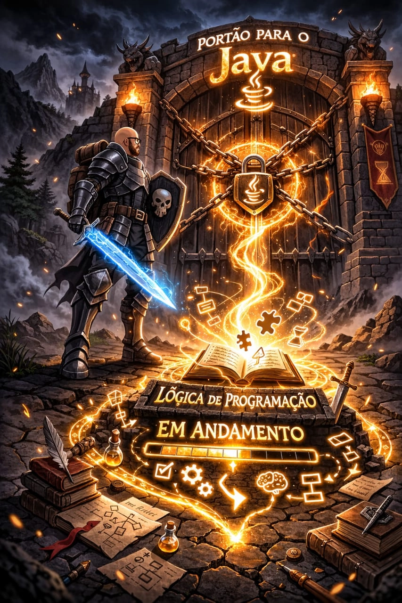

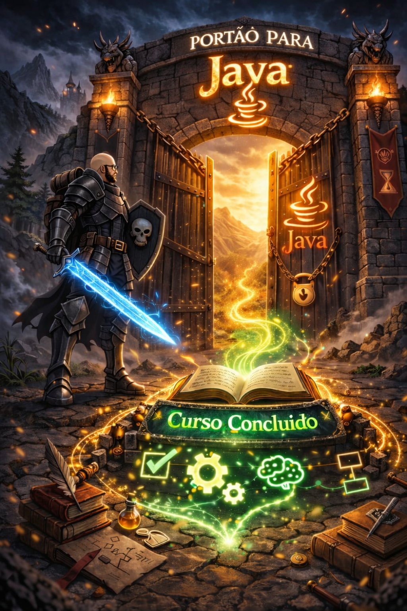

---

# **🌟 Nível** 1: Fundamentos da Linguagem

## 1.  Introdução à Guilda Java ☕🛡️

### 📜 A Crônica do Java: De um Carvalho a um Império

Toda grande guilda tem um começo humilde. A história do Java não foi escrita em pergaminhos, mas em chips de dispositivos eletrônicos.

### 🌳 O Projeto Green e o Carvalho (1991)

No início da década de 90, um grupo de magos da **Sun Microsystems** (liderado por **James Gosling**, o "Pai do Java") formou o *Green Team*. Eles queriam criar uma linguagem para a "próxima onda" da computação: aparelhos domésticos inteligentes (como geladeiras e controles remotos).

Originalmente, a linguagem se chamava **Oak** (Carvalho), inspirada em uma árvore que Gosling via pela janela do seu escritório.

> **No RPG:** Foi como tentar criar um feitiço para controlar itens mágicos comuns dentro de casa.
> 

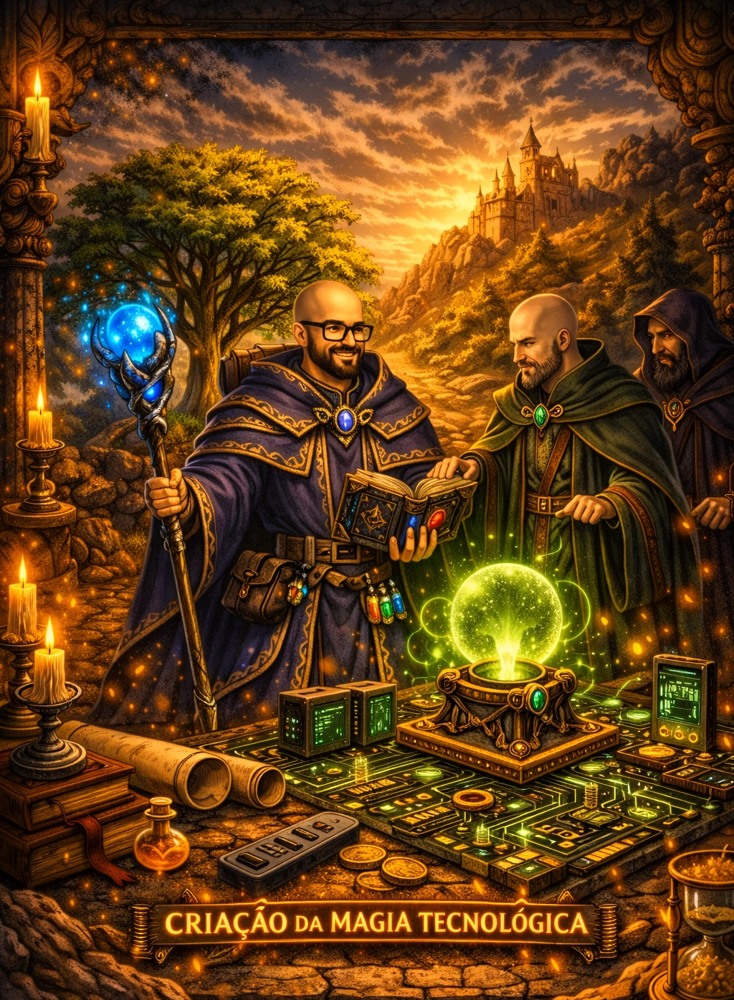

### ☕ O Nascimento do Nome

O nome *Oak* já estava registrado, então os magos precisavam de um novo nome. Reza a lenda que, após consumirem quantidades industriais de café, escolheram **Java** — o nome de uma ilha na Indonésia famosa por seus grãos de café. Por isso, até hoje, o símbolo do Java é uma xícara fumegante.

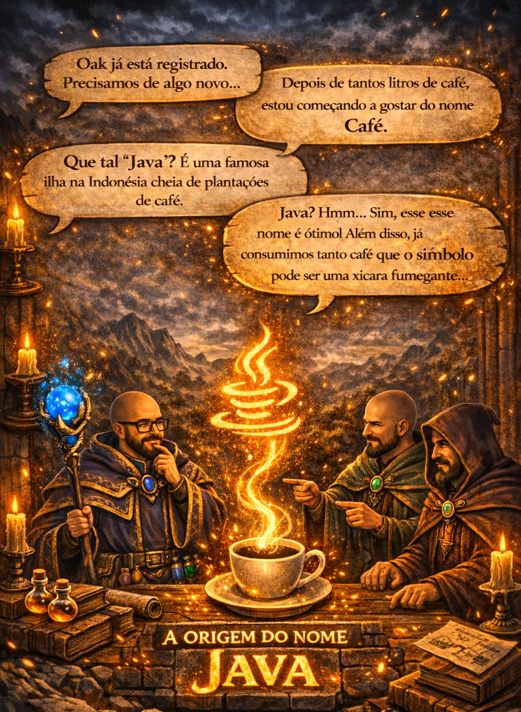

### 🌐 O Encontro com a Grande Rede (1995)

O projeto para geladeiras não decolou, mas algo maior surgiu: a **Internet**. Naquela época, a web era estática e sem vida. O Java trouxe os **Applets**, que permitiam que animações e mini-programas rodassem direto no navegador. Foi uma revolução! O Java deu "vida" à internet.


### 🏗️ A Era da Robustez (2000 - Presente)

Com o tempo, o Java percebeu que sua verdadeira força não estava em animações de sites, mas em **infraestrutura pesada**. Em 2010, a **Oracle** adquiriu a Sun Microsystems, tornando-se a nova guardiã do Java. A linguagem evoluiu para suportar os maiores sistemas do planeta, desde o sistema de controle de Marte da NASA até o código por trás do Minecraft (sim, a versão original do Minecraft foi inteira forjada em Java!).

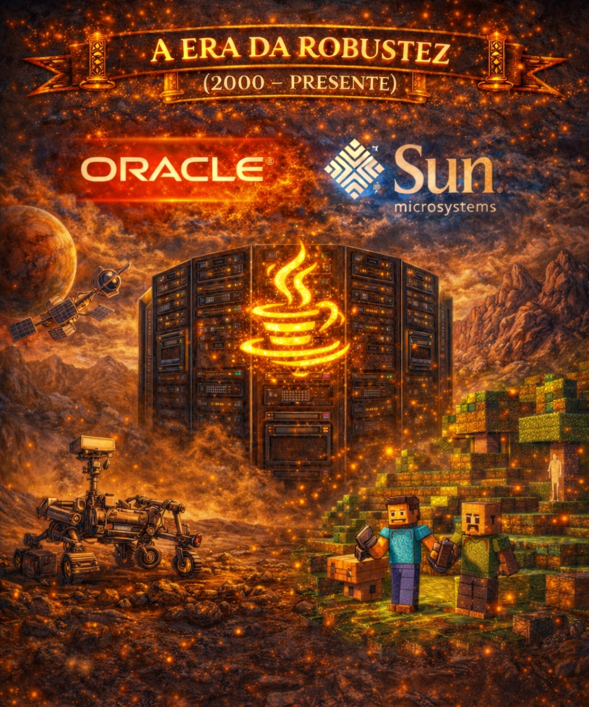

### ☕ O que é Java? (O Sistema de Regras Universal)

imagine que o  **Java** é um **Manual de Regras de RPG** tão bem escrito que funciona em qualquer reino. Não importa se voce esta jogando em uma mesa de madeira (Windows), em um castelo de pedra (Linux) ou em uma taberna móvel (Android).

- ***JVM (Java Virtual Machine):*** É como o “Mestre do jogo”. Você escreve suas magias (**código**), e o mestre garante que elas funcionem exatamente da mesma forma em qualquer lugar que tenha um Mestre presente.
- “**Escreva uma vez, execute em qualquer lugar”**: No passado, cada console precisava de um código diferente. Com **Java**, você cria o motor do jogo uma vez e ele roda em múltiplos “**consoles**” sem esforço.


### Por que aprender Java? (As vantagens da guilda)

- **Mercado e Popularidade**: É a guilda com mais missões abertas e que paga as melhores recompensas em ouro.
- **Versatilidade e Escalabilidade**: Você pode usar **Java** para criar desde um pequeno dado digital ate o sistema de gerenciamento de um império inteiro (bancos e grandes empresas).
- **Base para Outras Tecnologias**: Aprender **Java** é como aprender a base da magia; depois disso, aprender Kotlin ou Scala é apenas aprender um novo dialeto.

### Características Principais (Os Atributos do Motor)

| Atributos | O que significa |
| --- | --- |
| Orientação a objetos | Em vez de variaveis soltas, você cria **Entidades**. Um “Guerreiro”  é um objeto que tem **HP, força** e sabe **“atacar()”.**  |
| Independencia de plataforma | O jogo roda no **PC**, no **Servidor** ou no **Celular** sem voce precisar mudar uma linha de codigo. |
| Segurança | O Java impede que “maldições” (Virus ou Bugs de memoria) destruam o sistema do usuario. |
| Robustez | O sistema possui um **Garbage collector** (lixeiro Mágico) que limpa a memoria usada automaticamente, evitando que o jogo trave. |
| Multihreading | O jogo pode processar a musica, o movimento dos monstros e o chat do jogdor ao mesmo tempo, sem gargalos. |
| Alto Desempenho | O codigo é tranformado em **Bytecode** (um pergaminho otimizado) que a maquina lê muito rapido. |

### Onde o Java é usado (Os Reinos Conquistados)

o java não esta apenas em um lugar; ele domina vários territórios:

- 📲 **Android (Reino Mobile)**: Até pouco tempo, o **Java** era a linguagem soberana para criar qualquer aprlicativo de celular **Android**. Embora o Kotlin tenha ganhado espaço, bilhoes de linhas de codigo java ainda sustentam os apps que voce usa todo dia.
    - **No RPG**: Imagine que você esta desenvolvendo o app da “ficha de Personagem” que os jogadores levam no bolso para a mesa de jogo.
- **Empresarial (Sistema de Grande Porte)**: O **Java** é o rei do “**Backend**” corporativo. Grandes empresas (como companhias aéreas ou seguradores) usam **Java** porque ele é **Robusto**. Ele aguenta mulhoes de acessos sem “**crashar**”.
    - **No RPG**: Seria o sistema central que gerencia todos os servidores de um **MMO**(como o World of Warcraft), cuidando de milhões de jogadores simultâneos.
- **🌐 Web “Spring” (Magia dos Frameworks)**: o Spring é como um conjunto de armaduras e armas lendarias pré-fabricadas. Ele facilita muito a criação de sites complexos e seguros.
    - **No RPG**: É o que permite criar o “Mercado da Comunidade” onde os jogadores compram, vendem e trocam itens via navegador;.
- **Desktop (Interfaces Graficas)**: Com ferramentas como **JavaFX** ou **Swing**, você cria programas que abrem janelas no computador (Windows/Mac/Linux).
    - **No RPG**: Seria o “Launcher” do jogo ou um Editor de mapas para o mestre criar masmorras no PC.
- **Big Data (Processamento de Dados Massivos)**: Ferramentas como **Hadoop** e **Spark** (muitas vezes construidas ou uadas com **Java**) servem para processar uma quantidade gigantesca de dados que um computador comum nao aguentaria.
    - **No RPG:** Imagine analisar o comportamento de todos os jogadores do mundo para descobrir qual monstro é mais difícil ou qual arma é a mais usada.
- 🧮 **Financeiro (O Cofre de ouro)**: Bancos adoram **Java** devido à sua **Segurança**. O sistema de tipos rigorosos do java evita que um erro de virgula transforme 10 moedas de outro em 100 por acidente.
    - **No RPG**: É o sistema que garante que, quando voce transfere outro para outro jogador, o valor saia da sua conta e chegue na dele de forma segura e auditável.

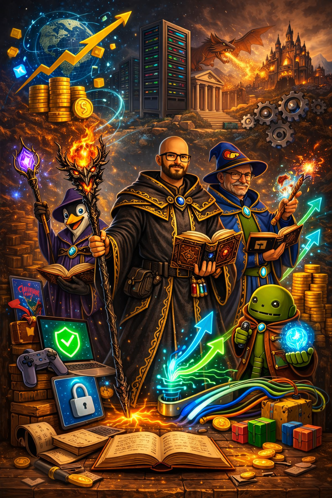

### ⚙ Configuração do ambiente de desenvolvimento.

Prepare suas ferramentas, recruta! antes de um ferreiros forjar uma espada lendaria ele precisa organizar ua **oficina**. No **Java**, o seu ambiente de Desenvolvimentoé a sua **Forja**

### O kit de ferramentas (JDK vs. IDE)

Para ser um desenvolvedor, Voce precisa de dois elementos fundamentais.

1.  **JDK (Java Development Kit):** é a sua caixa de ferreiro. Ela contem o martelo (compilador), a bigorna (bibliotecas) e o Fogo JVM. Sem o JDK, o computador nao entende como transfotmar seu texto em um programa funcional.
2. **IDE (Ambiente de Desenvolvimento Integrado): É a sua oficina magina. Você poderia escrever codigo em um bloco de notas comum, mas a IDE é como uma oficina que organiza seus itens, brilha quando voce comere um erro de sintaxe e sugere a melhor forma de terminar um feitiço (autocomplete).

### 🏰 Escolhendo sua Oficina (As IDEs)

### **🔍 Dica de Mestre para Iniciantes:**

Antes de enfrentar dragões de código, escolha o Santuário correto. Recomendamos o **IntelliJ IDEA Community Edition**: ele é como uma "Espada Justiceira" que brilha quando o perigo (erros de sintaxe) está por perto, oferecendo magias de auxílio (autocomplete) que tornam sua jornada de aprendizado muito mais fluida e segura.

Cada IDE é como uma guilda diferente com suas próprias vantagens:

- **IntelliJ IDEA (A Recomendada):** É como ter um mestre ferreiro ao seu lado. Ela prevê o que você quer escrever e avisa sobre erros antes mesmo de você tentar rodar o código.
- **VS Code:** É um kit de ferramentas leve e portátil. Ótimo se você tem um PC menos potente ou quer algo rápido para scripts menores.
- **Eclipse/NetBeans:** São guildas antigas e poderosas, muito usadas em grandes castelos (empresas Tradicionais).

### 🔗 O Link da Forja

[**Download IntelliJ IDEA Community Edition](https://www.jetbrains.com/idea/download/)** *(Role um pouco a página para baixo até encontrar a versão **Community**, que é a gratuita e perfeita para nossa jornada!)*

### 🏗️ Configurando a Forja (Instalação Passo a Passo)

Siga este roteiro para garantir que seu equipamento seja montado corretamente:

### 1. O Caminho do Aprendiz (Automático via IntelliJ) 🌟

Este é o "Modo História". É o mais seguro para quem está começando.

1. **Baixe e Instale:** Execute o instalador que você baixou no link acima. Pode seguir o clássico "Next, Next, Install".
2. **Primeira Abertura:** Ao abrir o IntelliJ pela primeira vez, clique em **"New Project"**.
3. **A Magia do JDK:** Na tela de novo projeto, haverá um campo chamado **JDK**. Se estiver escrito *"No SDK"*, clique nele e escolha **"Download JDK"**.
4. **Versão:** O IntelliJ sugerirá a versão mais estável (como a 21 ou 23). Escolha uma dessas, clique em "Download" e ele fará todo o trabalho sujo de configurar as engrenagens (Variáveis de Ambiente) para você.

### 2. O Caminho do Alquimista (Manual) 🔧

- **📦 Instalação e Configuração do JDK**
    
    ### Opções de Instalação
    
    - **🚀 Instalação Recomendada (para Iniciantes)**
        
        Para uma experiência mais amigável, recomendamos instalar o IntelliJ IDEA que já configura o JDK automaticamente:
        
        1. **Baixe o IntelliJ IDEA Community Edition**
            - Acesse [JetBrains.com/idea/download](https://www.jetbrains.com/idea/download/)
            - Escolha a versão gratuita Community Edition
        2. **Durante a instalação, o IntelliJ perguntará se você deseja baixar e configurar o JDK**
            - Selecione esta opção e escolha a versão mais recente do JDK (recomendamos JDK 23 ou posterior)
        
        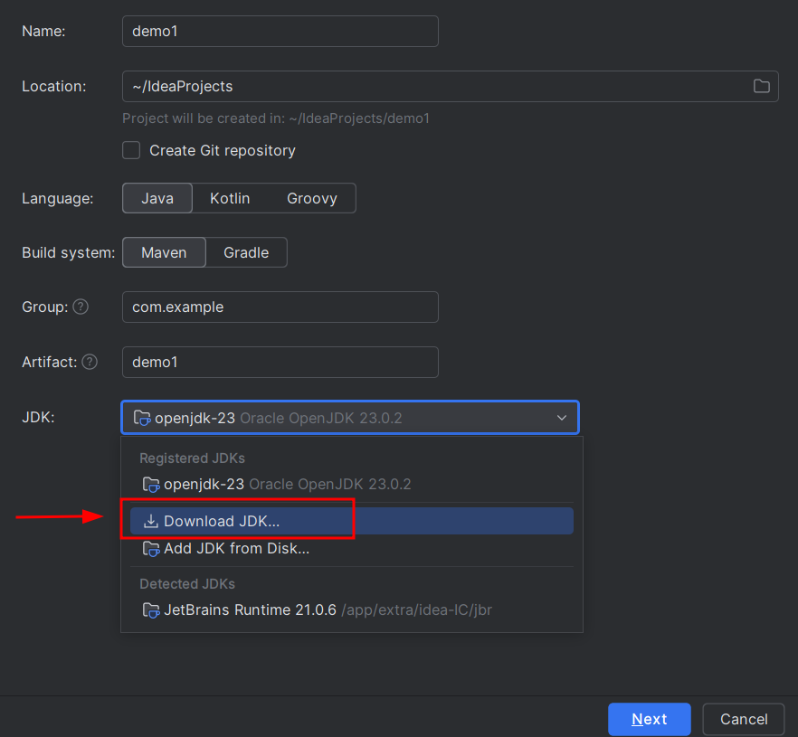
        
        Instalação do JDK via IntelliJ
        
        1. **Tudo pronto!**
            - O IntelliJ configurará automaticamente as variáveis de ambiente necessárias
            - Você pode começar a criar projetos Java imediatamente
        
        > Dica: Esta é a maneira mais simples e recomendada para iniciantes, pois elimina problemas comuns de configuração do ambiente.
        > 
    - **🔧 Instalação Manual (Avançada)**
        1. **Escolha uma versão do JDK**
            - [Oracle JDK](https://www.oracle.com/java/technologies/downloads/) (requer conta Oracle)
            - [OpenJDK](https://openjdk.org/) (gratuito e open-source)
        2. **Instalação**
            - **Windows**: Execute o instalador (.exe ou .msi)
            - **macOS**: Use o instalador .dmg ou Homebrew `brew install openjdk@23`
            - **Linux**: Use o gerenciador de pacotes `sudo apt install openjdk-23-jdk`
        3. **Configurar Variáveis de Ambiente**
            
            **Windows:**
            
            ```
            Setx JAVA_HOME "C:\Program Files\Java\jdk-23"
            Setx PATH "%PATH%;%JAVA_HOME%\bin"
            ```
            
            **Mac/Linux:**
            
            ```bash
            export JAVA_HOME=/path/to/jdk
            export PATH=$PATH:$JAVA_HOME/bin
            ```
            
        4. **Verificar instalação.**
            
            Abra o terminal/prompt de comando e digite:
            
            ```bash
            java -version
            ```
            
            Se a instalação foi bem-sucedida, você verá a versão do Java instalada como `java version "23"` ou similar.
            

### 🧪 O Teste de Pureza (Verificação)

Para ter certeza de que sua magia está fluindo pelo sistema:

1. Abra o terminal do seu computador (CMD no Windows ou Terminal no Mac/Linux).
2. Digite o encantamento: `java -version`
3. Se aparecer algo como `java version "23"` ou similar, a forja está quente!

---

## ⚔️ Desafio de Inventário: Seu Primeiro Código

Agora, vamos ao seu primeiro teste prático dentro da IDE:

1. No IntelliJ, crie um **New Project**.
2. Dê o nome de `PrimeiraMissao`.
3. No lado esquerdo (Project), clique com o botão direito na pasta `src` -> **New** -> **Java Class**.
4. Nomeie a classe como `TesteMagico`.
5. Digite o código abaixo exatamente assim:

Java

```java
public class TesteMagico {
    public static void main(String[] args) {
        // Seu primeiro grito de guerra no Java!
        System.out.println("A forja está pronta! O herói despertou.");
    }
}
```

1. Clique com o botão direito em qualquer lugar do código e selecione **Run 'TesteMagico.main()'**.
2. Se a mensagem aparecer no painel inferior, você subiu de nível!

### 🏰 Quadro de Missões: O Despertar da Forja

### 🥉 Bronze (Fácil) - Conhecimento de Taverna

**1. O Mestre do Jogo:** Como se chama a entidade que garante que sua "magia" (código) funcione em qualquer reino (Windows, Linux ou Android)?

- [ ]  a) JDK
- [ ]  b) JVM
- [ ]  c) IDE

**2. O Kit de Ferramentas:** Você precisa de um martelo e uma bigorna para começar. Qual é o nome do kit que contém o compilador e as bibliotecas básicas?

- [ ]  a) IntelliJ
- [ ]  b) Bytecode
- [ ]  c) JDK

**3. A Oficina Mágica:** Qual ferramenta é comparada a uma "oficina" que brilha quando você comete um erro de sintaxe?

- [ ]  a) IDE
- [ ]  b) Terminal
- [ ]  c) Java Virtual Machine
- **⚠ Dica do Mestre:**
    
    A maestria na programação nasce da prática, não apenas da leitura. O código só ganha vida quando você o escreve! Tente resolver o desafio com sua própria lógica antes de espiar a solução. **Confie no seu processo; o erro de hoje é o acerto de amanhã!**
    
- **Resolução:**
    1. **O Mestre do Jogo:**
        - **Resposta:** **b) JVM** (Java Virtual Machine). É ela quem interpreta o bytecode e garante que o programa rode em qualquer sistema operacional.
    2. **O Kit de Ferramentas:**
        - **Resposta:** **c) JDK** (Java Development Kit). Ele é o pacote completo que inclui o compilador (`javac`) e as bibliotecas necessárias para criar o código.
    3. **A Oficina Mágica:**
        - **Resposta:** **a) IDE** (Integrated Development Environment). Ferramentas como IntelliJ, Eclipse ou VS Code funcionam como essa oficina que aponta erros em tempo real.

### 🥈 Prata (Médio) - Explorador de Reinos

1. **O Reino Mobile:** De acordo com o texto, qual é o nome do território (sistema) onde o Java gera a linguagem soberana para aplicativos de celular?
    - [ ]  a) iOS
    - [ ]  b) Android
    - [ ]  c) Spring
2. **A Magia do Lixeiro:** O Java possui um "Lixeiro Mágico" que limpa a memória automaticamente para o jogo não travar. Qual o nome técnico desse atributo?
    - [ ]  a) Multithreading
    - [ ]  b) Garbage Collector
    - [ ]  c) Bytecode
- **⚠ Dica do Mestre:**
    
    A maestria na programação nasce da prática, não apenas da leitura. O código só ganha vida quando você o escreve! Tente resolver o desafio com sua própria lógica antes de espiar a solução. **Confie no seu processo; o erro de hoje é o acerto de amanhã!**
    
- **Resolução:**
    1. **O Reino Mobile:** 
        - **Resposta: b) Android,** o Java é a base histórica e uma das principais linguagens para o ecossistema Android.
    2.   **A magia do lixeiro:**
    - **Resposta: b) Garbage Collector:** Esse é o "Lixeiro Mágico" que evita o temido erro de "Memória Cheia" (Stack Overflow ou OutOfMemory) enquanto seu código roda.

### 🥇 Ouro (Difícil) - Cavaleiro de Elite

1. **O Teste de Pureza:** Você acabou de montar sua forja. Qual comando você deve digitar no terminal (CMD) para verificar se o "Mestre do Jogo" está devidamente instalado e pronto para a ação?
    - [ ]  a) `run java`
    - [ ]  b) `java -version`
    - [ ]  c) `new project`
    - **⚠ Dica do Mestre:**
        
        A maestria na programação nasce da prática, não apenas da leitura. O código só ganha vida quando você o escreve! Tente resolver o desafio com sua própria lógica antes de espiar a solução. **Confie no seu processo; o erro de hoje é o acerto de amanhã!**
        
    - **Resolução:**
        1. **O Teste de Pureza:**
            
            **Resposta: b) java -version.** Este é o comando sagrado digitado no terminal (CMD ou PowerShell) para invocar o "Mestre do Jogo" (JVM). Ele confirma se o Java está instalado e mostra a versão atual que ditará as regras do seu reino de código.
            

### 💎 Diamante (Mestre do Sistema) - O Primeiro Grito de Guerra

1. **A Invocação do Código:** Imagine que você abriu sua IDE IntelliJ e criou a classe `TesteMagico`. Qual é o comando exato de "magia" (linha de código) que você deve escrever dentro do `main` para que o sistema exiba a frase: **"A forja está pronta! O herói despertou."**?
    - **Inventário Disponível:**
        - [ ]  `System.out.println("...");`
        - [ ]  `Public Class...`
        - [ ]  `// Comentário`
    
    > **Desafio Extra:** Se você remover o `;` (ponto e vírgula) ao final dessa linha, o que sua IDE (a "Espada Justiceira") fará para te avisar?
    > 
    - **⚠ Dica do Mestre:**
        
        A maestria na programação nasce da prática, não apenas da leitura. O código só ganha vida quando você o escreve! Tente resolver o desafio com sua própria lógica antes de espiar a solução. **Confie no seu processo; o erro de hoje é o acerto de amanhã!**
        
    - **Resolução:**
        1. **A Invocação do Código:**
            
            **Resposta: System.out.println ("A forja está pronta! O herói despertou.");** Este é o comando de invocação que ordena ao sistema enviar um fluxo de dados para a saída padrão (o console). O termo **println** é uma abreviação de "**print line**", garantindo que, após exibir a frase, o cursor pule para a próxima linha, mantendo a organização do seu grimório de logs.
            

---

## 2. Conceitos básicos. 🧱🌱

Chegou a hora de conjurar seu primeiro feitiço! No **Java**, a estrutura do código é como o **ritual de abertura** de um portal: se você errar um símbolo, o portal não abre.

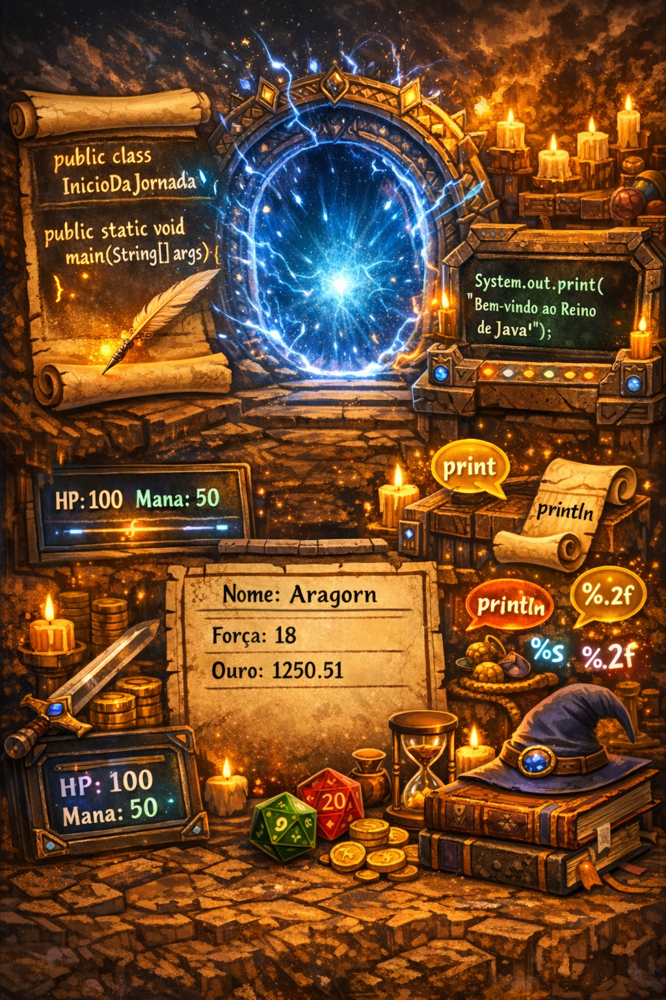

### 📜 A anatomia do pergaminho (estrutura do código)

No **Java**, todo código vive dentro de uma **Classe**. Pense na classe como o nome da sua missão.

```java
public class InicioDaJornada { //O nome do arquivo DEVE ser igual ao nome do arquivo InicioDeJornada.java
	public static void main(String[] args) {
		// Este é o 'Coração do Herói'. Sem ele, o programa não tem vida.
		System.out.print("--- Bem-vindo ao Reino de Java! ---");
	
			// Aqui dentro escrevemos as ações do jogo (codigo).
	
	}
}
```

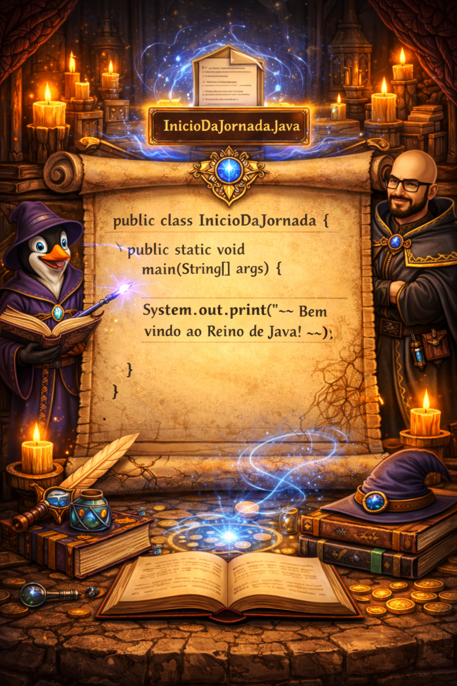

### 🗣️ Comando de Voz (Saída de Dados)

No **RPG**, o mestre narra a história. No **Java**, o mestre é o ***System.out**, existem três formas principais de narrar:*

1. System.out.print(); **(padrão mesma linha)**
    
    É como um sussurro contínuo Ele não pula linha.
    
    - **No RPG**: Narrar o HP e a mana na mesma linha.
    - **Ex:**
        
        System.out.print("HP: 100 “); 
        System.out.print("Mana: 50”);  
        
        - **Saida:** Hp: 100 Mana: 50
    
    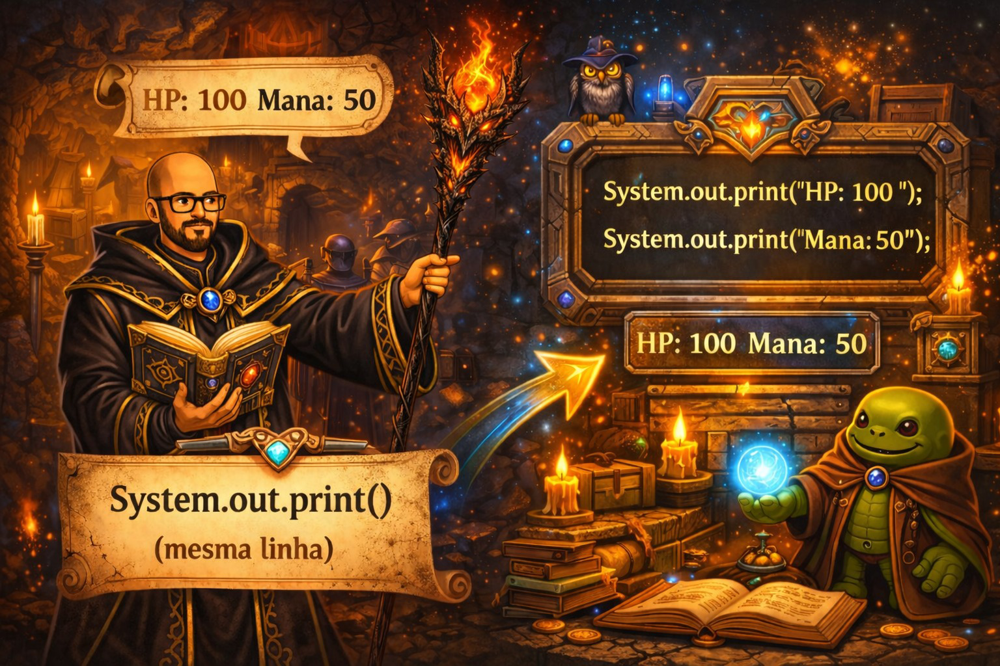
    
2. System.out.println(); **(Quebra de linha)**
    
    É a fala completa. Após o texto, ele pula para a próxima linha automaticamente (Break row: quebra de linha).
    
    - **No RPG:** Narrar diálogos ou eventos novos.
    - **Ex:** System.out.println("Um Orc selvagem apareceu!”);
    
    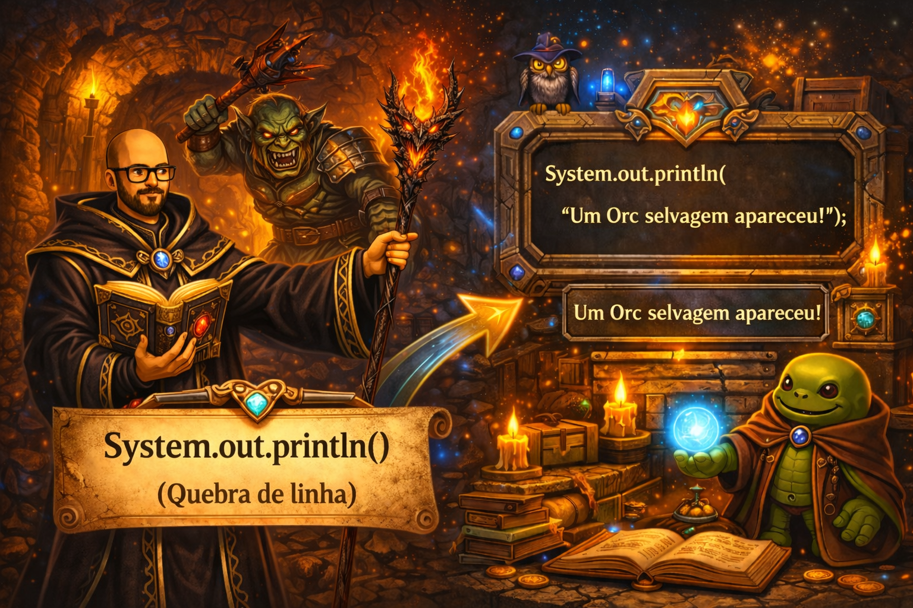
    
3. System.out.printf(); **(O formatador)**
Este é o comando mais poderoso para interfaces de **RPG**. Ele usa es**pecificadores de formato** (marcadores de posição) para organizar os atributos do herói.
    
    
    | Especificador | Atributo RPG | Exemplo Prático |
    | --- | --- | --- |
    | %d | inteiros (Nivel, Força) | System.out.printf(”Nivel: %d”, 5); |
    | %f | Decimais (Peso, Ouro) | System.out.print(”Ouro: %.2f”, 150.75); |
    | %s | Textos (Nome, Classe) | System.out.print(”Classe: %s”, “Mago”); |
    | %n | Quebra de linha | System.out.print(”Fim do turno%n”); |

### Exemplo Prático: Status do personagem

Veja como transformar o seu “Olá Mundo” em algo digno de um guerreiro:

1. **“Olá Mundo!”:**

```java
public class Main {
	public static void main(String[] args) {
		//Usando print para imprimir "Olá Mundo" na tela.
		System.out.print("Olá Mundo!");
	}
}
```

1. **Status do Personagem:** 

```java
public class StatusHeroi {
	public static void main(String[] args) {
	//Usando println para o titulo
	System.out.println("--- Ficha de Personagem ---");
	
	//Usando printf para formatar os atributos
	System.out.printf("Nome: %s %n", "Aragorn");
	System.out.printf("Força %d %n", 18);
	System.out.printf("Ouro: %.2f %n", 1250.508); //%.2f Arredonda para 1250.51
	
	System.out.println("---------------------------");
	}
}
```

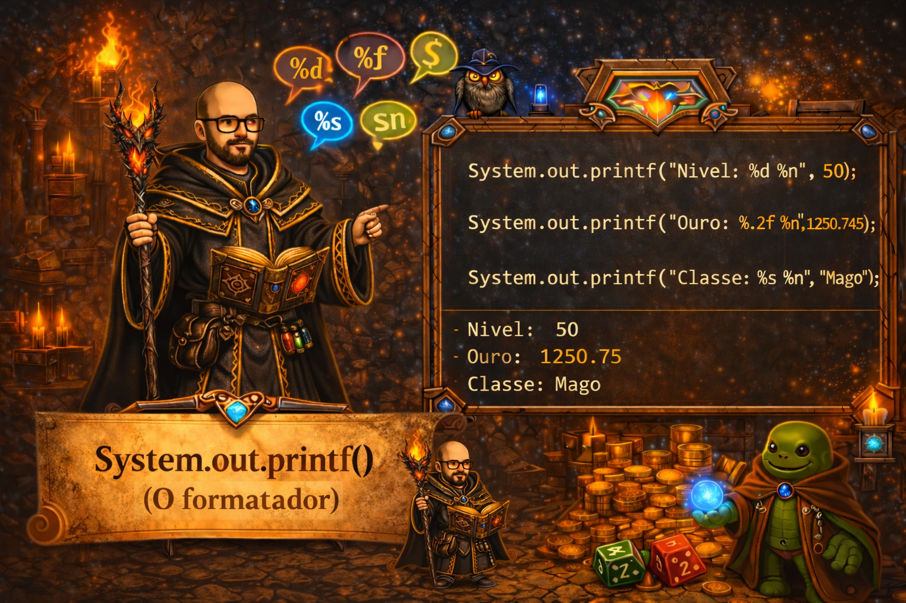

### 🏰 Quadro de Missões: A Arte da Narrativa

### 🥉 Bronze (Fácil) - O Mensageiro do Reino

1. **O Título da Missão:** Se você criar um arquivo chamado `EntradaDungeon.java`, qual deve ser o nome da **classe** dentro dele para o portal abrir?
2. **Sussurro Linear:** Use o `System.out.print()` duas vezes seguidas para exibir a frase "Vida: 100" e "Mana: 50" na **mesma linha**.
3. **O Pulo do Gato:** Qual comando você deve usar para que o texto "O Orc foi derrotado!" Apareça e o cursor já pula para a linha de baixo automaticamente?
- **⚠ Dica do Mestre:**
    
    A maestria na programação nasce da prática, não apenas da leitura. O código só ganha vida quando você o escreve! Tente resolver o desafio com sua própria lógica antes de espiar a solução. **Confie no seu processo; o erro de hoje é o acerto de amanhã!**
    
- **Resolução:**
    
    ```jsx
    //Ex. 01 "public class EntradaDungeon"
    public class EntradaDungeon {
        public static void main(String[] args){
        
            //Ex. 02 "System.out.print"
            int vida = 100, mana = 80;
            System.out.print("Vida: " + vida);
            System.out.print(" | Mana: " + mana);
    
            //Ex. 03 "System.out.println"
            System.out.println("\nO Orc foi derrotado!");
            System.out.println("Parabens você venceu a batalha!");
        }
    }
    
    ```
    

### 🥈 Prata (Médio) - O Mestre dos Marcadores.

1. **A Bolsa de Moedas:** Você encontrou 12,50 moedas de ouro. Use o `System.out.printf()` e o marcador correto para exibir: `Ouro: 12.50`.
    - **⚠ Dica do Mestre:**
        
        A maestria na programação nasce da prática, não apenas da leitura. O código só ganha vida quando você o escreve! Tente resolver o desafio com sua própria lógica antes de espiar a solução. **Confie no seu processo; o erro de hoje é o acerto de amanhã!**
        
    - **Resolução:**
        
        ```java
        public class BauOuro {
            public static void main(String[] args){
                double moedas = 12.50;
                
                System.out.printf("Moedas: %f %n", moedas);
                //Saida = Moedas: 12,500000
                
                System.out.printf("%nMoedas: %.2f", moedas);
                //Saida = Moedas: 12,50
            }
        }
        
        ```
        
2. **O nome do vilão:** use o marcador de texto para anunciar o nome de um chefe de fase. Exemplo: `O Boss (marcador) apareceu!` Qual marcador você colocaria no lugar do nome?
    - **⚠ Dica do Mestre:**
        
        A maestria na programação nasce da prática, não apenas da leitura. O código só ganha vida quando você o escreve! Tente resolver o desafio com sua própria lógica antes de espiar a solução. **Confie no seu processo; o erro de hoje é o acerto de amanhã!**
        
    - **Resolução:**
        
        ```java
        public class Monstro {
            public static void main(String[] args){
                String nomeBoss = "Dragão";
                System.out.printf("O Boss %s Apareceu!", nomeBoss);
        
            }
        }
        
        }
        
        ```
        

### 🥇 Ouro (Difícil) - O Alquimista da Precisão.

1. **Arredondamento Mágico:**  Crie um pequeno código que mostre o peso de uma armadura de `80.77777` kg arredondado para apenas duas casas decimais usando `printf`.
    - **⚠ Dica do Mestre:**
        
        A maestria na programação nasce da prática, não apenas da leitura. O código só ganha vida quando você o escreve! Tente resolver o desafio com sua própria lógica antes de espiar a solução. **Confie no seu processo; o erro de hoje é o acerto de amanhã!**
        
    - **Resolução:**
        
        ```java
        public class PesoArmadura {
            public static void main(String[] args) {
                double pesoArmadura = 80.77777;
                System.out.printf("A armadura pesa: %.2f kg", pesoArmadura);
            }
        }
        ```
        
2. **A Quebra de Linha Invisível:** Existe um marcador especial que você coloca dentro das aspas do `printf` para pular linha. Tente criar uma única linha de código com `printf` que mostre o Nome em uma linha e a Força na linha de baixo.
    - **⚠ Dica do Mestre:**
        
        A maestria na programação nasce da prática, não apenas da leitura. O código só ganha vida quando você o escreve! Tente resolver o desafio com sua própria lógica antes de espiar a solução. **Confie no seu processo; o erro de hoje é o acerto de amanhã!**
        
    - **Resolução:**
        
        ```java
        public class Heroi {
            public static void main(String[] args) {
            String nome = "Aragorn";
            int forca = 70;
                System.out.printf("Nome: %s %nForça: %d%n", nome, forca);
            }
        }
        ```
        

### 💎 Diamante (Difícil Nível 2) - O Sistema de Ficha Completa

1. **A Grande Forja da Ficha:**
Crie uma classe chamada `FichaRPG`. Dentro do `main`, você deve imprimir uma ficha completa de um monstro que você acabou de encontrar.
    
    **Regras da Missão:**
    
    - **Linha 1:** Use `println` para o título: `=== MONSTRO ENCONTRADO ===`
    - **Linha 2:** Use `printf` para o nome do monstro e o nível dele.
    - **Linha 3:** Use `printf` para o drop de XP (Decimal com 1 casa).
    - **Linha 4:** Use `print` para mostrar "Status: " e na mesma linha, outro `print` para mostrar "Irritado".
    
    **Desafio de Integração:** Certifique-se de que cada `printf` use o `%n` para que a ficha não fique toda grudada em uma linha só, conforme as regras do seu pergaminho!
    
    - **⚠ Dica do Mestre:**
        
        A maestria na programação nasce da prática, não apenas da leitura. O código só ganha vida quando você o escreve! Tente resolver o desafio com sua própria lógica antes de espiar a solução. **Confie no seu processo; o erro de hoje é o acerto de amanhã!**
        
    - **Resolução:**
        
        ```java
        public class FichaRPG {
            public static void main(String[] args) {
                String nomeMonstro = "Dragão";
                int nivel = 99;
                double xp = 800.3819;
        
                System.out.println("=== MONSTRO ENCONTRADO ===");
        
                System.out.printf("Nome: %s | Nível: %d%n", nomeMonstro, nivel);
        
                System.out.printf("XP Dropado: %.1f%n", xp);
        
                System.out.print("Status: ");
                System.out.print("Irritado");
            }
        }
        ```
        
2. **A Narração do bardo:** 
Sua missão é criar um programa chamado `NarracaoBardo.java` que exiba a seguinte mensagem exatamente como abaixo, usando o que aprendeu:
    1. Use `System.out.println` para a primeira linha: `"O bardo começa a cantar..."`
    2. Use `System.out.println` para a canção do bardo em 5 linhas quebrando linha na virgula:
        - *Dica:* A saída deve ser: 
        `Nos campos antigos ecoa o aço,`
            
            `A chama da forja nunca se apaga,`
            
            `Heróis se erguem sob o luar,`
            
            `Dragões temem o som da espada,`
            
            `E a lenda nasce no calor da batalha...`
            
    3. Use `System.out.println` para informar “Bau encontrado!” e “Você abriu o bau!” (um em cada linha) e `System.out.printf` para mostrar as estatísticas de um item encontrado no bau, usando os marcadores `%s`, `%d` e `%f`:
        - Item: **Espada de Ferro**
        - Dano: **15**
        - Peso: **4.5**
        - *Dica:* A saída deve ser:
            
            `Bau encontrado!`
            
            `Você abriu o Bau!`
            
            `Item: Espada de Ferro | Dano: 15 | Peso: 4.50` 
            
        - **⚠ Dica do Mestre:**
            
            A maestria na programação nasce da prática, não apenas da leitura. O código só ganha vida quando você o escreve! Tente resolver o desafio com sua própria lógica antes de espiar a solução. **Confie no seu processo; o erro de hoje é o acerto de amanhã!**
            
        - **Resolução:**
            
            ```java
            public class NarracaoBardo {
                public static void main(String[] args) {
                    String arma = "Espada de Ferro";
                    int dano = 15;
                    double peso = 4.5253;
            
                    System.out.println("O bardo começa a cantar....");
                    System.out.println("Nos campos antigos ecoa o aço,\n" +
                            "A chama da forja nunca se apaga,\n" +
                            "Heróis se erguem sob o luar,\n" +
                            "Dragões temem o som da espada,\n" +
                            "E a lenda nasce no calor da batalha...");
                    System.out.println("Baú encontrado!");
                    System.out.println("Você abriu o Baú!");
                    System.out.printf("Item: %s | Dano: %d | Peso: %.1f", arma, dano, peso);
                }
            }
            ```
            

---

## 3. Sintaxe e convenções. 📏📜

Dominar a sintaxe é como aprender a caligrafia das runas magicas: se voce desenhar um simbolo torto, o feitiço falha. No **Java**, seguimos padroes rigidos (conjunto de regras) para que qualquer outro programador (ou “mestre da guilda”) consiga ler seu codigo sem esforço.

### 📜 Tabela de Convenções de Nomenclatura (Padrão Java)

| ***Estilo de Escrita*** | ***Onde Usar no Java (Regra)*** | ***Exemplo No RPg*** |
| --- | --- | --- |
| PascalCase | Classes e interfaces (Cada palavra começa com maiuscula) | Guerreiro, SistemaCombate, Inventario |
| camelCase | Variaveis, Metodos e Parametros (1ª letra minuscula, as outras primeiras letras de palavras começam maiusculas) | pontosVida , atacarInimigo( ) , quantidadeDeOuro , missoesCompletadas  |
| UPPER_SNAKE_CASE | Constantes (Tudo maiusculo com undercores). Nem toda variável em MAIÚSCULO é constante.Ela só é considerada constante de verdade se tiver `final`. | DANO_MAXIMO , LIMITE_MEMBROS_GRUPO |
| minusculas | Pacotes (Organizaçao de pastas/namespaces) | com.meujogo.mecanicas , br.rpg.personagens |
| Sem Underscore | Inicio de Variaveis (evite começar com _ (underline) ou $ (cifrão) | nivel (correto) vs _nivel (evite) |

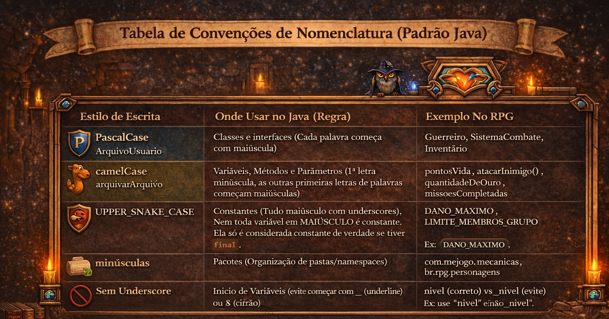

- 🔍 Por que essas regras importam no seu RPG?
    
    Imagine que voce esta lendo o codigo de um colega. se ele usar **PascalCase** em uma variavel, voce vai achar que é uma **Classe**. Se ele usar **camelCase** em uma **Classe**, o codigo pode parecer desorganizado.
    
- 💡 Detalhes Adicionais da Sintaxe:
    1. **Case Sensitive: O java diferencia maiusculas de minusculas. a variavel vida é totalmente diferente da variavel Vida. No RPG, isso seria como confundir “Cura” (o feitiço) com “**cura**” (o ato de curar).
    2. **Ponto e Virgula** **(;)**: É o ponto final de cada ordem dada ao computador. Esquece-lo é o erro numero **1** de quem esta começando na guilda.
    3. **Blocos de Codigo ({ })**: As Chaves “**{ }**” delimitam onde a magia começa e onde ela termina. Se voce abrir uma, **precisa** fecha-la.
    
    ### ⚔️ Desafio de Etiqueta da Guilda
    
    Abaixo, deixei um código propositalmente "bagunçado" que não segue as convenções de nomes que acabamos de ver. **Sua missão é reescrevê-lo corrigindo os nomes para os padrões corretos (PascalCase, camelCase ou UPPER_SNAKE_CASE).**
    
    ```java
    // O nome do arquivo e da classe deveriam ser PascalCase
    public class statusdo_heroi { 
        public static void main(String[] args) {
            
            // Esta variável deveria ser camelCase
            int PontosDeVida = 100; 
            
            // Esta constante deveria ser UPPER_SNAKE_CASE
            final double multiplicadorcritico = 1.5; 
            
            System.out.println("Vida: " + PontosDeVida);
        }
    }
    ```
    
    - **Resoluçao:**
        - ***Dica do heroi:***
            
            Não veja a resoluçao do desafio sem antes tentar fazer de verdade, mesmo que erre tente ate conseguir, voce so sera **Classe: Programador** se aprender programando diariamente, voce nao vai ficar bom em um jogo somente olhando gameplays, você precisa jogar direto para conseguir! Então nao desista recruta, sei que voce consegue!
            
        - Missão Completa
        
    

### 🏰 Quadro de Missões: As Leis de Caligrafia

### 🥉 Bronze (Fácil) - Identificando as Runas

1. **A Classe Mestra:** De acordo com a tabela de convenções, qual destes nomes segue o padrão **PascalCase** correto para uma classe de RPG?
    - [ ]  a) `sistema_de_combate`
    - [ ]  b) `sistemadecombate`
    - [ ]  c) `SistemaDeCombate`
        - **⚠ Dica do Mestre:**
            
            A maestria na programação nasce da prática, não apenas da leitura. O código só ganha vida quando você o escreve! Tente resolver o desafio com sua própria lógica antes de espiar a solução. **Confie no seu processo; o erro de hoje é o acerto de amanhã!**
            
        - **Resolução:**
            
            ✅ **Alternativa correta:**
            
            **c) `SistemaDeCombate`**
            
            **📖 Explicação:**
            
            O padrão **PascalCase** exige que:
            
            - Cada palavra comece com letra **maiúscula**
            - Não use `_`
            - Não use tudo minúsculo
            
            | Alternativa | Motivo |
            | --- | --- |
            | `sistema_de_combate` | ❌ usa snake_case |
            | `sistemadecombate` | ❌ não separa palavras |
            | `SistemaDeCombate` | ✅ PascalCase correto |
2. **A Variável Ágil:** Você quer criar uma variável para armazenar a "quantidade de flechas". Qual o nome correto seguindo o **camelCase**?
    - [ ]  a) `QuantidadeDeFlechas`
    - [ ]  b) `quantidadeDeFlechas`
    - [ ]  c) `QUANTIDADE_FLECHAS`
        - **⚠ Dica do Mestre:**
            
            A maestria na programação nasce da prática, não apenas da leitura. O código só ganha vida quando você o escreve! Tente resolver o desafio com sua própria lógica antes de espiar a solução. **Confie no seu processo; o erro de hoje é o acerto de amanhã!**
            
        - **Resolução:**
            
            ✅ Alternativa correta:
            
            **b) `quantidadeDeFlechas`**
            
            **📖 Explicação:**
            
            O padrão **camelCase** exige:
            
            - Primeira palavra começa com **minúscula**
            - Próximas palavras começam com **maiúscula**
            - Sem `_`
            - Sem tudo maiúsculo
            
            | Alternativa | Motivo |
            | --- | --- |
            | `QuantidadeDeFlechas` | ❌ PascalCase (classe) |
            | `quantidadeDeFlechas` | ✅ camelCase correto |
            | `QUANTIDADE_FLECHAS` | ❌ padrão de constante |
3. **O Ponto Final:** O que acontece se você esquecer o ponto e vírgula (`;`) ao final de um `System.out.println`?
    - [ ]  a) O código pula a linha sozinho.
    - [ ]  b) O feitiço falha (erro de compilação).
    - [ ]  c) O Java entende que você ainda não terminou a frase.
        - **⚠ Dica do Mestre:**
            
            A maestria na programação nasce da prática, não apenas da leitura. O código só ganha vida quando você o escreve! Tente resolver o desafio com sua própria lógica antes de espiar a solução. **Confie no seu processo; o erro de hoje é o acerto de amanhã!**
            
        - **Resolução:**
            
            ✅ **Alternativa correta:**
            
            **b) `O feitiço falha (erro de compilação)`**
            
              **📖 Explicação:**
            
            Em Java, o ponto e vírgula (`;`) indica o **fim de uma instrução**.
            
            Se você esquecer o `;`, o compilador não entende que a linha terminou e gera um erro de compilação.
            
            Exemplo com erro:
            
            ```
            System.out.println("Olá mundo")
            ```
            
            Erro gerado:
            
            ```
            ';' expected
            ```
            
            Isso significa que o programa:
            
            - Não compila
            - Não executa
            - Interrompe antes mesmo de rodar
    
    ### 🗺 Extra
    
    1. Escreva um código que receba o nome e a tem 'X' anos" de nascimento de alguém e imprima na tela a seguinte mensagem: "Olá 'Fulano' você tem X anos
    2. Escreva um código que receba o tamanho do lado de um quadrado, calcule sua área e exiba na tela
    fórmula: área lado X lado
    3. Escreva um código que receba a base e a alturade um retângulo, calcule sua área e exiba na tela
    fórmula: área base X altura
    4. Escreva um código que receba o nome e a idade de 2 pessoas e imprima a diferença de idade entre elas
        
        

### 🥈 Prata (Médio) - O Guardião do Cofre

1. **A Constante Sagrada:** No RPG, o valor da gravidade ou o limite máximo de nível não muda. Para o `DANO_MAXIMO`, qual estilo de escrita usamos?
    - [ ]  a) camelCase
    - [ ]  b) UPPER_SNAKE_CASE
    - [ ]  c) PascalCase
        - **⚠ Dica do Mestre:**
            
            A maestria na programação nasce da prática, não apenas da leitura. O código só ganha vida quando você o escreve! Tente resolver o desafio com sua própria lógica antes de espiar a solução. **Confie no seu processo; o erro de hoje é o acerto de amanhã!**
            
        - **Resolução:**
            
            **✅Alternativa correta:**
            
            **b) UPPER_SNAKE_CASE**
            
            ---
            
            **📖 Explicação:**
            
            Em Java, **constantes** (valores que não mudam) seguem o padrão:
            
            - Todas as letras **maiúsculas**
            - Palavras separadas por **_**
            - Geralmente declaradas com `final`
            
            Exemplo:
            
            ```
            int DANO_MAXIMO=100;
            ```
            
2. **O Olho de Lince (Case Sensitive):** Se você declarar uma variável como `int mana = 50;`, mas tentar imprimi-la usando `System.out.println(Mana);` (com M maiúsculo), o que o Java fará?
    - [ ]  a) Ele corrige automaticamente para você.
    - [ ]  b) Ele ignora a diferença e imprime 50.
    - [ ]  c) Ele diz que a variável `Mana` não existe.
        - **⚠ Dica do Mestre:**
            
            A maestria na programação nasce da prática, não apenas da leitura. O código só ganha vida quando você o escreve! Tente resolver o desafio com sua própria lógica antes de espiar a solução. **Confie no seu processo; o erro de hoje é o acerto de amanhã!**
            
        - **Resolução:**
            
            **✅ Alternativa correta:**
            
            **c) Ele diz que a variável `Mana` não existe.**
            
            📖 Explicação:
            
            Java é **case sensitive**, ou seja:
            
            Ele diferencia letras **maiúsculas** de **minúsculas**.
            O Java entenderá que `Mana` é outra variável — e como ela não foi declarada, ocorrerá erro de compilação.
            **Erro comum:**
            
            ```
            cannot find symbol
            symbol:   variable Mana
            ```
            
        

### 🥇 Ouro (Difícil) - O Revisor de Pergaminhos

1. **A Tradução de Runas:** Analise os nomes abaixo e classifique os **Corretos** para os padrões Java: (múltipla escolha)
    - [ ]  `public class gerador_de_monstros`
    - [ ]  `int nivelDoJogador`
    - [ ]  `final double TAXA_CRITICO`
    - [ ]  `String NomeHeroi` (para uma variável)
        - **⚠ Dica do Mestre:**
            
            A maestria na programação nasce da prática, não apenas da leitura. O código só ganha vida quando você o escreve! Tente resolver o desafio com sua própria lógica antes de espiar a solução. **Confie no seu processo; o erro de hoje é o acerto de amanhã!**
            
        - **Resolução:**
            
            ✅ **Alternativa correta:**
            
            - **`int nivelDoJogador`**
            - **`final double TAXA_CRITICO`**
            
            **📖 Explicação:**
            
            Em Java, seguimos estas convenções:
            
            - **Classe → PascalCase**
            - **Variável → camelCase**
            - **Constante (`final`) → UPPER_SNAKE_CASE**

### 💎 Diamante (Nível 2) - O Arquiteto do Código Limpo

1. **O Ritual de Correção:**
Crie uma classe seguindo todas as regras de caligrafia que você aprendeu.
    
    **Especificações do Projeto:**
    
    - O nome do arquivo e da Classe deve ser: **StatusDoEquipamento**
    - Dentro dele, declare uma variável para o "nome da espada" e faça a variável receber um nome para a espada.
    - Declare uma constante para o "BÔNUS DE FORÇA".
    - Use o `System.out.printf` para imprimir:
    `Equipamento: [Nome] | Bônus: [Inteiro]%n`
        - **⚠ Dica do Mestre:**
            
            A maestria na programação nasce da prática, não apenas da leitura. O código só ganha vida quando você o escreve! Tente resolver o desafio com sua própria lógica antes de espiar a solução. **Confie no seu processo; o erro de hoje é o acerto de amanhã!**
            
        - **Resolução:**
            
            ```java
            public class StatusDoEquipamento {
                public static void main(String[] args) {
                    String nomeDaEspada = "Espada Matadora de Dragões";
                    final int BONUS_DE_FORCA = 50;
            
                    System.out.printf("Equipamento: %s | Bônus: %d%n", nomeDaEspada, BONUS_DE_FORCA);
                }
            }
            ```
            
        
        **Desafio de Sintaxe:** Se você abrir o bloco da classe `{` e esquecer de fechar o último `}`, qual o nome do símbolo que você deixou de completar no ritual?
        

---

## 4. Identificadores e palavras rereservadas 🆔🔑

Dominar os **identificadores** e as **Palavras Reservadas** é como aprender o alfabeto das runas magicas: existem simbolos que você pode criar (idenrificadores) e palavras de poder que pertemcem apenas ao sistema (Palavras Reservadas).

### 🏷️ Identificadores: Batizando seu Heroi e Itens

Um **Identificador** é qualquer nome que voce escolhe. imagine que voce esta criando um novo item: você precisa dar um **nome** a ele seguindo as regras do reino.

### Regras de Validação de Nomes

| Regra | Status | Exemplo Valido | Exemplo Invalido |
| --- | --- | --- | --- |
| Inicio do nome | 🛡️ Letras, _  (underline) ou $ (cifrao) | int nivel; | int 1nivel; (começa com numero) |
| Corpo do nome | 🛡️ Letras, numeros, _ (underline) ou $ (cifrão) | int dano2; | int dano#2; (caractere especial) |
| Espaços | 🚫 Proibido | String nomeHeroi; | String nome Heroi: (espaço quebra o codigo) |
| Diferenciação | ⚠️ Case-sensitive | vida e Vida | (São variaveis diferentes) |

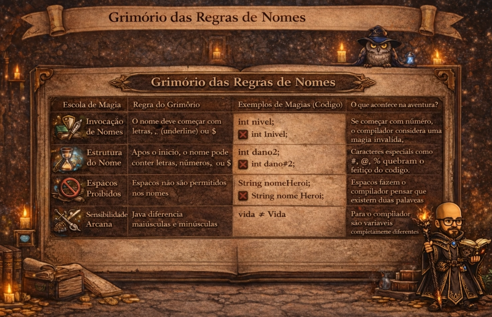

### 📜 Palavras Reservadas: O Vocabulário Arcano

Estas 52 palavras sao “feitiços pré-existentes”. Você **não pode** usá-las para dar nome as suas variaveis. se voce tentar criar uma variavel chamada **int class = 10;**, o **Java** vai pensar que voce esta tentando criar uma classe e o codigo vai explodir.

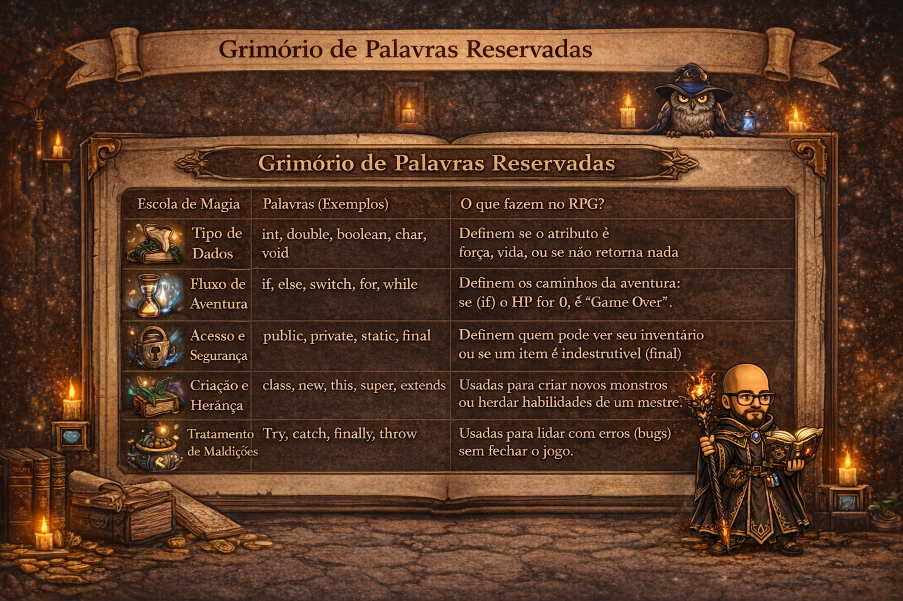

### Grimório de Palavras Reservadas

| Escola de Magia | Palavras(Exemplos) | O que fazem no RPG? |
| --- | --- | --- |
| Tipo de dados | int, double, bollean, char, void | Definem se o atributo é força, vida, ou se nao retorna nada |
| Fluxo de Aventura | if, else, switch, for, while | Definem os caminhos “Se (if) o HP for 0, Game Over”. |
| Acesso e Segurança | public, private, static, final | Definem quem pode ver seu inventario ou se um item é indestrutivel (final). |
| Criação e Herança | class, new, this, super, extends | Usadas para criar novos monstros ou herdar habilidades de um mestre. |
| Tratamento de Maldiçoes | Try, catch, finally, throw | Usadas para lidar com erros (bugs) sem fechar o jogo. |

### Boas Praticas: O Codigo de Conduta do cavaleiro

para que seu pergaminho seja legivel por outros magos (programadores), siga estas diretrizes:

1. **Seja Descritivo**: Em vez de **int x = 10; , use int agilidadeHeroi = 10**; .
2. **Evite a “Sopa de Simbolos”:** Embora **$** e **_** sejam permitidos, use-os com moderação. O padrao da comunidade prefere o **camelCase** Puro**.**

### 🏰 Quadro de Missões: O Batismo das Runas

### 🥉 Bronze (Fácil) - O Crivo do Nomeador

1. **A Regra de Ouro:** Qual destes nomes de variável o Java aceitaria sem "explodir" o código?
    - [ ]  a) `int 1vitoria;`
    - [ ]  b) `int vitoria_1;`
    - [ ]  c) `int vitoria 1;`
        - **⚠ Dica do Mestre:**
            
            A maestria na programação nasce da prática, não apenas da leitura. O código só ganha vida quando você o escreve! Tente resolver o desafio com sua própria lógica antes de espiar a solução. **Confie no seu processo; o erro de hoje é o acerto de amanhã!**
            
        - **Resolução:**
            
            **✅ Alternativa correta:**
            
            **b) `int vitoria_1;`**
            
            📖 Explicação:
            
            O Java possui regras específicas para nomes de variáveis (identificadores).
            
            Um identificador:
            
            - Pode começar com **letra**, `_` ou `$`
            - Pode conter **números depois da primeira letra**
            - **Não pode começar com número**
            - **Não pode conter espaços**
            
            A alternativa **b)** segue todas as regras:
            
            - Começa com letra ✔
            - Possui número após a letra ✔
            - Usa underscore `_` corretamente ✔
            
2. **O Espaço Proibido:** Por que o identificador `String nome do heroi;` é considerado uma "maldição" para o compilador?
    - [ ]  A) Porque a linguagem não permite o uso do tipo `String`.
    - [ ]  B) Porque identificadores não podem conter espaços, tornando `nome do heroi` inválido.
    - [ ]  C) Porque o ponto e vírgula está sendo usado incorretamente.
    - [ ]  D) Porque toda variável `String` precisa ser inicializada no momento da declaração.
    - **⚠ Dica do Mestre:**
        
        A maestria na programação nasce da prática, não apenas da leitura. O código só ganha vida quando você o escreve! Tente resolver o desafio com sua própria lógica antes de espiar a solução. **Confie no seu processo; o erro de hoje é o acerto de amanhã!**
        
    - **Resolução:**
        
        **✅ Alternativa correta:**
        
        **B) Porque identificadores não podem conter espaços, tornando `nome do heroi` inválido.**
        
        📖 Explicação:
        
        Em Java, nomes de variáveis (identificadores) **não podem conter espaços**.
        
        Quando você escreve:
        
        ```
        Stringnomedoheroi;
        ```
        
        O compilador interpreta assim:
        
        - `nome` → nome da variável
        - `do` → algo inesperado
        - `heroi` → algo inesperado
        
        Ou seja, o Java entende que você está tentando escrever várias coisas separadas, e isso gera erro de sintaxe.
        
3. **Início de Jornada:** Quais são os únicos três tipos de caracteres permitidos para **começar** o nome de uma variável?
    - [ ]  a) Letras, Números e @
    - [ ]  b) Letras, Underline (_) e Cifrão ($)
    - [ ]  c) Letras, Espaços e Traços (-)
        - **⚠ Dica do Mestre:**
            
            A maestria na programação nasce da prática, não apenas da leitura. O código só ganha vida quando você o escreve! Tente resolver o desafio com sua própria lógica antes de espiar a solução. **Confie no seu processo; o erro de hoje é o acerto de amanhã!**
            
        - **Resolução:**
            
            **✅ Alternativa correta:**
            
            **b) Letras, Underline (_) e Cifrão ($)**
            
            📖 Explicação:
            
            Em Java, o nome de uma variável (identificador) **não pode começar com qualquer caractere**.
            
            Os únicos caracteres permitidos no início são:
            
            - **Letras** (a–z, A–Z)
            - **Underline** `_`
            - **Cifrão** `$`
            
            Exemplos válidos:
            
            ```
            int vida;
            int _energia;
            int $moedas;
            ```
            

### 🥈 Prata (Médio) - O Guardião do Vocabulário Arcano

1. **Palavras de Poder:** Imagine que você quer criar uma variável para contar quantas classes de prestígio um herói tem. Você tenta: `int class = 5;`. Por que o Java não permite isso?
    - [ ]  A) Porque variáveis do tipo `int` não podem receber o valor 5.
    - [ ]  B) Porque toda variável `int` precisa ser declarada dentro de um método.
    - [ ]  C) Porque `class` é uma palavra reservada da linguagem Java e não pode ser usada como identificador.
    - [ ]  D) Porque números inteiros só podem ser armazenados em variáveis do tipo `Integer`.
        - **⚠ Dica do Mestre:**
            
            A maestria na programação nasce da prática, não apenas da leitura. O código só ganha vida quando você o escreve! Tente resolver o desafio com sua própria lógica antes de espiar a solução. **Confie no seu processo; o erro de hoje é o acerto de amanhã!**
            
        - **Resolução:**
            
            **✅ Alternativa correta:**
            
            **C) Porque `class` é uma palavra reservada da linguagem Java e não pode ser usada como identificador.**
            
            📖 Explicação:
            
            Em Java, existem **palavras reservadas** (keywords) que fazem parte da estrutura da linguagem.
            
            A palavra `class` é usada para **declarar uma classe**:
            
            ```
            public class Heroi {
            }
            ```
            
            Como ela já tem uma função específica dentro da linguagem, o Java **não permite que seja usada como nome de variável**.
            
2. **Identificadores Disfarçados:** Marque quais destes são identificadores válidos (embora nem todos sigam as boas práticas):
    - [ ]  a) `$_valor`
    - [ ]  b) `static`
    - [ ]  c) `velocidadeMaxima`
    - [ ]  d) `ponto#critico`
        - **⚠ Dica do Mestre:**
            
            A maestria na programação nasce da prática, não apenas da leitura. O código só ganha vida quando você o escreve! Tente resolver o desafio com sua própria lógica antes de espiar a solução. **Confie no seu processo; o erro de hoje é o acerto de amanhã!**
            
        - **Resolução:**
            
            **✅ Alternativas corretas:**
            
            **a) `$_valor`**
            
            **c) `velocidadeMaxima`**
            
3. **Desafio do Escriba:** Analise a lista de "variáveis" abaixo que um aprendiz tentou criar para um RPG. **Quais delas o Java vai aceitar?** 
    - [ ]  `int 2026_nivel;`
    - [x]  `String classeHeroi;`
    - [x]  `double valor$Recompensa;`
    - [ ]  `boolean float;`
    - [ ]  `int status heroi;`
        - **⚠ Dica do Mestre:**
            
            A maestria na programação nasce da prática, não apenas da leitura. O código só ganha vida quando você o escreve! Tente resolver o desafio com sua própria lógica antes de espiar a solução. **Confie no seu processo; o erro de hoje é o acerto de amanhã!**
            
        - **Resolução:**
            
            **✅ Alternativas corretas:**
            
            **`String classeHeroi;`**
            
            **`double valor$Recompensa;`**
            

### 🥇 Ouro (Difícil) - O Código de Conduta do Cavaleiro

1. **Sopa de Símbolos vs. Clareza:** Um aprendiz escreveu o seguinte código:
`int a = 100; // HP do guerreirodouble b = 50.5; // Peso da armadura`
    
    Reescreva essas duas variáveis seguindo a **Boa Prática** de ser descritivo e usar o **camelCase**, conforme o seu pergaminho orienta.
    
    - **⚠ Dica do Mestre:**
        
        A maestria na programação nasce da prática, não apenas da leitura. O código só ganha vida quando você o escreve! Tente resolver o desafio com sua própria lógica antes de espiar a solução. **Confie no seu processo; o erro de hoje é o acerto de amanhã!**
        
    - **Resolução:**
        
        ```java
        public class FichaGuerreiro {
            public static void main(String[] args) {
                int pontosVida = 100; // HP do guerreiro
                double pesoArmadura = 50.5; // Peso da armadura
        
                System.out.printf("HP: %d%nPeso Armadura: %.1f%n", pontosVida, pesoArmadura);
        
            }
        }
        ```
        
2. **O Grimório de Tipos:** Olhando para a tabela de palavras reservadas, quais palavras você usaria para definir se um atributo é "força" (número inteiro) ou "vida"  (número decimal)?
    - [ ]  A) `integer` e `decimal`
    - [ ]  B) `int` e `float`
    - [ ]  C) `number` e `double`
    - [ ]  D) `Int` e `Double`
        - **⚠ Dica do Mestre:**
            
            A maestria na programação nasce da prática, não apenas da leitura. O código só ganha vida quando você o escreve! Tente resolver o desafio com sua própria lógica antes de espiar a solução. **Confie no seu processo; o erro de hoje é o acerto de amanhã!**
            
        - **Resolução:**
            
            **✅ Alternativa correta:**
            
            **B) `int` e `float`**
            
            📖 Explicação:
            
            Em Java, os tipos primitivos para números são definidos por **palavras reservadas específicas**.
            
            Para representar:
            
            - **Força (número inteiro)** → usamos `int`
            - **Vida (número decimal)** → podemos usar `float` (ou `double`, mas entre as opções dadas, `float` é a correta)
            
            Exemplo:
            
            ```
            int forca=18;
            float vida=75.5f;
            ```
            
            ⚠ Observação importante:
            
            Quando usamos `float`, é necessário colocar **`f` no final do número**, pois o Java considera números decimais como `double` por padrão.
            

### 💎 Diamante (Nível 2) - O Perito em Identificação

1. **O Sistema de Validação de Itens:**
Você está criando um sistema para um ferreiro. Ele quer registrar uma "Espada Lendária" que custa "5000" moedas.
    
    **Sua missão:**
    
    - Crie uma classe chamada `RegistroFerreiro`.
    - Declare uma variável para o nome do item e outra para o preço.
    - **O Desafio:** Você deve usar um identificador que comece com `$` para o preço e um que comece com `_` para o nome do item (apenas para provar que você conhece a regra de início de nome).
    - Use o `System.out.printf` para exibir:
        
         `Item: %s | Valor: %.2f moedas%n`.
        
    - Adicione um comentário de código (`//`) explicando por que você não poderia usar a palavra `new` como nome da variável de preço.
        - **⚠ Dica do Mestre:**
            
            A maestria na programação nasce da prática, não apenas da leitura. O código só ganha vida quando você o escreve! Tente resolver o desafio com sua própria lógica antes de espiar a solução. **Confie no seu processo; o erro de hoje é o acerto de amanhã!**
            
        - **Resolução:**
            
            ```java
            public class RegistroFerreiro {
                public static void main(String[] args) {
                    String _nomeItem = "Espada Lendária";
                    double $preco = 5000.00;
            
                    System.out.printf("Item: %s | Valor: %.2f moedas", _nomeItem, $preco);
            
                    // Não podemos usar "new" como nome de variável,
                    // porque "new" é uma palavra reservada do Java.
                    // Ela é utilizada para criar novos objetos na memória.
                }
            }
            ```
            

---

## 5. Comentários no Código 💬💻

Os comentários são como **anotações no mapa de um explorador**. Elas não mudam o terreno (o código), mas impedem que quem venha depois (ou você mesmo no futuro) caia em armadilhas.

No **Java** o compilador e ignora essas anotações. Elas servem puramente para comunicação entre humanos.

### Diário do Aventureiro (Tipos de Comentários)

| Tipo |  Simbolo | Uso no RPg | Exemplço pratico |
| --- | --- | --- | --- |
| **Linha Unica** | // | Notas rapidas sobre um atributo ou item. | int vida = 10; //HP base do goblin |
| **Multiplas linhas**  | /*…………………………………………………*/ | Explicar a lore de um sistema complexo ou desativar blocos de magia | /* O Sistema de critico leva em conta a sorte e a destreza */ |
| **Javadoc** | /**…………………………………………………………….  */ | O “Grande livro de Regras” Gera documentaçao automatica para outros mestres | /** @para força valor de ataque do heroi */ |


### 📖 Como Documentar suas Magias (Javadoc)

O **Javadoc** é especial. Ele não apenas comenta o codigo, mas pode ser extreido para criar um manual técnico (HTML). É como se as anotaçoes do seu grimorio se tranformassem em uma enciclopedia magica automatica.

### Tags de poder do Javadoc

- @param: Explica o que é cada “ingrediente” (parametro) da magia.
- @return: Explica qual sera o resultado final apos a execuçao.
- @throws: Avisa sobre possiveis “maldiçoes” (erros) que podem ocorrer.

### O Código de Ética dos escribas

Seguir boas praticas evita que seu codigo vire um pantano de textos inuteis:

1. **Não narre o obvio:** Evite **int vida = 10; //Define vida como 10**. O codigo ja diz isso!
2. **Explique a intenção: Use comentarios para dizer **por que** você tomou uma decisão.
    - **Bom:** // Usamos 0.5 aqui porque o escudo de madeira absorve metade do dano.
3. **Codigo Limpo:** Se o seu codigo for tão claro que nao precisa de comentarios, voce atingiu o nivel de mestre. Use comentarios apenas onde a logica for realmente complexa.

### ⚔️ Desafio do Cronista

Abaixo está um método de combate sem nenhuma documentação. Sua missão é adicionar:

1. Um **comentário de linha única** para a variável `danoFinal`.
2. Um **Javadoc** acima do método explicando o que ele faz, o parâmetro `defesa` e o que ele retorna.

```java
public int calcularDano(int ataque, int defesa) {
    int danoFinal = ataque - defesa; 
    
    if (danoFinal < 0) {
        danoFinal = 0;
    }
    
    return danoFinal;
}
```

### 🏰 Quadro de Missões: O Diário do Explorador

### 🥉 Bronze (Fácil) - O Sussurro do Escriba

1. **A Nota Rápida:** Qual símbolo você deve usar para fazer um comentário de apenas uma linha no final de um código?
    - [ ]  a) `/*`
    - [ ]  b) `/**`
    - [x]  c) `//`
2. **O Olho do Mestre:** O que acontece se você escrever uma receita de bolo dentro de um comentário `//` e tentar rodar o programa?
    - [ ]  a) O Java tenta cozinhar (dá erro de compilação).
    - [x]  b) O Java ignora completamente o texto e o programa roda normal.
    - [ ]  c) O texto aparece escrito no console.
3. **O Bloco de Notas:** Para desativar um parágrafo inteiro de código que está causando erros, qual símbolo é o mais eficiente para abrir e fechar o comentário?
    - [x]  a) `//`
    - [ ]  b) `#`
    - [ ]  c) `/*` e `*/`
    - [ ]  d) `<!--` e `-->`

### 🥈 Prata (Médio) - O Guardião do Conhecimento

1. **A Ética do Cavaleiro:** Analise a frase: `int nivel = 1; //Define o nível como 1`. Segundo a apostila, por que esse comentário é considerado uma "má prática"?
    
    Resposta:
    
    ```
    
    ```
    
    - **⚠ Dica do Mestre:**
        
        A maestria na programação nasce da prática, não apenas da leitura. O código só ganha vida quando você o escreve! Tente resolver o desafio com sua própria lógica antes de espiar a solução. **Confie no seu processo; o erro de hoje é o acerto de amanhã!**
        
    - **Resolução:**
        
        **✅ Alternativa correta:**
        
        ```
        Porque comentar o óbvio não agrega valor ao código.
        Os comentários devem ser utilizados apenas para explicar partes que não são 
        tão claras ou que exigem entendimento adiciona
        ```
        
        📖 Explicação:
        
        Comentários devem ser usados para explicar partes do código que não são facilmente compreendidas. Relatar o óbvio torna o código poluído e menos legível, indo contra as boas práticas de programação.
        
2. **A Intenção da Magia:** Como você comentaria a linha abaixo de forma útil, explicando o **porquê** da decisão (invente uma regra de RPG)?
    
    ```java
    double modificador = 0.5;
    ```
    
    - **⚠ Dica do Mestre:**
        
        A maestria na programação nasce da prática, não apenas da leitura. O código só ganha vida quando você o escreve! Tente resolver o desafio com sua própria lógica antes de espiar a solução. **Confie no seu processo; o erro de hoje é o acerto de amanhã!**
        
    - **Resolução:**
        
        **✅ Alternativa correta:**
        
        ```java
        double modificador = 0.5;
        /* Reduz o efeito das habilidades pela metade quando
        o personagem está sob efeito de "fadiga mágica"*/
        ```
        
        📖 Explicação:
        
        A forma correta é explicar o **contexto da regra**, como por exemplo uma mecânica de RPG (fadiga, debuff, condição especial, etc.).
        
        Isso torna o código mais compreensível e útil para outros desenvolvedores, pois deixa claro **por que o valor 0.5 está sendo aplicado**.
        

### 🥇 Ouro (Difícil) - O Alquimista de Javadoc

1. **Tags de Poder:** No Javadoc, usamos "tags" para organizar a informação. Relacione as tags abaixo com sua função:
    - a) `@param`
    - b) `@return`
    - c) `@throws`
    - (1) Explica o que a magia devolve ao final.
    - (2) Avisa sobre possíveis "maldições" ou erros.
    - (3) Descreve os "ingredientes" (parâmetros) que entram na magia.
    - [ ]  A-1, B-2, C-3
    - [ ]  A-3, B-1, C-2
    - [ ]  A-2, B-3, C-1
    - [ ]  A-3, B-2, C-1
    - [ ]  A-1, B-3, C-2
    - **⚠ Dica do Mestre:**
        
        A maestria na programação nasce da prática, não apenas da leitura. O código só ganha vida quando você o escreve! Tente resolver o desafio com sua própria lógica antes de espiar a solução. **Confie no seu processo; o erro de hoje é o acerto de amanhã!**
        
    - **Resolução:**
        
        **✅ Alternativa correta:**
        
        **A-3, B-1, C-2**
        
        📖 Explicação:
        
        Cada tag do Javadoc tem uma função específica:
        
        - `@param` → **Descreve os parâmetros** que entram no método
        ✔️ Relacionado com (3) “ingredientes”
        - `@return` → **Descreve o valor retornado** pelo método
        ✔️ Relacionado com (1) “o que a magia devolve”
        - `@throws` → **Indica possíveis exceções/erros**
        ✔️ Relacionado com (2) “maldições ou erros”

### 💎 Diamante (Nível 2) - O Cronista Real

1. **O Registro da Espada Sagrada:**
Crie uma classe chamada `CalculadoraDeDano`.
    
    **Sua missão de escrita:**
    
    - **No topo da classe:** Use um comentário de **Múltiplas Linhas** para descrever a "Lore" (história) desse sistema de dano.
    - **No método main:** Crie uma variável `int ataqueTotal = 50;`. Adicione um comentário de **Linha Única** explicando que este valor inclui o bônus da arma equipada.
    - **Desafio de Documentação:** Imagine um método chamado `aplicarDano`. Escreva apenas o **Javadoc** (o bloco `/** ... */`) para ele, usando as tags `@param` para o nome do inimigo e `@return` para informar se o inimigo ainda está vivo (true/false).
    - **Integração:** Use o que aprendeu em capítulos anteriores: nomeie a classe em **PascalCase** e a variável em **camelCase**.

---

## 6. Tipos de dados 🗃💾

Essa é a parte mais importante da sua “ficha de personagem”, recruta! No java, os **Tipos de dados** Definem o que cada atributo pode guardar. Se voce tentar guardar um **”Dragao”** (String) dentro de um **”Frasco de poçao”** (byte), o codigo vai tranbordar!

### 1. Tipos primitivos (atributos básicos)

Os tipos primitivos são os elementos mais puros da linguagem. Eles não são objetos, são valores brutos guardados diretamente na memória "rápida" (Stack).

### Inteiros (Sem casas decimais)

| Tipo | Espaço | Uso no RPg | Exemplo de codigo |
| --- | --- | --- | --- |
| byte | 8 bits | Nivel de upgrade de arma (-128 a 127). | byte refino = 10; |
| int | 32 bits | XP ou Pontos de vida (HP) | int xpTotal = 1500; |
| long | 64 bits | Pontuação global de um servidor MMO | long scoreMundial = 9000000000L; |

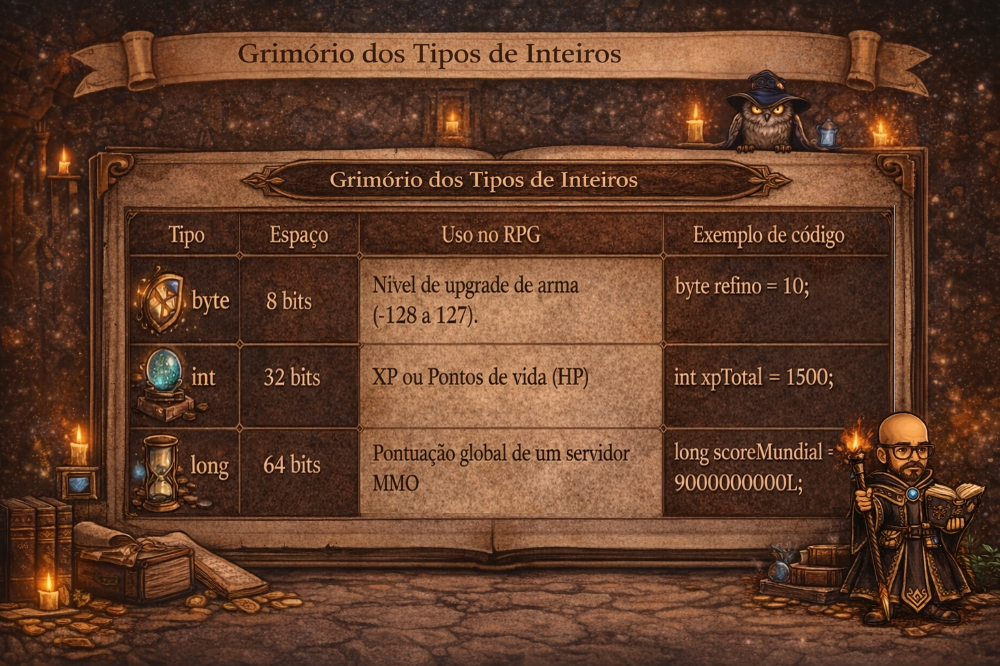

### Decimais (Com casas Decimais)

| Tipo | Espaço | Uso no RPg | Exemplo de codigo |
| --- | --- | --- | --- |
| float | 32 bits | multiplicador de dano critico (precisa do **f** ) | float critico = 15f; |
| double | 64 bits | peso da mochila ou coordenadas no mapa | double pesoBarraOuro = 12.55; |

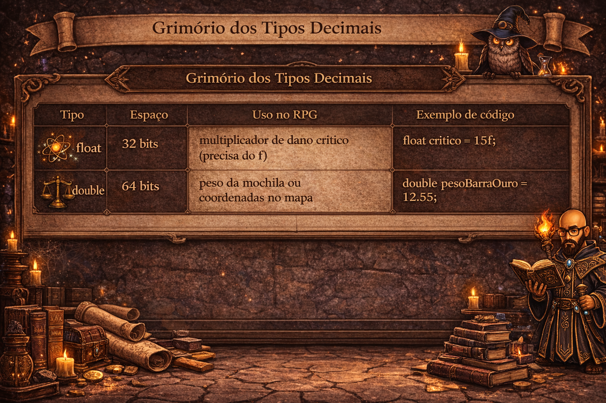

- Dica de forja:
    
    O **float** exige um **f** ao final do numero. O **double** é o tipo favorido do Java para decimais.
    
    Outros.
    

### **Outros tipos**

| Tipo | Espaço | Uso no RPg | Exemplo de codigo |
| --- | --- | --- | --- |
| boolean (verdadeiro ou falso) | 1 bit | O heroi esta vivo? (true/false) | boolean estaVivo = true; |
| char | 16 bits | Classe do heroi (uma unica letra) | char rank = ‘S’ ; |

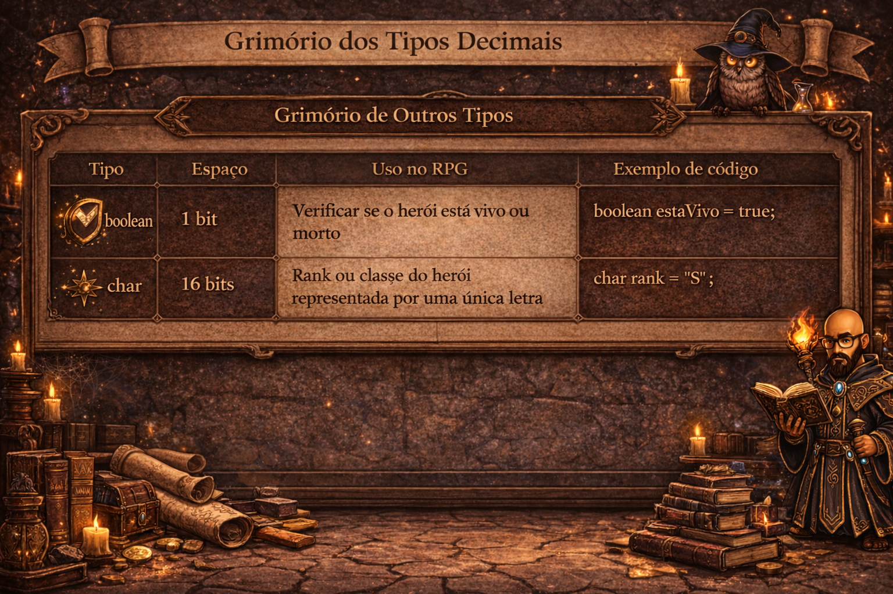

### Porque o tamanho importa

Imagine que seu servidor de RPG tem 1 milhçao de jogadore.

- Se voce salvar o nivel de todos como **long** (8 bits), gastará **8MB**.
- Se salvar como **byte** (1 byte), gastara apenas **1MB**. Saber escolher o tipo certo é a diferença entre um jogo leve e um jogo que trava o PC do usuario!

### ⚔️ Desafio dos Atributos

Analise os dados abaixo e me diga qual o **melhor tipo primitivo** para cada um, pensando em economizar memória sem deixar o valor "estourar":

1. A quantidade de dedos de um personagem (0 a 10).
2. A distância entre duas galáxias no mapa estelar.
3. Se o modo "PVP" está ligado ou desligado.
4. O preço de uma maçã na taverna (ex: 1.50).
5. O número total de monstros derrotados por todos os jogadores do mundo (estimativa de bilhões).

## 🏰 Quadro de Missões: A Alquimia dos Atributos

### 🥉 Bronze (Fácil) - O Aprendiz de Farmácia

1. **O Frasco Pequeno:** Você quer guardar o nível de refinamento de uma espada (que vai de 0 a 20). Qual o tipo de dado mais econômico em termos de bits para isso?
    - [ ]  a) `int`
    - [ ]  b) `long`
    - [ ]  c) `byte`
    - **⚠ Dica do Mestre:**
        
        A maestria na programação nasce da prática, não apenas da leitura. O código só ganha vida quando você o escreve! Tente resolver o desafio com sua própria lógica antes de espiar a solução. **Confie no seu processo; o erro de hoje é o acerto de amanhã!**
        
    - **Resolução:**
        
        **✅ Alternativa correta:**
        
        **c) `byte`**
        
        📖 Explicação:
        
        O tipo `byte` ocupa apenas **8 bits** e armazena valores de **-128 a 127**, o que é mais do que suficiente para representar níveis de 0 a 20.
        
        Já:
        
        - `int` usa 32 bits
        - `long` usa 64 bits
        
        Portanto, `byte` é o tipo mais econômico em memória para esse caso.
        
2. **O Simbolo do Rank:** Para guardar apenas a letra inicial do rank de um aventureiro (Ex: 'A', 'B' ou 'S'), qual tipo devemos usar?
    - [ ]  a) `String`
    - [ ]  b) `char`
    - [ ]  c) `boolean`
    - **⚠ Dica do Mestre:**
        
        A maestria na programação nasce da prática, não apenas da leitura. O código só ganha vida quando você o escreve! Tente resolver o desafio com sua própria lógica antes de espiar a solução. **Confie no seu processo; o erro de hoje é o acerto de amanhã!**
        
    - **Resolução:**
        
        **✅ Alternativa correta:**
        
        **b) `char`**
        
        📖 Explicação:
        
        O tipo `char` é utilizado para armazenar **um único caractere**, como 'A', 'B' ou 'S'.
        
        Já:
        
        - `String` armazena **vários caracteres (texto)**
        - `boolean` armazena apenas **true ou false**
        
        Portanto, `char` é o tipo mais adequado para representar uma única letra de rank.
        
3. **Missão Concluída ou Falha:** Qual tipo de dado ocupa apenas 1 bit e serve para dizer se uma missão foi completada ou não?
    - [ ]  a) `int`
    - [ ]  b) `char`
    - [ ]  c) `boolean`
    - [ ]  d) `double`
- **⚠ Dica do Mestre:**
    
    A maestria na programação nasce da prática, não apenas da leitura. O código só ganha vida quando você o escreve! Tente resolver o desafio com sua própria lógica antes de espiar a solução. **Confie no seu processo; o erro de hoje é o acerto de amanhã!**
    
- **Resolução:**
    
    **✅ Alternativa correta:**
    
    **c) `boolean`**
    
    📖 Explicação:
    
    O tipo `boolean` é usado para representar apenas dois valores: **true** (verdadeiro) ou **false** (falso), sendo ideal para indicar se uma missão foi concluída ou não.
    
    Ele é o tipo mais econômico, pois conceitualmente utiliza apenas **1 bit** de informação.
    
    Já:
    
    - `int` → números inteiros
    - `char` → caracteres
    - `double` → números decimais

### 🥈 Prata (Médio) - O Guardião da Precisão

1. **A Maldição do Float:** Um aprendiz tentou escrever `float dano = 12.5;` e o código explodiu. O que está faltando no final do número para o "feitiço" funcionar?
    
    ```
    float dano = 12.5;
    ```
    
    - **⚠ Dica do Mestre:**
        
        A maestria na programação nasce da prática, não apenas da leitura. O código só ganha vida quando você o escreve! Tente resolver o desafio com sua própria lógica antes de espiar a solução. **Confie no seu processo; o erro de hoje é o acerto de amanhã!**
        
    - **Resolução:**
2. **O Peso da Moeda:** O `double` é o tipo favorito do Java para decimais. Se você tiver um peso de `10.5` kg, como seria a declaração correta dessa variável seguindo as convenções de nome (`camelCase`)?
    - **⚠ Dica do Mestre:**
        
        A maestria na programação nasce da prática, não apenas da leitura. O código só ganha vida quando você o escreve! Tente resolver o desafio com sua própria lógica antes de espiar a solução. **Confie no seu processo; o erro de hoje é o acerto de amanhã!**
        
    - **Resolução:**
        
        **✅ Alternativa correta:**
        
        **(Adicionar o sufixo `f` ao final do número)**
        
        📖 Explicação:
        
        Por padrão, números com casas decimais em Java são do tipo `double`.
        
        Como `float` é um tipo diferente e menor, o compilador exige uma indicação explícita. Isso é feito adicionando o sufixo `f` ao valor.
        
        Sem isso, ocorre erro de compilação por tentativa de atribuir um `double` a um `float`.
        

### 🥇 Ouro (Difícil) - O Economista de Bits

1. **Otimização de Servidor:** Imagine que você tem 10.000 NPCs na sua cidade. Todos eles têm uma variável `estaAndando` (verdadeiro ou falso). Qual a diferença de memória total se você usar um `int` (32 bits) em vez de um `boolean` (1 bit) para cada NPC?
    - [ ]  a) ~3,8 KB
    - [ ]  b) ~38 KB
    - [ ]  c) ~380 KB
    - [ ]  d) ~3.800 KB
    - **⚠ Dica do Mestre:**
        
        A maestria na programação nasce da prática, não apenas da leitura. O código só ganha vida quando você o escreve! Tente resolver o desafio com sua própria lógica antes de espiar a solução. **Confie no seu processo; o erro de hoje é o acerto de amanhã!**
        
    - **Resolução:**
        
        **✅ Alternativa correta:**
        
        **b) ~38 KB**
        
        📖 Explicação:
        
        - `int` → 32 bits
        - `boolean` → 1 bit
        
        🔹 Diferença por NPC:
        
        ```
        32 - 1 = 31 bits
        ```
        
        🔹 Para 10.000 NPCs:
        
        ```
        31 × 10.000 = 310.000 bits
        ```
        
        🔹 Convertendo para bytes:
        
        ```
        310.000 ÷ 8 = 38.750 bytes ≈ 38 KB
        ```
        
        Portanto, usar `int` consumiria cerca de **38 KB a mais de memória**.
        
2. **A Letra e o Número:** Qual a diferença visual na hora de escrever um valor para um `char` e um valor para um `int`? (Dica: olhe as aspas!).
    - [ ]  a) `char` usa aspas simples ('A') e `int` não usa aspas (10) ✅
    - [ ]  b) `char` usa aspas duplas ("A") e `int` usa aspas simples ('10')
    - [ ]  c) Ambos usam aspas duplas ("A" e "10")
    - [ ]  d) Nenhum dos dois usa aspas
    - **⚠ Dica do Mestre:**
        
        A maestria na programação nasce da prática, não apenas da leitura. O código só ganha vida quando você o escreve! Tente resolver o desafio com sua própria lógica antes de espiar a solução. **Confie no seu processo; o erro de hoje é o acerto de amanhã!**
        
    - **Resolução:**
        
        **✅ Alternativa correta:**
        
        **a) `char` usa aspas simples ('A') e `int` não usa aspas (10)**
        
        📖 Explicação:
        
        Em Java, o tipo `char` representa **um único caractere** e deve ser escrito entre **aspas simples**:
        
        ```
        charletra='A';
        ```
        
        Já o tipo `int` representa **números inteiros** e é escrito **sem aspas**:
        
        ```
        intnumero=10;
        ```
        
        Usar aspas em números faria com que eles fossem interpretados como texto (ou causaria erro, no caso de `char` com mais de um caractere).
        

### 💎 Diamante (Nível 2) - O Mestre da Ficha Técnica

1. **A Grande Forja dos Atributos:**
Crie uma classe chamada `AtributosVilao`. No método `main`, você deve declarar e inicializar os atributos de um Boss final usando o tipo **mais econômico possível** para cada um:
    
    **Requisitos da Ficha:**
    
    - **Vidas:** O Boss tem 3 vidas (pense no menor tipo inteiro).
    - **Mana:** O Boss tem 5000 de mana.
    - **Dano Crítico:** O multiplicador é de 2.5 (use `float`).
    - **Ouro de Saque:** Ele dropa 1.000.000.000.000 de moedas (um trilhão).
    - **Status:** Uma variável que diz se ele "estaEnfurecido".
    
    **Ação Final:** Use um único `System.out.printf` para exibir a frase:
    `Boss Status: Vida=%d | Mana=%d | Critico=%.1f | Ouro=%d | Furioso=%b%n`
    
    **Desafio de Integração:** Adicione um comentário Javadoc (`/** ... */`) acima da classe explicando que esta é a ficha técnica do vilão final.
    
    - **⚠ Dica do Mestre:**
        
        A maestria na programação nasce da prática, não apenas da leitura. O código só ganha vida quando você o escreve! Tente resolver o desafio com sua própria lógica antes de espiar a solução. **Confie no seu processo; o erro de hoje é o acerto de amanhã!**
        
    - **Resolução:**

### 2. Classes Wrapper

As **Classes Wrapper** são como as “Versoes de Luxo” dos tipos primitivos. No **Java**, os tipos primitivos (como **int** ou **double) são apenas valores brutos na memmoria.** 

Já os **Wrappers sao objetos**, o que significa que elas vem com uma mochila cheia de metodos e utilitarios magicos.

### 🎁 Wrappers: O Encantamento de Tipos

Imagine que um tipo **primitivo** é uma flecha comum. Uma **Classe Wrapper** é uma “Flecha Encantada”: Ela ainda é uma flecha, mas agora possui propriedades especiais e pode ser guardada em baus magicos (coleções) onde flechas comuns nao cabem.

| Tipo Primitivos | Classe Wrapper | Quando usar: |
| --- | --- | --- |
| **int** | **Integer** | Quando precisa converter texto de um input em numero (**parseInt**) |
| **double** | **Double** | Precisa verificar o valor maximo permitido para um atributo (Double.MAX_VALUE ). |
| **char** | **Character** | Para checar se um caractere digitado é uma letra ou numero (**isDigit**). |
| boolean | Boolean | Para converter uma resposta “true” do servidor em um estado do herói. |


### 🛡️ Autoboxing e Unboxing: A Transformação Automática

O **Java** é inteligente. Ele consegue transformar um tipo primitivo em **Wrapper** (e vice-versa) automaticamente. No mundo do codigo, chamamos isso de  **Autoboxing**.

- **Autoboxing**: o **Java** coloca o valor primitivo dentro de uma “caixa” (objeto).
    
    ```java
    	int vidaPrimitiva = vidaObjeto; // O integer volta a ser int
    ```
    

### 🧪 Por que usar Wrappers em vez de Primitivos?

1. **Utilidades Arcanas: Wrappers possuem métodos prontos. Ex: integer .max(10, 20)** retorna o maior valor.
2. **Trabalho com Nulos:** Um **int** sempre vale **0** se não for inicializado. Já um **integer** poder ser **null**. No RPG, isso é util para saber se um atributo “ainda nao foi definido”.
3. **Coleçoes (ArrayListis):** futuramente, voce verá que o **Java** nao aceita primitivos dentro de listas. Você não pode ter uma **List<int>**, mas pode ter uma **List<integer>.**

## 🏰 Quadro de Missões: O Poder das Wrappers

### 🥉 Bronze (Fácil) - A Transformação de Valores

No seu IntelliJ, dentro do método `main`, faça o seguinte:

1. Crie uma variável `Integer vidaObjeto = 100;`.

- **⚠ Dica do Mestre:**
    
    A maestria na programação nasce da prática, não apenas da leitura. O código só ganha vida quando você o escreve! Tente resolver o desafio com sua própria lógica antes de espiar a solução. **Confie no seu processo; o erro de hoje é o acerto de amanhã!**
    
- **Resolução:**
1. Crie uma variável `int vidaPrimitiva = vidaObjeto;`.
    - **⚠ Dica do Mestre:**
        
        A maestria na programação nasce da prática, não apenas da leitura. O código só ganha vida quando você o escreve! Tente resolver o desafio com sua própria lógica antes de espiar a solução. **Confie no seu processo; o erro de hoje é o acerto de amanhã!**
        
    - **Resolução:**
2. Use o `System.out.println` para mostrar o valor de `vidaPrimitiva`.
*Isso serve para você ver que o Java faz a troca de "caixas" (Autoboxing) automaticamente para você.*
    - **⚠ Dica do Mestre:**
        
        A maestria na programação nasce da prática, não apenas da leitura. O código só ganha vida quando você o escreve! Tente resolver o desafio com sua própria lógica antes de espiar a solução. **Confie no seu processo; o erro de hoje é o acerto de amanhã!**
        
    - **Resolução:**

### 🥈 Prata (Médio) - Decifrando o Pergaminho

1. Crie uma `String textoDano = "50";`.
    - **⚠ Dica do Mestre:**
        
        A maestria na programação nasce da prática, não apenas da leitura. O código só ganha vida quando você o escreve! Tente resolver o desafio com sua própria lógica antes de espiar a solução. **Confie no seu processo; o erro de hoje é o acerto de amanhã!**
        
    - **Resolução:**
2. Use o comando `Integer.parseInt(textoDano)` e guarde o resultado em uma variável do tipo `int`.
    - **⚠ Dica do Mestre:**
        
        A maestria na programação nasce da prática, não apenas da leitura. O código só ganha vida quando você o escreve! Tente resolver o desafio com sua própria lógica antes de espiar a solução. **Confie no seu processo; o erro de hoje é o acerto de amanhã!**
        
    - **Resolução:**
3. Some `10` a esse valor e mostre o resultado final com `System.out.println`.
    - **⚠ Dica do Mestre:**
        
        A maestria na programação nasce da prática, não apenas da leitura. O código só ganha vida quando você o escreve! Tente resolver o desafio com sua própria lógica antes de espiar a solução. **Confie no seu processo; o erro de hoje é o acerto de amanhã!**
        
    - **Resolução:**

### 🥇 Ouro (Difícil) - O Olho do Observador

As Wrappers têm "poderes de observação" (métodos) que os tipos primitivos não têm:

1. Use o comando `Character.isDigit('5')` dentro de um `System.out.println`. Ele deve retornar `true`.
    - **⚠ Dica do Mestre:**
        
        A maestria na programação nasce da prática, não apenas da leitura. O código só ganha vida quando você o escreve! Tente resolver o desafio com sua própria lógica antes de espiar a solução. **Confie no seu processo; o erro de hoje é o acerto de amanhã!**
        
    - **Resolução:**
2. Use o comando `Character.isLetter('A')` e veja se ele retorna `true`.
    - **⚠ Dica do Mestre:**
        
        A maestria na programação nasce da prática, não apenas da leitura. O código só ganha vida quando você o escreve! Tente resolver o desafio com sua própria lógica antes de espiar a solução. **Confie no seu processo; o erro de hoje é o acerto de amanhã!**
        
    - **Resolução:**
3. Use o comando `Double.max(25.5, 30.2)` e imprima o resultado para ver qual é o maior peso.
    - **⚠ Dica do Mestre:**
        
        A maestria na programação nasce da prática, não apenas da leitura. O código só ganha vida quando você o escreve! Tente resolver o desafio com sua própria lógica antes de espiar a solução. **Confie no seu processo; o erro de hoje é o acerto de amanhã!**
        
    - **Resolução:**

### 💎 Diamante (Nível 2) - O Verificador de Status

Crie um pequeno código no seu IntelliJ que simule a chegada de dados de um servidor:

1. **Dados Recebidos:**
    - `String nivelTexto = "10";`
    - `String ouroTexto = "150.50";`
    - `char rank = 'S';`
2. **Sua Missão:**
    - Converta o `nivelTexto` para um `int` usando `Integer`.
    - Converta o `ouroTexto` para um `double` usando `Double`.
    - Verifique se o `rank` é uma letra usando o método da Wrapper `Character`.
3. **Saída:**
    - Use o `System.out.printf` para mostrar: `"Nível: %d | Ouro: %.2f | Rank Válido: %b%n"`.
- **⚠ Dica do Mestre:**
    
    A maestria na programação nasce da prática, não apenas da leitura. O código só ganha vida quando você o escreve! Tente resolver o desafio com sua própria lógica antes de espiar a solução. **Confie no seu processo; o erro de hoje é o acerto de amanhã!**
    
- **Resolução:**

### ⚔️ Desafio da Transformação

Vamos praticar o uso dos métodos que vêm dentro das Wrappers. Escreva um código que:

1. Receba uma String `String inputDano = "50";`.
2. Use a Wrapper `Integer` para converter essa String em um número.
3. Use um método da Wrapper `Double` para descobrir qual o maior valor entre `25.5` e `30.2`.
4. Use a Wrapper `Character` para verificar se o rank do herói `'A'` é uma letra (Dica: procure por `Character.isLetter()`).
- **⚠ Dica do Mestre:**
    
    A maestria na programação nasce da prática, não apenas da leitura. O código só ganha vida quando você o escreve! Tente resolver o desafio com sua própria lógica antes de espiar a solução. **Confie no seu processo; o erro de hoje é o acerto de amanhã!**
    
- **Resolução:**

### 3. Manipulação de Texto (a Classe String)

Diferente de um **char,** que guarda apenas uma runa (caractere), a **String** guarda frases inteiras. no Java, elas são **imutaveis**: uma vez criada, voce nao altera a **String** **original**, voce cria uma nova versao dela com as modificações.

### 🧙‍♂️ Encantamentos comuns (métodos úteis)

| Operação | Comando | O que faz? | Exemplo |
| --- | --- | --- | --- |
| Concatenação |   +  ou .concat() | Junta dois textos (nome + Titulo). | “Aragorn” + “ o Rei” |
| tamanho | .length() | Conta quantos caracteres tem o nome | nome.length() |
| Gritar/Sussurrar | .toUpperCase( ) / .toLowerCase( ) | Transforme o texto em **CAIXA ALTA** Ou **caixa baixa** | fala.toUpperCase( ) |
| Comparação | .equals( ) | Verifica se a senha ou o nome é igual. | input.equals(”123”) |
| Busca | .contains( ) | Vê se um titulo contem uma palavra. | item.contains(”Espada”) |

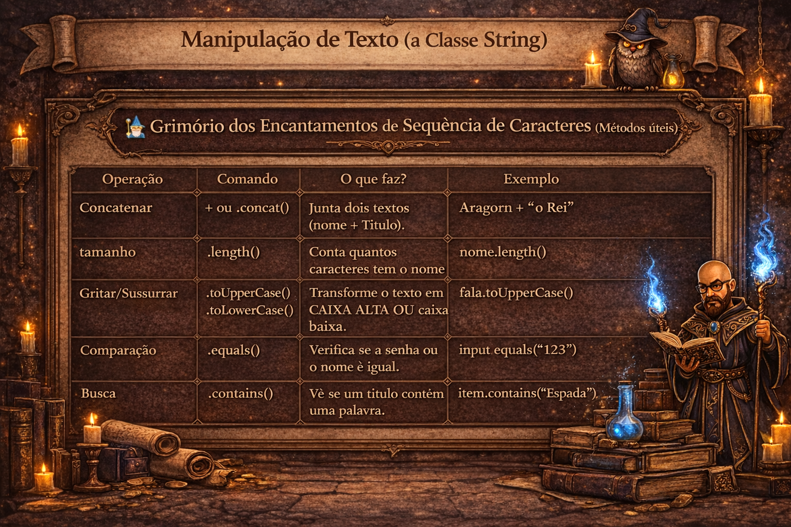

### ⚠️ A Regra de Ouro:

No RPG, se voce usar **==** para comparar dois nomes de personagens, o **Java** vai comparar se eles ocupam o mesmo “espaço de memoria” (o endereço do pergaminho) e não se o texto pe o memso.

- ❌ **Errado**: if (nome == “Aragorn”) (pode falhar!)
- ✅ **Correto**: if (nome.equals(”Aragorn”)) (sempre funciona!)

### Exemplo Prático: O gerador de Títulos

Veja como usar esses metodos para criar um sistema de nomes épicos:

```java
	String nome = "  Aragorn  ";
	String classe = "Warrior";
	
	//1. Limpando espaços em branco (Trim)
	String nomeLimpo = nome.Trim();
	
	//2. Criando Nome Épico (Concatenação)
	String nomeEpico = nomeLimpo + ", O " * classe;
	
	//3. verificando o tamanho da alcunha
	int letras = nomeEpico.length();
	
	System.out.print("Heroi: " + nomeEpico.toUpperCase());
	System.out,print("O nome tem " + letras + " caracteres.");
```

### ⚔️ Desafio do Bardo: O Formatador de Diálogos

Para treinar seus novos poderes de manipulação de texto, escreva um programa que faça o seguinte:

1. Crie uma variável `String dialogo = "eu vou te derrotar, monstro!"`.
2. Transforme todo o diálogo em **Maiúsculas** (para parecer um grito de guerra).
3. Substitua a palavra `"monstro"` por `"DRAGÃO"` (Dica: procure pelo método `.replace("antigo", "novo")`).
4. Exiba o tamanho final da frase.
5. **Desafio Extra:** Use o método `.startsWith("EU")` para verificar se o grito começa com a palavra "EU" e exiba o resultado (true ou false).

## 🏰 Quadro de Missões: O Domínio dos Pergaminhos

### 🥉 Bronze (Fácil) - O Grito e o Sussurro

No seu `main`, crie um código que:

1. Declare uma String `fala = "silêncio na taverna";`.
    - **⚠ Dica do Mestre:**
        
        A maestria na programação nasce da prática, não apenas da leitura. O código só ganha vida quando você o escreve! Tente resolver o desafio com sua própria lógica antes de espiar a solução. **Confie no seu processo; o erro de hoje é o acerto de amanhã!**
        
    - **Resolução:**
2. Use o método para transformar tudo em **CAIXA ALTA** (Gritar).
    - **⚠ Dica do Mestre:**
        
        A maestria na programação nasce da prática, não apenas da leitura. O código só ganha vida quando você o escreve! Tente resolver o desafio com sua própria lógica antes de espiar a solução. **Confie no seu processo; o erro de hoje é o acerto de amanhã!**
        
    - **Resolução:**
3. Use o método para contar quantos caracteres existem nessa frase e exiba o resultado.
    - **⚠ Dica do Mestre:**
        
        A maestria na programação nasce da prática, não apenas da leitura. O código só ganha vida quando você o escreve! Tente resolver o desafio com sua própria lógica antes de espiar a solução. **Confie no seu processo; o erro de hoje é o acerto de amanhã!**
        
    - **Resolução:**

### 🥈 Prata (Médio) - O Selo de Autenticidade

Muitos aprendizes caem na armadilha do `==`. Vamos aprender a comparar do jeito certo:

1. Crie uma String `senhaMestra = "Excalibur123";`.
    - **⚠ Dica do Mestre:**
        
        A maestria na programação nasce da prática, não apenas da leitura. O código só ganha vida quando você o escreve! Tente resolver o desafio com sua própria lógica antes de espiar a solução. **Confie no seu processo; o erro de hoje é o acerto de amanhã!**
        
    - **Resolução:**
2. Crie uma String `tentativa = "excalibur123";`.
    - **⚠ Dica do Mestre:**
        
        A maestria na programação nasce da prática, não apenas da leitura. O código só ganha vida quando você o escreve! Tente resolver o desafio com sua própria lógica antes de espiar a solução. **Confie no seu processo; o erro de hoje é o acerto de amanhã!**
        
    - **Resolução:**
3. Use o método `.equals()` para comparar as duas e exiba o resultado (`true` ou `false`).
    - **⚠ Dica do Mestre:**
        
        A maestria na programação nasce da prática, não apenas da leitura. O código só ganha vida quando você o escreve! Tente resolver o desafio com sua própria lógica antes de espiar a solução. **Confie no seu processo; o erro de hoje é o acerto de amanhã!**
        
    - **Resolução:**
4. **Desafio:** Procure no IntelliJ pelo método `.equalsIgnoreCase()` e teste a mesma comparação. O que mudou?
    - **⚠ Dica do Mestre:**
        
        A maestria na programação nasce da prática, não apenas da leitura. O código só ganha vida quando você o escreve! Tente resolver o desafio com sua própria lógica antes de espiar a solução. **Confie no seu processo; o erro de hoje é o acerto de amanhã!**
        
    - **Resolução:**

### 🥇 Ouro (Difícil) - O Alquimista de Nomes

Use os métodos de "limpeza" e "substituição" que você viu:

1. Crie a String `nomeSujo = " Gandalf, o Cinzento ";`.
    - **⚠ Dica do Mestre:**
        
        A maestria na programação nasce da prática, não apenas da leitura. O código só ganha vida quando você o escreve! Tente resolver o desafio com sua própria lógica antes de espiar a solução. **Confie no seu processo; o erro de hoje é o acerto de amanhã!**
        
    - **Resolução:**
2. Use o `.trim()` para remover os espaços vazios das pontas.
    - **⚠ Dica do Mestre:**
        
        A maestria na programação nasce da prática, não apenas da leitura. O código só ganha vida quando você o escreve! Tente resolver o desafio com sua própria lógica antes de espiar a solução. **Confie no seu processo; o erro de hoje é o acerto de amanhã!**
        
    - **Resolução:**
3. Use o `.replace()` para transformar "Cinzento" em "Branco".
    - **⚠ Dica do Mestre:**
        
        A maestria na programação nasce da prática, não apenas da leitura. O código só ganha vida quando você o escreve! Tente resolver o desafio com sua própria lógica antes de espiar a solução. **Confie no seu processo; o erro de hoje é o acerto de amanhã!**
        
    - **Resolução:**
4. Use o `.contains()` para verificar se a palavra "Mago" está no nome e exiba o resultado.
    - **⚠ Dica do Mestre:**
        
        A maestria na programação nasce da prática, não apenas da leitura. O código só ganha vida quando você o escreve! Tente resolver o desafio com sua própria lógica antes de espiar a solução. **Confie no seu processo; o erro de hoje é o acerto de amanhã!**
        
    - **Resolução:**

### 💎 Diamante (Nível 2) - O Gerador de Títulos Épicos

Crie um programa no seu IntelliJ que simule a criação de uma alcunha de herói:

1. **Dados Iniciais:**
    - `String heroi = " beowulf ";`
    - `String titulo = "matador de monstros";`
2. **O Ritual de Formatação:**
    - Limpe os espaços em branco do nome do herói.
    - Deixe o nome do herói com a primeira letra maiúscula (Dica: apenas use o `.toUpperCase()` no nome todo por enquanto, já que não vimos como pegar letras isoladas).
    - Substitua "monstros" por "DRAGÕES" no título.
    - Junte (concatene) o Nome e o Título com uma vírgula entre eles.
3. **A Saída:**
    - Use o `System.out.printf` para exibir: `"ANUNCIANDO: %s!%n"`.
    - Verifique se a frase final termina com a palavra "DRAGÕES" usando o método `.endsWith("DRAGÕES")`.
    - **⚠ Dica do Mestre:**
        
        A maestria na programação nasce da prática, não apenas da leitura. O código só ganha vida quando você o escreve! Tente resolver o desafio com sua própria lógica antes de espiar a solução. **Confie no seu processo; o erro de hoje é o acerto de amanhã!**
        
    - **Resolução:**

### 4. Conversão de tipos

Essa é a parte da **Alquimia de dados! No Java**, nem sempre os recipientes têm o mesmo tamanho, e você precisa saber como transvasar a “energia” (os dados) de um lugar para o outro sem causar explosão no seu código.

### 🔼 Transmutação Ascendente (Conversão Implicita)

Acontece quando voce move um dados de um recipiente menor par aum maior como nao há risco de transbordar, o **Java** faz isso sozinho (automaticamente).

```java
int xpMissao = 500;
double xpComBonus = xpMissao; //o int vira 500.0 automaticamente
```

### 🔽 Tranmutação Descendente (Conversão Explicita / Casting)

Acontece quando você tenta forçar um dado em um recipiente **Menor**. Há risco de perda de informação, entao o **Java** exige que voce assine um **”termo de responsabilidade”** usando parênteses **(tipo).**

- **No RPG:** É como tenta colocar uma armadura pesada (**double**) em uma bolsa de moedas (**int**). Você vai ter que “amassar” (cortar as casas decimais) para caber.
    
    ```java
    double pesoCarga = 10.75
    int pesoSimplificado = (int) pesoCarga; //o valor vira 10. O 0.75 sumiu
    ```
    

### 📜 Invocação de Dados (Parsing)

Muitas vezes, os dados vem como **Texto** (String), especialmente quando o jogador digita algo. Para tranformar esse texto em numeros reais, usamos **Parsing**.

| Alvo | Comando de invocação | Exemplo RPG |
| --- | --- | --- |
| Inteiro | Integer.parseInt( ) | int vida = integer.parseInt(”100”); |
| Decimal | Double.parseDouble( ) | double peso = Double.parseDouble(”5.5”); |
| Longo | Long.parseLong( ) | long id = Long.parseLong(”99999”) |

.png)

### 💰 Moeda de Ouro Real (BigDecimal)

Como voce viu na sua apostila, para dinheiro **nunca** usamos **double**, pois ele pode arredondar errado (o que seria um desastre no banco do jogo!). Usamos o **BigDecimal**.

```java
//forma segura de criar valores para a loja do jogo
BigDecimal precoEspada = new BigDecimal("150.99");
BigDecimal impostoTaverna = BigDecimal.valueof(0.05);
```

### ✨ EXTRA: Classes Especializadas ✨

- **StringBuilder:** A Forja de Diálogos
    
    Diferente da **String** comum (que cria um novo objeto toda vez que voce soma um texto). o **StringBuilder** é como um pergaminho infinito que você pode apagar, inserir e reescrever sem gastar memoria extra.
    
    - **Uso no RPG**: montar o logo de uma batalha com centenas de turnos ou criar o inventario formatado do jogador.
    - **Comandos**: **.append( )** (Adiciona ao fim), **.insert( )** (coloca no meio) e **.reverse( )** (inverte o texto)

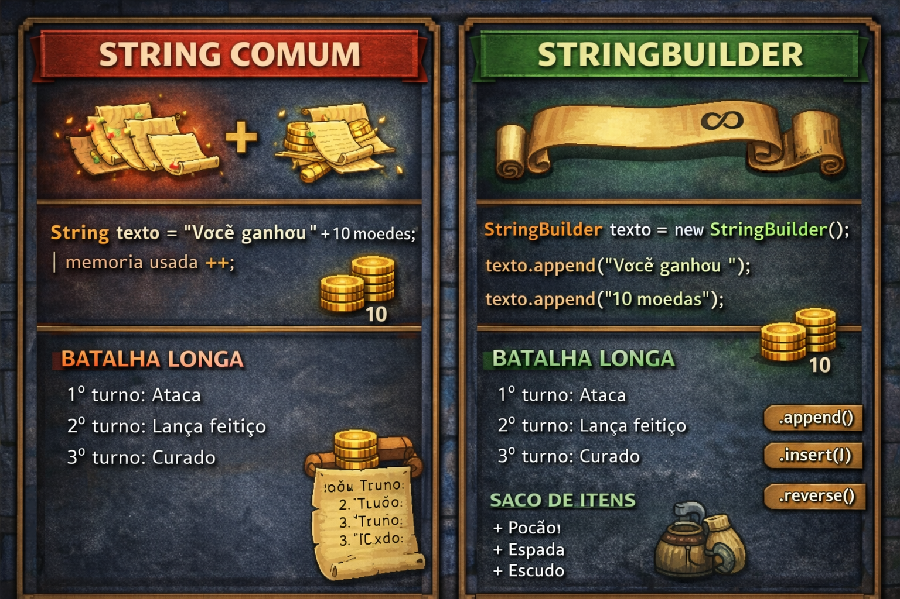

- **BigInteger: o  Contador de Estrelas**
    
    Imagine um RPG onde o XP dos deuses utralapassa quintilhoes. o tipo **long** iria “estourar” (overflow). o **BigInteger** não tem limite de tamanho; ele cresce conforme a memoria do seu PC permitir.
    
    - **Uso no RPG**: IDs de transações globais em um MMO ou o dano de um golpe que destroi universos.
    - **Regra Arfana:** Você não usa **+** ou **-.** Usa metodos como **.add( )** e **.multiply( ).**
    
    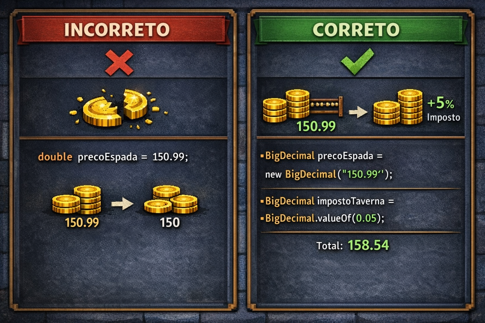
    
- **BigDecimal: O Tesouro Real**
    
    Este é o mais importante para a economia do seu jogo. Computadores tem dificuldade em processar numeros decimais binarios (o **double** pode fazer 0.1 + 0.2 = 0.30000000000000004). O **BigDecimal** resolve isso com precisão decimal absoluta.
    
    - **Uso no RPG**: Salto de moedas de outros, taxas de leilão e desconto de mercadores.
    - **Cuidado:** Use sempre **compareTo( )** para saber quem é maior, pois o **equals( )** pode falhar se um valor for 2.0 e o outro 2.00.
- **Java Time: As Eras do Reino**
    
    Gerenciar o tempo com as classes antigas do **Java** era um pesadelo (como uma maldição de confusão). O pacote **java.time** trouxe ordem ao caos.
    
    | **Classe**  | **No RPG** | Exemplo |
    | --- | --- | --- |
    | LocalDate | calendario | Data de nascimento do personagem ou fundação do reino. |
    | LocalTime | Relogio de pulso | Hora exata de um evento diário ( Ex:”O torneio começa as 15h”       |
    | LocalDateTimeInstant | Marca d’agua | O momento exato (UTC) que um jogados fez login (log o servidor) |

## 🏰 Quadro de Missões: O Laboratório de Alquimia

### 🥉 Bronze (Fácil) - Transmutação Segura

No seu IntelliJ, pratique a transmutação automática:

1. Crie uma variável `int moedasDePrata = 100;`.
    - **⚠ Dica do Mestre:**
        
        A maestria na programação nasce da prática, não apenas da leitura. O código só ganha vida quando você o escreve! Tente resolver o desafio com sua própria lógica antes de espiar a solução. **Confie no seu processo; o erro de hoje é o acerto de amanhã!**
        
    - **Resolução:**
2. Transmute-a para um `double moedasDeOuro` de forma implícita.
    - **⚠ Dica do Mestre:**
        
        A maestria na programação nasce da prática, não apenas da leitura. O código só ganha vida quando você o escreve! Tente resolver o desafio com sua própria lógica antes de espiar a solução. **Confie no seu processo; o erro de hoje é o acerto de amanhã!**
        
    - **Resolução:**
3. Use o `System.out.println` para ver como o número ganhou uma casa decimal (`.0`).
    - **⚠ Dica do Mestre:**
        
        A maestria na programação nasce da prática, não apenas da leitura. O código só ganha vida quando você o escreve! Tente resolver o desafio com sua própria lógica antes de espiar a solução. **Confie no seu processo; o erro de hoje é o acerto de amanhã!**
        
    - **Resolução:**
4. **Desafio:** Tente fazer o contrário (`int total = moedasDeOuro;`) sem usar o parênteses e veja o IntelliJ "gritar" com você.
    - **⚠ Dica do Mestre:**
        
        A maestria na programação nasce da prática, não apenas da leitura. O código só ganha vida quando você o escreve! Tente resolver o desafio com sua própria lógica antes de espiar a solução. **Confie no seu processo; o erro de hoje é o acerto de amanhã!**
        
    - **Resolução:**

### 🥈 Prata (Médio) - O Termo de Responsabilidade (Casting)

Às vezes, precisamos "amassar" o dado para ele caber.

1. Crie uma variável `double danoOriginal = 55.99;`.
    - **⚠ Dica do Mestre:**
        
        A maestria na programação nasce da prática, não apenas da leitura. O código só ganha vida quando você o escreve! Tente resolver o desafio com sua própria lógica antes de espiar a solução. **Confie no seu processo; o erro de hoje é o acerto de amanhã!**
        
    - **Resolução:**
2. Use o **Casting** `(int)` para forçar esse valor dentro de uma variável `int danoReduzido`.
    - **⚠ Dica do Mestre:**
        
        A maestria na programação nasce da prática, não apenas da leitura. O código só ganha vida quando você o escreve! Tente resolver o desafio com sua própria lógica antes de espiar a solução. **Confie no seu processo; o erro de hoje é o acerto de amanhã!**
        
    - **Resolução:**
3. Imprima o resultado.
    - **⚠ Dica do Mestre:**
        
        A maestria na programação nasce da prática, não apenas da leitura. O código só ganha vida quando você o escreve! Tente resolver o desafio com sua própria lógica antes de espiar a solução. **Confie no seu processo; o erro de hoje é o acerto de amanhã!**
        
    - **Resolução:**
4. **Pergunta de Alquimista:** O valor foi arredondado para 56 ou simplesmente cortado para 55? Observe o resultado no console!
    - **⚠ Dica do Mestre:**
        
        A maestria na programação nasce da prática, não apenas da leitura. O código só ganha vida quando você o escreve! Tente resolver o desafio com sua própria lógica antes de espiar a solução. **Confie no seu processo; o erro de hoje é o acerto de amanhã!**
        
    - **Resolução:**

### 🥇 Ouro (Difícil) - O Contador de Estrelas e Moedas

Vamos usar as classes especiais para lidar com números gigantes e precisos:

1. **BigInteger:** Crie um `BigInteger xpDeus = new BigInteger("9000000000000000000000");`. Use o método `.add()` para somar mais 1000 de XP e imprima.
    - **⚠ Dica do Mestre:**
        
        A maestria na programação nasce da prática, não apenas da leitura. O código só ganha vida quando você o escreve! Tente resolver o desafio com sua própria lógica antes de espiar a solução. **Confie no seu processo; o erro de hoje é o acerto de amanhã!**
        
    - **Resolução:**
2. **BigDecimal:** Crie um `BigDecimal saldoBanco = new BigDecimal("100.05");`. Tente somar outro `BigDecimal` de `"0.10"` usando o método `.add()`.
    - **⚠ Dica do Mestre:**
        
        A maestria na programação nasce da prática, não apenas da leitura. O código só ganha vida quando você o escreve! Tente resolver o desafio com sua própria lógica antes de espiar a solução. **Confie no seu processo; o erro de hoje é o acerto de amanhã!**
        
    - **Resolução:**
3. **Parsing:** Receba uma `String input = "150";` e transforme-a em um `int` usando a técnica de Invocação que você aprendeu.
    - **⚠ Dica do Mestre:**
        
        A maestria na programação nasce da prática, não apenas da leitura. O código só ganha vida quando você o escreve! Tente resolver o desafio com sua própria lógica antes de espiar a solução. **Confie no seu processo; o erro de hoje é o acerto de amanhã!**
        
    - **Resolução:**

### 💎 Diamante (Nível 2) - O Relógio do Reino e a Forja de Diálogos

Crie um sistema no seu IntelliJ chamado `CronistaReal`. Este exercício integra **StringBuilder, java.time e Conversão**.

**Requisitos do Código:**

1. **O Tempo:** Use `LocalDate.now()` para registrar a data atual da sua jornada.
    - **⚠ Dica do Mestre:**
        
        A maestria na programação nasce da prática, não apenas da leitura. O código só ganha vida quando você o escreve! Tente resolver o desafio com sua própria lógica antes de espiar a solução. **Confie no seu processo; o erro de hoje é o acerto de amanhã!**
        
    - **Resolução:**
2. **A Forja de Texto:** Use um `StringBuilder` para montar uma frase de log de batalha.
    - Adicione (`append`) a data.
    - Adicione o nome de um monstro.
    - Adicione o dano que ele recebeu (converta um `double 99.5` para `int` antes de adicionar).
        - **⚠ Dica do Mestre:**
            
            A maestria na programação nasce da prática, não apenas da leitura. O código só ganha vida quando você o escreve! Tente resolver o desafio com sua própria lógica antes de espiar a solução. **Confie no seu processo; o erro de hoje é o acerto de amanhã!**
            
        - **Resolução:**
3. **A Saída:**
    - Converta o `StringBuilder` para String usando `.toString()` e imprima tudo em **CAIXA ALTA**.
        - **⚠ Dica do Mestre:**
            
            A maestria na programação nasce da prática, não apenas da leitura. O código só ganha vida quando você o escreve! Tente resolver o desafio com sua própria lógica antes de espiar a solução. **Confie no seu processo; o erro de hoje é o acerto de amanhã!**
            
        - **Resolução:**
4. **Desafio Extra:** Use o `BigInteger` para definir a vida desse monstro como sendo 1 centilhão (muitos zeros!) e verifique se o programa roda sem "estourar".
    - **⚠ Dica do Mestre:**
        
        A maestria na programação nasce da prática, não apenas da leitura. O código só ganha vida quando você o escreve! Tente resolver o desafio com sua própria lógica antes de espiar a solução. **Confie no seu processo; o erro de hoje é o acerto de amanhã!**
        
    - **Resolução:**

### ⚔️ Desafio do Alquimista

Um mercante está vendendo uma poção, mas o sistema dele está todo confuso. Resolva os problemas abaixo:

1. O bônus de dano da poção é `double bonus = 5.99;`. O herói só consegue absorver a parte **inteira** desse bônus. Use **Casting** para salvar esse bônus em uma variável `int`.
    - **⚠ Dica do Mestre:**
        
        A maestria na programação nasce da prática, não apenas da leitura. O código só ganha vida quando você o escreve! Tente resolver o desafio com sua própria lógica antes de espiar a solução. **Confie no seu processo; o erro de hoje é o acerto de amanhã!**
        
    - **Resolução:**
2. O preço da poção vem do teclado como uma String: `String inputPreco = "25.80";`. Converta para `double`.
    - **⚠ Dica do Mestre:**
        
        A maestria na programação nasce da prática, não apenas da leitura. O código só ganha vida quando você o escreve! Tente resolver o desafio com sua própria lógica antes de espiar a solução. **Confie no seu processo; o erro de hoje é o acerto de amanhã!**
        
    - **Resolução:**
3. Crie um `BigDecimal` chamado `taxaGuilda` com o valor de `"10.00"` (usando String no construtor).
    - **⚠ Dica do Mestre:**
        
        A maestria na programação nasce da prática, não apenas da leitura. O código só ganha vida quando você o escreve! Tente resolver o desafio com sua própria lógica antes de espiar a solução. **Confie no seu processo; o erro de hoje é o acerto de amanhã!**
        
    - **Resolução:**

### ⚔️ Desafio dos Mestres

Para finalizar sua apostila de **Fundamentos de Dados**, vamos unir os poderes:

1. Crie um `StringBuilder` e adicione o nome do seu herói e a frase " entrou na masmorra!".
2. Imagine que seu herói achou um tesouro de `BigDecimal("100.00")`. Ele deve pagar uma taxa de `BigDecimal("0.10")` (10%). Calcule o valor da taxa usando `.multiply()`.
3. Use `LocalDate.now()` para registrar em que dia essa aventura aconteceu.
4. Exiba tudo formatado no console.
- **⚠ Dica do Mestre:**
    
    A maestria na programação nasce da prática, não apenas da leitura. O código só ganha vida quando você o escreve! Tente resolver o desafio com sua própria lógica antes de espiar a solução. **Confie no seu processo; o erro de hoje é o acerto de amanhã!**
    
- **Resolução:**

### 5. Variaveis

Agora entramos na **Gestão de Inventario**. Se os **Tipos Primitivos** são os materiais (ferro, madeira, magia), as **Variáveis** são as caixas de slots onde voce organiza tudo isso para usar durante a aventura.

### 📦Variáveis: Os Slots de Inventario

Uma variável é um endereço na memoria. No **Java,** você não pode simplesmente jogar um item no chão; você precisa de um slot identificado e do tipo certo.

- **📝 1. Declaração (Preparando o Slot)**
    
    Para criar uma variavel, seguimos o ritual: **tipo + nome + valor.**
    
    ```jsx
    //Sintaxe: Tipo nome = valor;
    int forca = 15
    String nomeHeroi = "Aragorn";
    ```
    
- **📏 2. Regras de Ouro da Guilda**
    1. **Tipagem Extrita:** Se o Slot é de **int**, você não pode tentar guardar um **double** ou uma **String**. O **Java** é um mestre rigoroso!
    2. **Declaração Prévia:** Você não pode usar uma poção que ainda nao “instanciou” no seu inventario. Declare sempre antes de chamar.
    3. **Nomes Descritivos**: Evite variaeis como **int x;**. Use **int quantidadePessoas; . Isso facilita a leitura do codigo por outros membros da guilda.
    
- 🔄 **3. Modificação e Reatribuição**
    
    Diferentes das constantes, a maioria das variaveis pode mudar de valor conforme a jornada avança. É o que chamamos de **mutabilidade**
    
    ```jsx
    int vida = 100;
    vida = 80;// Levou um golpe de um Goblin! O valor antigo (100) é descartado.
    ```
    
- **💎 Extra: O Selo `final` (Itens Indestrutíveis)**
    
    Existem valores que nunca devem mudar, como a gravidade do mundo ou o ID unico de uma conta. Para isso, usamos o modificador **final**. Por convenção nomes de constantes são escritos em **MAIÚSCULAS**.
    
    ```jsx
    final int NIVEL_MAXIMO = 99;
    // NIVEL_MAXIMO = 100; // O COMPILADOR BLOQUEIA! Erro de magia proibida.
    ```
    
- **🛡️ Dicas de Sobrevivência (Boas Práticas)**
    - **Escopo Restrito:** Não crie variáveis globais se você só vai usá-las dentro de uma pequena função de combate. Isso economiza "energia" (memória).
    - **Inicialização:** Tentar ler uma variável que não tem valor inicial pode causar um erro de "NullPointerException" ou "Variable not initialized". Sempre dê um ponto de partida para seus atributos!
- **⚔️ Desafio: O Gerenciador de Status**
    
    Escreva um pequeno script Java que simule a evolução de um herói:
    
    1. Declare uma variável `String nomeHeroi` e uma `int nivel`.
    2. Declare uma **constante** (`final`) chamada `MULTIPLICADOR_DANO` com o valor `2.0`.
    3. Exiba o status inicial.
    4. Aumente o nível do herói em 1 (reatribuição).
    5. Exiba o novo status e tente (apenas mentalmente ou no código comentando) mudar o valor da constante para ver o erro acontecer.

## 🏰 Quadro de Missões: Gestão de Inventário

### 🥉 Bronze (Fácil) - Preparando os Slots

Abra seu IntelliJ e execute as seguintes ordens:

1. Declare uma variável para o `nomeDoHeroi` e outra para a `idadeDoHeroi`.
    - **⚠ Dica do Mestre:**
        
        A maestria na programação nasce da prática, não apenas da leitura. O código só ganha vida quando você o escreve! Tente resolver o desafio com sua própria lógica antes de espiar a solução. **Confie no seu processo; o erro de hoje é o acerto de amanhã!**
        
    - **Resolução:**
2. Tente imprimir as duas sem dar um valor inicial a elas. Observe se o IntelliJ mostra um erro de "Variable might not have been initialized".
    - **⚠ Dica do Mestre:**
        
        A maestria na programação nasce da prática, não apenas da leitura. O código só ganha vida quando você o escreve! Tente resolver o desafio com sua própria lógica antes de espiar a solução. **Confie no seu processo; o erro de hoje é o acerto de amanhã!**
        
    - **Resolução:**
3. Inicialize-as com seu nome e sua idade e execute novamente.
    - **⚠ Dica do Mestre:**
        
        A maestria na programação nasce da prática, não apenas da leitura. O código só ganha vida quando você o escreve! Tente resolver o desafio com sua própria lógica antes de espiar a solução. **Confie no seu processo; o erro de hoje é o acerto de amanhã!**
        
    - **Resolução:**
4. **Desafio:** Tente guardar sua idade (número) dentro da variável de nome (String). O que o "Mestre do Jogo" diz?
    - **⚠ Dica do Mestre:**
        
        A maestria na programação nasce da prática, não apenas da leitura. O código só ganha vida quando você o escreve! Tente resolver o desafio com sua própria lógica antes de espiar a solução. **Confie no seu processo; o erro de hoje é o acerto de amanhã!**
        
    - **Resolução:**

### 🥈 Prata (Médio) - O Golpe do Goblin (Mutabilidade)

As variáveis são mutáveis, exceto quando seladas.

1. Crie uma variável `int vida = 100;`.
    - **⚠ Dica do Mestre:**
        
        A maestria na programação nasce da prática, não apenas da leitura. O código só ganha vida quando você o escreve! Tente resolver o desafio com sua própria lógica antes de espiar a solução. **Confie no seu processo; o erro de hoje é o acerto de amanhã!**
        
    - **Resolução:**
2. Imprima: `"Vida Inicial: " + vida`.
    - **⚠ Dica do Mestre:**
        
        A maestria na programação nasce da prática, não apenas da leitura. O código só ganha vida quando você o escreve! Tente resolver o desafio com sua própria lógica antes de espiar a solução. **Confie no seu processo; o erro de hoje é o acerto de amanhã!**
        
    - **Resolução:**
3. Simule um ataque: reatribua o valor da vida para `vida - 20`.
    - **⚠ Dica do Mestre:**
        
        A maestria na programação nasce da prática, não apenas da leitura. O código só ganha vida quando você o escreve! Tente resolver o desafio com sua própria lógica antes de espiar a solução. **Confie no seu processo; o erro de hoje é o acerto de amanhã!**
        
    - **Resolução:**
4. Imprima a vida atualizada.
    - **⚠ Dica do Mestre:**
        
        A maestria na programação nasce da prática, não apenas da leitura. O código só ganha vida quando você o escreve! Tente resolver o desafio com sua própria lógica antes de espiar a solução. **Confie no seu processo; o erro de hoje é o acerto de amanhã!**
        
    - **Resolução:**
5. **Dica de Escriba:** Use nomes descritivos como `vidaAtual` em vez de apenas `v`.
    - **⚠ Dica do Mestre:**
        
        A maestria na programação nasce da prática, não apenas da leitura. O código só ganha vida quando você o escreve! Tente resolver o desafio com sua própria lógica antes de espiar a solução. **Confie no seu processo; o erro de hoje é o acerto de amanhã!**
        
    - **Resolução:**

### 🥇 Ouro (Difícil) - Itens Indestrutíveis (Constantes)

Existem leis no mundo de Java que nem a magia mais forte pode quebrar.

1. Declare uma constante `final int FORCA_MAXIMA = 50;`.
    - **⚠ Dica do Mestre:**
        
        A maestria na programação nasce da prática, não apenas da leitura. O código só ganha vida quando você o escreve! Tente resolver o desafio com sua própria lógica antes de espiar a solução. **Confie no seu processo; o erro de hoje é o acerto de amanhã!**
        
    - **Resolução:**
2. Tente mudar o valor de `FORCA_MAXIMA` para `60` na linha de baixo.
    - **⚠ Dica do Mestre:**
        
        A maestria na programação nasce da prática, não apenas da leitura. O código só ganha vida quando você o escreve! Tente resolver o desafio com sua própria lógica antes de espiar a solução. **Confie no seu processo; o erro de hoje é o acerto de amanhã!**
        
    - **Resolução:**
3. Observe a mensagem de erro vermelha no IntelliJ.
    - **⚠ Dica do Mestre:**
        
        A maestria na programação nasce da prática, não apenas da leitura. O código só ganha vida quando você o escreve! Tente resolver o desafio com sua própria lógica antes de espiar a solução. **Confie no seu processo; o erro de hoje é o acerto de amanhã!**
        
    - **Resolução:**
4. Adicione um comentário de **Linha Única** (`//`) explicando por que o erro aconteceu, citando o "Selo Final".
    - **⚠ Dica do Mestre:**
        
        A maestria na programação nasce da prática, não apenas da leitura. O código só ganha vida quando você o escreve! Tente resolver o desafio com sua própria lógica antes de espiar a solução. **Confie no seu processo; o erro de hoje é o acerto de amanhã!**
        
    - **Resolução:**

### 💎 Diamante (Nível 2) - O Sistema de Evolução de Status

Crie uma classe chamada `EvolucaoHeroi` para consolidar tudo o que você aprendeu até aqui: **Variáveis, Constantes, Tipos e Strings.**

**Requisitos do Código:**

1. **O Selo:** Declare uma constante `final double BÔNUS_EXP = 1.5;`.
2. **O Inventário:** * Declare `String classeHeroi = "Guerreiro";`
    - Declare `int nivel = 1;`
    - Declare `double experiencia = 0.0;`
        - **⚠ Dica do Mestre:**
            
            A maestria na programação nasce da prática, não apenas da leitura. O código só ganha vida quando você o escreve! Tente resolver o desafio com sua própria lógica antes de espiar a solução. **Confie no seu processo; o erro de hoje é o acerto de amanhã!**
            
        - **Resolução:**
3. **A Jornada:**
    - Use o `StringBuilder` (visto na lição anterior) para montar a frase: `"O herói [nome] subiu de nível!"`.
    - Atualize o `nivel` para `2`.
    - Calcule a nova experiência: `experiencia = nivel * BÔNUS_EXP;`.
        - **⚠ Dica do Mestre:**
            
            A maestria na programação nasce da prática, não apenas da leitura. O código só ganha vida quando você o escreve! Tente resolver o desafio com sua própria lógica antes de espiar a solução. **Confie no seu processo; o erro de hoje é o acerto de amanhã!**
            
        - **Resolução:**
4. **A Saída:**
    - Use o `System.out.printf` para mostrar o status final formatado:
    `"Status Final -> Classe: %s | Nível: %d | XP: %.1f%n"`.
        - **⚠ Dica do Mestre:**
            
            A maestria na programação nasce da prática, não apenas da leitura. O código só ganha vida quando você o escreve! Tente resolver o desafio com sua própria lógica antes de espiar a solução. **Confie no seu processo; o erro de hoje é o acerto de amanhã!**
            
        - **Resolução:**
5. **Integração:** Adicione um **Javadoc** no topo da classe explicando que este script gerencia a mutabilidade dos atributos do herói.
    - **⚠ Dica do Mestre:**
        
        A maestria na programação nasce da prática, não apenas da leitura. O código só ganha vida quando você o escreve! Tente resolver o desafio com sua própria lógica antes de espiar a solução. **Confie no seu processo; o erro de hoje é o acerto de amanhã!**
        
    - **Resolução:**

### 6. Entrada Básica de Dados

essa é a parte onde o seu programa deixa de ser um monólogo e vira um **dialogo.** A classe **Scanner** funciona como os **ouvidos** do seu heroi, permitindo que ele escute os comandos do jogador (o teclado).

- **👂 A Classe Scanner: Os Ouvidos do Sistema**
    
    Para usar o **Scanner**, precisamos importa-lo da biblioteca de utilitarios do **Java** (**java.util.Scanner**). O **InteliJ** faz isso por você, mas é importante saber que ele esta la no topo do pergaminho.
    
    📜 **Tabela de Comandos de Escuta**
    
    | Comando | oque ele escuta? | Exemplo RPG |
    | --- | --- | --- |
    | sc. next( ) | Uma única palavra | Nome do Heroi: “Aragorn” |
    | sc.nextLine( ) | Uma frase inteira | Descriçao da missão: “matar o dragão” |
    | sc.nextInt( ) | Números inteiros | Nivel de força: 15 |
    | sc.NextDouble( ) | Numeros decimais | Peso ou Ouro: 150.75 |
    - **⚠️ Alerta de Armadilha (Bug Comum):**
        
         Após usar `nextInt()` ou `nextDouble()`, se você for usar `nextLine()`, o Java pode "pular" a leitura. Isso acontece porque o "Enter" fica preso no teclado. **Dica:** Sempre use um `sc.nextLine();` vazio para limpar o buffer antes de ler um novo texto longo.
        
- **📐 Fluxograma da Entrada de Dados**
    
    Para visualizar como o dado viaja do teclado até a memória, imagine este fluxo:
    
    1. **Início:** O programa começa.
    2. **Instalação dos Ouvidos:** `Scanner sc = new Scanner(System.in);`
    3. **O Questionamento:** `System.out.println("Qual seu nome?");`
    4. **A Espera:** O programa pausa até o usuário digitar e apertar **ENTER**.
    5. **Armazenamento:** O valor vai para a variável (Ex: `String nome = sc.next();`).
    6. **O Uso:** O programa usa essa variável para cálculos ou mensagens.
- 🧪 **Refinando**
    
    No **Java,** sempre que terminamos de usar o **Scanner**, é uma boa pratica fecha-lo com **sc.clore( )**; isso evita que o programa fique gastanto recursos do sistema a toa.
    
    - **Codigo**
        
        ```jsx
        import java.util.Scanner;
        import java.util.Locale;
        
        public class RecrutamentoGuilda {
            public static void main(String[] args) {
                // Configura o Scanner para aceitar pontos em decimais (ex: 1.75)
                Scanner sc = new Scanner(System.in).useLocale(Locale.US);
        
                System.out.println("=== 🏰 BEM-VINDO À GUILDA DOS HERÓIS ===");
                System.out.println("Mestre da Guilda: 'Pare aí, viajante! Identifique-se.'");
        
                // 1. Lendo Nome (String)
                System.out.print("\n[Digite seu nome completo]: ");
                String nomeHeroi = sc.nextLine();
        
                // 2. Lendo Idade (int)
                System.out.print("Mestre: 'E quantos anos de experiência você tem no mundo físico?' \n[Digite sua idade]: ");
                int idade = sc.nextInt();
        
                // 3. Lendo Peso/Altura (double)
                System.out.print("Mestre: 'Entendi. E qual o peso da carga que você consegue carregar?' \n[Digite o peso em kg]: ");
                double cargaMaxima = sc.nextDouble();
        
                // 4. Lendo Estado de Equipamento (boolean)
                System.out.print("Mestre: 'Você possui uma espada básica?' \n[true para sim / false para não]: ");
                boolean temEspada = sc.nextBoolean();
        
                // --- PROCESSAMENTO DA FICHA ---
                System.out.println("\n--- 📜 FICHA DE RECRUTAMENTO ---");
                System.out.println("NOME DO AVENTUREIRO: " + nomeHeroi.toUpperCase());
                System.out.println("IDADE REGISTRADA: " + idade + " anos");
                
                // Usando printf para formatar o peso com 2 casas decimais
                System.out.printf("CAPACIDADE DE CARGA: %.2f kg %n", cargaMaxima);
                
                if (temEspada) {
                    System.out.println("EQUIPAMENTO INICIAL: Espada de Ferro Rompida");
                } else {
                    System.out.println("EQUIPAMENTO INICIAL: Punhos de Fúria");
                }
        
                System.out.println("--------------------------------");
                System.out.println("Mestre: 'Muito bem, " + nomeHeroi + ". Sua jornada começa agora!'");
        
                sc.close(); // Fecha os ouvidos do mestre
            }
        }
        ```
        
    - **Fluxograma**
        
        ```jsx
        graph TD
            A[Início] --> B[Criar Scanner]
            B --> C[Exibir Boas-vindas da Guilda]
            
            C --> D[Pedir Nome Completo]
            D --> E[Ler nomeHeroi]
            
            E --> F[Pedir Idade]
            F --> G[Ler idade]
            
            G --> H[Pedir Peso da Carga]
            H --> I[Ler cargaMaxima]
            
            I --> J[Perguntar se tem Espada]
            J --> K[Ler temEspada]
            
            K --> L[Exibir Cabeçalho da Ficha]
            L --> M{temEspada é true?}
            
            M -- Sim --> N[Imprimir: Espada de Ferro Rompida]
            M -- Não --> O[Imprimir: Punhos de Fúria]
            
            N --> P[Exibir Encerramento e Despedida]
            O --> P
            
            P --> Q[Fechar Scanner]
            Q --> R[Fim]
        
            style A fill:#4CAF50,color:white
            style B fill:#9C27B0,color:white
            style C fill:#2196F3,color:white
            style D fill:#03A9F4,color:white
            style E fill:#FF9800,color:white
            style F fill:#03A9F4,color:white
            style G fill:#FF9800,color:white
            style H fill:#03A9F4,color:white
            style I fill:#FF9800,color:white
            style J fill:#03A9F4,color:white
            style K fill:#FF9800,color:white
            style L fill:#2196F3,color:white
            style M fill:#E91E63,color:white
            style N fill:#2196F3,color:white
            style O fill:#2196F3,color:white
            style P fill:#2196F3,color:white
            style Q fill:#9C27B0,color:white
            style R fill:#F44336,color:white
        ```
        
    - **⚔️ Desafio Final do Módulo de Entrada**
        
        Agora que você dominou a escuta, tente criar um **Simulador de Loja de RPG**:
        
        1. Pergunte o nome do item que o herói quer comprar.
        2. Pergunte a quantidade desse item.
        3. Pergunte o preço unitário.
        4. Calcule o total e exiba: `"Você comprou <quantidade> de <item> por R$ <total>!"`
    - **⚔️ Desafio do Fluxo Alternativo**
        
        Imagine que no seu RPG, se o jogador digitar uma idade menor que 18, ele recebe uma mensagem: *"Você é muito jovem para esta aventura"*.
        
        **Como você alteraria o seu fluxograma para incluir essa decisão (IF/ELSE)?** *Dica: Você precisaria de um bloco em formato de Losango após o passo F.*
        

## 🏰 Quadro de Missões: Os Ouvidos do Reino

### 🥉 Bronze (Fácil) - O Eco da Taverna

1. **Identificação:** Crie um programa que use o `Scanner` para perguntar o nome de um herói e a sua classe (Guerreiro, Mago, etc). Exiba uma mensagem de boas-vindas usando os dados capturados.
    - **⚠ Dica do Mestre:**
        
        A maestria na programação nasce da prática, não apenas da leitura. O código só ganha vida quando você o escreve! Tente resolver o desafio com sua própria lógica antes de espiar a solução. **Confie no seu processo; o erro de hoje é o acerto de amanhã!**
        
    - **Resolução:**
2. **O Contador de Flechas:** Peça ao usuário para digitar a quantidade de flechas no inventário (inteiro) e exiba o dobro desse valor (simulando um feitiço de duplicação).
    - **⚠ Dica do Mestre:**
        
        A maestria na programação nasce da prática, não apenas da leitura. O código só ganha vida quando você o escreve! Tente resolver o desafio com sua própria lógica antes de espiar a solução. **Confie no seu processo; o erro de hoje é o acerto de amanhã!**
        
    - **Resolução:**
3. **A Palavra de Ordem:** Use `sc.next()` para ler apenas a primeira palavra de um grito de guerra e exiba-a em CAIXA ALTA.
    - **⚠ Dica do Mestre:**
        
        A maestria na programação nasce da prática, não apenas da leitura. O código só ganha vida quando você o escreve! Tente resolver o desafio com sua própria lógica antes de espiar a solução. **Confie no seu processo; o erro de hoje é o acerto de amanhã!**
        
    - **Resolução:**

### 🥈 Prata (Médio) - O Mercador Calculista

1. **Simulador de Loja:**  peça o nome de um item, a quantidade desejada e o preço unitário. O programa deve calcular o valor total.
    - **⚠ Dica do Mestre:**
        
        A maestria na programação nasce da prática, não apenas da leitura. O código só ganha vida quando você o escreve! Tente resolver o desafio com sua própria lógica antes de espiar a solução. **Confie no seu processo; o erro de hoje é o acerto de amanhã!**
        
    - **Resolução:**
2. **O Peso da Mochila:** Peça o peso de três itens diferentes (decimais) e exiba a soma total da carga.
    - *Dica do Mago:* Lembre-se de configurar o `Locale.US` para não ter problemas com pontos e vírgulas!
    - **⚠ Dica do Mestre:**
        
        A maestria na programação nasce da prática, não apenas da leitura. O código só ganha vida quando você o escreve! Tente resolver o desafio com sua própria lógica antes de espiar a solução. **Confie no seu processo; o erro de hoje é o acerto de amanhã!**
        
    - **Resolução:**

### 🥇 Ouro (Difícil) - O Enigma do Buffer

1. **A Armadilha do Enter:** Crie um programa que peça primeiro um número (ex: nível do herói com `nextInt()`) e, logo em seguida, peça uma frase épica (com `nextLine()`).
    - **Missão:** Você deve aplicar a técnica de "Limpeza de Buffer" mencionada na apostila para garantir que o programa não pule a leitura da frase.
2. **Conversão Arfana (Parsing):** Peça a idade e a altura do herói usando **apenas** `sc.nextLine()`. Depois, converta esses textos para `int` e `double` usando as classes Wrapper (`Integer.parseInt` e `Double.parseDouble`).
- **⚠ Dica do Mestre:**
    
    A maestria na programação nasce da prática, não apenas da leitura. O código só ganha vida quando você o escreve! Tente resolver o desafio com sua própria lógica antes de espiar a solução. **Confie no seu processo; o erro de hoje é o acerto de amanhã!**
    
- **Resolução:**

### 💎 Diamante (Nível 2) - O Portal do Guardião

1. **O Teste de Maturidade:** Implemente o sistema completo de recrutamento integrando os conhecimentos de **Entrada de Dados** e **Fluxo de Decisão**:
    - O Guardião pergunta a idade do jogador (use `Scanner`).
    - **Decisão (IF/ELSE):** Se a idade for menor que 18, o programa encerra com a mensagem: "Você é muito jovem para esta aventura".
    - Se for maior ou igual a 18, o Guardião pede o peso da armadura (double) e o nome da cidade natal.
    - **Casting:** Converta o peso da armadura (double) para um número inteiro (int) usando casting explícito e mostre o valor "arredondado" no console.
    - Finalize fechando o `Scanner` corretamente para não desperdiçar recursos do reino.
    - **⚠ Dica do Mestre:**
        
        A maestria na programação nasce da prática, não apenas da leitura. O código só ganha vida quando você o escreve! Tente resolver o desafio com sua própria lógica antes de espiar a solução. **Confie no seu processo; o erro de hoje é o acerto de amanhã!**
        
    - **Resolução:**

---

# **🔢 Nível 2: Estruturas Condicionais e Testes Lógicos**

## **1. Operadores 🛠️🔣**

Os operadores são ferramentas que permitem ao motor do jogo manipular os dados. Sem eles, as variaveis seriam apenas baús fechados que nunca mudam de conteúdo.

### **⚔️ Operadores Aritméticos**

Agora entramos no **Sistema de combate e Economia**. Os **Operadores Aritmeticos** são as formulas matematicas que rodam por tras de cada golpe de espada, cura de poção ou divisão de saque entre o grupo.

Pense nos operadores como as ações que alteram os atributos dos heróis e monstros durante a partida.

| **Operador** | **Nome** | **Função no RPG** | **Exemplo (a=10, b=3)** |
| --- | --- | --- | --- |
| + | Adição | Curar vida ou receber bonus de força. | **a + b = 13** |
| **-** | Subtração | Receber dano ou gastar mana | **a - b = 7** |
| ***** | Multiplicação | Aplicar buffs (ex: dano dobrado). | **a * b = 30** |
| **/**  | Divisão | Dividir o saque entre o grupo | **a / b = 3** |
| **%** | Modulo | Verificar turnos ou chances de critico | **a % b = 1** |
- ⚠️ **Alerta de Mestre:**
    
    Em **Java**, se você dividir dois números inteiros (**int**), o resultado sempre sera um numero inteiro, cortando os decimais
    
    - Exemplo: **10 / 3** no RPG seria como dividir **10** moedas para **3** herois: cada heroi ganha **3** e sobra **1** no chão.

### 🧪 Exemplo Prático: Sistema de Dano e Saque

Aqui está como esses operadores funcionam em uma cena real de jogo:

```java
public class CombateRPG {
    public static void main(String[] args) {
        // Atributos do Guerreiro
        int ataqueBase = 25;
        int bonusEspada = 10;
        int defesaMonstro = 12;

        // 1. ADIÇÃO: Calculando dano total do herói
        int danoBruto = ataqueBase + bonusEspada; 

        // 2. SUBTRAÇÃO: Dano aplicado após a defesa
        int danoReal = danoBruto - defesaMonstro;
        System.out.println("O herói causou " + danoReal + " de dano no Troll!");

        // 3. MULTIPLICAÇÃO: Golpe Crítico (Dano x2)
        int danoCritico = danoReal * 2;
        System.out.println("CRÍTICO! Dano aumentado para: " + danoCritico);

        // 4. DIVISÃO: Dividindo o tesouro
        int moedasEncontradas = 100;
        int membrosGrupo = 3;
        int moedasPorHeroi = moedasEncontradas / membrosGrupo;

        // 5. MÓDULO: O que sobra para o mestre da guilda (resto)
        int restoMoedas = moedasEncontradas % membrosGrupo;

        System.out.println("\n--- RESULTADO DA BUSCA ---");
        System.out.println("Cada herói recebeu: " + moedasPorHeroi + " moedas.");
        System.out.println("Moedas que sobraram no baú: " + restoMoedas);
    }
}
```

### ⚔️ Desafio do Alquimista Matemático

Sua missão é criar um pequeno código que:

1. Declare uma variável `int manaAtual = 50;`.
2. O herói usa uma magia que custa `int custoMagia = 15;`. Subtraia esse valor.
3. O herói toma uma poção que **dobra** a mana que restou. Use multiplicação.
4. Verifique se o valor final da mana é **par ou ímpar** usando o operador de módulo `%`. (Dica: se `valor % 2` for igual a 0, é par).

### 🎭 Exemplo de RPG: O Cálculo do Saque

Imagine que seu grupo de 4 herois derrotou um dragão e encontrou **101 moedas** **de ouro**. Como o java processaria isso?

```java
public class TesouroDoDragão {
    public static void main(String[] args) {
        int moedasOuro = 101;
        int heroisNoGrupo = 4;

        // DIVISÃO: Quantas moedas inteiras cada um recebe
        int moedasCada = moedasOuro / heroisNoGrupo; 
        
        // MÓDULO: O que sobra no baú após a partilha justa
        int sobraNoBau = moedasOuro % heroisNoGrupo;

        System.out.println("=== 💰 DISTRIBUIÇÃO DE PILHAGEM ===");
        System.out.println("Cada herói recebe: " + moedasCada + " moedas.");
        System.out.println("O mestre da guilda fica com a sobra: " + sobraNoBau + " moedas.");
        
        // ADIÇÃO E MULTIPLICAÇÃO: Calculando o valor total em prata (1 ouro = 10 pratas)
        int valorTotalEmPrata = (moedasOuro * 10);
        System.out.println("Valor total do tesouro em moedas de prata: " + valorTotalEmPrata);
    }
}
```

### **💡 Dica do Mestre:**

Sempre que usar a **divisão (/)** com numeros **inteiros (int)**, lembre-se que o **Java** “joga fora” os centavos. Se você quer precisão decimal para preços de itens, deve usar **double** ou **BigDecimal**.

## 🏰 Quadro de Missões: O Cálculo de Batalha

### 🥉 Bronze (Fácil) - A Recuperação do Herói

No seu IntelliJ, pratique as fórmulas básicas:

1. **Cura Divina:** O herói tem `int vidaAtual = 30;`. Use a adição para somar `int cura = 25;` e exiba o resultado.
    - **⚠ Dica do Mestre:**
        
        A maestria na programação nasce da prática, não apenas da leitura. O código só ganha vida quando você o escreve! Tente resolver o desafio com sua própria lógica antes de espiar a solução. **Confie no seu processo; o erro de hoje é o acerto de amanhã!**
        
    - **Resolução:**
2. **Custo de Habilidade:** O guerreiro tem `int estamina = 100;`. Subtraia `15` pontos de um ataque básico e exiba quanto sobrou.
    - **⚠ Dica do Mestre:**
        
        A maestria na programação nasce da prática, não apenas da leitura. O código só ganha vida quando você o escreve! Tente resolver o desafio com sua própria lógica antes de espiar a solução. **Confie no seu processo; o erro de hoje é o acerto de amanhã!**
        
    - **Resolução:**
3. **Multiplicador de Buff:** Uma poção triplica a força (`int forca = 10;`). Use a multiplicação e exiba o novo valor.
    - **⚠ Dica do Mestre:**
        
        A maestria na programação nasce da prática, não apenas da leitura. O código só ganha vida quando você o escreve! Tente resolver o desafio com sua própria lógica antes de espiar a solução. **Confie no seu processo; o erro de hoje é o acerto de amanhã!**
        
    - **Resolução:**

### 🥈 Prata (Médio) - O Saque da Masmorra

Vamos aplicar a lógica de divisão e resto:

1. **O Baú de Prata:** O grupo encontrou `int moedas = 50;`. Existem `int aventureiros = 6;` no grupo.
    - **⚠ Dica do Mestre:**
        
        A maestria na programação nasce da prática, não apenas da leitura. O código só ganha vida quando você o escreve! Tente resolver o desafio com sua própria lógica antes de espiar a solução. **Confie no seu processo; o erro de hoje é o acerto de amanhã!**
        
    - **Resolução:**
2. **Missão:** Calcule e exiba quantas moedas cada um leva e, usando o operador `%`, quantas moedas ficam no fundo do baú por não poderem ser divididas igualmente.
    - **⚠ Dica do Mestre:**
        
        A maestria na programação nasce da prática, não apenas da leitura. O código só ganha vida quando você o escreve! Tente resolver o desafio com sua própria lógica antes de espiar a solução. **Confie no seu processo; o erro de hoje é o acerto de amanhã!**
        
    - **Resolução:**

### 🥇 Ouro (Difícil) - O Alquimista Matemático

Siga os passos exatos do desafio da sua apostila para forjar este código:

1. Declare `int manaAtual = 80;` e `int custoMagia = 25;`.
    - **⚠ Dica do Mestre:**
        
        A maestria na programação nasce da prática, não apenas da leitura. O código só ganha vida quando você o escreve! Tente resolver o desafio com sua própria lógica antes de espiar a solução. **Confie no seu processo; o erro de hoje é o acerto de amanhã!**
        
    - **Resolução:**
2. Realize a subtração e, em seguida, use a multiplicação para dobrar o que restou (como se fosse um efeito de uma poção de mana).
    - **⚠ Dica do Mestre:**
        
        A maestria na programação nasce da prática, não apenas da leitura. O código só ganha vida quando você o escreve! Tente resolver o desafio com sua própria lógica antes de espiar a solução. **Confie no seu processo; o erro de hoje é o acerto de amanhã!**
        
    - **Resolução:**
3. **O Teste do Par ou Ímpar:** Use o operador `% 2` no valor final da mana. Se o resultado for `0`, o valor é par; se for `1`, é ímpar. Exiba esse resto no console.
    - **⚠ Dica do Mestre:**
        
        A maestria na programação nasce da prática, não apenas da leitura. O código só ganha vida quando você o escreve! Tente resolver o desafio com sua própria lógica antes de espiar a solução. **Confie no seu processo; o erro de hoje é o acerto de amanhã!**
        
    - **Resolução:**

### 💎 Diamante (Nível 2) - O Sistema de Dano Crítico e Loot

Crie uma classe chamada `SistemaDeCombate` que integre **Scanner** e **Operadores**:

**Requisitos do Código:**

1. **Entrada de Dados:** Peça ao usuário para digitar o `ataqueBase` do herói e a `defesaInimiga` (use `sc.nextInt()`).
    - **⚠ Dica do Mestre:**
        
        A maestria na programação nasce da prática, não apenas da leitura. O código só ganha vida quando você o escreve! Tente resolver o desafio com sua própria lógica antes de espiar a solução. **Confie no seu processo; o erro de hoje é o acerto de amanhã!**
        
    - **Resolução:**
2. **Cálculo de Dano:** * Calcule o `danoReal = ataqueBase - defesaInimiga`.
    - Calcule um `danoCritico` que é o `danoReal` multiplicado por `1.5` (Cuidado: aqui você precisará usar **Casting** para transformar o resultado de volta em `int` ou usar uma variável `double`).
    - **⚠ Dica do Mestre:**
        
        A maestria na programação nasce da prática, não apenas da leitura. O código só ganha vida quando você o escreve! Tente resolver o desafio com sua própria lógica antes de espiar a solução. **Confie no seu processo; o erro de hoje é o acerto de amanhã!**
        
    - **Resolução:**
3. **Sorteio de Turnos:** Use o operador `%` para verificar se o `ataqueBase` digitado é um número par. Se for, imprima: `"O herói ataca primeiro!"`.
    - **⚠ Dica do Mestre:**
        
        A maestria na programação nasce da prática, não apenas da leitura. O código só ganha vida quando você o escreve! Tente resolver o desafio com sua própria lógica antes de espiar a solução. **Confie no seu processo; o erro de hoje é o acerto de amanhã!**
        
    - **Resolução:**
4. **Economia:** Peça um valor total de ouro e divida por `3` heróis. Mostre o valor inteiro que cada um recebe e o resto que sobra para a guilda.
    - **⚠ Dica do Mestre:**
        
        A maestria na programação nasce da prática, não apenas da leitura. O código só ganha vida quando você o escreve! Tente resolver o desafio com sua própria lógica antes de espiar a solução. **Confie no seu processo; o erro de hoje é o acerto de amanhã!**
        
    - **Resolução:**
5. **Boas Práticas:** Use o `StringBuilder` para montar o relatório final da batalha antes de imprimir.
    - **⚠ Dica do Mestre:**
        
        A maestria na programação nasce da prática, não apenas da leitura. O código só ganha vida quando você o escreve! Tente resolver o desafio com sua própria lógica antes de espiar a solução. **Confie no seu processo; o erro de hoje é o acerto de amanhã!**
        
    - **Resolução:**

### ⚖️ Operadores Relacionais

Os **Operadores Relacionais** são os “Sensores de Percepção” do seu código. É através deles que o **Java** decide se o herói ainda tem vida, se a chave abre a porta ou se o nivel do jogador é suficiente para equipar uma armadura lendária.

Estes operadores realizam **Testes Lógicos**. O resultado de qualquer comparação feita com eles sera sempre um valor tipo **boolean**: ou é **true** (verdadeiro) ou é **false** (falso).

| Operador | Nome | Logica de RPG | Exemplo (x=10, y=5) |
| --- | --- | --- | --- |
| > | Maior que | Meu ataque é maior que a defesa? | 10 > 5 → True |
| < | Menor que | Minha vida esta abaixo do critico? | 10 < 5 → False |
| <= (≥) | Maior ou igual  | Tenho nivel minimo para a missão? | 10 <= 10 → True |
| <= (≤) | Menor ou igual | O peso da carga é suportavel? | 5 <= 2 → False |
| == | Igual a | A chave que tenho é a chave do baú? | 7 == 7 → True |
| != (≠) | Diferente de | O inimigo é diferente do aliado? | 8 != 9 → True  |

### 🎭 Exemplo de RPG: O Teste de Atributos

Imagine que seu herói está tentando entrar em uma masmorra protegida por um Guardião de Pedra. O Guardião só permite a entrada se o herói cumprir certos requisitos.

```java
public class TesteDoGuardiao {
    public static void main(String[] args) {
        int nivelHeroi = 15;
        int nivelMinimoMasmorra = 10;
        int moedasNoBolso = 50;
        int custoEntrada = 50;

        // Comparando Nível
        boolean podeEntrarPeloNivel = nivelHeroi >= nivelMinimoMasmorra;
        System.out.println("O herói tem nível suficiente? " + podeEntrarPeloNivel);

        // Comparando Moedas (Igualdade)
        boolean temValorExato = moedasNoBolso == custoEntrada;
        System.out.println("O herói tem exatamente o valor da entrada? " + temValorExato);

        // Verificando se o herói não é um trapaceiro (Diferença)
        String classeInimiga = "Ladrão";
        String classeHeroi = "Guerreiro";
        boolean naoEhInimigo = classeHeroi != classeInimiga;
        System.out.println("O herói é bem-vindo na guilda? " + naoEhInimigo);
    }
}
```

### 💡 Dica do Mestre

Cuidado para nao confundir **=** com **==**:

- **= (Atribuição)**: “A partir de agora, a variavel vida **vale 100**”.
- **== (comparação)**: “A variavel **vida** é **igual** a **100**  neste exato momento?
- Usar o operador errado é uma das “maldições” mais comuns que quebram o codigo de aprendizes!

## 🏰 Quadro de Missões: O Tribunal do Guardião

### 🥉 Bronze (Fácil) - Teste de Percepção

No seu IntelliJ, pratique as comparações básicas:

1. **Duelo de Atributos:** Declare `int forcaHeroi = 15;` e `int defesaMonstro = 12;`. Exiba o resultado de `forcaHeroi > defesaMonstro`.
    - **⚠ Dica do Mestre:**
        
        A maestria na programação nasce da prática, não apenas da leitura. O código só ganha vida quando você o escreve! Tente resolver o desafio com sua própria lógica antes de espiar a solução. **Confie no seu processo; o erro de hoje é o acerto de amanhã!**
        
    - **Resolução:**
2. **Limite de Vida:** Crie uma variável `int hp = 5;`. Verifique se a vida está abaixo do crítico: `hp < 10`.
    - **⚠ Dica do Mestre:**
        
        A maestria na programação nasce da prática, não apenas da leitura. O código só ganha vida quando você o escreve! Tente resolver o desafio com sua própria lógica antes de espiar a solução. **Confie no seu processo; o erro de hoje é o acerto de amanhã!**
        
    - **Resolução:**
3. **Identidade:** Use o operador `!=` para verificar se a `String classe = "Mago";` é diferente de `"Guerreiro"`.
    - **⚠ Dica do Mestre:**
        
        A maestria na programação nasce da prática, não apenas da leitura. O código só ganha vida quando você o escreve! Tente resolver o desafio com sua própria lógica antes de espiar a solução. **Confie no seu processo; o erro de hoje é o acerto de amanhã!**
        
    - **Resolução:**

### 🥈 Prata (Médio) - Requisitos da Guilda (AND / OR)

Vamos combinar condições como um verdadeiro estrategista:

1. **Acesso à Masmorra (&&):** O herói só entra se tiver `int nivel = 12;` (mínimo 10) **E** possuir `boolean temConvite = true;`. Crie esse teste e exiba o resultado.
    - **⚠ Dica do Mestre:**
        
        A maestria na programação nasce da prática, não apenas da leitura. O código só ganha vida quando você o escreve! Tente resolver o desafio com sua própria lógica antes de espiar a solução. **Confie no seu processo; o erro de hoje é o acerto de amanhã!**
        
    - **Resolução:**
2. **Porto Seguro (||):** O herói pode descansar na estalagem se tiver `int moedas = 5;` (custo 10) **OU** se for um `boolean ehVip = true;`. Teste se ele consegue descansar.
    - **⚠ Dica do Mestre:**
        
        A maestria na programação nasce da prática, não apenas da leitura. O código só ganha vida quando você o escreve! Tente resolver o desafio com sua própria lógica antes de espiar a solução. **Confie no seu processo; o erro de hoje é o acerto de amanhã!**
        
    - **Resolução:**

### 🥇 Ouro (Difícil) - O Inversor de Magia (NOT)

O operador `!` é pequeno, mas muda o destino do código:

1. **Verificação de Maldição:** Declare `boolean envenenado = false;`.
    - **⚠ Dica do Mestre:**
        
        A maestria na programação nasce da prática, não apenas da leitura. O código só ganha vida quando você o escreve! Tente resolver o desafio com sua própria lógica antes de espiar a solução. **Confie no seu processo; o erro de hoje é o acerto de amanhã!**
        
    - **Resolução:**
2. Use o operador `!` para exibir uma mensagem: `"O herói está saudável? " + !envenenado`.
    - **⚠ Dica do Mestre:**
        
        A maestria na programação nasce da prática, não apenas da leitura. O código só ganha vida quando você o escreve! Tente resolver o desafio com sua própria lógica antes de espiar a solução. **Confie no seu processo; o erro de hoje é o acerto de amanhã!**
        
    - **Resolução:**
3. **O Desafio do Curto-Circuito:** Explique em um comentário de código o que acontece se o Java avaliar `(5 < 2 && 10 > 5)`. Por que ele não verificaria a segunda parte?
    - **⚠ Dica do Mestre:**
        
        A maestria na programação nasce da prática, não apenas da leitura. O código só ganha vida quando você o escreve! Tente resolver o desafio com sua própria lógica antes de espiar a solução. **Confie no seu processo; o erro de hoje é o acerto de amanhã!**
        
    - **Resolução:**

### 💎 Diamante (Nível 2) - O Grande Sistema de Condições

Crie uma classe chamada `VerificadorDeAventura`. Este desafio integra **Scanner, Operadores Relacionais, Lógicos e a Tabela da Verdade**.

**Requisitos do Código:**

1. **Entrada de Dados:** * Peça o `nivel` do jogador.
    - Peça a quantidade de `ouro`.
    - Pergunte se ele possui o `"Emblema do Destino"` (use `boolean`).
        - **⚠ Dica do Mestre:**
            
            A maestria na programação nasce da prática, não apenas da leitura. O código só ganha vida quando você o escreve! Tente resolver o desafio com sua própria lógica antes de espiar a solução. **Confie no seu processo; o erro de hoje é o acerto de amanhã!**
            
        - **Resolução:**
2. **Lógica de Missão Épica:**
    - O herói só pode aceitar a "Missão Lendária" se:
        - Tiver Nível 20 ou superior **E** mais de 500 moedas de ouro.
        - **OU** se ele tiver o "Emblema do Destino", independente do nível ou ouro.
            - **⚠ Dica do Mestre:**
                
                A maestria na programação nasce da prática, não apenas da leitura. O código só ganha vida quando você o escreve! Tente resolver o desafio com sua própria lógica antes de espiar a solução. **Confie no seu processo; o erro de hoje é o acerto de amanhã!**
                
            - **Resolução:**
3. **O Teste Final:**
    - Crie uma variável `boolean podeAceitar` que armazene o resultado dessa lógica complexa.
    - Use o `System.out.printf` para mostrar: `"Iniciando Missão Lendária? %b%n"`.
        - **⚠ Dica do Mestre:**
            
            A maestria na programação nasce da prática, não apenas da leitura. O código só ganha vida quando você o escreve! Tente resolver o desafio com sua própria lógica antes de espiar a solução. **Confie no seu processo; o erro de hoje é o acerto de amanhã!**
            
        - **Resolução:**
4. **Desafio de Inversão:** Use o operador `!` para mostrar se o herói **NÃO** atingiu os requisitos mínimos de ouro (ouro < 500).
    - **⚠ Dica do Mestre:**
        
        A maestria na programação nasce da prática, não apenas da leitura. O código só ganha vida quando você o escreve! Tente resolver o desafio com sua própria lógica antes de espiar a solução. **Confie no seu processo; o erro de hoje é o acerto de amanhã!**
        
    - **Resolução:**

### 🧠 Operadores Lógicos

Os **Operadores Lógicos** são a “inteligencia estratégica” do seu codigo. euquanto os relacionais comparam uma coisa por vez, os lógicos permitem que voce crie regras complexas e condições combinadas, como em um verdadeiro sistema de RPG onde voce precisa de varios requisitos para realizar uma ação.

Estes operadores servem para conectar várias comparações e definir o destino final de uma decisão.

| Operador | Nome | Logica de RPG | Condição para ser **True** |
| --- | --- | --- | --- |
| && | **AND (E)** | Precisa de chave **E** nivel 10. | Ambas as partes devem ser verdadeiras |
| **’ | **OR (OU)** | Precisa de chave **OU** ter nivel 10. | Apenas uma precisar ser Verdadeira |
| ! | **NOT (NÃO)** | O Heroi **NÃO** esta envenenado. | Inverte o estado atual. |

### 🎭 Exemplo de RPG: A Porta do Tesouro

Vamos ver como o mestre do jogo (o código) avalia se um jogador pode abrir um baú lendário:

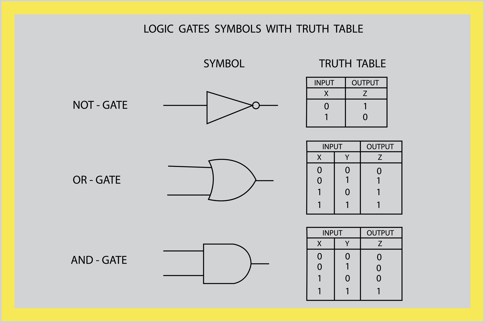

```java
public class DesafioDoBau {
    public static void main(String[] args) {
        boolean temChave = true;
        int nivelHeroi = 15;
        boolean ehLadrão = false;

        // Exemplo && (AND): Precisa de nível E da chave
        if (nivelHeroi >= 10 && temChave) {
            System.out.println("O baú se abriu com a chave!");
        }

        // Exemplo || (OR): Pode abrir se tiver a chave OU se for da classe Ladrão
        if (temChave || ehLadrão) {
            System.out.println("Acesso permitido ao tesouro.");
        }

        // Exemplo ! (NOT): Só entra se NÃO for um inimigo
        boolean ehInimigo = false;
        if (!ehInimigo) {
            System.out.println("Você é bem-vindo na cidade.");
        }
    }
}
```

### 📐 Tabelas da Verdade (Resumo Arcano)

Essas tabelas são o “mapa de consulta” rapido para os alunos:

### 🗡️ Operador && (AND)

Simbolo de Rigor: Só pessas se tudo estiver certo.

| Condição 1 | Operador | Condição 2 | Resultado |
| --- | --- | --- | --- |
| True (verdadeiro) | && | True (verdadeiro) |  True Verdadeiro |
| True (verdadeiro) | && | False (falso) | False (falso) |
| False (falso) | && | false (falso) | False (falso) |

### 🛡️ Operador || (OR)

Simbolo de Flexibilidade: passa se houver uma saida.

| Condição 1 | Operador | Condição 2 | Resultado |
| --- | --- | --- | --- |
| True (verdadeiro) | || | False (falso) | True (Verdadeiro) |
| False (falso) | || | True (verdadeiro) | True (verdadeiro) |
| False (falso) | || | False (falso) | False (falso) |

### 🔃 Operador ! (NOT)

Simbolo de inversão.

| Operador | Resultado |
| --- | --- |
| !True (diferente de verdadeiro) | Falso (falso) |
| !False (Diferente de falso) | True (verdadeiro) |
- **💡 Dica de Mestre**
    
    **Curto-Circuito:** O **Java** é preguiçoso (de um jeito bom!).
    
    - no **&&**, se a primeira parte for **False**, ele nem olha a segunda, pois ja sabe que o resuldato sera **False**.
    - No **||**, se a primeira parte for **True**, ele ja para por ali, pois ja sabe que o resultado será **True**. Isso economiza processamento na sua “engine” de jogo!

## 🏰 Quadro de Missões: A Estratégia do Mestre

### 🥉 Bronze (Fácil) - Verificação de Inventário

1. **Requisitos de Equipamento:** O herói quer equipar uma armadura. Crie um código que verifique se `int forca = 15;` é maior que 10 **E** se `boolean classeEhGuerreiro = true;` é verdadeiro.
    - **⚠ Dica do Mestre:**
        
        A maestria na programação nasce da prática, não apenas da leitura. O código só ganha vida quando você o escreve! Tente resolver o desafio com sua própria lógica antes de espiar a solução. **Confie no seu processo; o erro de hoje é o acerto de amanhã!**
        
    - **Resolução:**
2. **Acesso à Taverna:** O herói pode entrar se tiver `int moedas = 50;` **OU** se tiver o `boolean passeLivre = false;`. Exiba o resultado.
    - **⚠ Dica do Mestre:**
        
        A maestria na programação nasce da prática, não apenas da leitura. O código só ganha vida quando você o escreve! Tente resolver o desafio com sua própria lógica antes de espiar a solução. **Confie no seu processo; o erro de hoje é o acerto de amanhã!**
        
    - **Resolução:**
3. **Inversão de Status:** O herói está com `boolean invisivel = true;`. Use o operador `!` para exibir se ele está visível para os monstros.
    - **⚠ Dica do Mestre:**
        
        A maestria na programação nasce da prática, não apenas da leitura. O código só ganha vida quando você o escreve! Tente resolver o desafio com sua própria lógica antes de espiar a solução. **Confie no seu processo; o erro de hoje é o acerto de amanhã!**
        
    - **Resolução:**

### 🥈 Prata (Médio) - O Dilema da Dungeon

1. **Porta Mágica:** Para abrir a porta, o herói precisa: (Nível > 20 **E** ter a chave) **OU** ser um Administrador (`boolean ehAdmin = true;`).
    - *Dica:* Use parênteses para agrupar o primeiro bloco de condições.
    - **⚠ Dica do Mestre:**
        
        A maestria na programação nasce da prática, não apenas da leitura. O código só ganha vida quando você o escreve! Tente resolver o desafio com sua própria lógica antes de espiar a solução. **Confie no seu processo; o erro de hoje é o acerto de amanhã!**
        
    - **Resolução:**
2. **Sistema de Escapada:** O herói consegue fugir se: Sua `int estamina` for maior que 20 **E** ele **NÃO** estiver envenenado (`!envenenado`). Teste isso com valores de sua escolha.
    - **⚠ Dica do Mestre:**
        
        A maestria na programação nasce da prática, não apenas da leitura. O código só ganha vida quando você o escreve! Tente resolver o desafio com sua própria lógica antes de espiar a solução. **Confie no seu processo; o erro de hoje é o acerto de amanhã!**
        
    - **Resolução:**

### 🥇 Ouro (Difícil) - O Julgamento do Curto-Circuito

1. **Simulação de Performance:** Crie uma sentença lógica usando `&&` onde a primeira condição seja `false`. Adicione um comentário no código explicando por que o Java ignorará a segunda parte.
    - **⚠ Dica do Mestre:**
        
        A maestria na programação nasce da prática, não apenas da leitura. O código só ganha vida quando você o escreve! Tente resolver o desafio com sua própria lógica antes de espiar a solução. **Confie no seu processo; o erro de hoje é o acerto de amanhã!**
        
    - **Resolução:**
2. **Cálculo de Buff Complexo:** Um herói recebe um bônus de dano se: (Possui a "Espada de Fogo" **OU** a "Adaga de Gelo") **AND** (Seu nível é par - use `% 2 == 0`).
    - Declare as variáveis necessárias e exiba se o bônus foi aplicado.
        - **⚠ Dica do Mestre:**
            
            A maestria na programação nasce da prática, não apenas da leitura. O código só ganha vida quando você o escreve! Tente resolver o desafio com sua própria lógica antes de espiar a solução. **Confie no seu processo; o erro de hoje é o acerto de amanhã!**
            
        - **Resolução:**

### 💎 Diamante (Nível 2) - O Grande Sistema de Condições

Crie uma classe chamada `SistemaDeDecisaoRPG` que integre **Scanner, Relacionais e Lógicos**.

**Requisitos do Código:**

1. **Entrada de Dados:** * Peça o `nivel` do jogador.
    - Peça a quantidade de `ouro`.
    - Pergunte se ele possui o `"Emblema do Destino"` (use `boolean`).
    - **⚠ Dica do Mestre:**
        
        A maestria na programação nasce da prática, não apenas da leitura. O código só ganha vida quando você o escreve! Tente resolver o desafio com sua própria lógica antes de espiar a solução. **Confie no seu processo; o erro de hoje é o acerto de amanhã!**
        
    - **Resolução:**
2. **Lógica de Missão Épica:**
    - O herói só pode aceitar a "Missão Lendária" se:
        - Tiver Nível 20 ou superior **E** mais de 500 moedas de ouro.
        - **OU** se ele tiver o "Emblema do Destino", independente do nível ou ouro.
    - **⚠ Dica do Mestre:**
        
        A maestria na programação nasce da prática, não apenas da leitura. O código só ganha vida quando você o escreve! Tente resolver o desafio com sua própria lógica antes de espiar a solução. **Confie no seu processo; o erro de hoje é o acerto de amanhã!**
        
    - **Resolução:**
3. **O Teste Final:**
    - Armazene o resultado em uma variável `boolean podeAceitar`.
    - Use o `System.out.printf` para mostrar: `"Iniciando Missão Lendária? %b%n"`.
    - **⚠ Dica do Mestre:**
        
        A maestria na programação nasce da prática, não apenas da leitura. O código só ganha vida quando você o escreve! Tente resolver o desafio com sua própria lógica antes de espiar a solução. **Confie no seu processo; o erro de hoje é o acerto de amanhã!**
        
    - **Resolução:**
4. **Desafio de Inversão:** Use o operador `!` para mostrar se o herói **NÃO** atingiu os requisitos mínimos de ouro (ouro < 500).
    - **⚠ Dica do Mestre:**
        
        A maestria na programação nasce da prática, não apenas da leitura. O código só ganha vida quando você o escreve! Tente resolver o desafio com sua própria lógica antes de espiar a solução. **Confie no seu processo; o erro de hoje é o acerto de amanhã!**
        
    - **Resolução:**

### 📝 Operadores de Atribuição

Estes operadores definem ou atualizam o conteúdo de um “baú” (variável). O sinal de **igual (=)** no **Java** não significa que os dois lados são iguais (isso seria o **==**), mas sim: **“pegue o que está na direita e guarde na esquerda”**.

| Operador | Nome | Ação no RPG | Atalho de Código |
| --- | --- | --- | --- |
| = | Atribuição Simples | Define o valor inicial | vida = 100; |
| += | Atribuição de Soma | Cura ou Ganho de XP | Vida = vida + 10; |
| -= | Atribuição de Subtração | Dano ou Gasto de MP | Vida = vida - 5; |
| *=  | Atribribuição de Multiplicação | Bonus Temporario (buff) | dano = dano * 2; |
| /= | Atribuição de Divisão | Penalidade (Debuff) | Vel = vel / 2; |

### Exemplo de RPG: O painel de Status

Vamos ver como esses atalhos facilitam a vida de um mestre de jogo ao atualizar a ficha de um personagem:

```java
public class statusHeroi {
	public static void main(String[] args){
			int vida = 100;
			int moedas = 50;
			
			//O heroi encontra uma poção de vida grande
			vida += 50; //vida agora é 150
			Sytem.out.println("Cura aplicada! Vida: " + vida);
			
			//O heroi é atacado por um morcego
			vida -= 15; //Vida agora é 135
			System.out.print("Dano recebido! vida: " + vida;
			
			//O Heroi compra uma espada nova
			moedas -= 30; //moedas agora é 20
			System.out.println("Compar realizada! Moedas restantes: " + moedas);
			
			//Maldição da lentidão: O Heroi fica com metade da velocidade
			int velocidade = 20;
			velocidade /= 2; //velocidade agora é 10
			System.out.print("Voce foi amaldiçoado! velocidade: " + velocidade);
			
	}
}

```

### Dica do Mestre:

Por que usar **+=** em vez de **x = x + 5**?

1. **Legibilidade**: Seu codigo fica mais limpo e profissional.
2. **Performance:**Em alguns casos especificos, o compilador do **Java** consegue processar esses atalhos de forma levemente rapida.
3. **Menos erros:** Você evita o risco de digitar o nome da variavel errado no lado direito da equação.

## 🏰 Quadro de Missões: Atalhos do Guerreiro

### 🥉 Bronze (Fácil) - O Ganho de Experiência

No seu IntelliJ, pratique as atualizações rápidas:

1. **XP Acumulado:** Declare `int xp = 500;`. O herói derrotou um Slime e ganhou `150` de XP. Use o operador `+=` para atualizar o valor e exiba o total.
    - **⚠ Dica do Mestre:**
        
        A maestria na programação nasce da prática, não apenas da leitura. O código só ganha vida quando você o escreve! Tente resolver o desafio com sua própria lógica antes de espiar a solução. **Confie no seu processo; o erro de hoje é o acerto de amanhã!**
        
    - **Resolução:**
2. **Gasto de Mana:** O mago tem `int mana = 80;`. Ele lançou um feitiço de luz que custa `10`. Use o operador `=` para atualizar a mana.
    - **⚠ Dica do Mestre:**
        
        A maestria na programação nasce da prática, não apenas da leitura. O código só ganha vida quando você o escreve! Tente resolver o desafio com sua própria lógica antes de espiar a solução. **Confie no seu processo; o erro de hoje é o acerto de amanhã!**
        
    - **Resolução:**

### 🥈 Prata (Médio) - O Buff e o Debuff

Vamos usar multiplicadores e divisores:

1. **Fúria do Berserker:** O dano do herói é `int danoBase = 25;`. Ao entrar em fúria, o dano dobra. Use o operador `=` para aplicar esse bônus.
    - **⚠ Dica do Mestre:**
        
        A maestria na programação nasce da prática, não apenas da leitura. O código só ganha vida quando você o escreve! Tente resolver o desafio com sua própria lógica antes de espiar a solução. **Confie no seu processo; o erro de hoje é o acerto de amanhã!**
        
    - **Resolução:**
2. **Armadilha de Teia:** A velocidade do herói é `int velocidade = 100;`. Ao cair em uma teia, a velocidade cai pela metade. Use o operador `/=` para aplicar essa penalidade.
    - **⚠ Dica do Mestre:**
        
        A maestria na programação nasce da prática, não apenas da leitura. O código só ganha vida quando você o escreve! Tente resolver o desafio com sua própria lógica antes de espiar a solução. **Confie no seu processo; o erro de hoje é o acerto de amanhã!**
        
    - **Resolução:**

### 🥇 Ouro (Difícil) - A Economia da Taverna

1. **Ciclo de Compras:** Crie um pequeno script onde o herói começa com `int moedas = 200;`.
    - **⚠ Dica do Mestre:**
        
        A maestria na programação nasce da prática, não apenas da leitura. O código só ganha vida quando você o escreve! Tente resolver o desafio com sua própria lógica antes de espiar a solução. **Confie no seu processo; o erro de hoje é o acerto de amanhã!**
        
    - **Resolução:**
2. Ele compra uma armadura de `75` moedas (use `=`).
    - **⚠ Dica do Mestre:**
        
        A maestria na programação nasce da prática, não apenas da leitura. O código só ganha vida quando você o escreve! Tente resolver o desafio com sua própria lógica antes de espiar a solução. **Confie no seu processo; o erro de hoje é o acerto de amanhã!**
        
    - **Resolução:**
3. Ele vende um item velho e ganha `30` moedas (use `+=`).
    - **⚠ Dica do Mestre:**
        
        A maestria na programação nasce da prática, não apenas da leitura. O código só ganha vida quando você o escreve! Tente resolver o desafio com sua própria lógica antes de espiar a solução. **Confie no seu processo; o erro de hoje é o acerto de amanhã!**
        
    - **Resolução:**
4. Ele encontra um baú que triplica suas moedas atuais (use `=`).
    - **⚠ Dica do Mestre:**
        
        A maestria na programação nasce da prática, não apenas da leitura. O código só ganha vida quando você o escreve! Tente resolver o desafio com sua própria lógica antes de espiar a solução. **Confie no seu processo; o erro de hoje é o acerto de amanhã!**
        
    - **Resolução:**
5. Exiba o saldo final após todas essas transações usando apenas os operadores de atalho.
    - **⚠ Dica do Mestre:**
        
        A maestria na programação nasce da prática, não apenas da leitura. O código só ganha vida quando você o escreve! Tente resolver o desafio com sua própria lógica antes de espiar a solução. **Confie no seu processo; o erro de hoje é o acerto de amanhã!**
        
    - **Resolução:**

### 💎 Diamante (Nível 2) - O Simulador de Turno de Combate

Crie uma classe chamada `SimuladorCombate` que integre **Scanner** e **Operadores de Atribuição**.

**Requisitos do Código:**

1. **Status Iniciais:**
    - Peça ao jogador para digitar a `vidaInicial` do Boss.
    - Peça o `danoAtaque` do herói.
2. **Primeiro Turno:** * O herói ataca! Use `=` para subtrair o dano da vida do Boss.
3. **Evento Especial (Buff):**
    - Pergunte ao jogador: "Deseja usar Poção de Força? (true/false)".
    - Se `true`, use `=` para aumentar o `danoAtaque` em 2.
4. **Segundo Turno:**
    - O herói ataca novamente com o dano atualizado. Use `=` na vida do Boss.
5. **Finalização:**
    - Exiba a vida restante do Boss usando `System.out.printf`.
    - **Desafio Extra:** Use o que aprendeu em **Operadores Relacionais** para exibir se o Boss foi derrotado (`vidaBoss <= 0`).
    - **Resolução:**
    - **⚠ Dica do Mestre:**
        
        A maestria na programação nasce da prática, não apenas da leitura. O código só ganha vida quando você o escreve! Tente resolver o desafio com sua própria lógica antes de espiar a solução. **Confie no seu processo; o erro de hoje é o acerto de amanhã!**
        

## **2. Estruturas Condicionais 🏗️🔀**

## 🔍 Entendendo Escopos (As paredes do código)

O escopo define o “Tempo de vida” e a visibilidade” de uma variavel. em **Java,** Ele é delimitado pelas **Chaves { }.**

| Conceito |  Analogia de RPG | Regra de Ouro |
| --- | --- | --- |
| Escopo Global (Main) | O mapa do Mundo | Variaveis criadas aqui são vistas por todos os blocos internos. |
| Escopo Local (IF) | Usa Sala Trancada | Variaveis criadas aqui só existem enquanto o codigo estiver “dentro da sala”. |

### 🎭 Exemplo de RPG: A Chave da Sala de Tesouro

Veja como o erro de escopo que voce mostrou acontece na pratica de jogo:

```java
public classa MasmorraDoEscopo {
	public static void main(String[] args){ //Inicio do salão principal
		String heroi = "Aragorn"; //Variavel Global
		int moedas = 100; //Variavel Global
		 
		if(moedas > 50) { // ❓ Entrada na Sala do Tesouro
			String itemEspecial = "Anel de Ouro" //Variavel local
			Syste.out.println(heroi + " encontrou o " + itemEspecial);
		} //❓ A Sala do Tesouro se fecha e TUDO lá dentro some!
		
		//tentar usar o itemEspecial aqui fora geraria um erro de compilação:
		//System.out.println(itemEspecial); //❌ ERRO: O item ficou trancado na sala!
		
		System.out.println(Heroi + " continua sua jornada"); //Heroi ainda existe
	} //Fim do Mapa
}
```

### **💡 Dica de Mestre**

1. ***Lixo Automatico (Garbage Collection):** Quando o escopo de um **if** ou **for** termina (fecha a **chave }** ), o **Java** destroi as variaveis locais para liberar memoria. É por isso que voce consegue acessá-las depois.
2. **Declarar Fora para usar fora:** Se você precisa que o resultado de um calculo feito dentro de um **if** sja usado depois, voce deve **declarrar** a variavel antes do **if** e apenas atribuir o valor dentro dele.

## 🏰 Quadro de Missões: O Arquiteto de Escopo

### 🥉 Bronze (Fácil) - A Tocha Curta

1. **Missão:** No seu IntelliJ, crie um código onde você declara uma `String tocha = "Acesa";` dentro de um bloco `if (true) { ... }`.
    - **Resolução:**
    - **⚠ Dica do Mestre:**
        
        A maestria na programação nasce da prática, não apenas da leitura. O código só ganha vida quando você o escreve! Tente resolver o desafio com sua própria lógica antes de espiar a solução. **Confie no seu processo; o erro de hoje é o acerto de amanhã!**
        
2. **O Teste:** Tente imprimir essa `tocha` fora das chaves do `if`. Observe o erro vermelho dizendo que a variável não foi encontrada.
    - **Resolução:**
    - **⚠ Dica do Mestre:**
        
        A maestria na programação nasce da prática, não apenas da leitura. O código só ganha vida quando você o escreve! Tente resolver o desafio com sua própria lógica antes de espiar a solução. **Confie no seu processo; o erro de hoje é o acerto de amanhã!**
        
3. **A Correção:** Mova a declaração para cima do `if` e veja a mágica da visibilidade funcionar.
    - **Resolução:**
    - **⚠ Dica do Mestre:**
        
        A maestria na programação nasce da prática, não apenas da leitura. O código só ganha vida quando você o escreve! Tente resolver o desafio com sua própria lógica antes de espiar a solução. **Confie no seu processo; o erro de hoje é o acerto de amanhã!**
        

### 🥈 Prata (Médio) - O Saque Local

1. **O Baú Temporário:** Crie um programa onde o herói tem `int ouroTotal = 0;`.
    - **Resolução:**
    - **⚠ Dica do Mestre:**
        
        A maestria na programação nasce da prática, não apenas da leitura. O código só ganha vida quando você o escreve! Tente resolver o desafio com sua própria lógica antes de espiar a solução. **Confie no seu processo; o erro de hoje é o acerto de amanhã!**
        
2. **O Encontro:** Dentro de um `if`, declare uma variável `int ouroEncontrado = 50;`.
    - **Resolução:**
    - **⚠ Dica do Mestre:**
        
        A maestria na programação nasce da prática, não apenas da leitura. O código só ganha vida quando você o escreve! Tente resolver o desafio com sua própria lógica antes de espiar a solução. **Confie no seu processo; o erro de hoje é o acerto de amanhã!**
        
3. **A Persistência:** Tente somar `ouroTotal += ouroEncontrado;` ainda dentro do `if`.
    - **Resolução:**
    - **⚠ Dica do Mestre:**
        
        A maestria na programação nasce da prática, não apenas da leitura. O código só ganha vida quando você o escreve! Tente resolver o desafio com sua própria lógica antes de espiar a solução. **Confie no seu processo; o erro de hoje é o acerto de amanhã!**
        
4. **O Dilema:** Tente imprimir `ouroEncontrado` após o fechamento das chaves do `if`. O que acontece com o seu inventário?
    - **Resolução:**
    - **⚠ Dica do Mestre:**
        
        A maestria na programação nasce da prática, não apenas da leitura. O código só ganha vida quando você o escreve! Tente resolver o desafio com sua própria lógica antes de espiar a solução. **Confie no seu processo; o erro de hoje é o acerto de amanhã!**
        

### 🥇 Ouro (Difícil) - O Ritual de Invocação

1. **A Magia Restrita:** Crie um código que peça (via `Scanner`) o nível do herói.
    - **Resolução:**
    - **⚠ Dica do Mestre:**
        
        A maestria na programação nasce da prática, não apenas da leitura. O código só ganha vida quando você o escreve! Tente resolver o desafio com sua própria lógica antes de espiar a solução. **Confie no seu processo; o erro de hoje é o acerto de amanhã!**
        
2. **A Sala de Magia:** Se o nível for maior que 10, abra um bloco `if`. Dentro dele, declare uma constante `final String MAGIA_SUPREMA = "Explosão Estelar";`.
    - **Resolução:**
    - **⚠ Dica do Mestre:**
        
        A maestria na programação nasce da prática, não apenas da leitura. O código só ganha vida quando você o escreve! Tente resolver o desafio com sua própria lógica antes de espiar a solução. **Confie no seu processo; o erro de hoje é o acerto de amanhã!**
        
3. **A Consequência:** Tente usar essa magia fora do `if` para atacar um monstro fictício. Comente o erro explicando por que a `MAGIA_SUPREMA` é uma variável de escopo local.
    - **Resolução:**
    - **⚠ Dica do Mestre:**
        
        A maestria na programação nasce da prática, não apenas da leitura. O código só ganha vida quando você o escreve! Tente resolver o desafio com sua própria lógica antes de espiar a solução. **Confie no seu processo; o erro de hoje é o acerto de amanhã!**
        

### 💎 Diamante (Nível 2) - O Gerenciador de Inventário Persistente

Crie uma classe chamada `SistemaDeMasmorra`. Este desafio exige que você manipule escopos para que os dados não se percam.

**Requisitos do Código:**

1. **Salão Principal (Escopo Global):** Declare as variáveis `String nomeItem` (vazia) e `int bonusDano` (zero).
    - **Resolução:**
    - **⚠ Dica do Mestre:**
        
        A maestria na programação nasce da prática, não apenas da leitura. O código só ganha vida quando você o escreve! Tente resolver o desafio com sua própria lógica antes de espiar a solução. **Confie no seu processo; o erro de hoje é o acerto de amanhã!**
        
2. **A Sala de Tesouro (Bloco IF):**
    - Peça ao usuário para digitar o nome de um item épico.
    - Se o nome não estiver vazio (`!nome.isEmpty()`), atribua o valor digitado à variável `nomeItem` que você criou lá no topo.
    - Defina o `bonusDano` como 50.
    - **Resolução:**
    - **⚠ Dica do Mestre:**
        
        A maestria na programação nasce da prática, não apenas da leitura. O código só ganha vida quando você o escreve! Tente resolver o desafio com sua própria lógica antes de espiar a solução. **Confie no seu processo; o erro de hoje é o acerto de amanhã!**
        
3. **A Jornada Continua (Fora do IF):**
    - Use um `System.out.printf` para mostrar: `"Herói saiu da sala com: %s (Bônus: +%d)%n"`.
    - **O Pulo do Gato:** Se você tivesse declarado `nomeItem` dentro do `if`, conseguiria imprimir essa frase aqui fora? Explique no Javadoc da classe.
    - **Resolução:**
    - **⚠ Dica do Mestre:**
        
        A maestria na programação nasce da prática, não apenas da leitura. O código só ganha vida quando você o escreve! Tente resolver o desafio com sua própria lógica antes de espiar a solução. **Confie no seu processo; o erro de hoje é o acerto de amanhã!**
        

## ⚖️ Estruturas Condicionais (Tomada de Decisão)

### 🗡️ If (Se….)

O **if** é o teste de habilidade. Se o jogador passar no teste (Condição **True**), a ação acontece. Se falar, o codigo simplesmente ignora o bloco e seguem viagem.

```java
int vidaHeroi = 10;
if (vidaHeroi < 20) {
	System.out.prinln("⚠️ Alerta: Sua vida está criticamente baixa!");
}
```

## 🏰 Quadro de Missões: O Teste de Habilidade (`if` Único)

### 🥉 Bronze (Fácil) - O Sensor de Perigo

1. **Missão:** Crie um programa onde você declara `int vida = 10;`.
2. **O Teste:** Use um `if` para verificar se a `vida` é menor que 20.
3. **Ação:** Se for verdade, imprima: `"AVISO: Sua vida está criticamente baixa!"`.
4. **Prática:** Mude o valor da vida para 30 e rode o código novamente para ver o silêncio do console (o `if` sendo ignorado).

### 🥈 Prata (Médio) - O Pedágio da Cidade

1. **O Baú de Moedas:** Peça ao usuário (via `Scanner`) para digitar quantas moedas ele tem.
2. **A Condição:** Se a quantidade de moedas for **maior ou igual** a 50, execute um `if`.
3. **Ação:** Dentro do `if`, subtraia 50 das moedas (o custo da entrada) e imprima: `"Entrada permitida! Moedas restantes: " + moedas`.
4. **Atenção:** Se ele tiver menos de 50, o programa não deve mostrar mensagem nenhuma (apenas terminar).

### 🥇 Ouro (Difícil) - O Crítico Aleatório

1. **A Sorte do Guerreiro:** Peça para o jogador digitar o `danoBase` do seu ataque.
2. **O Gatilho:** Use um `if` para verificar se o `danoBase` é exatamente igual a 20 (um acerto crítico no dado).
3. **Ação de Escopo:** Se for 20, declare uma variável **dentro** do `if` chamada `danoTotal` que recebe o `danoBase * 3`. Imprima o valor do golpe crítico.
4. **Lembrete de Alquimista:** Lembre-se que essa variável `danoTotal` só existirá dentro desse `if`!

### 💎 Diamante (Nível 2) - O Portal de Verificação de Itens

Crie uma classe chamada `VerificadorDeItens`. Este desafio combina **Scanner, Strings e múltiplos `if` isolados**.

**Requisitos do Código:**

1. **Preparação:** Peça ao usuário o `nomeDoItem` (String) e o seu `peso` (double).
2. **Filtro de Nome:** Crie um `if` que verifica se o nome do item é igual a `"Excalibur"` (use `.equals()`). Se for, imprima: `"Você está portando uma arma lendária!"`.
3. **Filtro de Peso:** Crie um **segundo `if`** (separado do primeiro) que verifica se o `peso` é maior que 100.0. Se for, imprima: `"CUIDADO: Este item é pesado demais para sua mochila!"`.
4. **Filtro de Texto:** Crie um **terceiro `if`** que verifica se o nome do item contém a palavra `"Amaldiçoado"` (use `.contains()`). Se for, imprima: `"O item emite uma aura sinistra..."`.
5. **Missão de Escopo:** Tente criar uma variável de aviso dentro do primeiro `if` e use-a dentro do segundo. Observe o erro de escopo e comente no código por que o Java não permite isso.

### Else (Senão…)

O **else** é o plano B. Ele garante que algo aconteça caso o **if** falhe. É o “Caminho Alternativo”.

```java
Boolean temChaveMestra = false;

if (temChaveMestra) {
		System.out.println(""🔓 Você abriu o portão principal!");
} else {
		System.out.prinln("🚪 O portão está trancado. Procure outra entrada.");
}	
```

## 🏰 Quadro de Missões: A Encruzilhada do Destino

### 🥉 Bronze (Fácil) - O Porteiro da Taverna

1. **Missão:** Crie um programa que peça a `idade` do usuário via `Scanner`.
2. **O Teste:** Se a idade for maior ou igual a 18, imprima: `"Pode entrar e beber nossa melhor hidromel!"`.
3. **O Plano B:** Caso contrário (`else`), imprima: `"Vá para casa, jovem! Aqui servimos apenas leite para crianças."`.

### 🥈 Prata (Médio) - O Teste de Resistência

1. **O Atributo:** Peça para o jogador digitar o valor da sua `defesa` (int) e o valor de um `ataqueInimigo` (int).
2. **A Condição:** Se a `defesa` for maior que o `ataqueInimigo`, imprima: `"Você bloqueou o golpe com sucesso!"`.
3. **O Caminho Alternativo:** Caso o ataque seja maior ou igual à defesa, exiba: `"Sua guarda foi quebrada! Você recebeu dano."`.

### 🥇 Ouro (Difícil) - O Baú Mímico

1. **A Sorte:** Peça para o jogador escolher um número de 1 a 10 para tentar abrir um baú.
2. **O Gatilho:** Se o número for igual a `7` (o número da sorte), exiba: `"O baú se abre revelando uma Espada de Prata!"`.
3. **A Armadilha:** Se for **qualquer outro número**, use o `else` para exibir: `"O baú revela dentes afiados e te morde! É um Mímico!"`.
4. **Desafio de Escopo:** Declare uma variável `int recompensa` dentro do `if` e tente usá-la no `else`. Observe o erro e explique por que o `else` não consegue enxergar o que nasceu dentro do `if`.

### 💎 Diamante (Nível 2) - O Sistema de Login da Guilda

Crie uma classe chamada `SistemaAutenticacao`. Este desafio exige **Strings, Booleans e a lógica de Bifurcação**.

**Requisitos do Código:**

1. **Entrada de Dados:** * Peça o `nomeUsuario`.
    - Peça a `senhaMagica`.
2. **A Verificação:** * Crie um `if` que verifique se o nome é `"Mestre"` **E** se a senha é `"12345"`.
    - **IMPORTANTE:** Lembre-se de usar `.equals()` para comparar as Strings!
3. **Resultado:**
    - No caminho do `if` (Verdadeiro), imprima: `"Acesso concedido ao Painel de Controle do Mundo!"`.
    - No caminho do `else` (Falso), imprima: `"ALERTA: Intruso detectado! Os guardas foram acionados."`.
4. **Toque Final:** Use um `boolean` declarado antes do `if` para registrar se o login foi um sucesso e imprima esse status ao final de tudo, fora do bloco `if/else`.

### 🏹Else if (Condições em Cadeia)

O **Else if** é usado para situações com multiplos resultados possiveis, como o sistema de **Raridade de itens** ou **Niveis de Reputação**.

- **💎 Estrutura Condicional: O Sistema de Drop (Saque)**
    
    Em um RPG ONLINE, quando você derrota um chege, o servidor verifica a “Raridade” do item que vai cair para você. Não é um dado fisico, é um **algoritimo de probabilidade.
    
    ```java
    int raridadeItem = 95; //valor gasto pelo servidor de 1 a 100
    
    if (raridadeItem >= 99) {
    	System.out.println("💎 [LENDÁRIO] Você obteve a 'Lâmina do Caos'!);
    } else if (raridadeItem >= 85) {
    		System.out.println("💜 [ÉPICO] Você obteve a 'Armadura de Placas de Éter'.");
    } else if (raridade >= 50) {
    		System.out.println("💙 [RARO] Você obteve um 'Anel de Proteção'.");
    } else {
    		System.out.println("⚪ [COMUM] Você obteve 'Restos de Metal'.");
    }
    ```
    
- **🗺️ Estrutura Condicional: Sistema de Zonas de Perigo**
    
    Outro exemplo clássico de RPG de PC é quando o mapa impede ou avisa o jogador sobre o perigo de uma região com base no seu nível atual.
    
    ```java
    int nivelJogador = 22;
    
    if (nivelJogador >= 50) {
        System.out.println("🔥 Zona: 'Vulcão de Enxofre' - Nível Recomendado: 50+");
        System.out.println("Status: VOCÊ É UM MESTRE NESTA ÁREA.");
    } else if (nivelJogador >= 20) {
        System.out.println("🌲 Zona: 'Floresta Sombria' - Nível Recomendado: 20-49");
        System.out.println("Status: DESAFIO ADEQUADO.");
    } else {
        System.out.println("💀 ALERTA: Nível muito baixo! Os monstros aqui vão te destruir com um golpe.");
        System.out.println("Status: FUJA IMEDIATAMENTE!");
    }
    ```
    
    ### Dica do Mestre
    
    Observe que a ordem importa! Se eu testase o **nivelJogador >= 20** antes do **nivelJogador >=50**, um jogador nivel 60 entraria na condição de “Desafio adequado” (20+) e nunca chegaria a ser chamado ne “Mestre” (50+). **Sempre teste o valor mais restrito para o mais amplo.
    
    - **❌ O Jeito Errado (A Ordem Fraca)**
        
        Se testarmos o tempo maior primeiro, um jogador lendário que terminou em 2 minutos seria classificado como "Lento", porque 2 é menor que 20.
        
        ```java
        int tempoConclusao = 2; // minutos
        
        if (tempoConclusao <= 20) { // O filtro é muito largo!
            System.out.println("Rank C: Concluiu a tempo."); 
        } else if (tempoConclusao <= 10) {
            System.out.println("Rank B: Guerreiro veloz.");
        } else if (tempoConclusao <= 3) {
            System.out.println("Rank S: DEUS DA GUERRA!"); // O código nunca chegará aqui!
        }
        ```
        
    - **✅ O Jeito Certo (A Ordem Restrita)**
        
        Sempre teste a condição mais difícil (o funil mais estreito) primeiro.
        
        ```java
        int tempoConclusao = 2;
        
        if (tempoConclusao <= 3) { // Primeiro verificamos o mais difícil
            System.out.println("Rank S: DEUS DA GUERRA! ⚡");
        } else if (tempoConclusao <= 10) {
            System.out.println("Rank B: Guerreiro veloz. 🛡️");
        } else {
            System.out.println("Rank C: Concluiu a tempo. 🐢");
        }
        ```
        

## 🏰 Quadro de Missões: O Sistema de Rankings

### 🥉 Bronze (Fácil) - O Medidor de Reputação

1. **Missão:** Crie um programa que peça a `reputacao` do herói (int de 0 a 100).
2. **A Cadeia:** * Se for maior ou igual a 80, imprima: `"Status: Herói do Reino"`.
    - Se for maior ou igual a 50, imprima: `"Status: Aventureiro Conhecido"`.
    - Caso contrário (`else`), imprima: `"Status: Desconhecido"`.

### 🥈 Prata (Médio) - O Oráculo de Elementos

1. **O Atributo:** Peça para o jogador digitar sua pontuação de `afinidade` (0 a 100).
2. **A Seleção:**
    - Se afinidade >= 90: `"Seu elemento é o Relâmpago!"`.
    - Se afinidade >= 70: `"Seu elemento é o Fogo!"`.
    - Se afinidade >= 40: `"Seu elemento é a Terra!"`.
    - Caso contrário: `"Você ainda não despertou seu elemento."`.

### 🥇 Ouro (Difícil) - O Erro do Aprendiz (Ordem Reversa)

1. **O Desafio:** Tente reproduzir o "Jeito Errado" mencionado na sua apostila no IntelliJ.
2. **O Código:** Crie uma lógica de `tempoConclusao` onde você testa o valor mais alto (`<= 20`) antes do mais baixo (`<= 3`).
3. **A Observação:** Rode o programa com o valor `2`. Veja como o Java entrega o Rank C (errado) em vez do Rank S.
4. **A Correção:** Comente esse código e reescreva-o na ordem correta para ver a diferença.

### 💎 Diamante (Nível 2) - O Grande Sistema de Loot e Impostos

Crie uma classe chamada `GeradorDeTesouro`. Este sistema deve integrar **Scanner, Operadores e Escopos**.

**Requisitos do Código:**

1. **Entrada:** Peça a `quantidadeMoedas` que o herói encontrou.
2. **A Lógica de Drop (Baseada na sua apostila):**
    - Se moedas > 1000: `"💎 Drop Lendário! Você encontrou o Cálice de Ouro."`.
    - Senão, se moedas > 500: `"💜 Drop Épico! Você encontrou uma Capa de Veludo."`.
    - Senão, se moedas > 100: `"💙 Drop Raro! Você encontrou uma Moeda Antiga."`.
    - Senão: `"⚪ Drop Comum! Você encontrou Cascalho."`.
3. **O Sistema de Impostos (Integração):**
    - Se o drop for Lendário ou Épico, declare uma variável **dentro desses blocos** para calcular um imposto de 10% sobre o total de moedas.
    - **Desafio de Escopo:** Tente exibir o valor do imposto fora do `if/else if`. Se der erro, aplique a técnica de declarar a variável antes do bloco para que ela sobreviva ao escopo global!

## 🏰 Quadro de Missões: O Mestre das Condições

### 🥉 Bronze (Fácil) - O Medidor de Vida

1. **Missão:** Peça ao usuário sua `quantidadeVida` (0 a 100).
    - **Resolução:**
    - **⚠ Dica do Mestre:**
        
        A maestria na programação nasce da prática, não apenas da leitura. O código só ganha vida quando você o escreve! Tente resolver o desafio com sua própria lógica antes de espiar a solução. **Confie no seu processo; o erro de hoje é o acerto de amanhã!**
        
2. **Cadeia de Status:**
    - Se vida >= 80, imprima: `"Você está radiante e pronto para a briga!"`.
    - Senão, se vida >= 30, imprima: `"Você está ferido, mas ainda consegue lutar."`.
    - Senão (`else`), imprima: `"Estado Crítico! Fuja ou use uma poção!"`.
    - **Resolução:**
    - **⚠ Dica do Mestre:**
        
        A maestria na programação nasce da prática, não apenas da leitura. O código só ganha vida quando você o escreve! Tente resolver o desafio com sua própria lógica antes de espiar a solução. **Confie no seu processo; o erro de hoje é o acerto de amanhã!**
        

### 🥈 Prata (Médio) - O Seletor de Dificuldade

1. **A Escolha:** O jogador deve digitar um número para escolher a dificuldade: 1 (Fácil), 2 (Médio) ou 3 (Difícil).
    - **Resolução:**
    - **⚠ Dica do Mestre:**
        
        A maestria na programação nasce da prática, não apenas da leitura. O código só ganha vida quando você o escreve! Tente resolver o desafio com sua própria lógica antes de espiar a solução. **Confie no seu processo; o erro de hoje é o acerto de amanhã!**
        
2. **O Algoritmo:**
    - Se for 1, imprima: `"Modo Turista: Inimigos têm metade da vida."`.
    - Senão, se for 2, imprima: `"Modo Aventureiro: Desafio equilibrado."`.
    - Senão, se for 3, imprima: `"Modo Pesadelo: Um golpe e você morre!"`.
    - **Extra:** Use o `else` para tratar se o jogador digitar qualquer outro número (ex: 99), dizendo: `"Opção inválida! O Reino escolheu por você: Médio."`.
    - **Resolução:**
    - **⚠ Dica do Mestre:**
        
        A maestria na programação nasce da prática, não apenas da leitura. O código só ganha vida quando você o escreve! Tente resolver o desafio com sua própria lógica antes de espiar a solução. **Confie no seu processo; o erro de hoje é o acerto de amanhã!**
        

### 🥇 Ouro (Difícil) - O Sistema de Rankings (A Ordem Restrita)

1. **O Desafio:** Use o conhecimento de **Ordem de Precedência** da sua apostila.
    - **Resolução:**
    - **⚠ Dica do Mestre:**
        
        A maestria na programação nasce da prática, não apenas da leitura. O código só ganha vida quando você o escreve! Tente resolver o desafio com sua própria lógica antes de espiar a solução. **Confie no seu processo; o erro de hoje é o acerto de amanhã!**
        
2. **A Missão:** Peça o `tempoDeConclusao` de uma masmorra (em segundos).
    - **Resolução:**
    - **⚠ Dica do Mestre:**
        
        A maestria na programação nasce da prática, não apenas da leitura. O código só ganha vida quando você o escreve! Tente resolver o desafio com sua própria lógica antes de espiar a solução. **Confie no seu processo; o erro de hoje é o acerto de amanhã!**
        
3. **O Ranking:**
    - Menos de 60 segundos: `"Rank S - Velocidade Divina! ⚡"`.
    - Menos de 120 segundos: `"Rank A - Guerreiro Veloz. 🛡️"`.
    - Senão: `"Rank B - Concluiu a tempo. 🐢"`.
    - **Resolução:**
    - **⚠ Dica do Mestre:**
        
        A maestria na programação nasce da prática, não apenas da leitura. O código só ganha vida quando você o escreve! Tente resolver o desafio com sua própria lógica antes de espiar a solução. **Confie no seu processo; o erro de hoje é o acerto de amanhã!**
        
4. **Teste Crítico:** Insira o valor `45` e verifique se ele cai corretamente no Rank S e **não** no Rank A.
    - **Resolução:**
    - **⚠ Dica do Mestre:**
        
        A maestria na programação nasce da prática, não apenas da leitura. O código só ganha vida quando você o escreve! Tente resolver o desafio com sua própria lógica antes de espiar a solução. **Confie no seu processo; o erro de hoje é o acerto de amanhã!**
        

### 💎 Diamante (Nível 2) - O Grande Juiz do Torneio

Crie uma classe chamada `TorneioDeMagia`. Este sistema deve integrar **Scanner, Operadores Relacionais e Lógicos**.

**Requisitos do Código:**

1. **Entrada:** Peça o `nivelDeMana` e a `quantidadeDeMagias` que o herói conhece.
    - **Resolução:**
    - **⚠ Dica do Mestre:**
        
        A maestria na programação nasce da prática, não apenas da leitura. O código só ganha vida quando você o escreve! Tente resolver o desafio com sua própria lógica antes de espiar a solução. **Confie no seu processo; o erro de hoje é o acerto de amanhã!**
        
2. **O Julgamento:**
    - Se mana > 100 **E** magias > 5: `"Categoria: Arquimago do Império"`.
    - Senão, se mana > 50 **OU** magias > 2: `"Categoria: Mago de Combate"`.
    - Senão: `"Categoria: Aprendiz de Feitiçaria"`.
    - **Resolução:**
    - **⚠ Dica do Mestre:**
        
        A maestria na programação nasce da prática, não apenas da leitura. O código só ganha vida quando você o escreve! Tente resolver o desafio com sua própria lógica antes de espiar a solução. **Confie no seu processo; o erro de hoje é o acerto de amanhã!**
        
3. **O Toque de Alquimia:** Dentro do bloco do "Arquimago", use um operador de atribuição (`+=`) para dar um bônus de +20 de mana e exiba o novo valor.
    - **Resolução:**
    - **⚠ Dica do Mestre:**
        
        A maestria na programação nasce da prática, não apenas da leitura. O código só ganha vida quando você o escreve! Tente resolver o desafio com sua própria lógica antes de espiar a solução. **Confie no seu processo; o erro de hoje é o acerto de amanhã!**
        
4. **Finalização:** Use o `else` para exibir uma mensagem motivacional caso o herói seja apenas um Aprendiz.
    - **Resolução:**
    - **⚠ Dica do Mestre:**
        
        A maestria na programação nasce da prática, não apenas da leitura. O código só ganha vida quando você o escreve! Tente resolver o desafio com sua própria lógica antes de espiar a solução. **Confie no seu processo; o erro de hoje é o acerto de amanhã!**
        

### ⚔️ Desafio: O Julgamento do Oráculo

Escreva um código para um "Oráculo" que lê a **força** de um jogador e decide sua classe:

### Dica de Mestre:

 Lembre-se que o `else if` verifica de cima para baixo. Se você já testou `>= 80`, o próximo `else if (forca >= 50)` só será testado se a força for menor que 80!

1. Use `Scanner` para ler a `int forca`.
2. Se a força for **maior ou igual a 80**, imprima: "Você é um Titã!".
3. Se a força for **entre 50 e 79**, imprima: "Você é um Guerreiro!".
4. Se a força for **entre 20 e 49**, imprima: "Você é um Arqueiro!".
5. Se for **menor que 20**, imprima: "Você é um Mago!".
- **Resolução:**
- **⚠ Dica do Mestre:**
    
    A maestria na programação nasce da prática, não apenas da leitura. O código só ganha vida quando você o escreve! Tente resolver o desafio com sua própria lógica antes de espiar a solução. **Confie no seu processo; o erro de hoje é o acerto de amanhã!**
    

## 🎛️ Switch Case

O **Switch Case** é o seletor de destinos do seu codigo. Em um RPG, ele é a estrutura perfeita para gerencias **Menus de comandos. Seleção de Personagens** ou o **Inventario de itens**.

O **Switch** atua como um “Atalho” para quando precisamos comparar uma **única variavel** com varios valores exatos (como numeros ou textos). É muito mais limpo que escrever 12 **if/else**

### 📜 Anatomia do Comando

- **switch**: Define qual variavel sera analisada.
- **case:** Define os “endereços” possiveis. Se o valor bater, o codigo entra aqui.
- **Break**: O comando mais importante! Ele é a p**orta de saída** Sem ele, o código “escorrega” para o próximo caso (Efeito Fall-Through).
- **default**: A rede de segurança. se o jogador digitar “99” num menu de 1 a 3, o **default avisa que a opção é invalida.

### 🎭 Exemplo de RPG: Seleção de Classe

Ao iniciar um MMORPG, você geralmente escolhe sua classe. Veja como o `switch` organiza isso de forma elegante:

```java
import java.util.Scanner;

public class SelecaoClasse{
	public static void main(String[] args) {
		Scanner sc = new Scanner(System.in);
		
		System.out.println("=== 🛡️ SELEÇÃO DE CLASSE ===");
		System.out.println("1 - Guerreiro (Alta Defesa)");
		System.out.println("2 - Mago (Alto Dano Mágico)");
		System.out.println("3 - Ladino (Alta Agilidade)");
		System.out.println("Escolha seu destino: ");
		
		int escolha = sc.nextInt();
		
		switch (escolha) {
			case 1:
				System.out.println("Voce equipou uma Espada e Escudo!");
				break;
			case 2:
				System.out.println("Voce equipous um Cajado de Cristal!");
				break;
			case 3:
				System.out.println("Voce equipou adagas envenenadas!");
				break;
			case 4:
				System.out.println("Opção invalida! Você começara como um Camponês.");
				break;
		}
		
		sc.close();
	}
}
```

### 💎 Dica do Mestre:

As vezes, diferentes escolhas levam ao mesmo resultado. Se quisermos dividir os meses por **Estaçoes do ano**, poderia fazer assim:

```java
switch (mes) {
	case "dezembro":
	case "janeiro":
	case "fevereiro":
		System.out.println("Estação: Verão (Hemisferio Sul)");
		break;
	case "março":
	case "abril":
	case "maio":
		System.out.print("Estação Outono");
		break;
	// .... e assim por diante
	}
		
```

Note que não usei **break** entre dezembro e janeiro. Isso faz com que o Java execute o mesmo código para todos eles!

## 🏰 Quadro de Missões: O Mestre dos Portais

### 🥉 Bronze (Fácil) - O Menu de Comandos

1. **Missão:** Crie um `switch` que receba um número de 1 a 4.
    - **Resolução:**
    - **⚠ Dica do Mestre:**
        
        A maestria na programação nasce da prática, não apenas da leitura. O código só ganha vida quando você o escreve! Tente resolver o desafio com sua própria lógica antes de espiar a solução. **Confie no seu processo; o erro de hoje é o acerto de amanhã!**
        
2. **Os Comandos:**
    - `1`: "Atacar com Espada"
    - `2`: "Defender com Escudo"
    - `3`: "Usar Poção"
    - `4`: "Fugir da Batalha"
    - **Default:** "Comando desconhecido: você ficou parado e levou dano!"
        - **Resolução:**
        - **⚠ Dica do Mestre:**
            
            A maestria na programação nasce da prática, não apenas da leitura. O código só ganha vida quando você o escreve! Tente resolver o desafio com sua própria lógica antes de espiar a solução. **Confie no seu processo; o erro de hoje é o acerto de amanhã!**
            

### 🥈 Prata (Médio) - A Loja de Alquimia

1. **O Desafio da Apostila:** Peça o nome da poção (String) via `Scanner`.
    - **Resolução:**
    - **⚠ Dica do Mestre:**
        
        A maestria na programação nasce da prática, não apenas da leitura. O código só ganha vida quando você o escreve! Tente resolver o desafio com sua própria lógica antes de espiar a solução. **Confie no seu processo; o erro de hoje é o acerto de amanhã!**
        
2. **A Preparação:** Use `.toLowerCase()` na entrada para evitar erros de caixa alta.
    - **Resolução:**
    - **⚠ Dica do Mestre:**
        
        A maestria na programação nasce da prática, não apenas da leitura. O código só ganha vida quando você o escreve! Tente resolver o desafio com sua própria lógica antes de espiar a solução. **Confie no seu processo; o erro de hoje é o acerto de amanhã!**
        
3. **O Switch:**
    - "vida": Imprima "Preço: 10g"
    - "mana": Imprima "Preço: 15g"
    - "veneno": Imprima "Preço: 50g"
    - **Default:** "Não temos essa poção no estoque."
    - **Resolução:**
    - **⚠ Dica do Mestre:**
        
        A maestria na programação nasce da prática, não apenas da leitura. O código só ganha vida quando você o escreve! Tente resolver o desafio com sua própria lógica antes de espiar a solução. **Confie no seu processo; o erro de hoje é o acerto de amanhã!**
        

### 🥇 Ouro (Difícil) - O Sistema de Elementos (Agrupamento)

1. **A Missão:** Crie um `switch` que receba o nome de um material (String).
    - **Resolução:**
    - **⚠ Dica do Mestre:**
        
        A maestria na programação nasce da prática, não apenas da leitura. O código só ganha vida quando você o escreve! Tente resolver o desafio com sua própria lógica antes de espiar a solução. **Confie no seu processo; o erro de hoje é o acerto de amanhã!**
        
2. **O Agrupamento:** Use a técnica de "não colocar o break" para agrupar materiais:
    - "ferro", "aço", "mithril": Imprima "Categoria: Metais de Forja".
    - "carvalho", "pinheiro", "bambu": Imprima "Categoria: Madeiras de Arco".
    - "rubi", "safira": Imprima "Categoria: Pedras de Encantamento".
    - **Default:** "Material comum sem propriedades mágicas."
    - **Resolução:**
    - **⚠ Dica do Mestre:**
        
        A maestria na programação nasce da prática, não apenas da leitura. O código só ganha vida quando você o escreve! Tente resolver o desafio com sua própria lógica antes de espiar a solução. **Confie no seu processo; o erro de hoje é o acerto de amanhã!**
        

### 💎 Diamante (Nível 2) - O Teletransporte do Mundo Aberto

Crie uma classe chamada `SistemaDeViagem`. Este desafio exige **Scanner, Switch e Strings**.

**Requisitos do Código:**

1. **A Escolha:** Peça ao usuário para digitar o nome de uma Região ("Norte", "Sul", "Leste", "Oeste").
    - **Resolução:**
    - **⚠ Dica do Mestre:**
        
        A maestria na programação nasce da prática, não apenas da leitura. O código só ganha vida quando você o escreve! Tente resolver o desafio com sua própria lógica antes de espiar a solução. **Confie no seu processo; o erro de hoje é o acerto de amanhã!**
        
2. **O Switch de Destino:**
    - **Norte:** Atribua a uma variável `String bioma` o valor "Gelo" e a uma `int dificuldade` o valor 5.
    - **Sul:** Bioma "Deserto", Dificuldade 4.
    - **Leste:** Bioma "Floresta", Dificuldade 3.
    - **Oeste:** Bioma "Montanhas", Dificuldade 2.
    - **Resolução:**
    - **⚠ Dica do Mestre:**
        
        A maestria na programação nasce da prática, não apenas da leitura. O código só ganha vida quando você o escreve! Tente resolver o desafio com sua própria lógica antes de espiar a solução. **Confie no seu processo; o erro de hoje é o acerto de amanhã!**
        
3. **Saída Formatada:** Após o `switch`, use um `System.out.printf` para exibir: `"Viajando para o %s. Bioma: %s | Perigo Nível: %d%n"`.
    - **Resolução:**
    - **⚠ Dica do Mestre:**
        
        A maestria na programação nasce da prática, não apenas da leitura. O código só ganha vida quando você o escreve! Tente resolver o desafio com sua própria lógica antes de espiar a solução. **Confie no seu processo; o erro de hoje é o acerto de amanhã!**
        
4. **Tratamento de Erros:** Use o `default` para definir um bioma padrão ("Planície") e dificuldade 1 caso o usuário digite uma direção inexistente.
    - **Resolução:**
    - **⚠ Dica do Mestre:**
        
        A maestria na programação nasce da prática, não apenas da leitura. O código só ganha vida quando você o escreve! Tente resolver o desafio com sua própria lógica antes de espiar a solução. **Confie no seu processo; o erro de hoje é o acerto de amanhã!**
        

### ⚔️ Desafio do Menu de Itens

Tente criar um `switch` que simule uma **Loja de Alquimia**:

1. O usuário digita o nome da poção (String): "Vida", "Mana" ou "Veneno".
2. O `switch` deve imprimir o preço: "Vida = 10g", "Mana = 15g", "Veneno = 50g".
3. Lembre-se de usar o `.toLowerCase()` na entrada do Scanner para que "Vida" ou "vida" funcionem igualmente!
- **Resolução:**
- **⚠ Dica do Mestre:**
    
    A maestria na programação nasce da prática, não apenas da leitura. O código só ganha vida quando você o escreve! Tente resolver o desafio com sua própria lógica antes de espiar a solução. **Confie no seu processo; o erro de hoje é o acerto de amanhã!**
    

## 🔡 Comparação de Strings

Diferente dos numeros ( **int, double**), as Strings são **Objetos**. Quando você usa **==,** o **Java** não olha para o texto escrito, mas sim para o “endereço residencial” (referencia de memoria) daquele objeto. Se houver dois endereços diferentes com o mesmo texto. Se houver dois endereços diferentes com o mesmo texto, o **==** dirá que são diferentes!

- **🛠️ O Método .equals( )**
    
    para ler o que esta escito dentro da “caixa” da String, usamos o **.equals( ) .**
    
    | **Método** | **O que ele faz?** | **Uso no RPG** |
    | --- | --- | --- |
    | **`string1.equals(string2)`** | Compara o texto exatamente (letras iguais). | Validar uma senha secreta. |
    | **`string1.equalsIgnoreCase(string2)`** | Compara ignorando maiúsculas/minúsculas. | Aceitar "Poção", "poção" ou "POÇÃO". |
- **🎭 Exemplo de RPG: O Portal de Voz**
    
    Imagine um portal mágico que só abre se o herói disser a palavra de ordem correta.
    
    ```java
    import java.util.Scanner;
    
    public class PortalMagico {
    	public static void main(Sting{} args) {
    		Scanner sc - new Scanner(System.in);
    		String palavraCorreta= "Mellon";
    	
    		System.out.println("O Portal de pedra pergunta: "Qual é a palavra de onrdem?");
    		String tentativa = sc.next();
    	
    		//❌ FORMA ERRADA: (Pode falhar mesmo se digitar certo)
    		//if (tentativa == palavraCorreta) { ... }
    	
    		//✅ FORMA CORRETA: Compara o conteúdo
    		if (tentativa.equalsIgnoreCase(palavraCorreta)) {
    			System.out.println("✨ O portal brilha e se abre lentamente...");
    		} else {
    			System.out.print("🚫 Nada acontece. O portal permanece selado.");
    		}
    		sc.clore();
    	}
    }
    ```
    
- **💡 Dica de Mestre:**
    
    Por que **equalsIgnoreCase** é tão usado em jogos? Jogadores raramente digitam com a capitalização perfeita. se voce pedir para o jogador digitar “SIM” para aceitar uma missão, e ele digitar “sim”, o **.equals( )** comum retornaria **false.** Usar o **equalsIgnoreCase( ) torna a interface do seu jogo muito mais amigavel e menos frustante.
    

## 🏰 Quadro de Missões: O Mestre da Linguagem

### 🥉 Bronze (Fácil) - A Senha da Guilda

1. **Missão:** Crie uma String `senhaMestra = "Justiça";`.
    - **Resolução:**
    - **⚠ Dica do Mestre:**
        
        A maestria na programação nasce da prática, não apenas da leitura. O código só ganha vida quando você o escreve! Tente resolver o desafio com sua própria lógica antes de espiar a solução. **Confie no seu processo; o erro de hoje é o acerto de amanhã!**
        
2. **O Teste:** Peça ao usuário para digitar a senha.
    - **Resolução:**
    - **⚠ Dica do Mestre:**
        
        A maestria na programação nasce da prática, não apenas da leitura. O código só ganha vida quando você o escreve! Tente resolver o desafio com sua própria lógica antes de espiar a solução. **Confie no seu processo; o erro de hoje é o acerto de amanhã!**
        
3. **Comparação:** Use `.equals()` para verificar se a senha está correta.
    - **Resolução:**
    - **⚠ Dica do Mestre:**
        
        A maestria na programação nasce da prática, não apenas da leitura. O código só ganha vida quando você o escreve! Tente resolver o desafio com sua própria lógica antes de espiar a solução. **Confie no seu processo; o erro de hoje é o acerto de amanhã!**
        
4. **Reflexão:** Tente digitar "justiça" (com 'j' minúsculo) e veja por que o acesso é negado.
    - **Resolução:**
    - **⚠ Dica do Mestre:**
        
        A maestria na programação nasce da prática, não apenas da leitura. O código só ganha vida quando você o escreve! Tente resolver o desafio com sua própria lógica antes de espiar a solução. **Confie no seu processo; o erro de hoje é o acerto de amanhã!**
        

### 🥈 Prata (Médio) - O Oráculo Compreensivo

1. **A Pergunta:** O Oráculo pergunta: "Você aceita o seu destino? (Sim/Não)".
    - **Resolução:**
    - **⚠ Dica do Mestre:**
        
        A maestria na programação nasce da prática, não apenas da leitura. O código só ganha vida quando você o escreve! Tente resolver o desafio com sua própria lógica antes de espiar a solução. **Confie no seu processo; o erro de hoje é o acerto de amanhã!**
        
2. **A Flexibilidade:** Use `.equalsIgnoreCase()` para que o código aceite "SIM", "sim", "Sim" ou até "sIm".
    - **Resolução:**
    - **⚠ Dica do Mestre:**
        
        A maestria na programação nasce da prática, não apenas da leitura. O código só ganha vida quando você o escreve! Tente resolver o desafio com sua própria lógica antes de espiar a solução. **Confie no seu processo; o erro de hoje é o acerto de amanhã!**
        
3. **Resultado:** Se for verdadeiro, imprima "O destino foi selado!"; caso contrário, "Você escolheu seu próprio caminho".
    - **Resolução:**
    - **⚠ Dica do Mestre:**
        
        A maestria na programação nasce da prática, não apenas da leitura. O código só ganha vida quando você o escreve! Tente resolver o desafio com sua própria lógica antes de espiar a solução. **Confie no seu processo; o erro de hoje é o acerto de amanhã!**
        

### 🥇 Ouro (Difícil) - A Armadilha do Endereço

1. **O Experimento:** Crie duas Strings de formas diferentes:
    - `String s1 = "Ouro";`
    - `String s2 = new String("Ouro");`
    - **Resolução:**
    - **⚠ Dica do Mestre:**
        
        A maestria na programação nasce da prática, não apenas da leitura. O código só ganha vida quando você o escreve! Tente resolver o desafio com sua própria lógica antes de espiar a solução. **Confie no seu processo; o erro de hoje é o acerto de amanhã!**
        
2. **A Prova:** * Imprima o resultado de `s1 == s2` (deve dar `false`).
    - Imprima o resultado de `s1.equals(s2)` (deve dar `true`).
    - **Resolução:**
    - **⚠ Dica do Mestre:**
        
        A maestria na programação nasce da prática, não apenas da leitura. O código só ganha vida quando você o escreve! Tente resolver o desafio com sua própria lógica antes de espiar a solução. **Confie no seu processo; o erro de hoje é o acerto de amanhã!**
        
3. **Comentário:** Adicione um comentário no código explicando por que o primeiro deu falso, mencionando a "referência de memória".
    - **Resolução:**
    - **⚠ Dica do Mestre:**
        
        A maestria na programação nasce da prática, não apenas da leitura. O código só ganha vida quando você o escreve! Tente resolver o desafio com sua própria lógica antes de espiar a solução. **Confie no seu processo; o erro de hoje é o acerto de amanhã!**
        

### 💎 Diamante (Nível 2) - O Comandante de Tropas

Crie uma classe chamada `ComandoGuerra`. Este desafio exige **Switch Case (que aceita Strings) e os métodos de comparação**.

**Requisitos do Código:**

1. **Entrada:** Peça ao usuário um comando de guerra: "ATACAR", "RECUAR" ou "ESPERAR".
2. **Tratamento:** Antes de entrar no `switch`, transforme a entrada do usuário em letras maiúsculas usando `.toUpperCase()`.
3. **O Switch:**
    - **"ATACAR":** Imprima "As tropas avançam com fúria!".
    - **"RECUAR":** Imprima "Retirada estratégica confirmada.".
    - **"ESPERAR":** Imprima "As tropas mantêm a posição.".
    - **Default:** Imprima "Comando confuso! Os soldados estão hesitando...".
4. **Validação Extra:** Após o switch, use um `if` com `.contains()` para verificar se o comando continha a letra "A" e exiba uma curiosidade sobre o comando.
- **Resolução:**
- **⚠ Dica do Mestre:**
    
    A maestria na programação nasce da prática, não apenas da leitura. O código só ganha vida quando você o escreve! Tente resolver o desafio com sua própria lógica antes de espiar a solução. **Confie no seu processo; o erro de hoje é o acerto de amanhã!**
    

## 🧠 Expressões Condicionais

Essa seção consolida a **Inteligencia Estrategica** do sistema. Em um **RPG**, raramente uma ação depende de apenas um fator; geralmente, é uma combinação de requisitor (Nivel, Itens,Reputração ou Status).

As expressões complexas são como “Checkpoints de Missão”. Elas garantem que todos os pré-requisitos sejam atendidos antes da aventura começar.

### **🛡️ O poder dos parênteses ( )**

Assim como na matematica, os parênteses no **Java** definem a Prioridade.

- Exemplo: **Idade ≥ 18) && (temCadastro || isConvidado)**
- O **Java** primeiro resolve quem esta dentro dos parenteses do **OR** ( **||** ) para depois verificar o **AND** ( **&&**). É a diferença entre uma vitoria épica e um erro de lógica.
- **🎭 Exemplo de RPG: Requisitos de Masmorra Lendária**
    
    Imagine que para entrar na **Masmora de Cristal**, o herói precisa cumprir esta regra:
    
    “Apenas herois de **Nivel 20** ou **mais** podem entrar, DESDE QUE possua a **Chave de Cristal** ou a habilidade de **Mestre Gatuno**.
    
    ```java
    public class EntrardaMasmorra {
    	public static void main(String[] args) {
    		int nivelHeroi = 25;
    		boolean temChaveCristal = false;
    		boolean ehMestreGatuno = true;
    		
    		//Expressão Condicional Complexa
    		boolean podeEntrar = (noveHeroi >= 20) && (temChaveCristal || ehMestreGatuno);
    		
    		if (podeEntrar) {
    			System.out.println("✨ As runas brilham! A entrada foi liberada.");
    		} else { 
    			System.out.println("🌑 As runas permanecem escuras. Você não cumpre os requisitos.");
        }
      }
    }
    ```
    
    - **💡 Dica de Mestre**
        
        **Legibilidade vs. Complexidade:**
        Embora você possa colocar 10 condições na mesma linha, isso torna o código difícil de ler (o famoso "Código Macarrônico").
        
        **Truque de Programador:** Se a expressão ficar muito longa, salve os pedaços em variáveis booleanas antes:
        
        ```java
        boolean temRequisitoFisico = (nivel >= 20);
        boolean temRequisitoItem = (temChave || ehMestre);
        if (temRequisitoFisico && temRequisitoItem) { ... }
        ```
        
        Isso deixa seu código limpo e fácil de entender para outros desenvolvedores da guilda!
        

### Operador Ternario

o **Operador Ternario** é como um “golpe rapido” do programador **java**: ele resolve uma decisão em um unico movimento, economizando linhas e deixando o codigo mais elegante. Pordemos pensar nele como uma **Atribuição Estantanea**. Enquanto o **if/else** é uma estrutura de controle (uma sala), o ternario é uma **expressão** que retorna um valor.

**🎭 Exemplo de RPG: A Reação do NPC**

Imagine que seu personagem esta conversando com um guarda. A reação do guarda depende se voce esta com a arma guardada ou  não.

```java
boolean armaEmPunho = true;

//se  armaEmPunho for true, o guarda fica "hostil", senão fica "Amigavel"
String reacaoGuarda = armaEmPunho ? "Grrr! Guarde isso agora!" : "Olá, viajante! Bem-vindo.";

System.out.println("O Guarda diz" : + reacaoGuarda);
```

- **⚖️ Quando usar: Ternário vs. If/Else**
    
    
    | Caracteristica | Operador Ternario | Estrutura if/Else |
    | --- | --- | --- |
    | **Complexidade** | Apenas decisões simples (a ou b). | Pode ter multiplas linhas e logica complexa |
    | **Retorno** | **Sempre** retorna um valor | Executa um bloco de codigo ( pode não retornar nada). |
    | **Legicilidade** | Otimo para 1 linha | Melhor para iniciantes ou logicas extensas |
- **⚠️ O Perigo do "Combo" (Ternários Aninhados)**
    
    Evitar aninhamentos é cricual. veja como o codigo fica confuso (famoso “codigo mecarronico”):
    
    ```java
    //**❌ DIFÍCIL DE LER
    String raridade = (valor < 10) ? "comum" : (valor < 50) ? "Raro" : "Lendario"** 
    ```
    
    O `if / else if / else` é muito superios para manter a ordem na guilda dos programadores!
    

### ⚔️ Mini-Desafio Ternário:

Tente converter este bloco para uma única linha de código usando o ternário:

```java
int manaAtual = 50;
String mensagem;

if (manaAtual > 10) {
    mensagem = "Pode conjurar feitiço!";
} else {
    mensagem = "Mana insuficiente!";
}
```

### 🎛️ Switch case **(Java 14+)**

O **Switch Expession**, tranforma uma estrutura de controle (que apenas decido o caminho) em uma **exmpressão** (que gera resultado).

Isso é como comparar um **NPC** que te dá direçoes (**switch antigo**) com um **NPC** que entrega uma recompensa especifica baseada na sua escolha (**Switch expression**).

- **🛡️ O Switch Moderno**
    
    Existem dois detalhes “ninjas” nessa nova sintaxe que valem a pena destacar:
    
    1. **A Flecha (->) vs Dois ponto ( : )** 
        
        A grande vantagem da flecha é que ela **não permite** o “**fall-through”** (Aquele erro classico de esquecer o **break** e o Codigo continuar executando os casos abaixo). com o **->,** o **Java** Executa apenas o bloco correpsondente e pronto.
        
    2. **A palavra chave “yield**”
        
        se o seu **case** precisar de mais de uma linha de logica antes de retornar o valor, você usa chaves **{ }** e a palavra-chave **yield** para entregar o resultado final: 
        
        - **⚔️ Exemplo: O Sistema de Afinidade Elemental**
            
            Neste exemplo, o `switch` não apenas decide um texto, ele executa um "efeito colateral" (um print de aviso) e calcula o bônus usando `yield`.
            
            ```java
            String elementoArma = "fogo";
            int danoBase = 50;
            
            // o Switch expression retorna o dano total calculado
            int danoFinal = switch (elementoArma) {
            	case "fogo" -> {
            		System.out.println(""🔥 A lâmina entra em combustão!");
            		yield danoBase + 20; //Bonus de calor
            	}
            	case "gelo" -> {
            		System.out.println("❄️ O ar ao redor congela...");
            		yield danoBase + 10; //Bonus de lentidão
            	}
            	case "luz" -> {
            	Sysmte.out.println(""✨ Brilho cegante!");
            	yield baseBano + 50; //Bonus sagrado (muito forte)
            	}
            	default -> {
            		System.out.println("⚔️ Uma arma comum, mas confiável.");
            		yield danoBase; //Sem Bonus
            	}
            };
            
            System.out.println("Dano causado:" danoFinal);
            	
            ```
            
    
- **📊 Comparativo: O Velho vs. O Novo**
    
    
    | **Característica** | **Switch Clássico (Statement)** | **Switch Moderno (Expression)** |
    | --- | --- | --- |
    | **Sintaxe** | Usa `case :` | Usa `case ->` |
    | **Retorno** | Não retorna valor diretamente. | Pode ser atribuído a uma variável. |
    | **Break** | Obrigatório para não "vazar". | Desnecessário (impossível vazar). |
    | **Exaustividade** | Não exige o `default`. | **Exige** o `default` (para garantir que sempre retorne algo). |
- **🛡️ Pequeno Desafio: O Status do Personagem**
    
    Crie uma **Switch Expression** que verifique a variável `int saude`.
    
    - Se for `100` -> Retorna a String "Impecável".
    - Se for entre `50` e `99` -> Retorna "Ferido".
    - Se for `0` -> Imprime "Game Over" no console e dá um `yield` na String "Morto".
    
    **Dica:** Como o `switch` busca valores exatos, para faixas de valores (como 50 a 99), o `if/else` ainda é o rei. Mas se você usar o `switch` para estados fixos (como `100` ou `0`), ele brilha!
    
- **🧪 Desafio de Mestre: Refatorando o Inventário**
    
    Lembra daquela **Loja de Alquimia** que fizemos com o switch clássico? Tente reescrevê-la agora usando **Switch Expression** para que o preço da poção seja armazenado diretamente em uma variável `int preco`.
    
    ```java
    
    ```
    

## 🏰 Quadro de Missões: O Modernizador de Código

### 🥉 Bronze (Fácil) - O Status Instantâneo

1. **Missão:** Realize o "Pequeno Desafio" da sua apostila.
2. **O Código:** Declare `int saude = 100;`.
3. **Ação:** Crie uma `String status = switch(saude) { ... };` usando a sintaxe de flecha (`>`).
4. **Casos:** * `100 -> "Impecável"`
    - `0 ->` use chaves, imprima "Game Over" e dê `yield "Morto"`.
    - `default -> "Em combate"`.

### 🥈 Prata (Médio) - Refatorando a Alquimia

1. **O Desafio de Mestre:** Pegue sua antiga "Loja de Alquimia".
2. **A Nova Forja:** Reescreva-a para que a variável `int preco` receba o resultado do `switch (nomePocao.toLowerCase())`.
3. **Requisito:** Não use `break`. Use a sintaxe moderna `>`.
4. **Segurança:** Lembre-se que em Switch Expressions, o `default` é obrigatório para garantir que a variável `preco` nunca fique vazia!

### 🥇 Ouro (Difícil) - O Sistema de Afinidade e Cálculo

1. **A Missão:** Implemente o exemplo do "Sistema de Afinidade Elemental" da sua apostila.
2. **A Lógica:** * Se for "fogo", adicione 20 ao dano base.
    - Se for "luz", adicione 50.
3. **O Toque do Programador:** Use o `yield` dentro de blocos de chaves `{ }` para cada caso, imprimindo uma mensagem épica antes de retornar o valor final do dano.

### 💎 Diamante (Nível 2) - O Mestre do Inventário Multimodal

Crie uma classe chamada `GerenciadorItensModerno`. Este desafio exige **Switch Expression, Yield e tratamento de tipos**.

**Requisitos do Código:**

1. **Entrada:** Peça ao usuário o tipo de item (1 - Arma, 2 - Armadura, 3 - Consumível).
2. **O Switch Expressivo:**
    - **Caso 1:** Peça o nome da arma e retorne o `dano` (int) usando `yield`.
    - **Caso 2:** Retorne um valor fixo de `defesa` (int) de 50.
    - **Caso 3:** Imprima "Você usou um item!" e retorne `0` (pois itens consumíveis não dão bônus fixos).
3. **Atribuição:** O resultado do switch deve ser armazenado em `int atributoPrincipal`.
4. **Ternário Final:** Use um operador ternário para verificar: se `atributoPrincipal > 0`, imprima "Item Equipado!", senão imprima "Inventário Atualizado!".

## 🏰 Quadro de Missões: O Estrategista e o Duelista

### 🥉 Bronze (Fácil) - O Mini-Desafio Ternário

1. **Missão:** Converta o código do seu mini-desafio da apostila para uma única linha.
    - **Resolução:**
    - **⚠ Dica do Mestre:**
        
        A maestria na programação nasce da prática, não apenas da leitura. O código só ganha vida quando você o escreve! Tente resolver o desafio com sua própria lógica antes de espiar a solução. **Confie no seu processo; o erro de hoje é o acerto de amanhã!**
        
2. **O Código:** Declare `int manaAtual = 50;`.
    - **Resolução:**
    - **⚠ Dica do Mestre:**
        
        A maestria na programação nasce da prática, não apenas da leitura. O código só ganha vida quando você o escreve! Tente resolver o desafio com sua própria lógica antes de espiar a solução. **Confie no seu processo; o erro de hoje é o acerto de amanhã!**
        
3. **Ação:** Crie a `String mensagem` usando o operador ternário `? :` para decidir entre "Pode conjurar feitiço!" e "Mana insuficiente!".
    - **Resolução:**
    - **⚠ Dica do Mestre:**
        
        A maestria na programação nasce da prática, não apenas da leitura. O código só ganha vida quando você o escreve! Tente resolver o desafio com sua própria lógica antes de espiar a solução. **Confie no seu processo; o erro de hoje é o acerto de amanhã!**
        
4. **O Teste:** Imprima o resultado e depois mude a mana para 5 para ver a reação.
    - **Resolução:**
    - **⚠ Dica do Mestre:**
        
        A maestria na programação nasce da prática, não apenas da leitura. O código só ganha vida quando você o escreve! Tente resolver o desafio com sua própria lógica antes de espiar a solução. **Confie no seu processo; o erro de hoje é o acerto de amanhã!**
        

### 🥈 Prata (Médio) - O Checkpoint de Missã

1. **A Regra:** Para aceitar a missão "O Dragão de Gelo", o herói precisa:
    - Ter `nivel >= 30`.
    - **E** possuir ( `temArmaduraFogo == true` **OU** `temPoçãoResistencia == true` ).
    - **Resolução:**
    - **⚠ Dica do Mestre:**
        
        A maestria na programação nasce da prática, não apenas da leitura. O código só ganha vida quando você o escreve! Tente resolver o desafio com sua própria lógica antes de espiar a solução. **Confie no seu processo; o erro de hoje é o acerto de amanhã!**
        
2. **O Código:** Peça esses dados via `Scanner` e armazene o resultado em um `boolean podeAceitar`.
    - **Resolução:**
    - **⚠ Dica do Mestre:**
        
        A maestria na programação nasce da prática, não apenas da leitura. O código só ganha vida quando você o escreve! Tente resolver o desafio com sua própria lógica antes de espiar a solução. **Confie no seu processo; o erro de hoje é o acerto de amanhã!**
        
3. **Ação:** Use um `if/else` simples para exibir se a missão foi desbloqueada ou se o herói virará picolé de dragão.
    - **Resolução:**
    - **⚠ Dica do Mestre:**
        
        A maestria na programação nasce da prática, não apenas da leitura. O código só ganha vida quando você o escreve! Tente resolver o desafio com sua própria lógica antes de espiar a solução. **Confie no seu processo; o erro de hoje é o acerto de amanhã!**
        

### 🥇 Ouro (Difícil) - O Sistema de Preços Dinâmicos

1. **A Lógica:** Um mercador vende uma poção por 100 moedas.
    - **Resolução:**
    - **⚠ Dica do Mestre:**
        
        A maestria na programação nasce da prática, não apenas da leitura. O código só ganha vida quando você o escreve! Tente resolver o desafio com sua própria lógica antes de espiar a solução. **Confie no seu processo; o erro de hoje é o acerto de amanhã!**
        
2. **O Desconto:** * Se o herói for da classe `"Ladrão"` **OU** tiver `carisma > 80`, o preço cai para 70 (use um ternário para isso!).
    - Senão, o preço continua 100.
    - **Resolução:**
    - **⚠ Dica do Mestre:**
        
        A maestria na programação nasce da prática, não apenas da leitura. O código só ganha vida quando você o escreve! Tente resolver o desafio com sua própria lógica antes de espiar a solução. **Confie no seu processo; o erro de hoje é o acerto de amanhã!**
        
3. **A Atribuição:** Use o operador ternário para definir o valor da variável `int precoFinal`.
    - **Resolução:**
    - **⚠ Dica do Mestre:**
        
        A maestria na programação nasce da prática, não apenas da leitura. O código só ganha vida quando você o escreve! Tente resolver o desafio com sua própria lógica antes de espiar a solução. **Confie no seu processo; o erro de hoje é o acerto de amanhã!**
        
4. **O Comentário:** Adicione um comentário explicando por que o uso do ternário aqui é melhor que um `if/else` de 5 linhas.
    - **Resolução:**
    - **⚠ Dica do Mestre:**
        
        A maestria na programação nasce da prática, não apenas da leitura. O código só ganha vida quando você o escreve! Tente resolver o desafio com sua própria lógica antes de espiar a solução. **Confie no seu processo; o erro de hoje é o acerto de amanhã!**
        

### 💎 Diamante (Nível 2) - O Grande Portal das Eras

Crie uma classe chamada `PortalDasEras`. Este desafio integra **Expressões Complexas, Ternários e Escopo**.

**Requisitos do Código:**

1. **Entrada de Dados:** Peça o `anoNascimento` do herói, se ele possui o `"Medalhão do Tempo"` (boolean) e qual sua `energiaMagica` (int).
2. **A Condição de Acesso:** * O portal só abre se: (O herói nasceu antes do ano 2000 **E** tem energia > 50) **OU** se ele possuir o "Medalhão do Tempo".
    - Salve essa lógica em uma variável `boolean acessoLiberado`.
3. **O Ternário de Resposta:** * Use um operador ternário para criar uma `String statusPortal` que recebe "Aberto" se `acessoLiberado` for true, e "Bloqueado" se for false.
4. **O Diálogo Final:**
    - Use um `StringBuilder` para montar a frase: `"O herói de [Energia] de mana encontra o portal: [statusPortal]!"`.
    - **Desafio Extra:** Use um segundo ternário para decidir se o herói recebe um bônus de mana: se o portal abrir, `energiaMagica += 10`, senão `energiaMagica -= 5`

## 📚 Metodos de Strings

A classe **String** é uma das mais poderosas do Java. Como as **Strings** são objetos, elas vêm “de fabrica” com diversas ferramentas (metodos) que nos permitem transformar e analisar textos de forma simples.

1. **🛠️  Dicionário de Métodos Essenciais**
    
    para usar qualquer metodos, seguimos a sintaxe basica: variavel.nomeDoMetodo( ). Lembre-se que as **Strings** no Java são imutaveis: um metodo nao altera a variavel original a menos que voce atribua o resultado a ela (Ex: nome = nome.toUpperCase( );).
    
    | Método | Funcionalidade | Exemplo (resultado) |
    | --- | --- | --- |
    | .toLowerCase( ) | Converte para minusculas | “HEROI” → “heroi” |
    | .toUpperCase( ) | Converte para maiúsculas | “heroi” → “HEROI” |
    | .trim( ) | Remove os espaços inuteis no inicio e fim | “     fogo       “ → “fogo” |
    | .length( ) | Retorna o total de caracteres | “Heroi” → 5 |
    | .Substring(i) | Recorta o indice “i” ate o final | “Aragorn”.substring(3) → “gorn” |
    | .substring(s, e) | Recorta o indice do “a” ate o “e” (exclusivo) | “Aragorn”.substring(0, 3)→ “Ara” |
    | .replace(a, b) | Troca um caracter/trecho por outro | “Gato”.replace(”G”, “R”)  “Rato” |
    | .indexOf(txt) | Acha a primeira posição de um texto | “Aragorn”.indexOf(”g”) → 3 |
    | .contains(txt) | compara se os conteudos são identicos | “Heroi”.contains(”er”) → true  |
    | .equals(txt) | compara se os conteudos são identicos | “Heroi”.equals(”heroi” → false |
    | .equalsIgnoreCase( ) | Compara ignorando maiusculas/minusculas | “Heroi”.equalsIgnoraCase(”heroi”) → true |
2. 🗃 **Entendendo a Lógica de indices**
    
    No Java, a contagem de posições em uma string sempre começa no zero.
    
    - Na palavra “HEROI”:
        - **H** esta na posição **0**
        - **E** esta na posição **1**
        - **R** esta na posição **2**
        - **O** esta na posição **3**
        - **I** Esta na poisção **4**
    - o length( ) seria 4, mas o ultimo indice sempre **length( ) - 1** .
    
    ## 🏰 Quadro de Missões: O Escriba Real
    
    ### 🥉 Bronze (Fácil) - O Censo da Vila
    
    1. **Missão:** Peça ao usuário o seu nome completo.
        - **Resolução:**
        - **⚠ Dica do Mestre:**
            
            A maestria na programação nasce da prática, não apenas da leitura. O código só ganha vida quando você o escreve! Tente resolver o desafio com sua própria lógica antes de espiar a solução. **Confie no seu processo; o erro de hoje é o acerto de amanhã!**
            
    2. **Análise:** * Exiba o nome todo em MAIÚSCULAS.
        - Exiba o total de letras (incluindo espaços) usando `.length()`.
        - Exiba apenas a primeira letra do nome (Dica: use `.substring(0, 1)`).
        - **Resolução:**
        - **⚠ Dica do Mestre:**
            
            A maestria na programação nasce da prática, não apenas da leitura. O código só ganha vida quando você o escreve! Tente resolver o desafio com sua própria lógica antes de espiar a solução. **Confie no seu processo; o erro de hoje é o acerto de amanhã!**
            
    
    ### 🥈 Prata (Médio) - O Filtro de Inventário
    
    1. **O Problema:** Jogadores às vezes digitam com espaços extras por acidente (ex: `" Espada "`).
        - **Resolução:**
        - **⚠ Dica do Mestre:**
            
            A maestria na programação nasce da prática, não apenas da leitura. O código só ganha vida quando você o escreve! Tente resolver o desafio com sua própria lógica antes de espiar a solução. **Confie no seu processo; o erro de hoje é o acerto de amanhã!**
            
    2. **A Missão:** Peça o nome de um item. Use `.trim()` para limpar os espaços e `.toLowerCase()` para padronizar.
        - **Resolução:**
        - **⚠ Dica do Mestre:**
            
            A maestria na programação nasce da prática, não apenas da leitura. O código só ganha vida quando você o escreve! Tente resolver o desafio com sua própria lógica antes de espiar a solução. **Confie no seu processo; o erro de hoje é o acerto de amanhã!**
            
    3. **A Verificação:** Use `.contains("espada")` para verificar se o item é um tipo de espada e exiba uma mensagem especial se for.
        - **Resolução:**
        - **⚠ Dica do Mestre:**
            
            A maestria na programação nasce da prática, não apenas da leitura. O código só ganha vida quando você o escreve! Tente resolver o desafio com sua própria lógica antes de espiar a solução. **Confie no seu processo; o erro de hoje é o acerto de amanhã!**
            
    
    ### 🥇 Ouro (Difícil) - O Enigma das Runas
    
    1. **O Código:** Declare a String `runa = "FORÇA-MAGIA-AGILIDADE";`.
        - **Resolução:**
        - **⚠ Dica do Mestre:**
            
            A maestria na programação nasce da prática, não apenas da leitura. O código só ganha vida quando você o escreve! Tente resolver o desafio com sua própria lógica antes de espiar a solução. **Confie no seu processo; o erro de hoje é o acerto de amanhã!**
            
    2. **O Recorte:** * Use `.indexOf("-")` para descobrir onde está o primeiro traço.
        - Use `.substring()` para extrair apenas a palavra "MAGIA" da string original.
        - Use `.replace("-", " | ")` para mudar os traços por barras verticais e exiba o resultado.
        - **Resolução:**
        - **⚠ Dica do Mestre:**
            
            A maestria na programação nasce da prática, não apenas da leitura. O código só ganha vida quando você o escreve! Tente resolver o desafio com sua própria lógica antes de espiar a solução. **Confie no seu processo; o erro de hoje é o acerto de amanhã!**
            
    
    ### 💎 Diamante (Nível 2) - O Analista de Profecias
    
    Crie uma classe chamada `AnalistaDeDialogo`. Este desafio integra **vários métodos de String e Lógica Condicional**.
    
    **Requisitos do Código:**
    
    1. **Entrada:** O usuário digita uma frase de diálogo (ex: "O tesouro está escondido na caverna do dragão!").
        - **Resolução:**
        - **⚠ Dica do Mestre:**
            
            A maestria na programação nasce da prática, não apenas da leitura. O código só ganha vida quando você o escreve! Tente resolver o desafio com sua própria lógica antes de espiar a solução. **Confie no seu processo; o erro de hoje é o acerto de amanhã!**
            
    2. **Processamento:**
        - Verifique se a frase termina com "!" (`.endsWith()`).
        - Se a frase contiver a palavra "tesouro" (`.contains()`), use `.indexOf()` para mostrar em qual posição (índice) a pista começa.
        - Crie uma nova versão da frase onde o nome "dragão" é substituído por "Lagarto Gigante" (`.replace()`).
            - **Resolução:**
            - **⚠ Dica do Mestre:**
                
                A maestria na programação nasce da prática, não apenas da leitura. O código só ganha vida quando você o escreve! Tente resolver o desafio com sua própria lógica antes de espiar a solução. **Confie no seu processo; o erro de hoje é o acerto de amanhã!**
                
    3. **Saída:** * Exiba a frase original limpa (sem espaços no início/fim).
        - Exiba o "Grito de Guerra" (os primeiros 5 caracteres da frase em maiúsculas).
        - **Desafio Extra:** Use um `if` para verificar se o `.length()` da frase é maior que 50. Se for, diga: "O diálogo é muito longo para o balão de fala!".
            - **Resolução:**
            - **⚠ Dica do Mestre:**
                
                A maestria na programação nasce da prática, não apenas da leitura. O código só ganha vida quando você o escreve! Tente resolver o desafio com sua própria lógica antes de espiar a solução. **Confie no seu processo; o erro de hoje é o acerto de amanhã!**
                

---

# 📦 Nível **3: Vetores: Arrays e Coleções**

## 1. Arrays Unidimensionais e Multidimensionais 🏰

No Java, Um **Array** é como um inventario de tamanho fixo. Se o seu cinto tem 5 slots, ele tera 5 slots ate o fim da jornada. Eles guardam dados do mesmo tipo de forma sequencial.

- 🔍**Array (Cinto Fixo) vs ArrayList (Bolsa Mágica)**
    - **Array:** É como um slot de equipamento fixo. É ultra rapido para acessar ( 0(1) ), mas se voce precisar de um espaço, tera que comprar um cinto novo e passar tudo para ele.
    - **ArrayList**: É uma bolsa de expansão magica. Ela cresce sozinha, mas custa um pouco mais de “mana” (processamento) para se reorganizar.
- **🛡️ Arrays Unidimensionais ( o Cinto de Utilidades)**
    
    Um **Array** **Unidimensional** é uma linha de caixas, onde cada uma tem um endereço chamado **indice.**
    
    - **💰Regra de ouro:**
        
        No Java, a contagem começa no **0**. O primero item é o **indice[0]** .
        
    - **Declarando e Inicializando**
        
        ```java
        // Declaração de um inventário de poções (5 slots vazios)
        int[] pocoes = new int[5];
        
        //// Inicialização direta (Itens iniciais)
        String[] nomesherois = {"Aragorn", "Legolas", "Gimli"};
        
        ```
        
    - **🎭 Exemplo RPG: Vetores Paralelos (Ficha de Personagem)**
        
        Muitas vezes usamos dois arrays que "conversam" entre si através do mesmo índice.
        
        ```java
        String[] itens = {"Espada de Ferro", "Escudo de Madeira", "Anel de Mana"};
        double[] pesos = {5.5, 8.2, 0.1};
        
        System.out.println("Item: " + itens[0] + "| peso: " + pesos[0] + "kg");
        //O indicie 0 de ambos os arrays refere-se ao mesmo objeto conceitural (saida: Item: Espada de Ferro | peso: 5.5kg)
        System.out.println("Item: " + itens[1] + "| peso: " + pesos[1] + "kg");
        //O indicie 1 de ambos os arrays refere-se ao mesmo objeto conceitural (saida: Item: Escudo de Madeira | peso: 8.2kg)
        System.out.println("item: " + itens[2] + " | peso: " + pesos[2] + "kg");
        //O indicie 2 de ambos os arrays refere-se ao mesmo objeto conceitural (saida: Item: Anel de Mana | peso: 0.1 kg)
        ```
        
- **🏰 Array Multidimensional (A Matriz/O Castelo/O Mapa )**
    
    Uma matriz é um **Array de Arrays**. Pense nela como as coordenadas de um mapa (x , y) ou um tabuleiro de jogo.
    
    ```java
    // Um mapa 3x3 de IDs de terreno (1=Grama, 2=Água, 3=Montanha)
    int[][] mapa = {
    {1, 1, 3},
    {1, 2, 3},
    {2, 2, 1}
    };
    
    // Acessando a coordenada Central (Linha 1, Coluna 1)
    int terrenoCentral = mapa[1][1]; // Resultado: 2 (Água)
    ```
    
    - **✍️ Desafio de Mestre: A Masmorra 2x2**
        
        Crie uma matriz `String[][] masmorra = new String[2][2]` e preencha cada "sala" com um monstro diferente. Depois, peça para o usuário digitar uma linha e uma coluna e revele qual monstro está naquela coordenada.
        
    - **⚠️ Notas de Sobrevivência (Dicas)**
        1. **IndexOutOfBoundsExcepition:** É a “Armadilha de urso” do “Java”. Acontece quando voce tenta acessar o slot 10 de um **Array** que so vai ate o 9.
        2. **Atributo .length( ):**Use-o para saber o tamanho total de seu array sem precisar contar manualmente.
            1. Ex: int tamanhos = meuVetor.length;
        3. **Performance:** Por ter acesso direto ao indice, os **Arrays** são as estruturas mais rapidas para leitura de dados em massa.

## **🏰 Quadro de Missões: O Mestre dos Inventários**

- **🥉 Bronze (Fácil) - O Cinto de Poções**
1. **Missão:** Crie um array de inteiros chamado `pocaoCura` com 4 slots.
2. **Ação:** Preencha os slots com os valores de cura: `[10, 20, 30, 40]`.
3. **Exibição:** Imprima o valor da terceira poção (índice 2) e a soma da primeira com a última poção do array.
**🥈 Prata (Médio) - Vetores Paralelos de Atributos**
1. **O Grupo:** Crie um array de Strings com os nomes de 3 membros do seu grupo (`"Guerreiro"`, `"Mago"`, `"Arqueiro"`).
2. **O Status:** Crie um array de inteiros com o `hp` correspondente de cada um (`[100, 50, 80]`).
3. **A Interação:** Peça ao usuário para digitar um número de 0 a 2. O programa deve exibir: `"O herói [nome] possui [hp] de vida."` usando o índice digitado nos dois arrays.
**🥇 Ouro (Difícil) - A Masmorra 2x2**
1. **A Missão:** Realize o desafio da sua apostila! Crie uma `String[][] masmorra = new String[2][2]`.
2. **Preenchimento:** Coloque monstros como `"Goblin"`, `"Esqueleto"`, `"Mímico"` e `"Zumbi"` nas coordenadas.
3. **Exploração:** Use o `Scanner` para pedir a Linha e a Coluna.
4. **Proteção:** Use um `if` para garantir que o usuário não digite um número maior que 1, evitando a terrível `ArrayIndexOutOfBoundsException`.
**💎 Diamante (Nível 2) - O Mapa do Reino e o Radar**
Crie uma classe chamada `SistemaDeNavegacao`. Este desafio integra **Matrizes, Arrays Unidimensionais e Lógica Condicional**.
**Requisitos do Código:**
1. **O Mapa:** Crie uma matriz `int[][] mapaMundial` de 3x3 preenchida com IDs (0 para Campo, 1 para Floresta, 2 para Castelo).
2. **As Legendas:** Crie um array unidimensional `String[] nomesTerrenos = {"Campo Aberto", "Floresta Densa", "Castelo Real"}`.
3. **A Localização:** * Peça as coordenadas X e Y do jogador.
    ◦ Recupere o ID do terreno na matriz: `int id = mapaMundial[x][y]`.
    ◦ Use esse `id` como índice para buscar o nome no array `nomesTerrenos`.
4. **Relatório de Viagem:** * Exiba: `"Você está em: [Nome do Terreno]"`.
    ◦ Use um **Switch Expression** para dizer se o terreno é Seguro (Campo), Perigoso (Floresta) ou Zona de Repouso (Castelo).
5. **Desafio de Limite:** Use `.length` para mostrar ao jogador o tamanho máximo do mapa antes dele digitar as coordenadas.

## 2. Strings: O Array de Símbolos Arcanos 🔡

Éssa é uma parte fascinante da “Ciencia da computação” por tras dos jogos! Entender que uma **String** funciona como um **Arrays** de caracteres é como entender que o nome de um item épico no seu inventario é, na verdade, uma sequencia de “ladrinhos” de informação guardados na memoria.

Em Java, uma **String** é um **Objeto**, mas por baixo do capo ela se comporta como um **char[ ]** (array de caractere). Cada letra, espaço ou simbolo ocupa um indice, começando sempre do **0**.

- **🛠️ Métodos de Inspeção (Sentinelas)**
    
    Para manipular essas cadeiras de texto no seu jogo, você usara ferramentas especificas:
    
    | Ferramenta | O que faz? | Analogia RPG |
    | --- | --- | --- |
    | .length( ) | Retorna o tamanho da String. | Saber quantos caracteres cabem em um pergaminho. |
    | .charAt(i) | Pega o caractere na posição **i** .  | Olhar apenas a primeira letra de uma runa. |
    | .toCharArray() | transforma a String em um array real. | demosntra uma palavra em letras individuais |
    | .sbustring(inicio, fim) | corta um pedaço da string | Extrei apenas o prefiço de um item (ex: “Espada de Fogo” |
- **🎭 Exemplo de RPG: O Analisador de Itens**
    
    Imagine que você quer criar um sistema que verifica se um item é "Lendário" apenas olhando a primeira letra do código do item.
    
    ```java
    	publica class AnalisadorDeItens {
    		public static void main(String[] args) {
    		string itemCode = "L-Excalibur";
    		
    		//verificando o primeiro caractere ( indice 0)
    		char prefixo = itemCode.charAt(0);
    		
    		if ( prefixo == "L") {
    			System.out.println("💎 Atenção: Este é um item LENDÁRIO!");
    			}
    			
    		//iterando pelo nome do item como se fosse um array
    		System.out.println("soletando nome do item: ");
    		For)int i = 2; i < itemCode.length(); i++) {
    			System.out.println(itemCode.charAt(i) + " ");
    			}
    		}
    	}
    ```
    
- **🧱 A Lei da Imutabilidade (A Pedra Rúnica)**
    
    Um ponto crucial que voce tem que saber: **Strings são imutaveis**. No Java, uma vez que voce grava o nome “Excalibur” na memoria, ele nao pode ser alterado.
    
    - Se voce tentar mudar o “E” para “A”, o Java não altera a String original.
    - Ele cria uma copia totalmente nova na memoria com a alteração.
        - **Dica do Heroi:**
            
            Se o seu jogo precisar atualizar o nome de um personagem milhares de vezes por segundo ( como um cronometro ou pontuação), use o **StringBuilder**. Ele é como um quadro branco que voce pode apagar e reescrever sem gastar memoria criando copias.
            
- **🧪 Exercício de Alquimia de Texto**
    
    Tente criar um script que receba o nome de um monstro e o imprima **ao contrário**.
    *Dica: Use um loop `for` que comece em `nome.length() - 1` e vá diminuindo até `0`.*
    

## 3. Listas Dinâmicas (ArrayList & LinkedList) 🎒

Essa seção de **ArrayLists** e **LinkedLists** completa o seu arsenal de armazenamento. Se os Arrays eram baus fixos, os **ArrayListis** são famosas “bolsas de expansão” (Bag of holding) dos RPGs: Elas crescem conforme voce coleta mais loot sem que voce precise se preocupar com o limite inicial.

As listas dinamicas são essenciais para sistemas onde voce nao sabe quantos elementos terá.

- **🏺 ArrayList: A Bolsa Flexivel**
    
    O **ArrayList** é a escolha padrao em 90% dos casos. ele usa um array interno que se redimensiona automaticamente.
    
    **Caracteristicas:**
    
    - **Acesso Instantaneo:** Chegar ao item 500 é tao rapido quanto chegao ao item 1.
    - **Custos de Expensão:**Quando a bolsa enche, o Java gasta um pouco de tempo criando uma maior e movendo os itens.
    
    | Método | Ação no RPG | Código |
    | --- | --- | --- |
    | add(item) | Coleta novo item | inventario.add(”poção”); |
    | get(index) | Olhar item na mochila | inventario.get(0); |
    | remove(index) | Descartar ou usar item | inventario.remote(2); |
    | size() | Verifica espaço ocupado | inventario.size( ); |
    | contains(item) | Checar se tem o item | inventario.contains(”Chave”); |
- **⛓️ LinkedList: A Corrente de Elos**
    
    A **LinkedList** não guarda os itens lado a lado na memoria. Cada item (nó) conhece apenas o seu sucessor e o seu antecessor, como funciona corretamente.
    
    **Caracteristicas:**
    
    - **Inserção Ultra Rápida:** Adicionar ou remover alguem no meio da fila é instantaneo (basta trocar os elos da corrente).
    - **Busca Lenta:** PAra achar o item 500, o Java precisa percorrer do 1 ao 499 primeiro.
    
- **🎭 Exemplo Prático: Sistema de Gerenciamento de Guilda**
    
    Imagina que voce precisa gerenciar membros da sua guilda e manter a lista organizada por ordem alfabetica.
    
    ```java
    import java.util.ArrayList;
    import java.util.Collections;
    
    public class SistemaGuilda {
    	public static void mains(String[] args) {
    		ArrayList<String> membros = new ArrayList<>();
    		
    		//Adicionando aventureiros
    		membros.add("Zelda");
    		membros.add("Alucard");
    		membros.add("Kratos");
    		
    		//ordenando a guilda (A-Z)
    		Collections.sort(membros);
    		
    		system.out.println("Membros da guilda em Ordem: ");
    		for (string heroi : membros);
    			System.out.println("- " + heroi);
    		}
    		
    		// Verificando se alguém específico está na guilda
        if (membros.contains("Alucard")) {
           System.out.println("\nAlucard está pronto para a missão!");
         }
    		
    		
    	}
    }
    ```
    
- **⚔️ Desafio: O Carrinho de Mercado do Carrefaur vs Êstrah**
    
    Tente implementar a lógica de comparação de preços usando dois `ArrayList<Double>`.
    
    1. Percorra as listas com um `for`.
    2. Use `if (precosCarrefaur.get(i) <= precosEstrah.get(i))` para decidir onde comprar.
    3. Adicione o nome do produto em uma terceira lista chamada `listaDeCompras`.

## **4.  HashSet e HashMap: Estruturas de Dados Inteligentes 💎**

Entramos agora na **Câmara do conhecimento instantaneo!** Se as listas anteriores eram baus onde voce precisava revirar tudo para achar uma poção, o H**ashSet** e o **HashMap** são como sistemas de teletransporte: você pensa no item e ele apareca na sua mao na hora.

### 💎 HashSet: O Cesto de Itens Únicos

O **HashSet** é a estrutura perfeita para garantir que algo nao se repita. Em um RPG usamos isso para o **Registro de Missoes Concluidas** ou **Titulos de jogador**. Você não pode completar a “Missão do Dragão” duas vezes e ganhar a recompensa de novo, certo?

**⚔️ Características de RPG:**

- **Sem Duplicatas**: Se você tenta adicionar “Matador de Orcs” duas vezes, o Java  apenas ignora a segunda.
- **Sem Ordem Fixa:** Os itens ficam “flutuando” na caixa magica na ordem que for mais rapida para o java encontrar.
- **Busca Instantanea:** Perguntar **contains(”Item”)** é absurdamente veloz, nao importa se voce tem 10 ou 10 mil itens.

```java
HashSet<String> conquistas = new HashSet<>();
conquistas.add("Primeiro Passo");
conquistas.add("Mestre das Espadas");
conquistas.add("Primeiro Passo"); // O Java ignora silenciosamente

System.out.println("Total de conquistas únicas: " + conquistas.size()); // Resultado: 2
```

### 📖 HashMap: O Grimorio de Referências

O **HashMap** é, sem duvida, uma das ferramentas mais poderosas. Ela trabalha com o conceiro de **Chave** **(Key)** e **Valor (Value)**. É como um dicionario de tradução ou uma tabela de atributos de monstros.

- **🧙 Analogia do RPG:**
    - **Chave**: O nome do monstro (Ex: “Dragão Vermelho”) - Dever ser única!
    - **Valor**: O HP do monstro (Ex: 5000)
    
    | Operação | Método | Ação no Codigo |
    | --- | --- | --- |
    | Gravar | .put(k, v) | Status.put(”força”, 18); |
    | Ler | .get(k) | inf f = status.get(”força”); |
    | Remover | .remove(k) | status.remove(”Envenanado”); |
    | Checar Chave | .containsKey(k) | if(status.containsKey(”fogo”) |
    
    ```java
    //Criando um Bestiario (Nome do Monstro -> Nivel de Perigo)
    HashMap<String, String> bestiario = new HashMap<>();
    bestiario.put("Goblin", "Baixo");
    bestiario.put("Hidra", "Lendario");
    bestiario.put"Esqueleto", "Medio");
    
    //Acesso instantaneo sem percorrer a lista
    System.out.println("Perigo da Hidra: " + bestiario.get("Hidra"));
    ```
    

### 📐 Comparativo: Onde Usar Cada Um?

| Situação | Estrutura | Por quê? |
| --- | --- | --- |
| Lista de Presença | HashSet | Você só quer saber quem veio, sem repetir nomes. |
| Inventário de Itens | HashMap | Chave é o Nome, Valor é a Quantidade. |
| Tabela de Preços | HashMap | Chave é o Produto, Valor é o Preço. |
| Ids de Jogadores Online | HashSet | Garante que cada ID só apareça uma vez na lista. |
- **💡 Dica do Mestre:**
    
    **A Magia do Hashing:** Por que eles são tão rápidos? O Java usa uma fórmula matemática (Hash) para transformar o nome "Maria" em um número de endereço fixo. É como se cada nome já soubesse exatamente em qual prateleira deve morar. Por isso ele não "procura", ele simplesmente "vai direto" ao local.
    

## 5. Operações com Coleções 🛠️

Está secao sobre **Operadores com Coleções** e **Sistemas API** é o “Modo Avançado” do seu grimorio de programação. No desenvolvimento de RPGs e sistemas complexos, as Streams são como magias de área (AoE): em vez de lidar com um monstro por vez usando **for**, voce aplica um efeito sobre todo o campo de batalha de uma so vez.

- **🎲 A Classe Collections ( O Mestre do Jogo)**
    
    O Java fornece uma classe utilitaria chamada **Collections** que contem “trapaças” permitidas para manipular suas listas instanteneamente.
    
    | Comando | Efeito no RPG |
    | --- | --- |
    | Collections.sort(lista) | Organiza o inventario por raridade ou nome |
    | Collections.shuffle(lista) | Embaralha o deck de cartas ou a ordem de iniciativa. |
    | Collections.Reverse(lista) | Inverte a ordem de uma fila de espera |
    | Collections.mas(lista) | Encontra o heroi com o maior HP na guilda. |
    
- **📑 Tabelas do Mestre:**
    
    **🛠️ Operações Básicas (Gestão de Inventário e Grupo)**
    
    | Métodos | O que faz? |  Exemplo RPG |
    | --- | --- | --- |
    | add(e) | Adiciona um item. | inventario.add(”espada de ferro”); // Coletou loot |
    | AddAll(col) | Adiciona varios itens | mochila.addAll(bauTesouro); // Saqueou um bau inteiro. |
    | remove(e) | Remover um item especifico | inventario.remove(”Poção”); //Usou ou descartou o item. |
    | removeAll(col) | Remover uma lista de itens. | mochila.removeAll(itensVendidos); // Venda em massa no mercador. |
    | clear( ) | Limpa toda a coleção. | buffs.clear( ); //O heroi morreu ou recebeu “Dispel”. |
    | constains(e) | Verifica se o item existe. | if(chave.contains(”Chave de Cristal”)) // Pode abrir a porta? |
    | isEmpty( ) | Vê se esta vazia. | if(inimigos.isEmpty( )) //A batalha acabou? |
    | size( ) | Retorna a quantidade | equipe.size( ); //Quantos Herois vivos restam? |
    
    **⚖️ Ordenação e Status (Mecânicas de Sistema)**
    
    | Método | O que faz? | Exemplo RPG |
    | --- | --- | --- |
    | sort(list) | ordena (A-Z ou 0 - 9) | collection.sort(ranking); // Orzaniza o placar de lideres. |
    | reverse(list) | inverte a ordem atual. | collections.reverse(turno); //Efeito de feitiço “inverte tempo”. |
    | shuflle(list) | Embaralha os itens | Collection.shuffle(deckCartas); //Embaralha o baralho de habilidades. |
    | min(list) | Encontra o menor valor. | Collections.min(vidaAliados); //foca a cura no aliado mais fraco. |
    | max(list) | Encontra o maior valor | Collections.mas(danos); //Mostra o “Dano Critico” da rodada. |
    
- **🌊 Streams API: O Fluxo de Magia**
    
    A **Streams API** (Java 8+) mudou a forma como processamos dados. Imagine uma **Esteira de Produção de itens Mágicos:** os itens entram brutos de um lado, passam por filtros e transformaçoes, e saem prontos do outro lado.
    
    🧪 **Anatomia de uma Stream de RPG**
    
    Imagine que você tem uma lista de todos os itens do jogo e quer apenas os **Lendários**, mas quer que o nome deles apareça em **MAIÚSCULAS**.
    
    ```java
    List<String> itensLendarios = todosItens.stream()
    .filter(item -> item.getRaridade().equals("LENDARIO")) // Só deixa passar os épicos
    .map(item -> item.getNome().toUpperCase()) // Grita o nome do item!
    .collect(Collectors.toList()); // Guarda tudo num novo baú
    ```
    
    - **🌊Tabela do mestre:**
        
        
        | Operação | O que faz?  | Analogia de Sistema de jogo |
        | --- | --- | --- |
        | filter( ) | Filtra quem passa | jogador.stream( ).filter(j -> j.isOnline( )) //lista apenas quem esta logado |
        | map( ) | Transforma o dado | itens.stream( ).map( i - > i.getNome( )) //pega uma lista de “objetos item” e extrai so os “Nomes”. |
        | Collect( ) | finaliza e guarda | .collect(collectors.toList( )) //pega o resultado da magia e guarda num novo frasco (lista) |
        | reduce( ) | combina em um só | danos.stream( ). reduce(0), integer: : sum) //Soma todos os danos sofridos para dar o total no fim da raid |
    - **📐 Comparativo: O Velho Mundo vs. O Novo Mundo**
        
        Este comparativo visual mostra como a **Stream** economiza linhas de código e fadiga mental:
        
        **⚔️ O Desafio: Somar o dano total de uma equipe**
        
        **Abordagem Tradicional (Loop For):**
        
        ```java
        int danoTotal = 0;
        for (Integer dano : listaDanos) {
        		DanoTotal += dano;
        	}
        ```
        
        **Abordagem Moderna (Stream Reduce):**
        
        ```java
        int danoTotal = listaDanos.stream().reduce(0, Integer::sum);)
        ```
        
    - **📂 Agrupamento: Organizando o Bestiário**
        
        A operação **groupingBy** é uma das mais poderosas. Ela permite criar um mapa de categorias automaticamente. No Exemplo do bestiario, você agrupou por tamanho de String: no jogo, poderiamos agrupar monstros por **Elemento:**
        
        ```java
        Map<Elemento, List<monstros>> monstroPorElemento = ListaMonstros.stream()
        	.collect(Collectors.groupingBy(monstro::getElemento));
        	//Resultado: {FOGO = [Dragao, Salamandra], Agua = [kraken, Sereia]}
        ```
        
    - **💡 Dica do Mestre:**
        
        Por que usar **Streams** em vez de L**oops**?
        
        1. **Imutabilidade**: As Streams não alteram a lista original. Elas criam uma nova versao processada. Isso evita buds onde voce “estraga” seu inventario original sem querer.
        2. **Paralelismo**: Se você tem milhoes de dados, basta trocar **.stream( )** por **.parallelStream( )** e o Java usará todos os nucleos do seu processador para processar a lista mais rapido. É como invocar varios clones para ajudar no trabalho!
    

---

# 🔁 Nível 4: Estruturas de Repetição (Loops)

As estruturas de Repetição permitem que um bloco de codigo seja executado multiplas vezes. Imagine que seu Heroi precisa treinar: em vez de voce escrever **golpear( );** 100 vezes, voce cria um loop  que faz isso por você. 

## 1. O Laço “**for”** (A Repetição Controlada)🏹

Usamos **for** quando **sabemos exatamente** quantas vezes o codigo deve rodar (ex: 10 rodadas de um combate).

### **A Anatomia do for**

1. **Inicialização:** int i = 0  (onde a contagem começa)
2. **Condição**: i < 10 (Enquanto isso for verdade, o loop continua).
3. **Incremento:** i++ (o que acontece ao final de cada volta).

### **🎭 Analogia RPG: "O Treinamento do Recruta”**

imagine um exercicio onde um soldado deve fazer 10 polichinelos

```java
import java.util.Scanner;

public class TreinoRecruta{
    public static void main(String[] args) {
        Scanner sc = new Scanner(System.in);
        System.out.println("Quanto polichinelos? ");
        int quantosPolichinelos = sc.nextInt();

        for (int polichinelos = 1; polichinelos <= quantosPolichinelos; polichinelos++) {
            System.out.println("O soldado fez o" + polichinelos + "º");

        }
    }
}

}
```

- **🧠 Destaque Técnico: Percorrendo Vetores**
    
    O uso mais comundo do **for** em jogos é para olhar item por item e um **Array** ou **Lista**.
    
    ```java
    public class Main{
        public static void main(String[] args){
    	     String[] monstros = {"Goblin", "Orc", "Esqueleto", "Dragão", "Mago Negro", "Dragao Esqueleto"};
    
            for(int i = 0; i < monstros.length; i++){
                System.out.println(i+1 + "- " + monstros[i]);
            }
        }
    }
    ```
    

### **🏰 Quadro de Missões: O Domínio dos Loops (for)**

### 🥉 Bronze (Fácil) - Treinamento de Recruta

- **1. Grito de Guerra:** O seu exército precisa de motivação. pergunte ao Lider do Exercito (Usuario) “Qual Sera o grito de Guerra?” solicitando entrada de dados do usúario (Scanner). Use um `for` para imprimir " 10 vezes no consoleo “Grito de Guerra”.
    - ⚠Dica Do Mestre:
        
        A maestria na programação nasce da prática, não apenas da leitura. O código só ganha vida quando você o escreve! Tente resolver o desafio com sua própria lógica antes de espiar a solução. **Confie no seu processo; o erro de hoje é o acerto de amanhã!**
        
    - ✅ Resolução
        
        ```java
        import java.util.Scanner;
        
        public class Main{
            public static void main(String[] args){
                Scanner sc = new Scanner(System.in);
                System.out.println("Comandante, qual o Grito de Guerra? ");
                String gritoGuerra = sc.nextLine();
        
                for (int i = 1; i <= 10; i++){
                    System.out.println((i) +"- " + gritoGuerra);
                }
        
            }
        }
        ```
        
- **2. Contagem de Flechas:** Você tem 20 flechas na aljava. Crie um loop que conte de 20 até 0, imprimindo a cada passo: "Flecha disparada! Restam: X".
    - ⚠Dica Do Mestre:
        
        A maestria na programação nasce da prática, não apenas da leitura. O código só ganha vida quando você o escreve! Tente resolver o desafio com sua própria lógica antes de espiar a solução. **Confie no seu processo; o erro de hoje é o acerto de amanhã!**
        
    - ✅ Resolução
        
        ```java
        import java.util.Scanner;
        
        public class Main{
            public static void main(String[] args){
                Scanner sc = new Scanner(System.in);
                System.out.println("Quantas flechas ainda restam para a batalha? ");
                int flecha = sc.nextInt();
        
                for (int i = 1; i <= flecha; i++){
                    int restam = flecha - i;
        
                    if (restam == 1){
                        System.out.printf("Restam: %d flecha\n", restam);
                    }else if (restam > 1) {
                        System.out.printf("Restam: %d flechas\n", restam);
                    }else {
                        System.out.println("Não resta mais nem uma flecha.");
                    }
                }
        
            }
        }
        
        ```
        
- **3. Banquete da Taverna:** Um grupo de 5 aventureiros chega à mesa. Peça o nome de cada um via `Scanner` e imprima "Lugar reservado para [Nome]".
    - ⚠Dica Do Mestre:
        
        A maestria na programação nasce da prática, não apenas da leitura. O código só ganha vida quando você o escreve! Tente resolver o desafio com sua própria lógica antes de espiar a solução. **Confie no seu processo; o erro de hoje é o acerto de amanhã!**
        
    - ✅ Resolução
        
        ```java
        import java.util.Scanner;
        
        public class Main{
            public static void main(String[] args){
                Scanner sc = new Scanner(System.in);
                String[] nomes = new String[5];
        
                for(int i = 1; i <= nomes.length; i++){
                    System.out.println("Qual o nome do " + i + "º heroi?");
                    String nome = sc.next();
                    System.out.println("Bem vindo heroi "+ nome);
                }
                
            }
        }
        
        ```
        
- **4. Treinamento com Espada:** Para subir de nível, você precisa dar 10 golpes em um boneco de treino. Faça um loop que conte de 1 a 10 e, ao final, exiba: "Nível de Força aumentado!".
    - ⚠Dica Do Mestre:
        
        A maestria na programação nasce da prática, não apenas da leitura. O código só ganha vida quando você o escreve! Tente resolver o desafio com sua própria lógica antes de espiar a solução. **Confie no seu processo; o erro de hoje é o acerto de amanhã!**
        
    - ✅ Resolução
        
        ```java
        
        ```
        
- **5. Patrulha Noturna:** Um guarda percorre 12 postos de vigia. Use um `for` para imprimir: "Posto [i] verificado e seguro"
    - ⚠Dica Do Mestre:
        
        A maestria na programação nasce da prática, não apenas da leitura. O código só ganha vida quando você o escreve! Tente resolver o desafio com sua própria lógica antes de espiar a solução. **Confie no seu processo; o erro de hoje é o acerto de amanhã!**
        
    - ✅ Resolução
        
        ```java
        
        ```
        

### 🥈 Prata (Médio) - Explorador de Masmorras

- **1. O Corredor dos Mortos-Vivos:** Uma horda de 15 esqueletos aparece. Todos têm a mesma resistência. Use um loop para atacar cada um dos 15 esqueletos, exibindo: "Esqueleto [i] derrotado!".
    - ⚠Dica Do Mestre:
        
        A maestria na programação nasce da prática, não apenas da leitura. O código só ganha vida quando você o escreve! Tente resolver o desafio com sua própria lógica antes de espiar a solução. **Confie no seu processo; o erro de hoje é o acerto de amanhã!**
        
    - ✅ Resolução
        
        ```java
        
        ```
        
- **2. Gerador de Loot:** Crie um `for` que percorra um array de 10 números (IDs de itens). Se o número for par, imprima "Você encontrou uma Poção", se for ímpar, "Você encontrou uma Moeda de Ouro".
    - ⚠Dica Do Mestre:
        
        A maestria na programação nasce da prática, não apenas da leitura. O código só ganha vida quando você o escreve! Tente resolver o desafio com sua própria lógica antes de espiar a solução. **Confie no seu processo; o erro de hoje é o acerto de amanhã!**
        
    - ✅ Resolução
        
        ```java
        
        ```
        
- **3. Dano em Área (AoE):** Um mago lança uma bola de fogo em 6 monstros. Cada monstro tem 50 de vida. O fogo tira 15 de vida de cada um. Use um loop para mostrar a vida restante de cada monstro após o ataque.
    - ⚠Dica Do Mestre:
        
        A maestria na programação nasce da prática, não apenas da leitura. O código só ganha vida quando você o escreve! Tente resolver o desafio com sua própria lógica antes de espiar a solução. **Confie no seu processo; o erro de hoje é o acerto de amanhã!**
        
    - ✅ Resolução
        
        ```java
        
        ```
        
- **4. Caminhada no Mapa:** O herói precisa caminhar 100 metros. A cada 10 metros, ele encontra um obstáculo. Use um `for` que conte de 0 a 100 (de 10 em 10) e avise quando encontrar um obstáculo.
    - ⚠Dica Do Mestre:
        
        A maestria na programação nasce da prática, não apenas da leitura. O código só ganha vida quando você o escreve! Tente resolver o desafio com sua própria lógica antes de espiar a solução. **Confie no seu processo; o erro de hoje é o acerto de amanhã!**
        
    - ✅ Resolução
        
        ```java
        
        ```
        

### 🥇 Ouro (Difícil) - Cavaleiro de Elite

1. **Batalha de Turnos:** O Chefe da fase tem 100 de HP. Você tem um ataque que causa um dano aleatório entre 5 e 15 a cada turno. Use um `for` (limitado a 10 turnos) para tentar derrotá-lo. Se o HP chegar a 0 antes do fim, use `break` e anuncie a vitória. Se os 10 turnos acabarem e ele ainda tiver vida, anuncie a derrota.
2. **O Leilão de Itens:** Você tem uma lista de 5 preços de itens mágicos. O sistema deve percorrer a lista, aplicar um imposto de 10% sobre cada item usando `for` e, ao final, exibir o valor total da compra.

### 💎 Diamante (Difícil Nível 2) - Mestre do Sistema

1. **O Sistema de Inventário e Economia:** Implemente um sistema complexo que combine o que você já aprendeu:
    - Crie um `ArrayList` para o inventário e adicione 5 itens iniciais via `for`.
    - Crie um `HashMap` chamado `tabelaPrecos` onde cada item do inventário é uma **Chave** e seu valor em ouro é o **Valor**.
    - Use um `for-each` ou `Stream` para aplicar um filtro: se o item custar mais de 100 de ouro, ele é considerado "Item de Luxo".
    - Ao final, use um `Stream` com `.reduce()` ou um acumulador para somar o valor total de todos os itens do inventário e mostre quanto o jogador teria se vendesse tudo com 5% de desconto (o "imposto do mercador").

## 2. **O Laço “For Each” (Loop para cada)** 🗡

o **for each** (ou “loop para cada”) é a forma mais elegante de percorrer coleções. imagine que seu heroi abre um baú. Ele nao diz “vou pegar o item na posição 0 e depois o da prosição 1…”. Ele simplesmente diz: “Para cada item dentro desse baú eu vou guardá-lo”.

Usamos **For Each**  quando queremos processar todos os elementos de um array ou lista, do primeiro ao ultimo, sem exceção.

### **A Anatomia do For Each:**

- **Subtipo:** O tipo de dados que esta guardado ( ex String, int).
- **Variavel:** O nome temporario do item que voce esta segurando naquele instante.
- **Coleção:** O seu estoque, mochila ou horda de inimigos.

### 🎭 **Analogia RPG: "Inspecionando o Inventário"**

Imagine percorrer sua mochila para listar seus equipamentos:

```java
String[] mochila = {"Adaga de vidro", "Escudo de Carvalho", "Anel de Mana"};

//Para cada "item" do tipo String dentro da "mochila"
for(String item : mochila) {
	System.out.println("O heroi equipou: " + item);

}
```

### 🧠 **Destaque Técnico: Praticidade vs. Controle**

- **Vantagem:** O código fica limpo e legível. É impossível causar um erro de "Índice fora dos limites" (`ArrayIndexOutOfBoundsException`).
- **Limitação:** É um loop de **somente leitura**. Você não consegue saber a posição (índice) do item e não deve tentar remover itens da lista enquanto a percorre.

### 💡 **Dicas de Performance para o Manual:**

- **Use quando:** Você só quer ler ou exibir os dados.
- **Não use quando:** Você precisa saber se o item é o "primeiro" ou o "último", ou se precisar alterar o valor original dentro do array.

### 🏰 **Quadro de Missões: O Domínio do For Each**

### 🥉 Bronze (Fácil) - Treinamento de Recruta

1. **Chamada da Guilda:** Crie um array com o nome de 5 aventureiros. Use um **For Each** para imprimir: "[Nome] está pronto para a missão!".
2. **Contagem de Moedas:** Você encontrou 5 sacos de ouro (array de `int`). Use um For Each para somar o valor total das moedas.
3. **Lista de Equipamento:** Crie um array de Strings com 5 armas. Use o For Each para listar cada uma no console.
4. **Verificador de Flechas:** Em um array de `boolean` (true = flecha inteira), use For Each para contar quantas flechas estão prontas para uso.
5. **Mensagem de Incentivo:** Percorra um array de nomes de NPCs e, para cada um, imprima: "Obrigado pela ajuda, [Nome]!".

### 🥈 Prata (Médio) - Explorador de Masmorras

1. **Analista de Bestiário:** Em um array de 8 monstros, use o For Each para imprimir apenas os nomes que contêm a palavra "Dragão".
2. **Média de Nível:** Crie um array com o nível de 6 aliados. Use um For Each para somar os níveis e depois calcule a média do grupo.
3. **Detector de Traição:** Em um array de nomes, use o For Each para procurar pelo traidor "Loki". Se encontrar, imprima: "ALERTA: O traidor está no grupo!".
4. **Debuff de Mana:** Você tem um array com o custo de mana de 5 magias. Use um For Each para mostrar o valor de cada uma caso um feitiço inimigo dobre todos os custos.

### 🥇 Ouro (Difícil) - Cavaleiro de Elite

1. **O Inventário de Elite:** Crie um array de Strings com 10 itens de loot. Use um For Each: se o nome do item tiver mais de 8 letras, imprima "[Item] - LENDÁRIO", caso contrário, "[Item] - COMUM".
2. **Batalha de Resistência:** Você tem um array com a força de 5 ataques inimigos e `HP = 100`. Use um For Each para aplicar os danos. Se o HP cair abaixo de 20 dentro do loop, mostre: "O herói está ajoelhado e sangrando!".

### 💎 Diamante (Difícil Nível 2) - Mestre do Sistema

1. **O Sistema de Leilão da Taverna:**
    - Crie um `ArrayList` de itens de luxo e um `HashMap<String, Double>` com os valores base.
    - Use o **For Each** para percorrer o inventário.
    - Para cada item, verifique se ele é uma "Arma" ou "Armadura". Se for Arma, aplique 20% de lucro; se for Armadura, 10%.
    - **Integração:** Use o que aprendeu de loops e condições para imprimir o recibo final com o nome do item, o valor original e o novo valor de venda, somando tudo no final.

## 3. **O Laço While (A Repetição por Condição)**⚔

O **for** é excelente para quando sabemos o destino. Mas e quando nao sabemos? E se precisarmos lutar contra um dragão até que o **HP** dele cheguea a zero? Para isso usamos o **while** (Enquanto).

Diferente do **for** o **while** não se importa com contadores. Ele Foca apenas em uma **condição**. Enquanto o teste for **verdadeiro**, o codigo continua rodando. É o laço ideal para menus de jogos e combates por turno.

### Anatomia do While:

- **Condição:** Uma expressão booleana (ex: hp > 0).
- **Corpo:** O código que sera repetido (ex: atacar( ) ).
- **Ponto de Mudança:** Algo dentro do loop deve mudar a condição, se nao teremos um “loop Infinito” (o jogo trava).

### 🎭 **Analogia RPG: "A Batalha Final"**

Imagine que seu herói está diante de um portão que só abre com a força acumulada de 100 golpes, mas ele pode errar alguns.

```java
int forcaAcumulada = 0;

while  (forcaAcumulada < 100) {
	System.out.println("O heroi golpei o portao! Força atual: " + forcaAcumulada);
	forcaAcumulada += 10; //O Heroi ganha força a cada golpe
}
System.out.println("O portao se estraçalha!");
```

### 🧠 **Destaque Técnico: O Loop Infinito**

Se Você escrever **while (true)**, o codigo rodara para sempre. Isso é muito usado para manter o jogo “vivo”, mas voce precisa de um comando **Break** ou uma condição de saida, senão o sistema consome toda a memoria.

**Dicas de Performance:**

- **Cuidado com o Scanner**: Dentro de loops **while (true)**, certifique-se de que o usuario sempre tenha uma forma de encerrar o programa (como digitar “parar”)
- **Flag (bandeira)**: Use uma variavel **boolean jogoRodando = true; e controle o loop com ela. Mudar para **false** é mais limpro que usar **break** em excesso.

### 🏰 **Quadro de Missões: O Domínio do While**

### 🥉 Bronze (Fácil) - Treinamento de Recruta

1. **A Caminhada do Herói:** Crie uma variável `passos = 0`. Use um `while` para fazer o herói caminhar até 100 passos, imprimindo "Passo [i]...".
2. **Grito de Guerra Persistente:** O capitão exige 15 gritos de guerra. Use o `while` para imprimir "Pela Glória!" exatamente 15 vezes.
3. **Calculadora de Alquimia:** Crie um `while(true)` que peça dois números (ingredientes) e mostre a soma (poção). O loop nunca para.
4. **Sentinela de Portão:** Peça o nome e a idade do viajante. Se `idade >= 18`, diga que ele pode entrar na taverna. Repita isso infinitamente.
5. **O Aprendiz de Contagem:** Peça um número `n` ao usuário. Use o `while` para contar de 1 até `n`, mostrando o progresso do treino.

### 🥈 Prata (Médio) - Explorador de Masmorras

1. **Senha do Cofre Mágico:** O cofre só abre se o usuário digitar a senha "SENAI". Se errar, mostre "Alerta disparado!" e encerre o programa com o `while`.
2. **Coleta de Ervas:** Crie um array de 15 espaços para ervas. Use um `while` para permitir que o herói adicione nomes de ervas. Se ele digitar "parar", mostre a lista final e encerre.
3. **Dreno de Mana:** O herói tem uma reserva de mana. Peça o gasto de mana de cada magia. O `while` deve continuar enquanto o saldo de mana for maior que 0.
4. **O Oráculo de 43%:** Receba um valor `a`. Use um `while` para calcular e mostrar 43% desse valor exatamente 4 vezes seguidas.

### 🥇 Ouro (Difícil) - Cavaleiro de Elite

1. **Imposto Real (IR):** Crie um loop `while(true)` que peça o nome e o salário de um camponês. Calcule o imposto baseado nas faixas (Isento, 7.5%, 15%, 22.5%, 27.5%). Se o nome for "parar", encerre e mostre "Obrigado por contribuir com o Reino".
2. **Duelo de Vida ou Morte:** O monstro tem 100 de HP. Enquanto o HP for maior que 0, peça o dano do ataque do usuário. Subtraia o dano e mostre o HP restante. Se o HP chegar a 0, anuncie a queda da fera.

### 💎 Diamante (Difícil Nível 2) - Mestre do Sistema

1. **O Sistema de Dungeon Crawler:**
    - Crie um programa onde o herói entra em uma masmorra com 100 de HP e 50 de Estamina.
    - Use um `while (hp > 0)` para manter o herói na exploração.
    - A cada turno, ele pode escolher: [1] Atacar (Gasta 10 Estamina, causa dano), [2] Descansar (Recupera 10 Estamina), [3] Fugir (Encerra o loop).
    - **Integração:** Adicione um array de Strings com 5 monstros possíveis. Use um `for` dentro do `while` para simular o herói encontrando cada monstro se ele escolher "Explorar". Se a Estamina chegar a 0, o herói não pode atacar e perde HP.

## 4. Comandos de interrupção (Break, Continue e Return)⛔

### 🏹 **As Palavras-chave de Controle**

- **break (A Fuga):** Voce pode estar em uma masmorra, o teto começa a cair e você precisa sair **imediatamente**. O **Break** encerra o loop por completo, nao importa quantas voltas faltam.
- **continue (A Esquiva):** Você esta lutando contra uma horda. Um inimigo é um aliado disfarçado; voce não quer parar a lutar, apenas **pular** esse alvo especifico e ir para o proximo.
- **return (O Teleporte):** Você completa a missão e usa um pergaminho de retorno. o **return** não apenas para o loop, ele encerra o **metodo inteiro** e volta para quem o chamou, entregando (ou não) um premio.

### 🎭 **Analogia RPG: "O Labirinto das Armadilhas"**

```jsx
fpublic class Main{
    public static void main(String[] args){
        for (int sala = 1; sala < 10; sala++) {
            if(sala == 3) {
                System.out.printf("%d Sala 3 tem um aliado. Pulando combate...\n", sala);
                continue; //pula o resto do codigo desta volta e vaia para a sala 4
            }else  if(sala == 6) {
                System.out.printf("%d Sala 3 tem um aliado. Pulando combate...\n", sala);
                continue; //pula o resto do codigo desta volta e vaia para a sala 4
            }else if( sala == 9){
                System.out.printf("%d - ARMADILHA MORTAL! fugindo do labirinto...\n", sala);
                break; //Sai do loop completamente
            }else {
                System.out.printf("%d Lutando na sala \n", sala);
            }
	      }
    }
}

```

**🧠 Destaque Técnico: O Alcance do Comando**

- O b**reak**  e o **continue** afetam apenas o loop mais interno onde estão.
- O **return** é o mais podemoroso: ele ignora loops e condiçoes para encerrar a funçao atual na hora.

## 🏰 **Quadro de Missões: O Controle do Destino**

### 🥉 Bronze (Fácil) - Treinamento de Recruta

1. **Parada de Emergência:** Crie um `for` que conte de 1 a 20. Se o número for 13, use um `break` para parar a contagem (superstição de aventureiro!).
2. **Esquiva de Obstáculos:** Use um `for` de 1 a 10 para simular passos. Se o passo for o número 5, use `continue` para dizer que o herói saltou um buraco.
3. **Busca por Item:** Em um array de 5 itens, use o `for` para procurar por "Cajado". Quando encontrar, mostre "Item encontrado!" e use `break`.
4. **Apenas Números Pares:** Use um `for` de 1 a 20. Se o número for ímpar, use `continue` para não imprimi-lo.
5. **Teleporte de Retorno:** Crie um método simples que use um `for` de 1 a 5. Se o número for 3, use `return` para sair do método.

### 🥈 Prata (Médio) - Explorador de Masmorras

1. **O Inventário Amaldiçoado:** Você tem um array de itens. Use um `for each` para listá-los. Se encontrar um item chamado "Anel Amaldiçoado", use `continue` para ignorá-lo e não o mostrar no inventário.
2. **Resistência Limitada:** O herói está correndo (loop de 1 a 100). A cada passo, ele gasta 1 de fôlego. Se o fôlego chegar a 0, use `break` e diga "Exausto demais para continuar".
3. **Filtro de XP:** Em um array de ganhos de XP `{10, 0, 50, 0, 20}`, use o `continue` para ignorar os valores que são 0 e mostre apenas os ganhos reais.
4. **A Senha Mestra:** Use um `while(true)` para pedir uma senha. Se a senha for "FUSRODAH", use `break` para sair do loop e entrar na caverna.

### 🥇 Ouro (Difícil) - Cavaleiro de Elite

1. **Batalha de Turnos Inteligente:** Simule uma batalha de 10 turnos. Em cada turno, se o HP do herói estiver abaixo de 10, use `break` para fugir. Se o monstro usar "Defesa", use `continue` para pular seu ataque naquele turno.
2. **O Grande Leilão:** Você tem um array de lances. Percorra-os. Se um lance for negativo, ignore-o (`continue`). Se um lance atingir o valor de 1000 moedas, encerre o leilão imediatamente (`break`) e declare o vencedor.

### 💎 Diamante (Difícil Nível 2) - Mestre do Sistema

1. **O Sistema de Segurança da Fortaleza:**
    - Crie um array de Strings representando os guardas de uma fortaleza (ex: `{"Comum", "Comum", "Elite", "Comum"}`).
    - Use um loop para tentar passar por cada guarda. Se o guarda for "Elite", você deve usar um `return` para simular que foi capturado e o método de invasão falhou totalmente.
    - **Integração:** Se for um guarda "Comum", você tem 50% de chance de passar. Se falhar, use `continue` para tentar uma nova abordagem no mesmo guarda (limite de 3 tentativas por guarda usando um `while` interno com `break`). Ao final, exiba se a missão foi um sucesso.
    

## **5. Estruturas Aninhadas: Usando for para de matrizes🔂**

No mundo dos RPGs, nem tudo acontece em uma linha reta. as vezes, voce se depara com um **tabuleiro de xadrez**, uma **mapa de masmorra** ou uma **grade de inventario.** Para processar essas estruturas bidimencionais (matrizes), usamos os **Loops Aninhados**.

### 🏹 O Conceito: A "Masmorra de Camadas”

Imagine que cada andar da masmorra tem varias salas. para explorar tudo voce precisa de um **for** para percorrer **andares** (Linhas) e, dentro de cada andar outro **for** para percorrer as **Salas** (colunas).

**A Anatomia das Estruturas Aninhadas:**

- **Loop Externo**: Controla a vertical (linhas/andares). Ele so muda quando o loop interno termina.
- **Loop Interno:** Controla a horizontal (colunas/salas). Ele executa todas as suas voltas para cada volta no externo.
- **🎭 Analogia RPG: "O Mapa de Batalha"**
Vamos desenhar um campo de batalha 3x3 onde o herói está na diagonal principal (onde a linha é igual à coluna).
    
    ```jsx
    for (int linha = 1; linha <= 3; linha++) {
        for (int coluna = 1; coluna <= 3; coluna++) {
            if (linha == coluna) {
                System.out.print("⚔️ "); // O Herói
            } else {
                System.out.print("🌿 "); // Grama
            }
        }
        System.out.println(); // Pula para o próximo andar/linha
    }
    ```
    

### **🧠 Destaque Técnico: Multiplicação de Esforço**

Cuidado! Se o loop externo rodar 100 vezes e o interno também 100, o código dentro deles rodará **10.000 vezes** ($100 \times 100$). Isso pode pesar no processamento se não for bem planejado.

### **💡 Dicas de Mestre:**

• **Identação:** Mantenha o recuo do código impecável. É fácil se perder em qual `}` fecha qual `for`.
• **Nomes Claros:** Use `linha` e `coluna` ou `andar` e `sala`. Evite usar apenas `i` e `j` quando a estrutura for visual.
• **A "Quebra de Linha":** O `System.out.println()` vazio deve ficar sempre **fora** do loop interno e **dentro** do loop externo.

### **🏰 Quadro de Missões: O Arquiteto de Masmorras**

**🥉 Bronze (Fácil) - Treinamento de Recruta**
1. **Quadrado de Treinamento:** Use loops aninhados para desenhar um quadrado $4 \times 4$ feito de asteriscos (`*`).
2. **Linha de Fronteira:** Crie um mapa $5 \times 5$ de pontos (`.`), mas use um `if` para que a primeira linha (o horizonte) seja feita de `#`.
3. **Coordenadas do Mapa:** Imprima as coordenadas de uma grade $3 \times 3$ no formato: `(1,1) (1,2) (1,3)...`.
4. **Parede de Escudos:** Desenhe 3 linhas de soldados, onde cada linha tem 10 soldados (use a letra `S`).
5. **Tapete da Taverna:** Crie um padrão alternado em uma grade $4 \times 4$: use `X` se a soma da linha + coluna for par, e `O` se for ímpar.
**🥈 Prata (Médio) - Explorador de Masmorras**
1. **A Escada da Torre:** Use loops aninhados para criar um triângulo retângulo (escada). Na linha 1, um `#`. Na linha 2, dois `##`, até a linha 5.
2. **Localizador de Tesouros:** Em um mapa $4 \times 4$, coloque um `T` apenas na posição (2,3). Preencha o resto com `_`.
3. **Radar de Inimigos:** Percorra uma grade $5 \times 5$. Se a `coluna` for igual a 3, imprima um `V` (Vila), caso contrário, imprima `.` (Campo).
4. **Tabela de Multiplicação de Dano:** Crie uma tabuada de 1 a 10 usando loops aninhados para calcular os bônus de dano de magias.
**🥇 Ouro (Difícil) - Cavaleiro de Elite**
1. **O Xadrez do Rei:** Desenhe um tabuleiro $8 \times 8$ alternando entre `[ ]` (espaço branco) e `[#]` (espaço preto).
2. **Moldura da Masmorra:** Crie uma grade $10 \times 10$. Use um `if` complexo para colocar `#` apenas nas bordas (primeira e última linha/coluna) e `.` no centro (espaço vazio da sala).
**💎 Diamante (Difícil Nível 2) - Mestre do Sistema**
1. **Gerador de Masmorras Aleatórias:**
    ◦ Crie uma matriz $10 \times 10$.
    ◦ Use loops aninhados e a classe `Random`.
    ◦ Para cada célula, sorteie um número de 1 a 100.
    ◦ Se o número for $< 10$, coloque um `M` (Monstro). Se for $> 90$, um `B` (Baú). Se estiver entre 40 e 50, uma `P` (Parede). O resto deve ser `.` (Caminho).
    ◦ **Desafio Extra:** Use um `if` para garantir que a posição (0,0) — a entrada — e a posição (9,9) — a saída — estejam sempre vazias (`.`).

---

# ⚔️ Nível **5: Métodos e Funções (As Habilidades do Herói)**

Se o seu codigo fosse um heroi de RPG, ate agora ele so sabia “andar” e “atacar” em uma linha [reta.com](http://reta.com) as **funçoes**/**metodos**, você esta criando um **livro de habilidades (skill book)**. Em vez de explicar toda vez como o heroi deve canalizar mana, girar a espada e atingir o inimigo, você simplesmente chama a habilidade **golpeGiro( )**

## 1. O Que São Funções/Métodos?🏹

Em termos de jogo, uma funçao é o **Combo Pré-programado**. É um bloco de codigo que fica guardado e só “desperta” quando voce o chama pelo nome.

- **Executam tarefas especificas**: Ex: curarHeroi( ) , calcularDano( ).
- **Reutilização: Você escrever a logica de “Subir de Nivel” uma vez e a usa sempre que o XP atingir o limite.
- **Parametros (ingredientes):**O que a funçao precisa para funcionar (ex: quanto de XP o heroi ganhou).
- **Retorno (Resultado):** O que a funçao te devolver (ex: o nivel do heroi).

### 🎯 Analogia RPG: "A Forja do Ferreiro”

Imagine um NPC ferreiro no seu jogo. Ele funciona como uma funçao:

1. **Parametros de Entrada:** Você entrega a ele **Barra de ferro** e **Carvão**.
2. **Processamento (Logica):** Ele bate o martelo, aquece o metal e molga a lamina.
3. **Valor de Retorno:** ele te entraga uma **Espada**.

Você nao precisa saber como ele forja (encapsulamento), você so precisa saber o que dar a ele e oque recebera de volta.

### 📋 Vantagens no Desenvolvimento de Jogos

- **🔄 Reusabilidade:** A função **spawinimigo( )** pode criar um Goblin agora e um Dragao depois, mudando apenas os parametros.
- **📋 Organização:** Seu metodo **main** (o coração do jogo) não fica entulhado. ele apenas coordena as chamadas das funções.
- **🔧 Manutenção:** Se o dano do fogo estiver muito alto, voce muda apenas uma funçao, e nao em 50 lugares diferentes do codigo.

### 💡 Dicas de Mestre

- **Nomes Verbais:** Como funções executam ações, use verbos: `atacar()`, `abrirBau()`, `verificarVida()`.
- **Um Objetivo por Função:** Uma função chamada `salvarJogo()` não deve também "curar o jogador". Mantenha-as focadas!

## 🏰 Quadro de Missões: O Mestre das Habilidades

### 🥉 Bronze (Fácil) - Treinamento de Recruta

1. **Grito de Guerra:** Crie uma função chamada `gritar()` que apenas imprima "Pela honra do Reino!". Chame-a 3 vezes no seu código principal.
2. **Calculadora de XP:** Crie uma função que receba dois números (XP de missão + XP de bônus) e imprima a soma.
3. **Identificador de Herói:** Escreva uma função que receba o nome do jogador como parâmetro e imprima: "Bem-vindo à taverna, [Nome]!".
4. **Verificador de Vida:** Crie uma função que receba a vida atual do herói. Se for menor que 20, imprima "CUIDADO: Vida Baixa!".
5. **Status da Arma:** Crie uma função que receba o nome de uma arma e sua durabilidade, exibindo: "Sua [arma] está com [durabilidade]% de integridade".

### 🥈 Prata (Médio) - Explorador de Masmorras

1. **Conversor de Moedas:** Crie uma função que receba um valor em `Ouro` e retorne (return) quanto isso vale em `Prata` (multiplique por 10). Exiba o resultado fora da função.
2. **Simulador de Dano:** Crie uma função `causarDano` que receba o ataque do herói e a defesa do monstro. A função deve imprimir o dano final (Ataque - Defesa).
3. **Sorteio de Loot:** Crie uma função que gere um número aleatório de 1 a 3 e, dependendo do resultado, imprima se o herói achou uma "Poção", "Escudo" ou "Lixo".
4. **Filtro de Inventário:** Crie uma função que receba um array de itens. Use um **for each** dentro dela para listar apenas os itens que começam com a letra "M".

### 🥇 Ouro (Difícil) - Cavaleiro de Elite

1. **Sistema de Level Up:** Crie uma função que receba o `nívelAtual` e o `XP`. Se o XP for maior que 100, a função deve retornar o `nívelAtual + 1`. Exiba uma mensagem de comemoração se o nível aumentar.
2. **Calculadora de Imposto Real:** Baseado no exercício do IR que fizemos, crie uma função `calcularTributo` que receba o salário do trabalhador do reino e retorne apenas o valor do imposto. Use essa função dentro de um loop `while` que processa vários trabalhadores.

### 💎 Diamante (Difícil Nível 2) - Mestre do Sistema

1. **O Gerenciador de Combate Turno a Turno:**
    - Crie uma função `statusCombate(hpUsuario, hpInimigo)` que exibe as barras de vida.
    - Crie uma função `calcularAtaque(forca, itemBônus)` que retorna o dano causado.
    - **Integração:** No seu `main`, crie um loop `while` de batalha. A cada turno, chame as funções criadas para processar o dano e mostrar o status. Se o HP de alguém chegar a 0, use uma função `finalizarPartida(vencedor)` para encerrar o jogo com um anúncio épico.

## 2. Anatomia de uma Função (O DNA das Habilidades)⚔️

Entender a anatomia de um metodo é como conhecer os componentes de um feitiço: se voce errar um ingrediente ou o gesto, a magia nao acontece. Vamos dissecar como essa “habilidades” são construidas no Java.

### 📝 A Assinatura do Método

A assinatura é a “carteira de identidade” da função. Ela fiz ao Java quem pode usa-la, o que ela devolve e como ela se chama.

- **🔓 Modificadores (Acessibilidade e Tipo)**
    - **public:** O bardo da taverna. Qualquer um pode ouvi-lo (acessivel por qualquer classe).
    - **private:** O diario do mago. Só  ele pode ler (acessivel apenas na propria classe).
    - **static:** A estua na praça. Não precisa “nascer” (instanciar) para ser vista. Você chama direto pelo nome da classe: **Matematica.somar( )**.
- **🔄 Tipo de Retorno**
    
    É o “produto Final” da sua habilidade.
    
    - **int, string, double:**A função promete te entregar um valor desse tipo ao final.
    - **void:** O grito de guerra. Ele faz barrulho (executa algo), mas não te entrega nenhum objeto fisico para guardar.
- **📋 Parâmetros Formais**
    
    São os “espaços vazios” na sua receita. Quando voce define **public void curar (int pontos),** o **int ponto** é um **parametro formal**. É um placeholder esperando um valor real (argumento) para ganhar vida.
    
- **💻 O Corpo da Função**
    
    É onde a “magica” acontece de verdade. Tudo o que esta entre as chaves {  }.
    
    1. **Variavels locais:** Itens temporarios que so existem enquanto a magia dura.
    2. **Operaçoes:** A Logica (somas, filtros, buscas).
    3. **Instruçoes (return):** O portal de saida, Se a função nao for **void**, ela precisa de um **return** para entregar op resultado.
- **⚡ Lambda (A Magia Rápida)**
    
    A expressão lambida é como um “pergaminho de uso unico” . Em vez de criar um metodo inteiro com nome e modificadores, voce escreve a logica em uma linha: **(parametros) -> { ação }**.
    
    - **Uso comum**: Percorrer listas de monstros rapidamente.
    - **horda.forEach(monstro -> monstros.receberDano(10));**

## 🏰 Quadro de Missões: A Anatomia do Herói

### 🥉 Bronze (Fácil) - Treinamento de Recruta

1. **O Oráculo Privado:** Crie um método `private` que imprima uma mensagem secreta. Tente chamá-lo de outra classe e veja o erro acontecer.
2. **Saudação Real:** Escreva um método `void` que receba o nome do herói e o título (ex: "Sir", "Lady") e imprima a saudação completa.
3. **Dobrador de Moedas:** Crie um método que receba um `int` (ouro) e **retorne** o dobro desse valor.
4. **Verificador de Status:** Crie um método `static` que receba a vida de um herói e retorne `true` se ele estiver vivo (vida > 0).
5. **Grito de Batalha Lambda:** Crie uma lista com 3 nomes de ataques e use `.forEach()` com lambda para imprimir todos em letras maiúsculas.

### 🥈 Prata (Médio) - Explorador de Masmorras

1. **A Forja Estática:** Crie uma classe `Ferreiro` com um método `static` chamado `melhorarArma`. Ele deve receber uma String (nome da arma) e retornar a String com "+1" no final. Chame-o sem usar o comando `new`.
2. **Calculadora de Viagem:** Crie um método que receba a `distancia` e a `velocidade` do grupo e **retorne** o tempo de viagem (double).
3. **Lógica Interna:** Crie um método que receba uma String. No **corpo**, use um `for` para contar quantas letras 'a' existem e retorne esse número.
4. **Lambda de Filtragem:** Em uma lista de níveis de monstros `{10, 5, 20, 15}`, use um lambda para imprimir apenas os níveis maiores que 10.

### 🥇 Ouro (Difícil) - Cavaleiro de Elite

1. **Validador de Acesso:** Crie um método `private` que verifica uma senha. Crie um método `public` que chama esse método privado. Se a senha estiver correta, o método público retorna "Acesso ao Tesouro Permitido".
2. **Calculadora de Atributos:** Crie um método que receba a `força`, `agilidade` e `inteligência`. No corpo, crie uma variável local `media`. Se a média for > 15, retorne "Classe: Herói Lendário".

### 💎 Diamante (Difícil Nível 2) - Mestre do Sistema

1. **O Grande Árbitro de Arena:**
    - Crie métodos específicos (SRP) para: `validarCombatente()`, `calcularDano()` e `registrarVitoria()`.
    - Use um método `static` para simular o clima da arena que afeta o dano.
    - **Integração:** No seu `main`, use uma **Lambda** para aplicar um debuff de "Cansaço" em todos os combatentes de uma lista (reduzindo a força em 2) antes de chamar o método `calcularDano()`. O sistema deve garantir que nenhum método faça mais do que sua única responsabilidade.

---

# 🌍 Nível **6: Programação Orientada a Objetos (POO)**

Bem-vindo ao coração do desenvolvimento de jogos modernos! Se as funções era as “habilidades”, a **POO** é o que nos permite criar o **Mundo** e as **Entidades**.

## 1. Classes vs. Objetos: O Projeto e a Criatura📘

- **Classe ( O Grimorio/Projeto):** É o desenho tecnico. Ela define o que um ser tem (atributos) e o que um ser faz (Metodos). A classe nao existe fisicamente no jogo, ela é apenas a ideia.
- **Objeto (A instancia/Entidade):**É quando você usa o projeto para criar algo real na memoria do computador usando o comando **new**.

### 🎭 Analogia RPG: "O Criador de Monstros”

imagine que voce esta criando um jogo de RPG. Em vez de criar variaveis para cada monstro, voce cria uma **Classe Monstros**.

- **Atributos (O que ele tem):** nome, hp, nivel, elemento.
- **Metodos (O que ele faz):** atacar( ), receberDano( ), somar( ).

Quando o jogo começa, você instancia a classe:

- `Monstro m1 = new Monstro();` -> (Um Goblin aparece!)
- `Monstro m2 = new Monstro();` -> (Um Dragão aparece!)

Ambos vieram da mesma classe, mas o `m1.hp` é 20 e o `m2.hp` é 5000.

### 🧠 Destaque Técnico: O Comando `new` e a Memória

Quando você faz `Carro meuCarro = new Carro();`, o Java:

1. Olha para a **Classe** Carro.
2. Reserva um espaço na memória para os dados.
3. Cria o **Objeto** e entrega a "chave" (referência) para a variável `meuCarro`.

## 🏰 Quadro de Missões: O Arquiteto de Mundos

### 🥉 Bronze (Fácil) - Treinamento de Recruta

1. **Classe Herói:** Crie uma classe `Heroi` com os atributos: `nome`, `classeSocial` (Guerreiro, Mago, etc.) e `nivel`. No `main`, instancie 3 heróis diferentes.
2. **O Despertar:** Adicione um método `void gritar()` na classe `Heroi` que imprima o nome do herói seguido de um grito de guerra.
3. **Mochila de Itens:** Crie uma classe `Item` com `nome` e `peso`. Instancie um item chamado "Excalibur" com peso 15.5.
4. **O Pet do Aventureiro:** Baseado no exercício do Cachorro, crie a classe `Pet`. Adicione o método `aniversario()` que aumenta a idade do pet em +1 toda vez que for chamado.
5. **Status Visual:** Crie um método `exibirStatus()` que mostre todos os atributos do herói formatados.

### 🥈 Prata (Médio) - Explorador de Masmorras

1. **Mecânica de Movimento:** Na classe `Bicicleta` (ou `Montaria`), o método `acelerar()` deve gastar um atributo chamado `energia`. Se a energia for 0, o herói não pode acelerar.
2. **Sistema de Dano:** Crie a classe `Inimigo`. Adicione um método `receberDano(double dano)`. Este método deve subtrair o valor do atributo `vida`. Se a vida chegar a 0, imprima "[Nome] foi derrotado!".
3. **Transferência de Posse:** Na classe `Carro` (ou `Carruagem`), crie o método `transferirDono(String novoDono)`. Ele deve alterar o atributo `dono` e imprimir uma mensagem de confirmação.
4. **Calculadora de Tributo:** No método `calcularIPVA()` do carro, retorne o valor (4% do preço). No `main`, use esse retorno para dizer: "O imposto da sua carruagem é: [valor]".

### 🥇 Ouro (Difícil) - Cavaleiro de Elite

1. **Biblioteca Mágica:** Implemente a classe `Livro`. Adicione um método `lerPagina()`. Cada vez que for chamado, o atributo `paginaAtual` sobe +1. Se `paginaAtual` chegar ao `numeroDePaginas`, o método deve dizer "Você terminou o livro!".
2. **Instalador de Apps Mágicos:** Na classe `Celular`, crie um método `instalarFeitico(String nome)`. Em vez de uma lista real, apenas verifique se o `armazenamento` é suficiente (cada feitiço gasta 10 unidades). Se for, subtraia o espaço e confirme a instalação.

### 💎 Diamante (Difícil Nível 2) - Mestre do Sistema

1. **O Grande Ecossistema Integrado:**
    - Crie uma classe `Cenario` que possua um `Animal`, um `Computador` e um `Restaurante`.
    - O `Animal` deve ter um método `viver()` que consome comida do `Restaurante`.
    - O `Restaurante` deve usar o método `receberCliente(animal.nome)` e `cobrar()`.
    - **Complexidade:** Use o que aprendeu em **Loops** e **Condições** para simular um dia no cenário. Se o `Restaurante` estiver "fechado" (booleano), o `Animal` não pode comer e perde `peso`. Ao final, mostre o relatório de todos os objetos usando os métodos `mostrarInfo()`.

## 2. Construtores e Sobrecarga🏗️

se as classes sao o projeto e os objetos são os seres, os **Construtores** são o **Ritual de Invocação.** É o momento exato em que o objeto ganha vida. Sem um bom construtor, seu heroi pode nascar sem nome, sem vida ou “bugado”.

### 🏹 Construtores: O Nascimento do Objeto

O construtor é um metodo especial que tem o mesmo nome da classe e não possui tipo de retorno (nem mesmo **void**).

- 🔵 **Construtor Padrao (Default):** Se você não escrever nenhum, o java cria um invisivel que nao faz nada. O heroi nasce “vazio”.
- 🔴 **Construtor Personalizado:** Você exige os dados no momento da criação. **new Heroi(”Arthur”, 10);**. Isso garante que nenhum objeto seja criado incompleto.

### ⚖️ Sobrecarga (Overload): Versatilidade no Ritual

A **Sobrecarga** permite que uma classe tenha varios construtores (ou metodos) com o mesmo nome, desde que os parametros sejam diferentes.

**Analogia RPG:**

Imagine invocar um NPC Mercador:

1. Você pode invoca-lo apenas com um nome: **new Mercador(”beedle”);** (Ele começa com itens básicos).
2. ou invoca-lo com nome e um nivel de riqueza: **new Mercador(”beedle”, 5000); (ele ja nasce com itens lendarios).

O Java é inteligente o suficiente para saber qual “ritual” usar baseado no que voce passa entre os parenteses.

### 🧠 Destaque Técnico: A Palavra-chave `this`

Dentro do construtor, usamos o **this** para diferenciar o que é o **Atributo da classe** do que é  o **Parametro do metodo.**

- **this.nome = nome; -> “pegue o nome** que veio de fora e guarde no **nome** deste ****objeto.

### **🏰 Quadro de Missões: O Ritual de Invocação**

**🥉 Bronze (Fácil) - Treinamento de Recruta**
1. **O Nascimento do Guerreiro:** Crie uma classe `Guerreiro` com os atributos `nome`, `arma` e `estamina`. Crie um construtor que peça os três e os inicialize.
2. **O Alquimista Padrão:** Crie uma classe `Alquimista` e escreva um construtor sem parâmetros que imprima: "Um novo alquimista se apresentou ao conselho!".
3. **Registro de Estreia:** No seu `main`, instancie uma `Pessoa` usando o construtor que pede nome, nome do pai e idade (baseado no seu exercício).
4. **A Forja Automática:** Crie uma classe `Espada` com atributos `nome` e `dano`. O construtor deve converter o `nome` para MAIÚSCULO automaticamente ao salvar.
5. **Status de Spawn:** No construtor de uma classe `Monstro`, faça com que ele imprima: "[Nome] surgiu das sombras!".
**🥈 Prata (Médio) - Explorador de Masmorras**
1. **O Gato Camaleão:** Implemente a classe `Gato` com 4 construtores:
    ◦ Um vazio (Gato de rua).
    ◦ Um só com o `nome`.
    ◦ Um com `nome` e `cor`.
    ◦ Um com `nome`, `cor` e `peso`.
2. **O Humor do Gato:** Na classe `Gato`, crie o método `receberCarinho()` (Sobrecarga):
    ◦ Sem argumentos: Retorna "O gato ronrona".
    ◦ Com String `comida`: Se for "Peixe", retorna "O gato te ama!", se for outra coisa, retorna "O gato ignorou a comida".
3. **Montaria Potente:** Crie a classe `Cavalo`. O construtor recebe a `velocidadeBase`. Automaticamente, calcule o atributo `velocidadeGalope` como sendo $1.5 \times$ a base.
4. **Sobrecarga de Ataque:** Crie um método `atacar()` na classe `Heroi`. Se chamado sem parâmetros, causa 10 de dano. Se chamado com um `int bonus`, causa $10 + bonus$.
**🥇 Ouro (Difícil) - Cavaleiro de Elite**
1. **O Construtor de Vilões:** Crie uma classe `Boss`. Ele deve ter `vida` e `dificuldade` (String). Se o construtor receber "Hard", a vida deve ser definida como 5000. Se receber "Easy", vida 1000. Use um `if` dentro do construtor.
2. **Mestre das Máquinas:** Melhore sua classe `Carro`. Crie um construtor que receba apenas `modelo` e `ano`. Defina a `marca` como "Genérica" e o `combustivel` como "Gasolina" por padrão para esses casos.
**💎 Diamante (Difícil Nível 2) - Mestre do Sistema**
1. **O Sistema de Summoner Supremo:**
    ◦ Crie uma classe `Summon`. Atributos: `tipo`, `custoMana`, `poderTotal`.
    ◦ Use sobrecarga de construtores para permitir invocações de: **Criaturas** (consomem mana), **Totens** (consomem mana e vida) e **Espíritos** (consomem apenas estamina).
    ◦ **Integração:** Adicione uma lógica de "Check de Segurança" no construtor: se o custo de mana for maior que 100, o objeto não deve ser inicializado com poder (poder = 0) e deve avisar: "Invocação instável!". No `main`, tente invocar um de cada tipo e use o método `receberCarinho` do seu `Gato` (que agora é um Pet de suporte) para recuperar a mana gasta.

## 3. Encapsulamento e Segurança (Os Portões da Fortaleza)🛡️

No desenvolvimento de um RPG, o **Encapsulamento** é o que impede que um jogador trapaceiro mude sua vida de 10 para 99999 simplesmente acessando uma variavel. É a arte de esconder os mecanismos internos e oferecer apenas “botões” seguros para o mundo exterior

### 🏹 O Pilar do Encapsulamento

Encapsular é proteger os dados (atributos) tornando-os **privados** (private) e criando metodos **publicos** (public) para acessa-los: os famosos **Getters** e **Setters**.

- **Getters:** Um metodo de “apenas leitura”. Você pergunta ao heroi: “Qual sua vida atual?”.
- **Setters:** Um metodo de “escrita controlada”. Você diz ao heroi: “Receba 50 de dano”. O heroi verifica se o dano é valido antes de subtrair.

**🔒 Modificadores de Acesso: Quem pode entrar?**

| **Modificador** | **Na própria Classe** | **No mesmo Pacote** | **Subclasses** | **Em qualquer lugar** |
| --- | --- | --- | --- | --- |
| **`public`** | ✅ | ✅ | ✅ | ✅ |
| **`protected`** | ✅ | ✅ | ✅ | ❌ |
| **`default`** | ✅ | ✅ | ❌ | ❌ |
| **`private`** | ✅ | ❌ | ❌ | ❌ |

**Regra de Ouro:** Sempre comece com **private.** Se precisar liberar acesso,mude para **protected** ou **public.**

### 🛡️ Setters com Validação (O Filtro Mágico)

O maior beneficio do **set** é a **validação**. Você não apenas muda o valor, você o testa.

```jsx
public void setMana (int mana) {
	if (mana < 0) {
		System.out.println("Erro: mana não pode ser negativa!");
	} else if (mana > 100) { //limita ao maximo permitido
	} else {
		this.mana = mana;
	}
}
```

### 🏰 Quadro de Missões: A Fortaleza do Código

### 🥉 Bronze (Fácil) - Treinamento de Recruta

1. **Cofre Privado:** Crie uma classe `Cofre` com um atributo `private double ouro`. Crie apenas o Getter. Tente mudar o valor do ouro direto no `main` e veja o erro.
2. **Nome de Herói:** Na classe `Pessoa`, faça o atributo `nome` ser privado. Crie um `setNome` que só aceite nomes com mais de 3 letras.
3. **Estoque Positivo:** Crie a classe `Produto`. O `setEstoque` não deve permitir valores menores que zero. Se o usuário tentar, defina o estoque como 0 e avise.
4. **Acesso ao Tesouro:** Crie uma classe com um atributo `protected String segredoFamilia`. Crie uma subclasse que consiga acessar esse atributo.
5. **Bicicleta Segura:** Implemente a `Bicicleta` do seu exercício, garantindo que a `velocidadeAtual` nunca seja negativa ao usar o método `frear()`.

### 🥈 Prata (Médio) - Explorador de Masmorras

1. **Nokia 3110 (Brilho):** Crie a classe `Celular`. O atributo `brilho` (private) deve ir de 0 a 100. Crie métodos `aumentarBrilho()` e `diminuirBrilho()` que alteram de 10 em 10, mas nunca passam dos limites.
2. **Validação de Telefone:** No `setNumero`, use o que aprendeu de Strings para garantir que o número comece com '9' e tenha exatamente 9 dígitos.
3. **Dano Blindado:** Na classe `Inimigo`, o método `setVida` deve ignorar valores de dano negativos (que curariam o monstro).
4. **O Oráculo de Vogais:** No `setNome` da classe `Pessoa`, use um loop para garantir que o nome contenha pelo menos uma vogal antes de aceitá-lo.

### 🥇 Ouro (Difícil) - Cavaleiro de Elite

1. **Sistema de Login Ragnarok:**
    - Crie uma classe `Usuario` com `cpf`, `login` e `senha` privados.
    - O `setSenha` deve validar: entre 8 e 128 caracteres, 1 maiúscula, 1 minúscula e 1 caractere especial (!@#$%&*).
    - **Anti-Repetição:** A senha não pode ter caracteres repetidos em sequência (ex: "aa" é proibido).
2. **Banco Central do Reino:** Crie uma classe `ContaBancaria`. O `saldo` é privado. Crie um método `sacar(double valor)` que só permite o saque se o saldo for suficiente E o valor for positivo.

### 💎 Diamante (Difícil Nível 2) - Mestre do Sistema

1. **O Simulador de Economia de Guerra (CFC do João):**
    - Crie uma classe `SessaoPingPong` que recebe a `quantidadeJogos` (private).
    - Use esse valor como uma **Seed** para um método `calcularLuzAmarela()` que percorre um `ArrayList` de 22 alunos.
    - **Integração:** O sistema deve ter um `while(true)` para simular os dias. A cada dia, o "João" joga ping-pong (usa o setter com validação) e o sistema recalcula quem está com a luz amarela na câmera, usando **Encapsulamento** para garantir que ninguém altere o ArrayList de alunos fora das regras da classe.

## 4. Herança e Polimorfismo (A Árvore Genealógica e a Metamorfose)🧬

No Desenvolvimento de um RPG épico, você não vai escrever o codigo de “vida”, “nome” e “atacar” para cada um dos 100 monstros. voce cria um **Mestre de Monstros** (Superclasse) e deixa que os outros herdem dele.

### 🏹 Herança ("É um") vs. Composição ("Tem um")

A diferença entre essas duas relaçoes define como seu codigo se conecta:

1. **Herança (extends): Uma Expecialização.**
    - Exemplo: Um **Mago** é um **Personagem**. Ele herda tudo o que um personagem tem (vida, mana,nome) e adiciona magias.
    - O **super( )**: É o comando para chamar o “pai”. Se o pai sabe como se inicializar, o filho usar **super( )** para não ter que repetir o codigo.
2. **Composição: Uma Associação.**
    - Exemplo: Um **Guerreiro** tem uma **Espada**. A espada não é um guerreiro, ela é um objeto que o guerreiro utiliza.

### 🎭 Polimorfismo e @Override (A Metamorfose)

Polimorfismo significa “muitas formas”. Em Java. isso permite que voce trate diferentes objetos da mesma maneira.

- **@Override (Sobrescrita)**: O pai tem o modelo **falar( ),** que imprime “Olá”. O **Zumbi** herda esse método, mas faz o **Override** para que ele imprima “Braaaaaains!”.
- **Upcasting:** Voce pode guardar um **Dragão** em uma variavel do tipo **Animal**.
- **instanceof:** Serve para checar a identidade real: “Esse Animal escondido aqui é realmente um Dragão?.

### 🏗️ A Classe `Object`: O Ancestral Comum

Toda Classe em Java, por padrão, descende de **Object**. É como se todos os seres do seu jogo tivessem o mesmo DNA basico.

- **toString( ):** O metodo que voce sobrescreve para decidir como o objeto aparece quando voce da um **System.out.println( );**.
- **equals( ):** O metodo para comparar se dois heróis são o mesmo (ex: checar se o ID/CPF é igual)

### 🏰 Quadro de Missões: A Árvore de Habilidades

### 🥉 Bronze (Fácil) - Treinamento de Recruta

1. **Família Real:** Crie a classe `Mae` com o método `caminhar()`. Crie as subclasses `Filho` e `Filha` que herdam dela.
2. **O Zoo do Reino:** Crie a classe `Pet`. Crie subclasses `Gato`, `Cachorro` e `Papagaio`. Use `extends` para que todos tenham um `nome`.
3. **Grito de Guerra:** Na classe `Cachorro`, sobrescreva o método `emitirSom()` da classe `Pet` para imprimir "Au Au!".
4. **Aceleração de Montaria:** Crie a classe `Veiculo` e a subclasse `Cavalo`. No construtor do `Cavalo`, use o `super()` para definir a marca como "Raça Pura".
5. **Status em Texto:** Sobrescreva o método `toString()` na sua classe `Heroi` para retornar: "Herói: [nome] | Nível: [nivel]".

### 🥈 Prata (Médio) - Explorador de Masmorras

1. **Garagem de Elite:** Modele `Veiculo`, `Carro` e `Moto`. Crie um método `empinar()` apenas na `Moto` e `abrirPorta()` apenas no `Carro`. No `main`, use `instanceof` para garantir que só motos tentem empinar.
2. **Geometria Sagrada:** Crie `FormaGeometrica`. Crie subclasses `Triangulo` (3 lados) e `Quadrado` (4 lados). Sobrescreva o método `calcularArea()` em cada uma com sua fórmula específica.
3. **Composição de Equipamento:** Crie a classe `Arma` (com `dano`). Na classe `Heroi`, adicione um atributo privado `armaEquipada` do tipo `Arma`. Crie um método `atacar()` que usa o dano da arma composta.
4. **Sistema de Academia:** Implemente o exercício do `Instrutor` e `Academia`. O `Instrutor` deve sobrescrever o método `trabalhar()` para dizer que está dando aula de uma `especialidade` específica.

### 🥇 Ouro (Difícil) - Cavaleiro de Elite

1. **Override vs Overload Challenge:** * Crie uma classe `Mago`.
    - Crie um método `lancarFeitico(String nome)` (**Base**).
    - Crie um **Overload** de `lancarFeitico(String nome, int potencia)`.
    - Crie uma subclasse `Arquimago` e faça um **Override** do método original para que ele sempre adicione "+10 de dano crítico" na mensagem.
2. **O Teste de Identidade:** Crie uma lista (`ArrayList`) de `Funcionario`. Adicione `Gerentes` e `Secretarios`. Percorra a lista e use `instanceof` e **Downcasting** para chamar o método `gerenciar()` apenas se o objeto for um `Gerente`.

### 💎 Diamante (Difícil Nível 2) - Mestre do Sistema

1. **O Simulador de Ragnarok Beta:**
    - Crie uma Superclasse `Personagem` com atributos privados e métodos protegidos (`protected`).
    - Implemente subclasses para as classes iniciais (Aprendiz, Espadachim, Mago).
    - Use **Composição**: cada `Personagem` tem um objeto `Conta` (que valida CPF e Senha conforme as regras de segurança do módulo anterior).
    - **O Desafio Final:** Crie um sistema onde o `Personagem` só pode subir de nível ou usar habilidades se a sua `Conta` estiver validada. Use **Polimorfismo** para que o método `habilidadeEspecial()` funcione de forma totalmente diferente para cada classe, mas possa ser chamado em um loop que percorre um grupo de aventureiros.

## 5. Abstração (A Essência do Plano) 🗒

Na nossa jornada de RPG, a **Abstração** é como a “ideia primordial”. imagine que você quer criar um sistema de dados, mas percebe que “Dano” é algo abstrato: pode ser um golpe de espada, uma bola de fogo ou veneno. Você não pode sofrer um “Dano Genérico”, você sempre sofre um tipo especifico de dano.

A **Classe Abstrata** serve exatamente para isso: definir um conceito que é real o suficiente para ter regras, mas incompleto o suficiente para não poder existir sozinho no mundo.

### 🏛️ Classes e Métodos Abstratos: O Contrato Sagrado

- **Classes Abstrata ( abstract class):** É um rascunho de alto nível. Você proibe o uso do **new** nela.
    - Exemplo: **new Monstro( ) ❌ ( o jogo não sabe o que é um monstro genérico).
    - Exemplo: new Dragão( ) ✅ (Isso sim é algo concreto).
- **Método Abstrato (abstract void):** É uma promessa. Você diz: “Todo mundo deve **atacar( )**, mas eu nao vou dizer como agora”. Cada monstro (subclasse) será obrigado a escrever sua propria versão desse ataque.

**⚖️ Quando usar:**

1. **Código Comum:** Quando você quer que todos os heróis tenham **nome** e **vida** (métodos concretos), mas cada um use sua **habilidadeEspecial( )** de forma única (método abstrato).
2. **Segurança de Design:** Para garantir que ninguém instancie objetos que deveriam ser apenas categorias

### 🏰 Quadro de Missões: O Plano Astral

### 🥉 Bronze (Fácil) - Treinamento de Recruta

1. **A Entidade Abstrata:** Crie uma classe abstrata `Entidade` com um atributo `nome` e um método abstrato `exibirMensagem()`.
2. **O Despertar Concreto:** Crie uma classe `Jogador` que herda de `Entidade` e implementa o método imprimindo "Eu sou um jogador real!".
3. **Proibição de Invocação:** Tente dar um `new Entidade()` no seu método `main` e anote o erro que o Java apresenta.
4. **Movimento Base:** Adicione um método concreto (com corpo) na classe `Entidade` chamado `respirar()` que imprime "Inalando mana...". Teste-o através do objeto `Jogador`.
5. **O Alquimista Abstrato:** Crie uma classe abstrata `Pocao` com um método abstrato `aplicarEfeito()`.

### 🥈 Prata (Médio) - Explorador de Masmorras

1. **Sistema de Magia:** Crie a classe abstrata `Magia`. Ela deve ter um método abstrato `calcularDano()`. Implemente as classes `BolaDeFogo` (dano fixo 50) e `Raio` (dano fixo 30).
2. **Veículos de Guerra:** Baseado no exemplo do material, crie a classe abstrata `VeiculoDeGuerra`. Adicione o método abstrato `atirar()`. Crie a classe `Tanque` e `Aviao`, cada um com sua mensagem de tiro específica.
3. **Formas da Alma:** Crie a classe abstrata `Forma`. Adicione um método abstrato `getArea()`. Implemente `Circulo` e `Retangulo`. No `main`, crie um `ArrayList<Forma>` e calcule a área total de todas as formas usando um loop.
4. **O Som do Deserto:** Na classe abstrata `Animal`, crie um método abstrato `emitirSom()`. Implemente um `Camelo` e um `Escorpiao` (que talvez não faça som, apenas "silêncio mortal").

### 🥇 Ouro (Difícil) - Cavaleiro de Elite

1. **O Mestre das Habilidades:** Crie uma classe abstrata `Habilidade`. Ela deve ter:
    - Um atributo `custoMana`.
    - Um construtor que inicializa esse custo.
    - Um método abstrato `executar()`.
    - Um método concreto `podeUsar(int manaAtual)` que retorna um booleano.
    - **Desafio:** Crie uma habilidade `Cura` e uma `Explosao` que herdem disso e validem a mana antes de agir.

### 💎 Diamante (Difícil Nível 2) - Mestre do Sistema

1. **O Motor de Batalha Abstrato (Ragnarok System):**
    - Crie uma classe abstrata `Combatente` com atributos privados (`vida`, `forca`) e Getters/Setters.
    - Crie métodos abstratos: `atacar(Combatente alvo)` e `defender()`.
    - Implemente as classes `Guerreiro` e `Arqueiro`.
    - **Integração Complexa:** No `main`, crie uma arena onde dois `Combatentes` lutam em turnos até que um caia. O motor da arena não deve saber se eles são guerreiros ou arqueiros (use **Polimorfismo**), ele apenas chama os métodos abstratos definidos na superclasse. Adicione uma **Interface** (que veremos a seguir, mas tente antecipar) chamada `Equipavel` para dar itens a esses combatentes.

---

# Projetos  📝💻

# 🛡️ Missão: Desenvolvendo um RPG em Java (Modo Guilda Colaborativa)

A guilda foi convocada para desenvolver um **RPG em Java**, aplicando conceitos fundamentais de Programação Orientada a Objetos e organização de projetos profissionais.

Este projeto deverá explorar obrigatoriamente:

- 📦 Packages
- 🧱 Classes
- 🔒 Modificadores de acesso (`private`, `public`)
- 🔁 Getters e Setters (encapsulamento)
- 🎲 Estruturas de dados (randoms)
- 🤝 Trabalho colaborativo simultâneo em rede

# 🎯 Objetivo do Projeto

Criar um RPG baseado em turnos no qual:

- Existem **5 bosses**
- Os bosses devem surgir em **ordem aleatória**
- Cada integrante escolhe um personagem para representar
- A equipe deve derrotar todos os bosses
- O jogo termina quando:
    - Todos os bosses forem derrotados **ou**
    - Todos os jogadores forem derrotados

---

# 📦 Estrutura Obrigatória com Packages

O projeto deve ser organizado em **packages separados**, por exemplo:

```java
rpg/
├── personagens/
├── bosses/
├── armas/
├── skills/
└── main/
```

A estrutura pode variar, mas deve existir separação clara de responsabilidades.

---

# 👥 Regras da Guilda (Divisão de Responsabilidades)

## 📌 Obrigatório

Cada integrante do grupo deverá:

- Criar **2 classes**
- Implementar completamente suas classes
- Ser responsável pela modelagem e lógica

Cada classe deve conter:

- Atributos **private**
- Construtor
- Getters e Setters
- Métodos relevantes (ex: atacar, receberDano, usarHabilidade)

### Exemplo de divisão:

- Integrante A → `Guerreiro, Healer`
- Integrante B → `Mago, Ladino`
- Integrante C → `Arqueiro, Assassin`

---

# 🌐 Ambiente de Desenvolvimento (Obrigatório)

- Todos os arquivos devem permanecer em uma **pasta compartilhada na rede**
- O grupo deve trabalhar **simultaneamente**
- As alterações devem ser feitas diretamente nos arquivos compartilhados
- É responsabilidade da equipe evitar conflitos e sobrescritas indevidas

Objetivo: simular ambiente real de desenvolvimento colaborativo.

---

# 🐉 Sistema de Bosses

## 🎲 Fila Aleatória

O sistema deve:

- Criar uma coleção contendo os 5 bosses
- (Dica) Embaralhar a ordem usando `ArrayList<Bosses>`
- Inserir os bosses em uma fila
- Enfrentar um boss por vez
- Após a derrota, chamar o próximo da fila

---

# ⚔️ Sistema de Combate

O combate deve conter:

- Sistema de turnos (Cada jogador ataca uma vez, para um ataque do boss)
- Vida (HP)
- Ataque (Deve ser baseado em algum atributo do personagem)
- Defesa ou redução de dano (No caso de classes *Tanks* ou *Healers*, fazer buffs que reduzem o dano recebido da party)
- Método `atacar()` - (Informar o nome do ataque)
- Método `receberDano()` - (Com alvo)

Todos os atributos devem ser **private** e acessados apenas via **getters e setters**.

Nenhum *atributo* exceto o nome pode ser público.

# 🏁 Condições de Vitória do Projeto

---

O programa deve:

- Iniciar corretamente
- Permitir escolha de personagem
- Gerar ordem aleatória dos bosses
- Executar combate funcional
- Encerrar corretamente com mensagem de vitória ou derrota

---

# 📊 Critérios de Avaliação

- Organização do projeto em packages
- Uso de modificadores de acesso
- Encapsulamento adequado
- Funcionamento da dano aleatório
- Sistema de combate funcional
- Participação individual (2 classes por integrante)
- Trabalho colaborativo na pasta compartilhada

---

# 🔥 Missão Final

Mais do que criar um jogo, a guilda deverá demonstrar:

- Organização
- Diversão (Parte fundamental do processo de programação)
- Cooperação
- Estruturação correta de código
- Aplicação sólida de POO

Preparem suas classes.

Organizem seus packages.

E enfrentem os cinco bosses em ordem imprevisível.

Cuidado com o cofre/armário Gabriel.

---

## 🏆 Conclusão: Jornada Java Finalizada! 🎉🎆

**"O código é a lei, e agora você é o legislador."**

Chegar ao fim desta apostila não é apenas marcar um checklist no Notion; é a prova de que você agora domina os pilares da **Orientação a Objetos**, a complexidade da **JVM** e a arte de escrever código escalável e seguro.

Desde os primeiros **`System.out.println("Hello World");`** até a implementação de lógicas complexas, sua evolução foi constante. Java é a base de grandes sistemas bancários, aplicativos Android e servidores globais. Com o que você aprendeu aqui, as portas para o mercado de trabalho e para projetos de alto nível estão escancaradas.

**O que vem a seguir?**

- Aprofunde-se em **Spring Framework**.
- Explore o mundo dos **Microserviços**.
- Pratique com projetos reais e **APIs REST**.

### 🎉🎆 **Parabéns, Dev! O café agora tem um gosto de vitória. ☕🚀**

---

[Front-end](https://app.notion.com/p/Front-end-3c0290674c6780e880a3e2e922ae30da?pvs=21)