# Lógica de Programação

### ⚠️ *As imagens desta apostila foram geradas por Inteligência Artificial (ChatGPT) para fins de estudo.*

# Nivel 1: O que é um algoritmo?

Um algoritimo é uma sequencia de “passo a passo” finito e logico. No mundo dos computadores ele é a logica que diz oque a maquina deve exatamente fazer. Se o passo a passo estiver errado ou incompleto, o “personagem” (seu personagem) vai ficar travado ou tomar a decisão errada.

## Exemplo pratico

Imagine que voce é um alquimista Para criar uma poção, você não pode simplesmente Jogar tudo no caldeirão. Existe uma ordem:

1. Encher o caldeirão de agua
2. Acender o fogo.
3. Se a agua ferver, adicionar 2 ervas verdes.
4. Mexer em sentido horario por 30 segundos.
5. Senão (se nao ferver), esperar mais 2 minutos.
6. Engarrafar o líquido.
    
    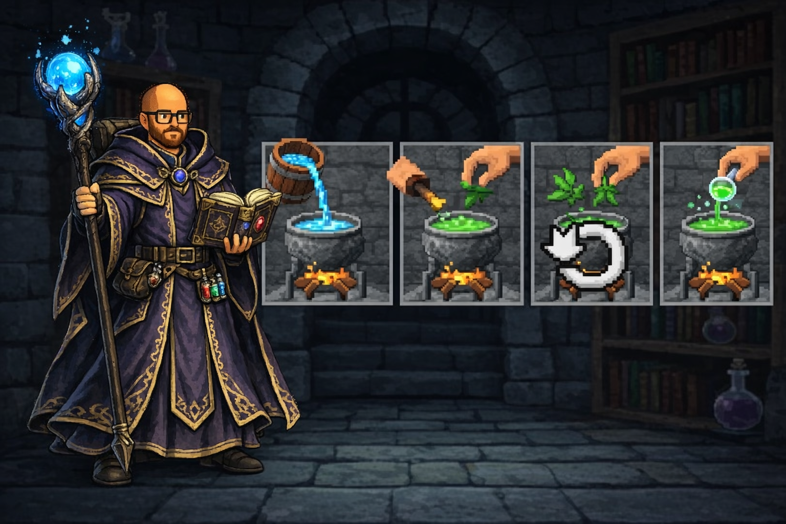
    

### Exemplo 2: Preparar um café

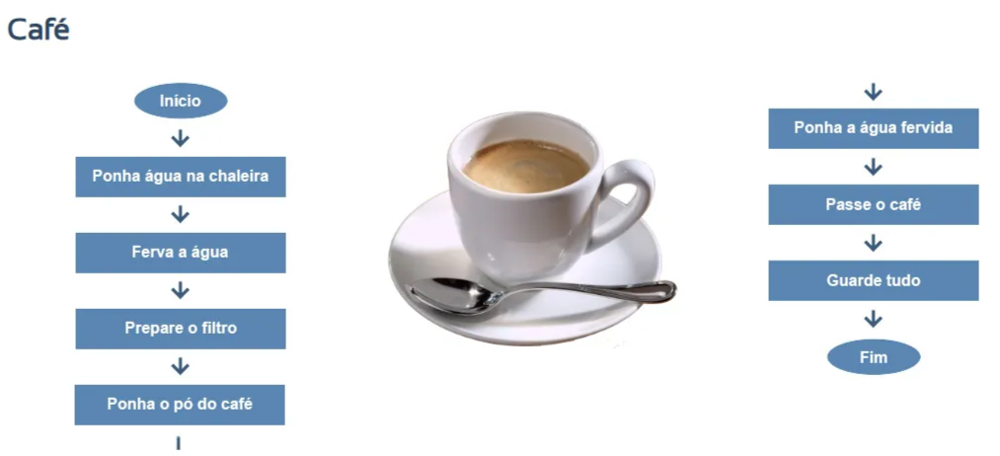

### Exemplo 3: Trocar uma Lampada

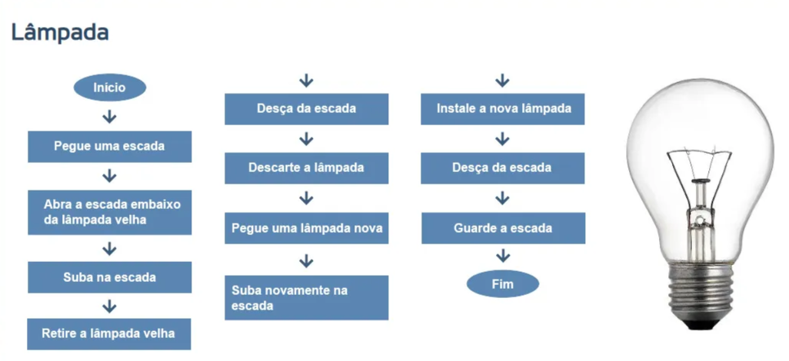

### Exemplo 4: Preparando um Bolo

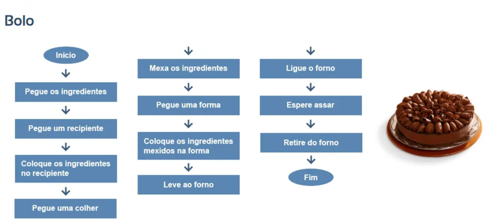

## A Anatomia de um Algoritmo

### Objetividade:

Cada instrução deve ser clara e sem ambiguidades. Em um RPG, “Atacar” é uma intrução vaga; “subtrair 10 de HP” é uma instrução objetiva.

### Finitude:

Todo algoritmo deve ter um fim. Ele resolve um problema especifico e encerra a execução, Um mapa de jogo que nunca termina de carregar é um algoritmo com falaha de Finitude (O famoso loop infinito).

### Complexidade Adaptável:

O Algoritmo é tão complexo quanto o desafio que ele resolve. Escovar os dentes é um algoritmo simples; calcular a fisica de uma explosão em um jogo de mundo aberto é um algoritmo complexo. Ambos, porém, seguem a mesma logica de “passo a passo”.

### Nota do Mestre:

Pense no algoritmo como o livro de regras do mestre de RPG. O livro diz exatamente o que acontece se o dado cair em 1 ou em 20. Sem as regas, o jogo vira bagunça; sem o algoritmo, o computador não sabe processar sequer um clique de mouse.

# Nivel 2: Representações de um Algoritmo

## Fluxograma (visão estratégica)

O Fluxograma é a representação visual. Ele usa formas geométricas para mostrar o Caminho que a informação percorre. É como o mapa de uma masmorra: você vê onde entra, onde decide para onde ir e onde sai.

### Os Símbolos no Mundo dos Jogos

Cada forma geométrica dita o "destino" do fluxo. Veja como eles se aplicam:

### 1. O Início e Fim (Círculo Alongado/Oval)

Representa o gatilho da ação. Nada acontece sem um início.

- **No RPG:** O momento em que o jogador diz: "Eu quero tentar abrir aquele baú trancado".

### 2. Ação ou Instrução (Retângulo)

É o processamento, em que algo acontece ou uma conta é feita.

- **No RPG:** "O jogador rola o dado de 20 faces (D20) e soma seu bônus de Destreza".

### 3. A Tomada de Decisão (Losango)

Aqui é onde o jogo testa uma condição. Sempre terá dois caminhos saindo dele: **Sim** ou **Não** (Verdadeiro ou Falso).

- **No RPG:** "O resultado total é maior que 15?". Se sim, o baú abre. Se não, a gazua quebra.

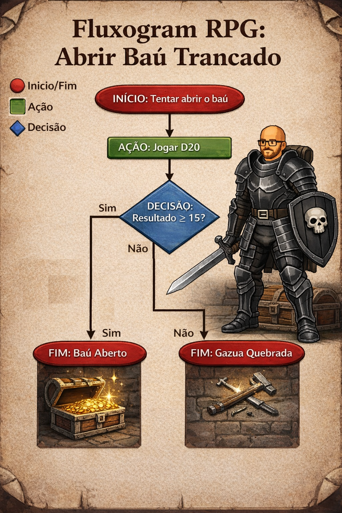

## Exemplo 2: Pesquisador

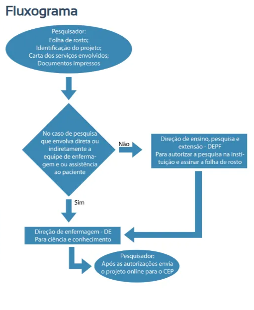

## Exemplo 3: Troca de lâmpada.

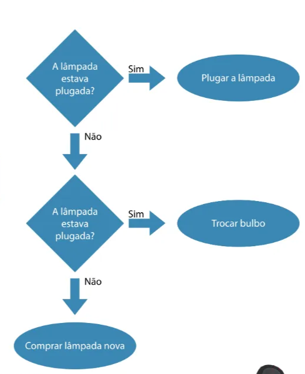

## Exemplo 4: Calculadora

```jsx
var
   n1, n2, resultado : real
   operacao : caracter
inicio
   escreva("Digite o primeiro número: ")
   leia(n1)
   escreva("Digite o segundo número: ")
   leia(n2)
   escreva("Escolha a operação (+, -, *, /): ")
   leia(operacao)
   
   escolha operacao
      caso "+"
         resultado := n1 + n2
         escreval("Resultado da adição: ", resultado)
      caso "-"
         resultado := n1 - n2
         escreval("Resultado da subtração: ", resultado)
      caso "*"
         resultado := n1 * n2
         escreval("Resultado da multiplicação: ", resultado)
      caso "/"
         se n2 <> 0 entao
            resultado := n1 / n2
            escreval("Resultado da divisão: ", resultado)
         senao
            escreval("Erro: Divisão por zero!")
         fimse
   fimescolha
   
   escreval("Fim da execução.")
fimalgoritmo
```

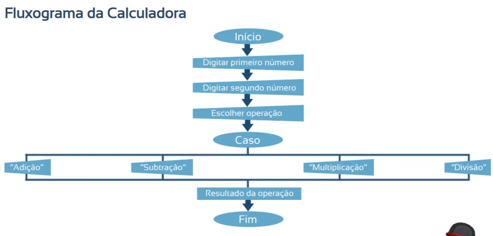

## Pseudocódigo (Roteiro da Aventura)

O pseudocódigo (também chamado de Portugol) é uma “linguagem de mentira”. Ele tambem parece português, mas segue a estrutura rígida de um programa. Como você bem disse, o computador não entende pseudocódigo, mas humanos entendem perfeitamente.

É como escrever as regras de um item mágico no verso de uma ficha de personagem antes de programar o jogo de verdade.

```jsx
ALGORITMO "Encontrar_Dragao"
VAR
   distancia_dragao : INTEIRO
   esta_vivo : LOGICO
INICIO
   distancia_dragao <- 50
   esta_vivo <- VERDADEIRO

   SE (distancia_dragao < 10) ENTAO
      ESCREVA ("O Dragão usou Sopro de Fogo! Você sofreu dano.")
   SENAO
      ESCREVA ("O Dragão está longe. Você pode usar o arco.")
   FIM_SE
FIM_ALGORITMO
```


## Exemplo 2: Salario Professor

```jsx
algoritmo "Salário"
// Função Calcula salário com deduções
// Seção de Declarações
var
nome_prof: Caractere
sal_h, horas, ded_ir, ded_inss, desc: Real
sal_bruto, sal_liq: Real
inicio
// Seção de Comandos
escreva ("Digite: ")
escreva ("Nome do Professor: ")
leia (nome_prof)
escreva ("Salário-Hora: ")
leia(sal_h)
escreva ("Horas/aula ministradas: ")
leia (horas)
sal_bruto <- sal_h * h
ded_ir <- sal_bruto * 0.15
ded_inss <- sal_bruto * 0.11
desc <- ded_ir + ded_inss
sal_liq <- sal_bruto - desc
escreval("Folha salarial do Professor ", nome_prof)
escreval("-Salário Bruto: R$", sal_bruto, "; Descontos: R$",desc)
escreval("-Salário Líquido: R$",sal_liq)
fimalgoritmo
```

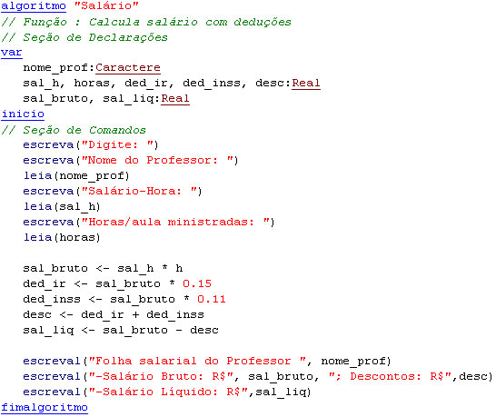

## Exemplo 3:  Divida Final

```jsx
algoritmo "CalculoDivida"
var
   E, S, D: real
inicio
   leia(E) // "Quantia gasta por Elisa"
   leia(S) // "Quantia gasta por Sofia"
   leia(D) // "Dívida Final"
   se (E > S) entao
      D := (1/2) * (E - S)
      escreval("Sofia deve a Elisa")
   senao
      D := (1/2) * (S - E)
      escreval("Elisa deve a Sofia")
   fimse
fim_algoritmo
```

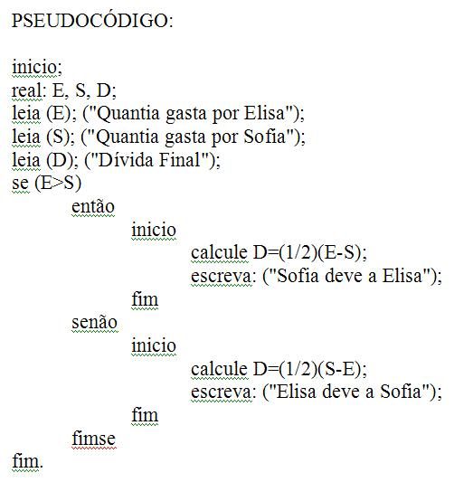

## Por que aprender pseudocódigo se não cria software real?

O foco é treinar seu raciocínio, se você souber montar o fluxograma e o pseudocódigo, você consegue programar em qualquer linguagem (Java, Python, C#).

- A lógica é saber jogar xadrez.
- A linguagem (Java, Python) é apenas se as peças são de madeira, plástico ou vidro.
- **Dica de Herói:**
    
     ****O erro mais comum de quem está começando é querer ir direto para o Python sem fazer o pseudocódigo. É como entrar em uma caverna sem tocha: você vai acabar batendo a cabeça na parede (ou pegando um erro de sintaxe difícil de achar).
    
    
    

# Nivel 3: VisuAlg

O **Visualg** é o seu “Campo de Treinamento” (ou o Tutorial Level). Ele é muito usado porque retira a complicação de decorar comandos em inglês e foca no que realmente importa: a sua capacidade de resolver problemas.

Vamos criar um cenário de um RPG de turno clássico. Imagine que o seu personagem (o guerreiro de armadura negra) está prestes a enfrentar um desafio, e o **Visualg** atua como o "Mestre do Jogo" que processa as regras que você definiu.

### Exemplo Comparativo: Como o Visualg "Joga"

Para ficar claro, veja como a sua lógica se transforma em execução dentro do sistema, usando o seu personagem como exemplo:

**1. Você define as Regras (O Código):**
Você escreve no Visualg que, para o seu guerreiro vencer, a **Força** dele somada ao valor de um **Dado** deve ser maior que a **Defesa** do inimigo.

```java
var
   forca_guerreiro, dado, defesa_inimigo : inteiro
inicio
   forca_guerreiro <- 18
   dado <- aleatorio(1, 20)
   defesa_inimigo <- 25

   // O Visualg avalia a condição que você criou:
   SE (forca_guerreiro + dado >= defesa_inimigo) ENTAO
      ESCREVA ("Sucesso! O Guerreiro atingiu o golpe.")
   SENAO
      ESCREVA ("Falha! A armadura do inimigo é muito resistente.")
   FIMSE
fimalgoritmo
```

**2. O Visualg resolve a "Jogada":**

- **Verifica Atributos:** Ele olha para a `forca_guerreiro` (18).
- **Avalia Condições:** Ele soma o valor sorteado e compara com a `defesa_inimigo`.
- **Determina o Resultado:** Ele exibe na tela se você acertou ou errou, sem que você precise fazer a conta de cabeça toda vez.

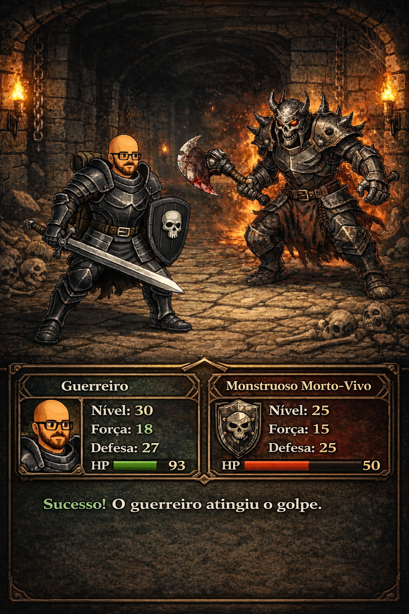

# Instalar o Visualg

Como o Visualg é um software clássico, existem algumas versões. A mais estável é a 3.0.7 (atualmente na criação desse conteúdo).

1. **Acesse o site oficial ou repositório:**  O site oficial histórico é:
    1. [sourceforge.net/projects/visualg30](https://sourceforge.net/projects/visualg30/).
2. Faça o download:
    1. Clique no botão de Download. Voce baixará um arquivo compactado (geralmente em formato .zip).
3. Extraia os arquivos:
    1. O Visualg não tem um “instalador” (daqueles de clicar em Avançar > Avançar > Concluir).
    2. Crie uma pasta chamada C:\Visualg no seu computador.
    3. Mova o arquivo .zip para lá e extraia tudo (botão direito > Extrair Aqui).
4. Execute o Programa:
    1. Dentro da pasta, procure por um ícone de um “V” azul chamado “visualg30.exe”.
    
    ### Dica do herói:
    
     Clique com o botão direito nele e escolha “Enviar para > Área de trabalho (Criar atalho)”. Assim, seu “Grimório de Programação” estará sempre à mão.
    

### Por que usar o **VisuAlg**?

1. Interpretador em Tempo Real: Ele lê linha por linha. Se você cometer um erro de logica (como tentar gastar ouro que não tem), você verá o erro na hora.
2. Visualização de Variáveis: O Visualg tem uma tabela lateral que mostra o valor de cada variável mudando. É como ver sua barra de vida (HP) subindo e descendo conforme você toma dano ou se cura.
3. Linguagem Próxima: usar **escreval** (escreve linha) e **leia** é muito mais intuitivo para quem está começando do que **System.out.print** (Java) ou **printf** (C).

### Dica do herói:

O **Visualg** é rigoroso com a **Sintaxe** (**as regras de escrita**). Se você esquecer um fimse ou uma **aspas**, o algoritmo não “**invoca o feitiço**”.
Ex.: Você quer lançar um feitiço de fogo, mas não tem runas ou cajado do fogo, só tem runas do ar, o feitiço de fogo não poderá ser lançado.

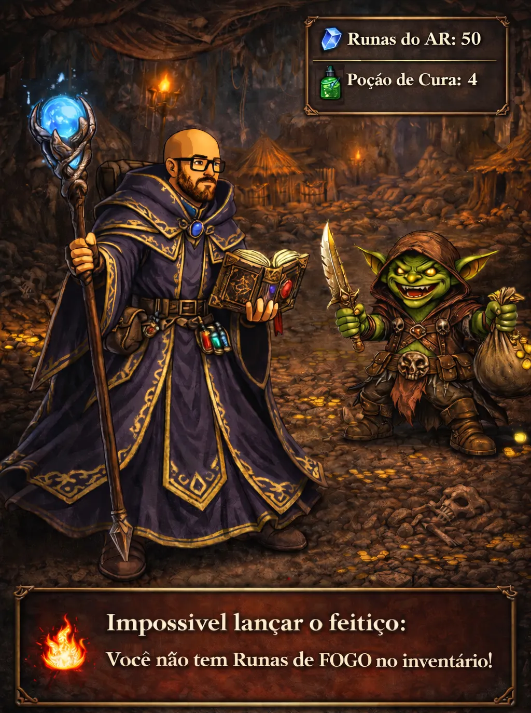

## Anatomia do VisuAlg (o “Grimorio”)

Quando você abre o **VisuAlg**, ele já vem com uma estrutura básica. Vamos traduzi-la:

- **Algoritmo: “nome”:** É o título da sua Quest. Deve ser feito em **aspas duplas** (”nome”)
- **var:** Aqui é sua mochila (inventário). É onde você declara o que vai usar (Ex.: ouro: inteiro, nome_heroi: literal/caractere ).
- **Início:** É onde o mestre diz “**A aventura começa**”. Tudo o que estiver aqui será executado em ordem. Nesse bloco ficarão os comandos e a lógica que utilizaremos para criar nosso algoritmo.
- **Fimalgoritmo:** O fim da sessão do algoritmo.

### ⚔️ Seu Primeiro Teste (Hello World RPG)

Assim que abrir o **VisuAlg**, apague tudo e cole este código para testar se a "**instalação**" foi um sucesso:

```java
algoritmo "Teste_de_Entrada"
var
   nome_aventureiro: caractere
   senha: caractere
inicio
   escreval("BEM-VINDO À GUILDA DE PROGRAMAÇÃO!")
   escreval("Digite o nome do seu Herói: ")
   leia(nome_aventureiro)
   escreval("senha: ******")
   leia(senha)
   
   escreval("Saudações, ", nome_aventureiro, "! Sua jornada começou.")
fimalgoritmo
```

**Para rodar:** Aperte a tecla **F9** dentro do programa. Se aparecer uma tela preta (o console) perguntando o nome do seu herói, você está pronto para a próxima fase!


### Exemplo prático: sistema de compra de equipamento.

Vamos imaginar que você quer programar um **NPC** vendedor. O código no **VisuAlg** ficaria assim:

```java
algoritmo "Lojinha_do_Vila"
var
   moedas_ouro : inteiro
   preco_espada : inteiro
inicio
   moedas_ouro <- 50  // O jogador começa com 50 moedas
   preco_espada <- 30
   
   escreval("Você chega na loja. A espada custa 30 moedas.")
   
   se (moedas_ouro >= preco_espada) entao
      escreval("Você compra a espada! Boa sorte na jornada.")
      moedas_ouro <- moedas_ouro - preco_espada
   senao
      escreval("Você não tem moedas suficientes para comprar a espada.")
   fimse
   
   escreval("Moedas restantes: ", moedas_ouro)
fimalgoritmo
```

**Se você tiver moedas o suficiente:**


**Se você não tiver moedas o suficiente:**


## Interações do algoritmo

- Escreva (fala contínua): Exibe o texto, mas mantém o “**cursor**” (o lugar onde se digita) logo à frente, na mesma linha. É ótimo para quando você quer que o jogador responda logo após a pergunta.
    - No **RPG**: É como quando o mestre faz uma pergunta direta e espera a resposta imediata. (Ex.: Quantas missões você completou hoje? [**Digite aqui**]).
        
        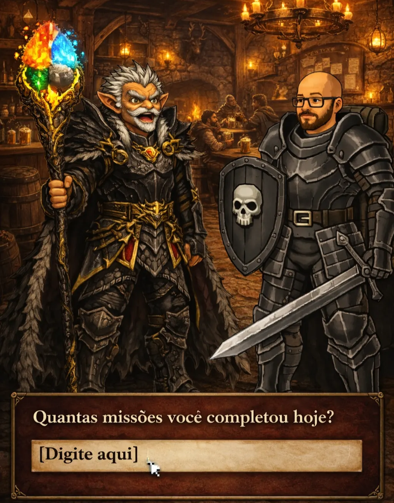
        
- Escreval (fala com pausa): O “L” no final vem de Linha. Ele escreve a informação e “pula” para a linha de baixo. Essencial para organizar diálogos ou lista de itens para o jogador nao ver uma “**maçaroca**” de texto colado.
    - No RPG: É usado para descrever o cenário ou narrar uma ação épica. (Ex.: “O dragão ruge ferozmente”).
        
        
        
- Leia (Escuta do mestre): É o comando em que o programa para e espera o jogador agir. Ele pega o que foi digitado e guarda em uma variavel (um espaço na memoria/mochila).
    - No **RPG**: É o momento em que o mestre pergunta: “Qual missão você vai escolher?” E aguarda sua decisão.
        
        
        
    - Atenção: Você só pode “**ler**” algo para uma **variável** que já foi criada lá em cima, no bloco var.

### Exemplo prático: Diálogo do guardião da ponte.

```java
algoritmo "Dialogo_Guardiao"
var
   resposta: caractere
   nivel_heroi: inteiro
inicio
   // 1. Você define o valor aqui
   nivel_heroi <- 10

   escreval("--- MASMORA DO DESTINO ---")
   escreval("Um velho guardião bloqueia seu caminho.")
   escreval("Guardião diz: Somente os sábios passam. Qual o seu nível?")
   
   // 2. Aqui você apenas mostra o valor, sem pedir entrada do usuário
   escreval("Meu nível atual: ", nivel_heroi)
   
   escreval("O guardião analisa seu nível ", nivel_heroi, "...")
   
   se (nivel_heroi >= 10) entao
      escreval("Guardião: Você é digno. Pode passar!")
   senao
      escreval("Guardião: Volte quando for mais forte, aventureiro.")
   fimse
fimalgoritmo
```


### Dica do heroi:

- Se você usar apenas **`escreva`**, a tela fica assim: **`Nome:AragornNivel:10`** (tudo grudado).
- Se usar **`escreval`**, fica assim: **`Nome: AragornNivel: 10`**

## Tela do VisuAlg

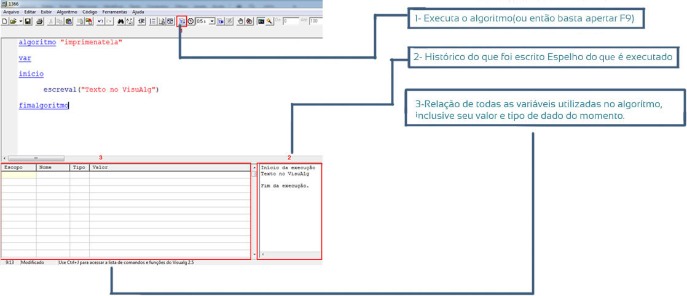

## Exemplo 2: Maior de idade.

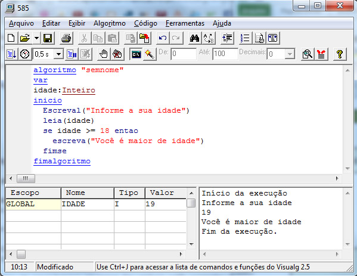

## Exercícios do módulo:

### **1. Quais são os dois tipos de representações mais utilizados em algoritmos ?**

- [ ]  Organograma e código
- [ ]  Fluxograma e programação
- [ ]  Fluxograma e pseudocódigo
- [ ]  Nenhuma das alternativas

### **2. O fluxograma é representado por: (Este exercício possui mais de uma alternativa correta. Marque todas elas para acertar.)**

- [ ]  Figuras geométricas.
- [ ]  Símbolos
- [ ]  Programação
- [ ]  Linguagem computacional.

### **3. Qual programa utilizaremos para escrever nossos pseudocódigos ?**

- [ ]  VisuAlg
- [ ]  Pascal
- [ ]  Eclipse.
- [ ]  Bloco de notas.

# Nivel 4: Tipos de dados

No **VisuAlg** e na maioria das linguagens, dividimos os dados em quatro categorias principais:

## Inteiro (contagens)

São numeros **sem casas decimais**. Usados para tudo que voce conta de 1 em 1.

- No RPG: Nível, Pontos de vida (HP), Quantidade de flechas, força, destreza.
    - Ex.: vida: inteiro (vida = 100).
        
        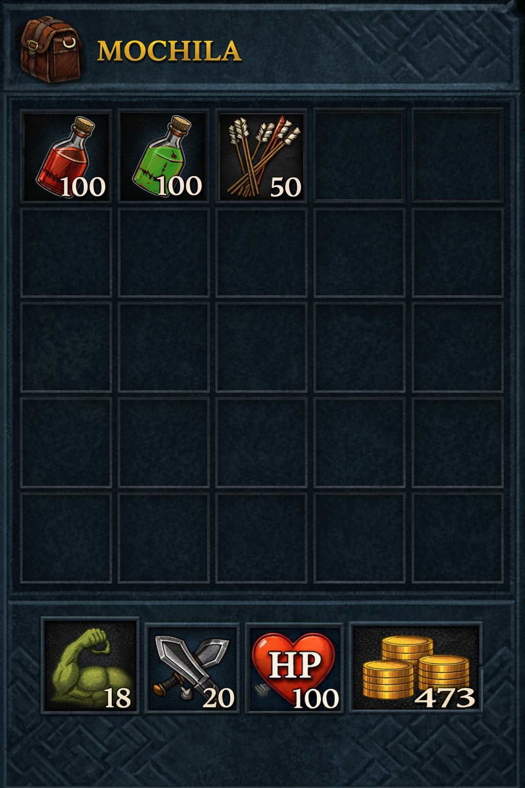
        

> Imagem elaborada com auxílio de Inteligência Artificial (ChatGPT).
> 


## Real (Medidas)

São numeros que podem ter **virgula (casas decimais)**. Usados para precisão.

- No **Rpg**: Peso da armadura (kg), distancia em metros ate o inimigo, multiplicador de dano critico.
    - Ex.: peso_espada : real (peso = 2.4).
        
        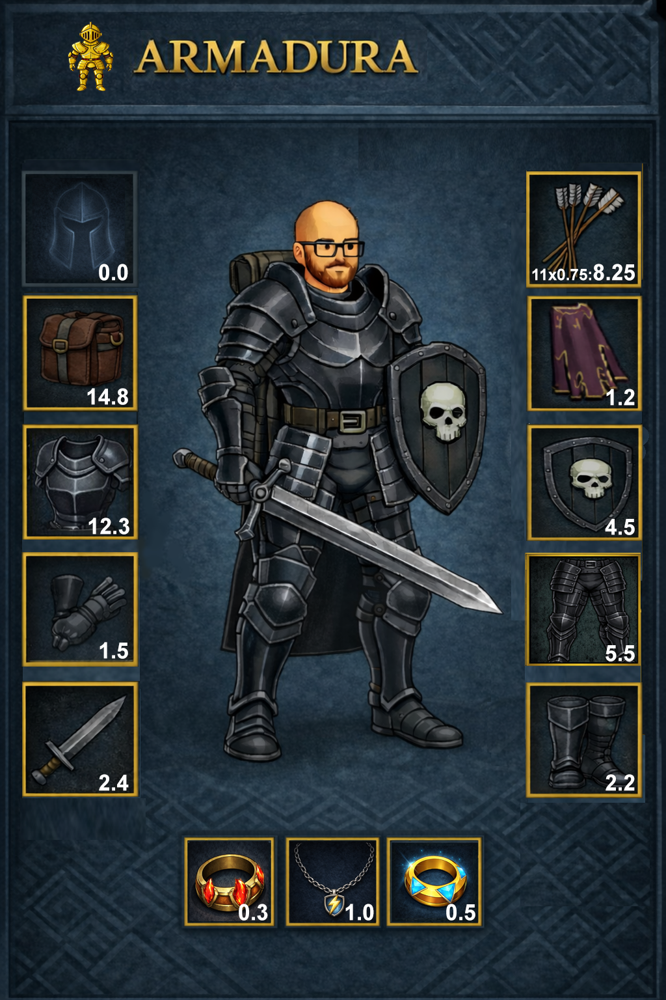
        
        > Imagem elaborada com auxílio de Inteligência Artificial (ChatGPT).
        > 
    
    
    

## Caractere (Textos)

Qualquer sequencia de letras, numeros ou simbolos (sempre entre **aspas**).

- No **RPG**: Nome do heroi, Classe (Guerreiro, Mago, Arqueiro), Nome da vila, Descrição da Missão.
    - Ex.:  missao : caractere (missao <- “O Exterminador de Dragões”).
        
        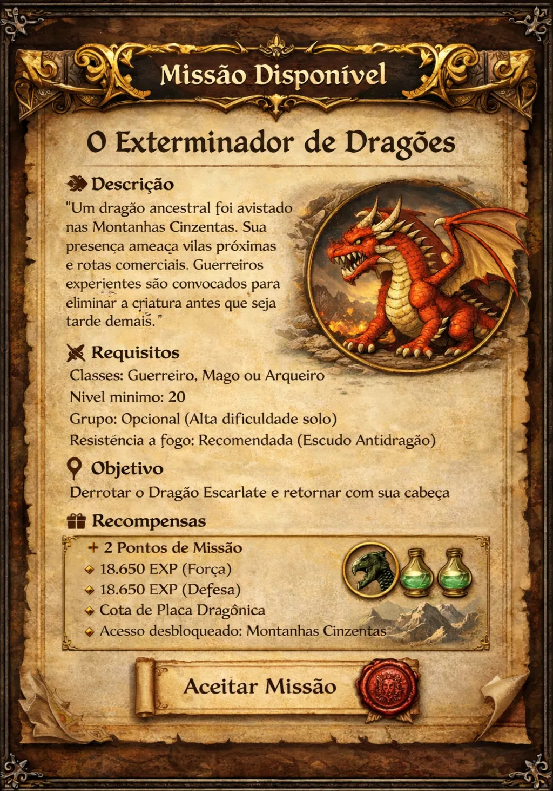
        
        > Imagem elaborada com auxílio de Inteligência Artificial (ChatGPT).
        > 
    
    
    

## Logico (Booleano)

Só pode assumir dois valores: **Verdadeiro** ou **Falso**. É a base da tomada de decisão.

- No **RPG**: O personagem esta envenenado? A porta esta trancada? O Dragao esta vivo?
    
    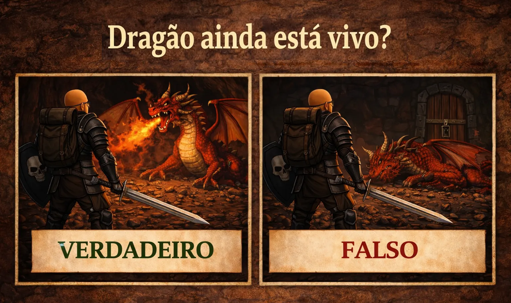
    
    > Imagem elaborada com auxílio de Inteligência Artificial (ChatGPT).
    > 
    - Ex.: esta_vivo: logico (verdadeiro).

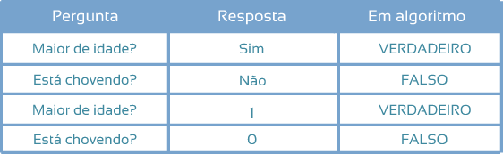

### Por que isso é importante?

O computador é como um organizador de estoque muito rigido. Se voce tentar guardar um Caractere (”Ouro”) dentro de uma variavel Inteiro, o programa vai “dar erro de sistema”, porque ele reservou um espaço para numeros e voce tentou colocar letras.

### Exemplo no código (bloco var)

```java
algoritmo "Ficha_de_RPG"
var
   nome_heroi: caractere  // O nome do jogador "Aragorn"
   nivel: inteiro         // Nível não tem vírgula (99)
   peso_armadura: real    // Peso Armadura pode ser (54,45) KG's 
   tem_magia: logico      // Sim ou Não (Verdadeiro/Falso)
inicio
   // Aqui o jogo começa...
fimalgoritmo
```

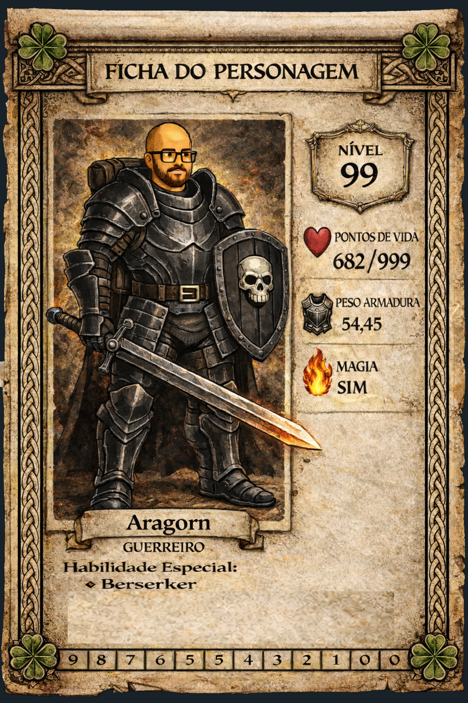

> Imagem elaborada com auxílio de Inteligência Artificial (ChatGPT).
> 

### Curiosidade: O “Tipo” define oque voce pode fazer

- Voce pode somar dois Inteiros (vida + poção).
- Voce nao pode somar dois Caracteres da mesma forma (Nome + Nome nao resulta em um “nome maior”, mas sim em uma junçao de textos).
- Voce não pode multiplicar um Logico (Verdadeiro x2 nao faz sentido).

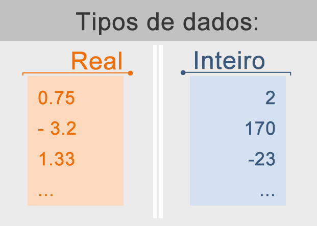

## Exercícios do módulo.

### **1. Selecione abaixo qual o tipo de dado correspondente para "Data de nascimento":**

- [ ]  Inteiro.
- [ ]  Real.
- [ ]  Literal
- [ ]  Lógico.

### **2. Selecione abaixo qual o tipo de dado correspondente para "Nome de uma pessoa":**

- [ ]  Inteiro
- [ ]  Real
- [ ]  Literal
- [ ]  Lógico

### **3. Selecione abaixo qual o tipo de dado correspondente para a pergunta "Será que está chovendo?":**

- [ ]  Inteiro
- [ ]  Real
- [ ]  Literal
- [ ]  Lógico

### **4. Selecione abaixo qual o tipo de dado correspondente para "Idade de uma pessoa":**

- [ ]  Inteiro
- [ ]  Real
- [ ]  Literal
- [ ]  Lógico

### **5. Selecione abaixo qual o tipo de dado correspondente para "Peso de uma pessoa":**

- [ ]  Inteiro
- [ ]  Real
- [ ]  Literal
- [ ]  Lógico

# Nivel 5: Variáveis

Se os tipos de dados sao as “**classes**” de informação, a **Variavel** é o compartimento físico onde essa informação fica guardada enquanto o jogo esta rodando.
Obs: Uma variavel so pode ter “Um” valor dentro dela.


Imagine a Ficha de personagem. Ela tem espaços fixos (Nome, Nivel, Peso), mas oque esta escrito a lápis nesses espaços muda o tempo todo durante a aventura.


## Anatomia de uma Variavel

Para o computador, uma variavel tem tres caracteristicas principais:

1. **Nome (identificador)**: É o rotulo da “caixa” (Ex.: Vida_atual).
2. **Tipo**: Define o que cabe na caixa (Ex.: inteiro).
3. **Valor**: É o conteudo que esta la dentro agora (Ex.: 100).

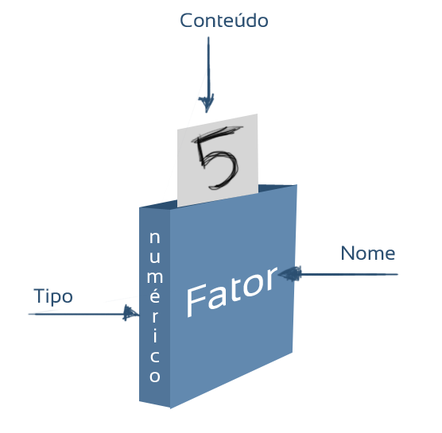

### Analogia de **RPG**: O “Slot” de equipamento

Pense na mao direita do seu guerreiro como uma variavel chamada Item_mao_direita:

- No nivel 1, o valor é “adaga de madeira”.
- No nivel 5, voce troca para “espada de ferro”.
- A “caixa” (a mao do personagem) continua sendo a mesma, mas o conteudo “Variou”.

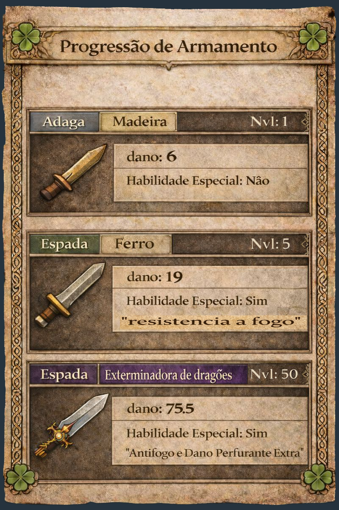

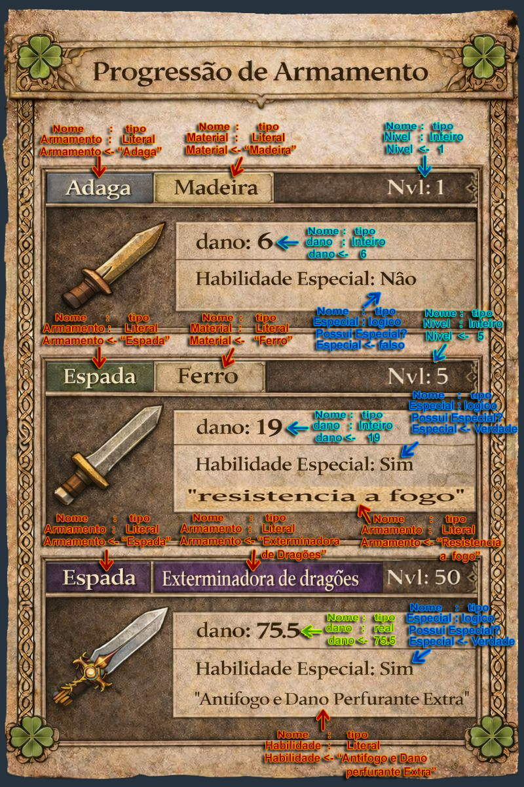

## Regras para criar Variaveis:

Você nao pode dar qualquer nome para as **variaveis**. Existem regas de “etiqueta” para o computador nao se confundir:

- Sem espaços em brancos: Use “vida_heroi” ou “vidaHeroi”, nunca “vida heroi”.
- Nomes de variáveis: devem possuir como primeiro caractere uma letra ou sublinhado '_' (os outros caracteres podem ser letras, números e sublinhado). Nao comece com numeros: “1nivel” é proibido; use “nivel1”.
- Sem caracteres especiais: Nada de “@”, “#”, “$” ou acentos (use “forca” em vez de “força”).
- Nomes sugestivos: Chame de “mana” em vez de “x”. No meio de um codigo grande, voce nao vai saber o que o “x” faz, mas sabera o que a “mana” faz.
- Nomes de variáveis: não podem ser iguais a palavras reservadas.
- Nomes de variáveis: devem ter no máximo 127 caracteres;

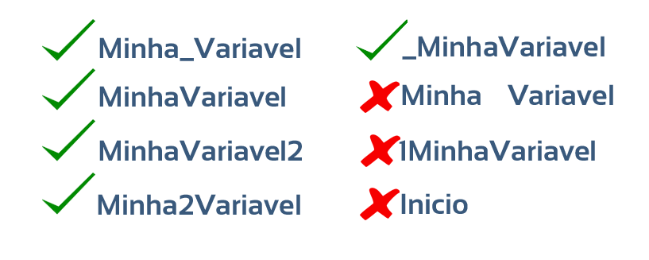

```java
algoritmo "Combate_Simples"
var
   hp_monstro: inteiro
inicio
   hp_monstro <- 50  // Valor inicial
   escreval("Um monstro apareceu com ", hp_monstro, " de HP!")
   
   escreval("Você lançou uma Bola de Fogo!")
   hp_monstro <- hp_monstro - 30  // O valor variou para 20
   
   escreval("O HP do monstro agora é: ", hp_monstro)
fimalgoritmo
```

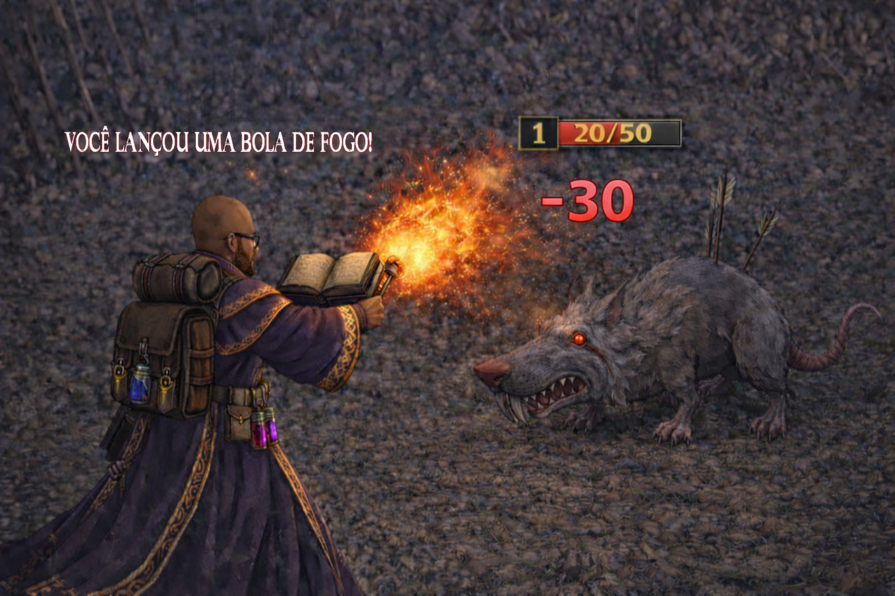

## Exercicios desse modulo:

### **1. Qual a finalidade de uma variável em nosso programa ?**

- [ ]  Guardar dados
- [ ]  Exibir valores
- [ ]  Definir a lógica do algoritmo
- [ ]  Não tem finalidade alguma

### **2. Informe se a afirmação é verdadeira ou falsa: Uma variável pode ter mais de um valor.**

- [ ]  Verdadeiro
- [ ]  Falso

### **3. Qual comando do VisuAlg utilizaremos para colocar um valor digitado para dentro de uma variável ?**

- [ ]  Escreva
- [ ]  Leia
- [ ]  Var
- [ ]  Inicio

### **4. Informe quais alternativas é de fato o nome de uma variável aceita no VisuAlg: (Questão Múltipla Escolha)**

- [ ]  1numero
- [ ]  tipo_operacao
- [ ]  meuResultado
- [ ]  nota1

### **5. No VisuAlg qual a primeira ação que devemos tomar para que a variável funcione em nosso programa ?**

- [ ]  Definir um nome
- [ ]  Declarar no bloco de variáveis.
- [ ]  Colocar valores
- [ ]  Definir o tipo de dado

# Nivel 6: **Expressões**

## Expressões Aritméticas

Você Chegou ao “motor” de qualquer sistema. se os algoritmos ão o roteiro e as variaveis são o inventario, as **Expressões aritmeticas** são os **dados de jogo**.  Elas calculam se voce sobreviveu a um golpe, quanto de ouro ganhou ou se subiu de nivel. Voce vera que o computador nao é inteligente, ele é apenas um **calculador extremamente rapido.**

### Operadores no campo de batalha (RPG)

vamos traduzir os simbolos matematicos para ações de jogo:

- Soma (+): Usado para curar o ganho de XP. (vida ← vida + pocao)
- Subtração (-): Usado para dano recebido (hp ← hp - dano)
- Multiplicação (*): Usado para bonus criticos ou dobrar moedas. (dano_final ← dano_base ** 2)
- Divisão (/): Usado para dividir o tesouro entro o grupo. (ouro_cada ← total_bau / 4)

### Ordem de Precedência (A Regra de Ouro)

Os **parenteses** “( )” mudam tudo. Na logica de programação, o computador segue uma ordem rigita:

1. Primeiro oque esta dentro dos **Parenteses.**
2. Depois **Multiplicação** e **Divisão**.
3. Por fim, **Soma** e **Subtração**.

**Exemplo de Erro (**RPG**): imagine que voce quer calcular a media de ataque de duas armas: uma espada (dano 10) e um machado (dano 20).

- **Sem Parenteses**: media ← 10 + 20 / 2
    - O computador faz **20 / 2 = 10** e depois **10 + 10 = 20**. **Errado!**
- **Com Parenteses**: media ← (10 + 20) / 2
    - O computador faz **30 / 2 = 15**. **Correto!**

### Exemplo Pratico: Calculadora de dano critico

Imagine que um guerreiro atacou um orc e queremos saber a media de dano de 3 golpes:

```java
algoritmo "Media_de_Dano"
var
   golpe1, golpe2, golpe3, media_dano : Real
inicio
   // Atribuindo os danos de cada turno
   golpe1 <- 15.5
   golpe2 <- 22.0
   golpe3 <- 18.2
   
   // A Expressão Aritmética
   media_dano <- (golpe1 + golpe2 + golpe3) / 3
   
   escreval("--- RELATÓRIO DE BATALHA ---")
   escreval("O dano médio do Guerreiro foi de:", media_dano)
   
   se (media_dano > 20) entao
      escreval("Resultado: O Guerreiro é muito poderoso!")
   senao
      escreval("Resultado: Precisa treinar mais na guilda.")
   fimse
fimalgoritmo
```

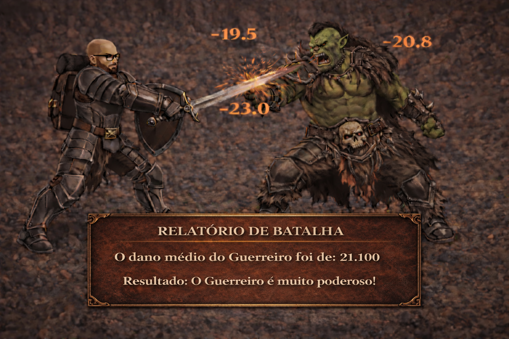

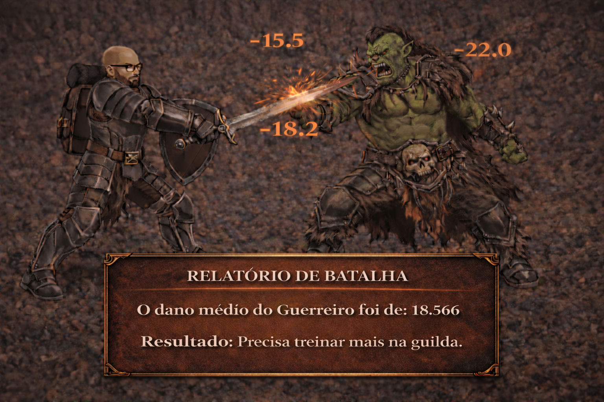

| **Operação** | **Símbolo** | **Exemplo de Uso no Jogo** |
| --- | --- | --- |
| **Soma** | `+` | Pegar moedas no chão: `total <- total + 50` |
| **Subtração** | `-` | Gastar flechas: `flechas <- flechas - 1` |
| **Multiplicação** | `*` | Buff de força: `forca <- base * 1.5` |
| **Divisão** | `/` | Partilha de loot: `cada_um <- total / 3` |

### Dica do heroi:

Sempre use o tipo **Real** para medias e divisões. Se voce usar **inteiro** e o resultado for **7.5**, o **VisuAlg** vai arredondar ou dar erro, e voce perdera a precisão ( o que em um jogo pode ser a diferença entre o monstro morrer ou ficar com 1 de vida!)

## Exercícios do módulo

### **1. Qual o tipo de dado resultante de uma expressão aritmética?**

- [ ]  Lógicos
- [ ]  Somente inteiros
- [ ]  Somente reais
- [ ]  Inteiros e reais

### **2. Resolva a seguinte expressão: 2*(3+10/5*5)-1 e diga qual seu resultado.**

- [ ]  12
- [ ]  15
- [ ]  25
- [ ]  20

### **3. Informe qual resultado da expressão aritmética será exibido no algoritmo a seguir:
var
n1,n2,n3,media: Real
inicio
n1 <- 10
n2 <- 8
n3 <- 7.5
media <- (n1+n2+n3)/3
Escreva(media)
fimalgoritmo**

- [ ]  8.5
- [ ]  7
- [ ]  8
- [ ]  7.5

### **4. Informe qual resultado da expressão aritmética será exibido no algoritmo a seguir:
var
x,y,resultado: Real
inicio
x <- 10
y <- 8
resultado <- (x+y)*(10-y)+x
Escreva(resultado)
fimalgoritmo**

- [ ]  46
- [ ]  10
- [ ]  25
- [ ]  67

### **5. Informe qual resultado da expressão aritmética será exibido no algoritmo a seguir:
var
x,y,resultado: Real
inicio
x <- 2
y <- 5
resultado <- x/y*3+(1-8)*x+30
escreva(resultado)
fimalgoritmo**

- [ ]  8.2
- [ ]  14.2
- [ ]  16.2
- [ ]  17.2

## Expressões Literais

Enquanto as e**xpressões aritméticas** cuidam da “**matematica”** do jogo, as e**xpressões literais** (ou de texto) cuidam da **Narrativa**.

Na programação, o ato de juntar textos é chamado de **Concatenação.** No **RPG,** usamos isso o tempo todo para criar nomes de itens mágicos, diálogos dinâmicos e títulos para o heroi.

### A “forja” de nomes (Concatenação)

O **Visualg** permite concatenar de duas formas principais, e cada uma tem um “truque” importante:

1. Usando o simbolo **+ (união):** Quando  voce usa o **+** entre duas variaveis do tipo caractere (ou literal), voce esta “soldando” as palavras.
    
    **Atenção**: Se voce nao coloca um espaço manual “  “, as palavras ficam grudadas.
    
    **Exemplo RPG**: 
    primeiro_nome ← “Grog” 
    sobrenome ← “O esmadador”
    nome_completo ← primeiro_nome + “ “ + sobrenome
    **Resultado**: **Grog O esmadador**
    
2. Usando a virgula , **(Exibição)**: A virgula é usada principalmente dentro do comando **escreva** ou **escreval**. Ela serve para listar varias coisas diferentes na mesma linha na hora de mostra ao jogador.
**Exemplo RPG: Gerador de itens Mágicos**:
Imagine que seu algoritmo sorteia um **Adjetivo** e um tipo de **Arma** para criar um item **único. No Visualg** ficaria assim:
    
    ```java
    algoritmo "Forja_Magica"
    var
       arma, encantamento, item_final: caractere
    inicio
       arma <- "Espada"
       encantamento <- "de Fogo"
       
       // Criando a expressão literal
       item_final <- arma + " " + encantamento
       
       escreval("--- VOCÊ ABRIU O BAÚ ---")
       escreval("Você encontrou um: ", item_final, "!")
       escreval("O ", item_final, " brilha intensamente na sua mão.")
    fimalgoritmo
    ```
    
    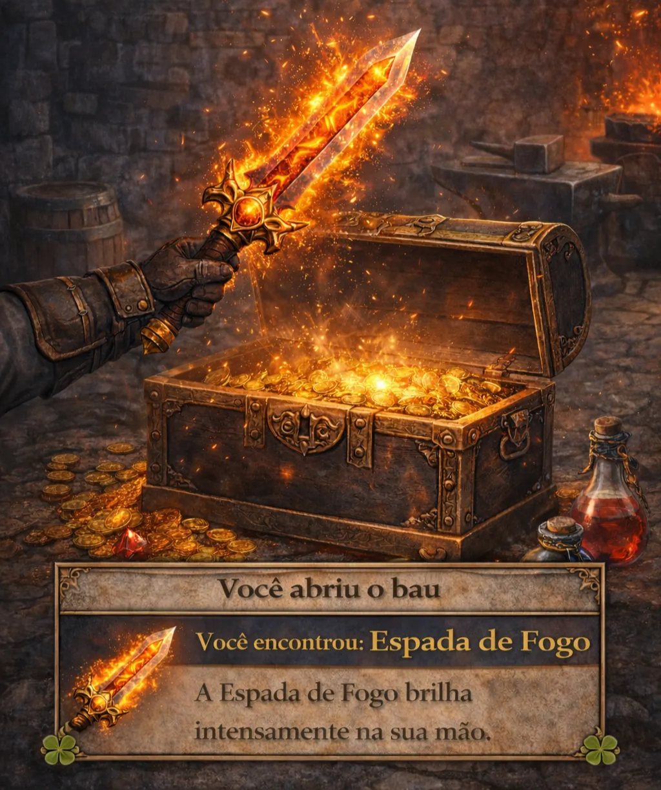
    
    ### Por que usar Expressões Literais?
    
    No desenvolvimento de sistemas, voce usara isso para:
    
    1. **Personalizar mensagens:** “Olá, [Nome do Usuario], seja bem-vindo”.
    2. **Gerar endereços:** Rua + Número + Bairro.
    3. **Logs de sistema:** Data + “ - ” + Erro Detectado.
    
    ### Regra de ouro**:**
    
    - **Soma de Números:** 10 + 10 resulta em **20** (Matematica)
    - **Soma Literais: “10” + “10” resulta em “1010” (Concatenação).**
    
    ### Dica do heroi:
    
    Sempre que quiser um espaço entre as palavras, lembre-se de somar uma string vazia com espaço: **+ “ “ +** .Sem Isso, seu heroi “**Aragorn**” “**Passoslargos**” viraria “**AragornPassoslargos**”.
    
    ### Desafio da Taverna:
    
    Se você tivesse uma variável `titulo <- "O Terrível"` e o jogador digitasse o nome `heroi <- "Loki"`, como você escreveria a expressão literal para o nome aparecer como **"Loki, O Terrível"**?
    
    ### Exercicios do modulo
    
    ### **1. Verifique se a afirmação é verdadeira ou falsa. Uma expressão literal sempre resultará em um tipo literal.**
    
    - [ ]  Verdadeiro
    - [ ]  Falso
    
    ### **2. Considerando a expressão literal a seguir, informe seu resultado (considerando o tipo).
    escreva("Meu"+" "+"Nome"+" "+"Completo")**
    
    - [ ]  "Meu Nome Completo"
    - [ ]  "MeuNomeCompleto"
    - [ ]  Meu Nome Completo
    - [ ]  MeuNomeCompleto

## Expressões Lógicas

Prepare o seu **Escudo Lógico** e sua **Espada da Verdade**, porque agora entramos nas regras que definem o destino de qualquer heroi em um RPG! As **Expressões Lógicas** são o coração da tomada de decisão: o famoso “**SE… ENTÃO”**

### Operadores Relacionais (O Teste de Atributos)

Esses operadores comparam dois valores. Em um RPG, o computador usa isso para verificar se você tem o que é preciso para realizar uma ação.

| **> (maior)** | Voce é forte o suficiente? | forca > 15 |
| --- | --- | --- |
| **>= (maior igual)** | Voce tem a quantidade correta ou mais de ervas verdes? | ervas_verdes >= 3 |
| **< (menor)** | O monstro esta com pouca vida? | vida_monstro  < 10 |
| **<= (menor igual)** | Seu hp é menor ou igual ao valor de cura da poção? | vida_heroi <= 20 |
| **= (igual)** | Voce tem a chave certa? | chave_id = 302 |
| **<> (Diferente)** | O jogador é de uma classe que nao seja Mago? | Classe <> “Mago” |

### Operadores de Sentença ( Conectivos Lógicos)

Às vezes, uma condição so nao basta. Precisamos combinar requisitos, e é aqui que entram o **E** e o **OU**

- **Operador E (A “porta com Duas Chaves”):** Para o Resultado ser **Verdadeiro, Tudo** tem que ser verdade. Se um único detalhe for **falso**, tudo falha.
    - **Exemplo no RPG**: para abrir o **Portal das sombras**, você precisa der **Nivel > 20** **E** possuir o **Amuleto da Noite.** Se voce tiver o nivel mais não o amuleto, voce nao entra.
        
        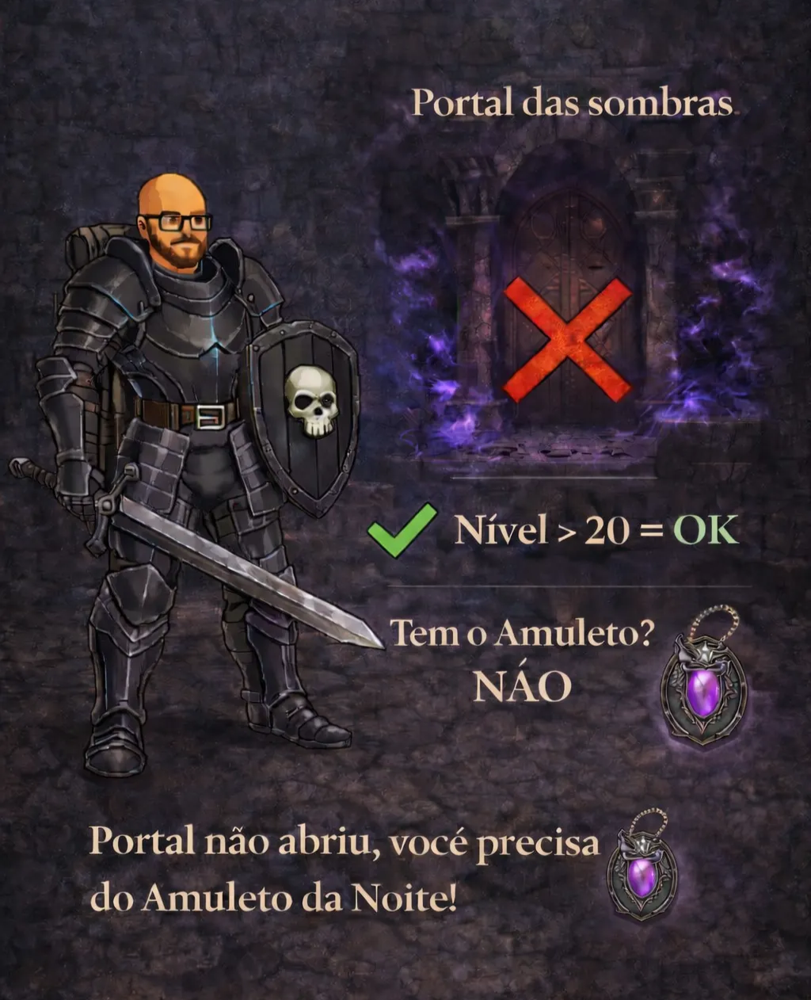
        
        
        
        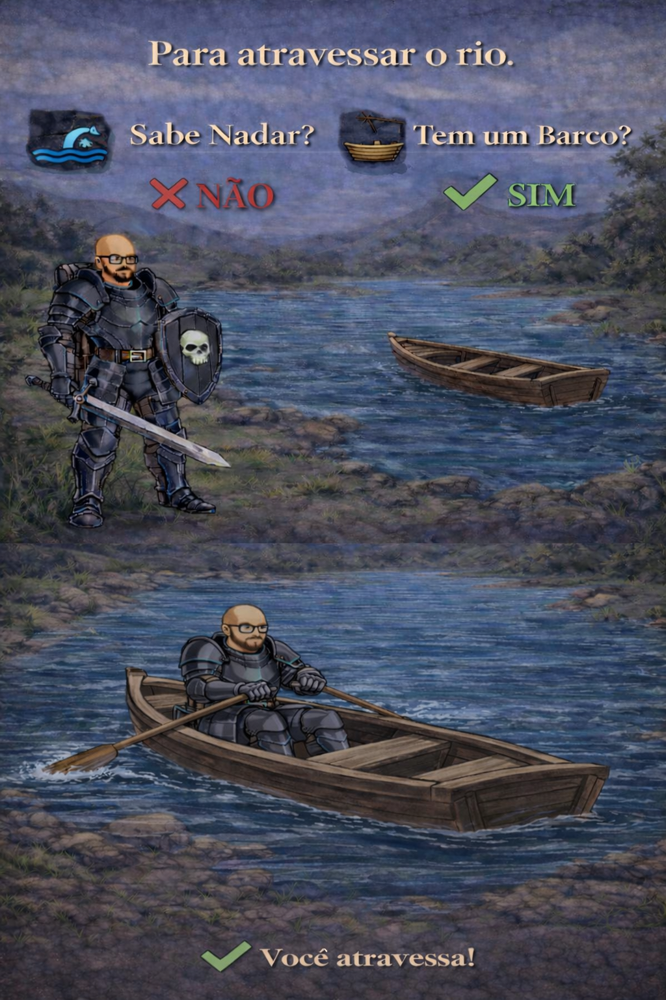
        
        
        

- **Operador OU (As “varias Rotas”)**: O resultado é ver **Verdadeiro** se **PELO MENOS UM** for verdade. ele é mais flexivel.
    - **Exemplo no RPG:** Para atravessar o rio, você pode **Saber Nadar** ou **Ter um Barco**. Se voce tiver qualquer um dos dois (ou os dois), você atravessa. Só falha se não tiver nenhum.
        
        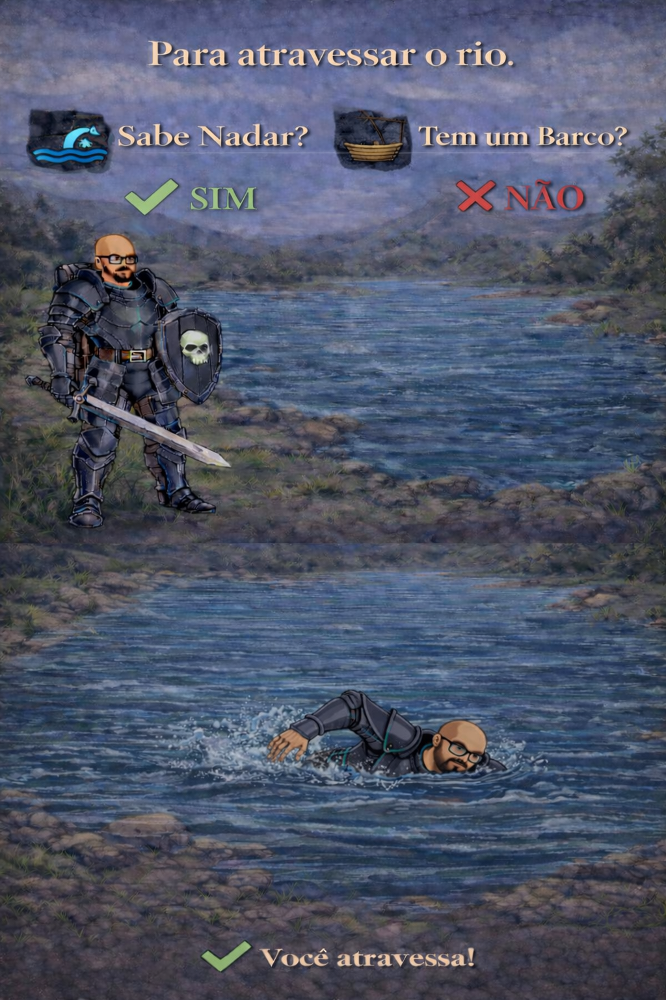
        
        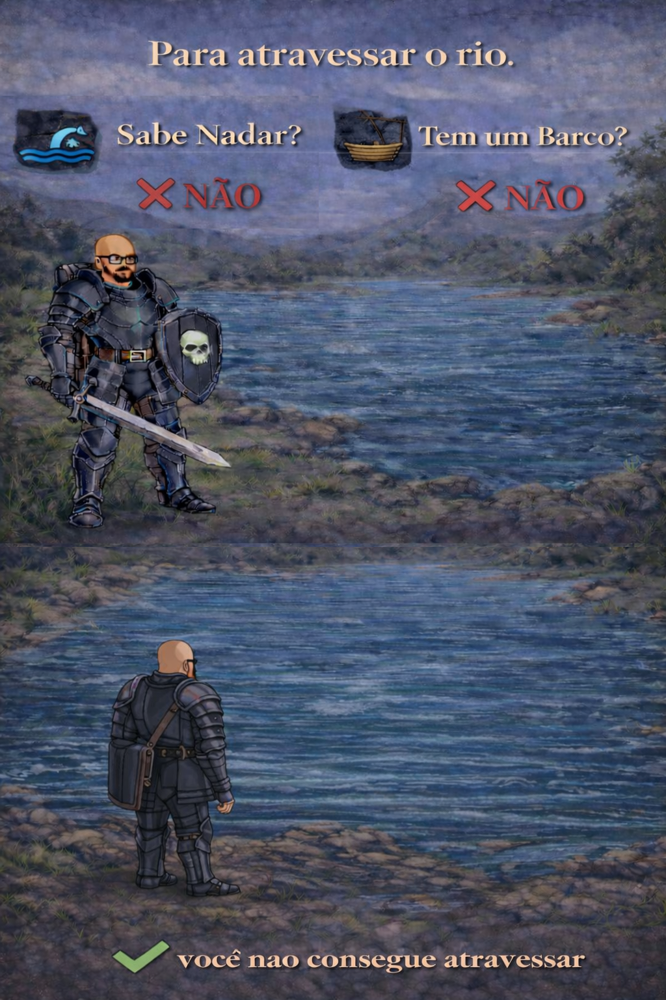
        
    

### Exemplo Prático: O Sistema de “Missao Cumprida”

Vamos ver como isso ficaria no **VisuAlg** simulando uma missão de guilda:

```java
algoritmo "Verificador_de_Quest"
var
   moedas, nivel : inteiro
   tem_passe_livre : logico
   pode_entrar : logico
inicio
   moedas <- 50
   nivel <- 15
   tem_passe_livre <- falso

   // Expressão Lógica Complexa:
   // O jogador entra se tiver 100 moedas E nível maior que 10
   // OU se ele tiver o Passe Livre do Rei.
   
   pode_entrar <- ((moedas >= 100) e (nivel > 10)) ou (tem_passe_livre = verdadeiro)

   escreval("O herói pode entrar no castelo? ", pode_entrar)
   // No nosso caso, resultará em FALSO (não tem moedas suficientes e não tem o passe)
fimalgoritmo
```


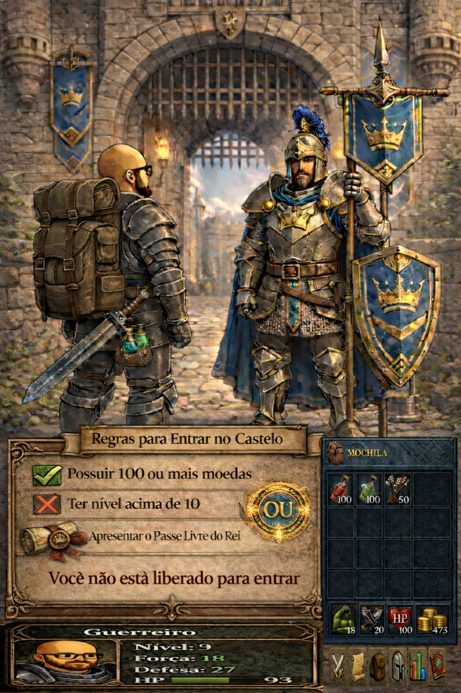

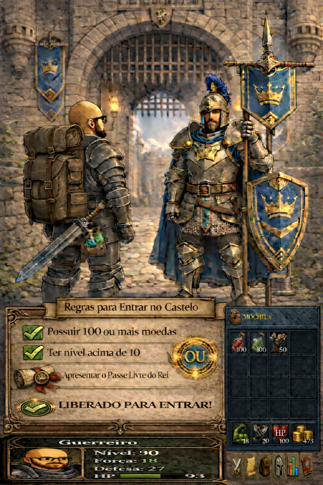

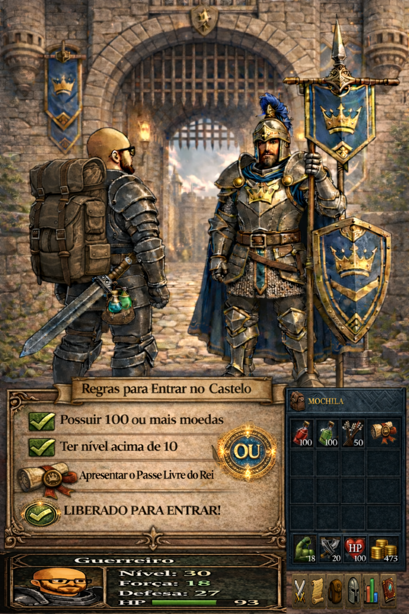

## Exercicios do modulo

### **1. Qual o resultado para a expressão: (3 <= 3 )?**

- [ ]  Verdadeiro
- [ ]  Falso

### **2. Qual o resultado para a expressão: (2 > 3) e (1=1) ?**

- [ ]  Verdadeiro
- [ ]  Falso

### **3. Qual o resultado para a expressão: (3*2*10)/10 <> 6 ?**

- [ ]  Verdadeiro
- [ ]  Falso
- [ ]  

### **4. Qual o resultado para a expressão:
a <- 8
b <- 10
((a*b/2)+b > 20) e (8=a) ?**

- [ ]  Verdadeiro
- [ ]  Falso

### 5. Qual o resultado para a expressão: 
a <- 8.5 b <- 10.2 ((a*4/2)+b > a+b) ?

- [ ]  Verdadeiro
- [ ]  Falso

### **6. Qual o resultado para a expressão:Seguindo a ordem, diga os significados dos seguintes operadores lógicos:>, <, >=, <=, =, <>**

- [ ]  Maior, menor, menor ou igual, maior ou igual, igual, diferente.
- [ ]  Maior, menor, maior ou igual, menor ou igual, igual, diferente.
- [ ]  Menor, maior, maior ou igual, menor ou igual, igual, diferente.
- [ ]  Menor, maior, menor ou igual, maior ou igual, igual, diferente.

### **7. Qual o resultado para a expressão:Diga o resultado final das duas questões utilizando os seguintes operadores de sentença:
((1=1) ou (2<>2))(5>2) e (3<>2) e (10 >= 100)**

- [ ]  Falso e falso
- [ ]  Verdadeiro e falso
- [ ]  Verdadeiro e verdadeiro
- [ ]  Falso e verdadeiro

# Nivel  7: Estruturas

## **Estruturas de Condição**

As **Estruturas de Condição** são os “divisores de aguas” de qualquer código. Você aprenderá que um programa inteligente não é aquele que faz tudo, mas aquele que sabe **o que não fazer** dependendo da situação.

No universo dos **RPGs**, as estruturas condicionais são o que chamamos de “Arvore de Dialogos” ou “Eventos de Script”

### O fluxograma da decisão

Vamos visualizar como isso funciona. O **Losango** é o nosso ponto de decisão. Se o valor testado for **verdadeiro**, seguimos por um corredor; se for **falso**, seguimos por outro.

### A escrita no VisuAlg (linguagem de Máquina didática)

Vamos Cria um exemplo de cadastro de maiores de idade para uma situação de RPG: **O Recrutamento para a Guerra.**

1. **Condicional Simples (se… entao):** Aqui, so agimos se o requisitor for atendido. Se não for, o programa ignora o bloco e segue para a proxima linha.
    
    ```java
    se (idade >= 18) entao
       escreval("Você foi recrutado para o exército do Rei!")
    fimse
    ```
    
    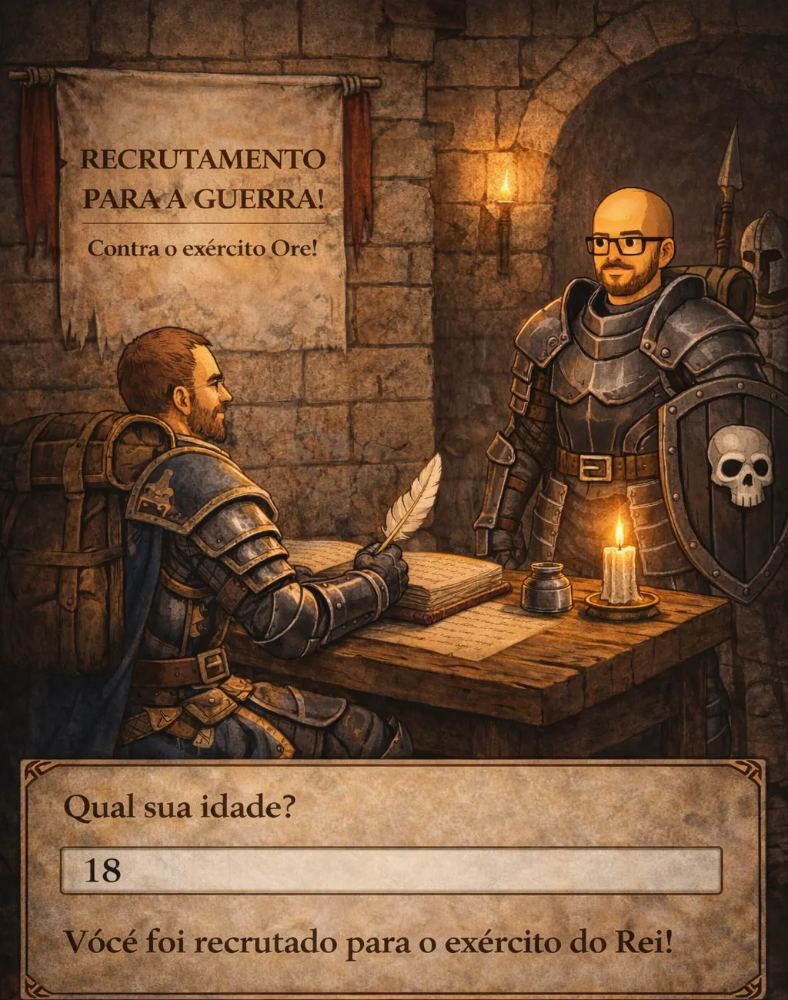
    
2. **Condicional Composta (se… entao… senao):** Aqui tratamos os dois lados da moeda. Seria a mensagem de erro para menores de idade.

```java
algoritmo "Cadastro_Aventureiro"
var
   idade : inteiro
inicio
   escreva("Digite sua idade para entrar na Guilda: ")
   leia(idade)

   se (idade >= 18) entao
      escreval("Cadastro realizado! Bem-vindo, herói.")
   senao
      escreval("Erro: Você é jovem demais para perigos. Volte para a escola!")
   fimse
fimalgoritmo
```


1. **Condições Sequenciais e Encadeadas (o “Ninho”):** Podemos ter condições consecutivas. Imagina um sistema de niveis de dificuldade:
    - **Se Nivel < 10:** “Inimigos Fracos”
    - **Se Nivel > 10 e Nivel < 20:** “Inimigos Médios”
    - **Senao:** “Inimigos Letais”
        
        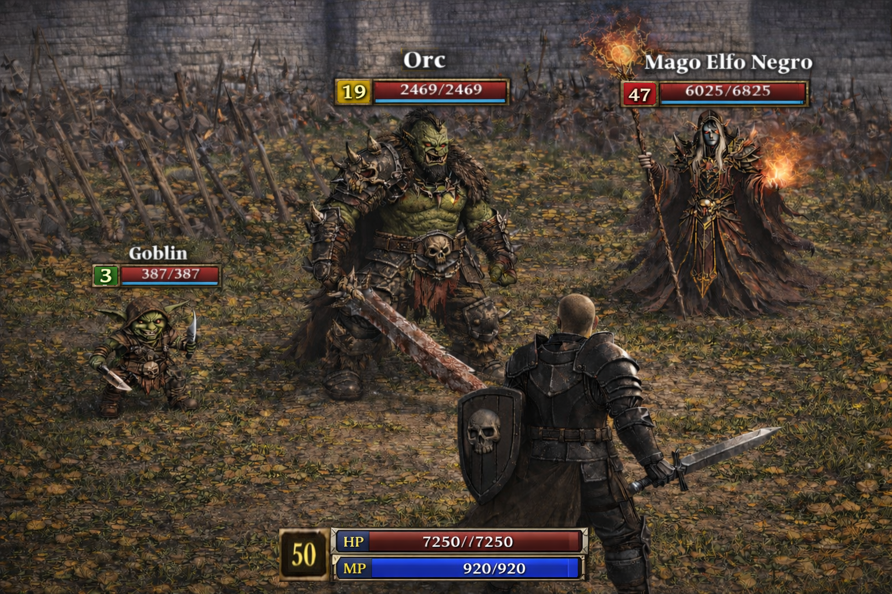
        
    
    Isso no VisuAlg é feito colocando um **SE** dentro do **SENAO** do outro, criando uma estrutura em cascata.
    

### Regras do Mestre (Programador)

1. **Todo SE precisa de um FIMSE:** se voce esquecer o **FIMSE**, o VisuAlg vai dizer que o “escopo” nao foi fechado. É como abrir um parentese e nunca fecha.
2. **Identação é Vida:** Perceba que as ações dentro do **SE** ficam um pouco mais para a direita (um espaço de **TAB**). Isso ajuda voce a ler o codigo e entender o que pertence a qual condição.
3. **Expressão Lógica:** O que vai entre o **SE** e o **ENTAO** deve sempre resultar em **VERDADEIRO** ou **FALSO**.

### Exercicio de fixação:

Tente criar um algoritmo onde o jogador digita o valor de um **Dado (1 a 20)**:

- Se o dado for **20**, escreva "Acerto Crítico!".
- Se o dado for **1**, escreva "Falha Crítica!".
- Se for qualquer outro valor, escreva "Ataque Normal".

## Exercicios do modulo

### **1. Em qual condição o algoritmo a seguir irá entrar?
idade <- 18se (idade > 18) entaoescreval ("Maior de idade")fimsese (idade < 18) entaoescreval ("Menor de idade")fimse**

- [ ]  Entrará no primeiro SE
- [ ]  Entrará no segundo SE
- [ ]  Entrará nos dois SE
- [ ]  Não entrará em nenhum dos dois

### **2. Em qual condição o algoritmo a seguir irá entrar?
nome <- "Joaozinho"se (nome = "Joao") entaoescreval ("SE")senaoescreval ("SENAO")fimse**

- [ ]  Entrará no SE
- [ ]  Entrará no SENAO
- [ ]  Entrará nos dois
- [ ]  Não entrará em nenhum dos dois

### **3. Em qual condição o algoritmo a seguir irá entrar?
se (1 = 1) e (2 <> 1) entaoescreval ("SE")senaoescreval ("SENAO")fimse**

- [ ]  Entrará no SE
- [ ]  Entrará no SENAO
- [ ]  Entrará nos dois
- [ ]  Não entrará em nenhum dos dois

### **4. Em qual condição o algoritmo a seguir irá entrar?
resultado <- 1resultado <- resultado+10se (resultado = 10) entaoescreval ("SE")senaoescreval ("SENAO")fimse**

- [ ]  Entrará no SE
- [ ]  Entrará no SENAO
- [ ]  Entrará nos dois
- [ ]  Não entrará em nenhum dos dois

### **5. Em qual condição o algoritmo a seguir irá entrar?
resultado <- 1resultado <- resultado+10resultado <- resultado*2se (resultado > 10) ou (resultado = 20) entaoescreval ("SE")senaoescreval ("SENAO")fimse**

- [ ]  Entrará no SE
- [ ]  Entrará no SENAO
- [ ]  Entrará nos dois
- [ ]  Não entrará em nenhum dos dois

## Estruturas de Repetição

Voce chegou à “Boss Battle” da lógica de programação. Se você entender **Estruturas de Repetição** (Tambem chamadas de **Loops** ou **Laços**), você deixa de ser um “usuario” e passa a ser um “mestre” que controla o tempo e o esforço do computador.

No RPG, repetições são fundamentais: é o que faz o monstro atacar varias vezes, o que controla os turnos de uma batalha ou o que permite que voce venda varios itens da mochila de uma só vez.

```java
para i de 1 ate 5 faca
   escreval(i, "º Ataque: O Guerreiro golpeia o Orc!")
   dano_total <- dano_total + 10
fimpara
```

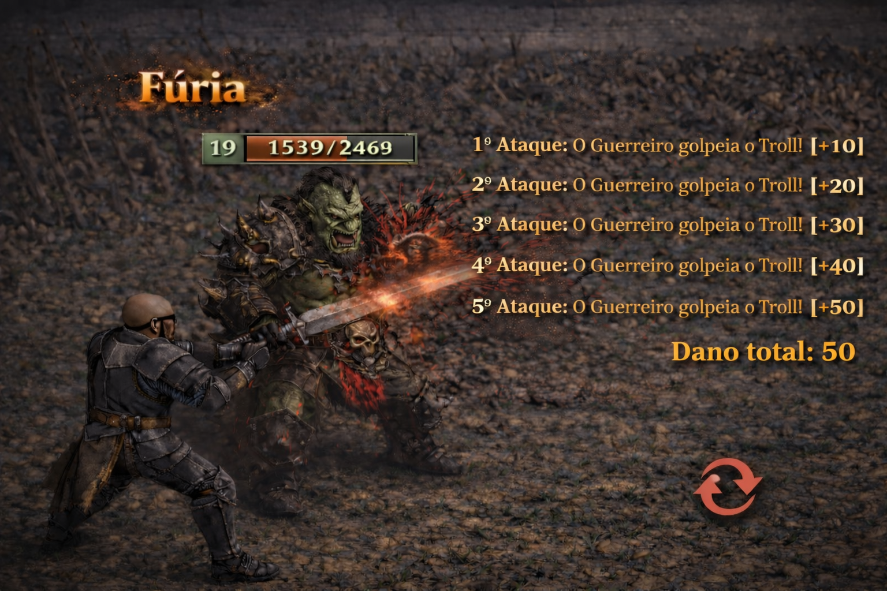

## 🔁 Estrutura **Para…Faça** — *O Combo de Ataques*

## 📌 Especificações

### 🧠 O que é o **Para…Faça**

A estrutura **Para…Faça** é um laço de repetição usado quando:

- Você **sabe exatamente quantas vezes** o bloco deve repetir
- Existe uma **contagem definida** (início, fim e passo)
- O controle da repetição é feito por uma **variável contadora**

👉 Diferente do `Enquanto` e do `Repita`, o `Para` é ideal para repetições **controladas e previsíveis**.

### 🎮 Analogia RPG

Um guerreiro ativa a habilidade **Fúria**.

- A habilidade ataca o inimigo **exatamente 5 vezes**
- Nem mais, nem menos
- Cada ataque faz parte de um **combo fechado**

➡️ Isso é um `para`: você já sabe quantos ataques vão acontecer.

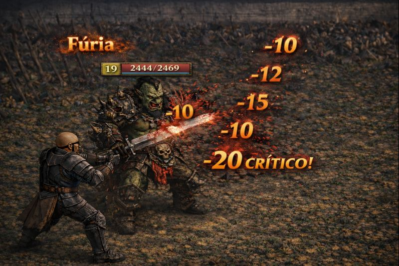

### 🧱 Estrutura geral

```pascal
para contador de inicio ate fim faca
   // comandos
fimpara
```

- O contador começa no valor inicial
- A cada repetição ele é incrementado automaticamente
- Quando o valor final é alcançado, o laço termina

## 🧪 Código completo — **VisuAlg (Combo de Ataques)**

```pascal
algoritmo "ComboDeAtaques"

var
   ataque: inteiro
   dano: inteiro
   hp_monstro: inteiro

inicio

   hp_monstro <- 100
   dano <- 15

   escreval("O guerreiro ativa a habilidade FÚRIA!")
   escreval("HP inicial do monstro: ", hp_monstro)
   escreval("")

   para ataque de 1 ate 5 faca
      escreval("Ataque ", ataque, " do combo!")
      hp_monstro <- hp_monstro - dano
      escreval("Dano causado: ", dano)
      escreval("HP restante do monstro: ", hp_monstro)
      escreval("")
   fimpara

   escreval("Combo finalizado!")
   escreval("HP final do monstro: ", hp_monstro)

fimalgoritmo
```

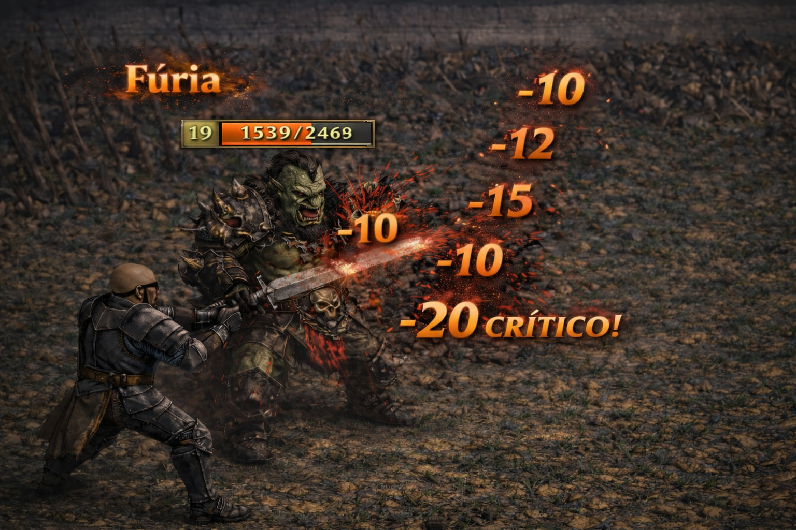

## 🔁 Estrutura **Enquanto…Faça** — *A Batalha de Turnos*

### 📌 Especificações

### 🧠 O que é o **Enquanto…Faça**

A estrutura **Enquanto…Faça** é um laço de repetição usado quando:

- **Não sabemos quantas vezes** o bloco será executado
- Existe uma **condição necessária para continuar**
- A condição é **testada ANTES** de executar o bloco

👉 Se a condição já for falsa no início, o bloco **não executa nenhuma vez**.

### 🎮 Analogia RPG

Uma batalha acontece **enquanto** o monstro ainda tiver vida.

- Se o monstro tem **HP > 0** → a luta acontece
- Se o monstro já começa com **HP = 0** → a luta **nem começa**

➡️ Exatamente como o `enquanto`: **testa antes de lutar**.

### 🧱 Estrutura geral

```pascal
enquanto (condicao) faca
   // comandos
fimenquanto

```

- ✅ Condição verdadeira → executa o bloco
- ❌ Condição falsa → pula o bloco

## 🧪 Código completo — **VisuAlg (Batalha de Turnos)**

```pascal
algoritmo "BatalhaDeTurnos"

var
   hp_monstro: inteiro
   dano_jogador: inteiro

inicio

   escreva("Informe o HP inicial do monstro: ")
   leia(hp_monstro)

   enquanto (hp_monstro > 0) faca
      escreval("O monstro ainda está vivo!")
      escreval("Continue atacando!")
      leia(dano_jogador)

      hp_monstro <- hp_monstro - dano_jogador

      escreval("HP atual do monstro: ", hp_monstro)
      escreval("")
   fimenquanto

   escreval("O monstro foi derrotado!")

fimalgoritmo
```

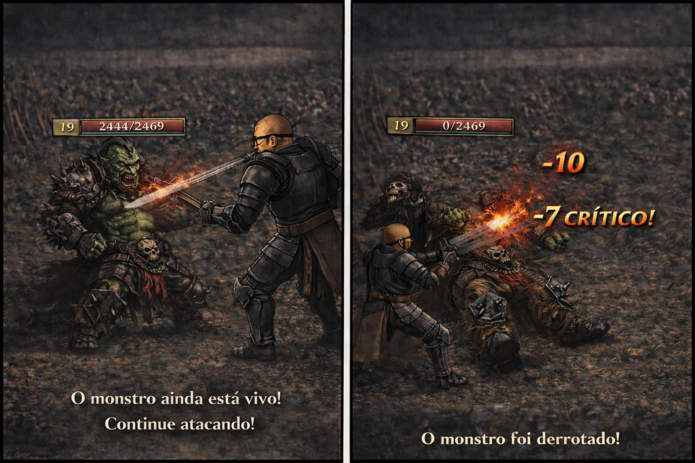

## 🔁 Estrutura **Repita…Até** — *O Menu da Taverna*

### 📌 Especificações

### 🧠 O que é o **Repita…Até**

A estrutura **Repita…Até** é um laço de repetição que:

- Executa o bloco **pelo menos uma vez**
- Testa a condição **somente no final**
- Continua repetindo **enquanto a condição for FALSA**
- Encerra quando a condição se torna **VERDADEIRA**

👉 Diferente do `Enquanto`, que testa antes, o `Repita` **garante uma execução mínima**.

### 🎮 Analogia RPG

Você entra em uma **taverna**.

1. O vendedor mostra o menu de itens
2. Pergunta: *“Deseja comprar mais algo?”*
3. Você só sai da taverna **quando responder “Não”**

➡️ Mesmo que você não compre nada, o menu aparece ao menos uma vez.

### 🧱 Estrutura geral

```pascal
repita
   // comandos
ate (condicao)

```

- ❌ Condição falsa → repete
- ✅ Condição verdadeira → encerra

## 🧪 Código completo — **VisuAlg (Loja de Poções)**

```pascal
algoritmo "MenuDaTaverna"

var
   opcao: inteiro

inicio

   repita
      escreval("=== TAVERNA DO AVENTUREIRO ===")
      escreval("1. Poção de Vida")
      escreval("2. Antídoto")
      escreval("3. Sair")
      escreva("Escolha uma opção: ")
      leia(opcao)

      se (opcao = 1) entao
         escreval("Você comprou uma Poção de Vida!")
      senao
         se (opcao = 2) entao
            escreval("Você comprou um Antídoto!")
         senao
            se (opcao = 3) entao
               escreval("Você sai da taverna. Boa sorte na jornada!")
            senao
               escreval("Opção inválida! Escolha novamente.")
            fimse
         fimse
      fimse

      escreval("") // linha em branco para organizar

   ate (opcao = 3)

fimalgoritmo
```

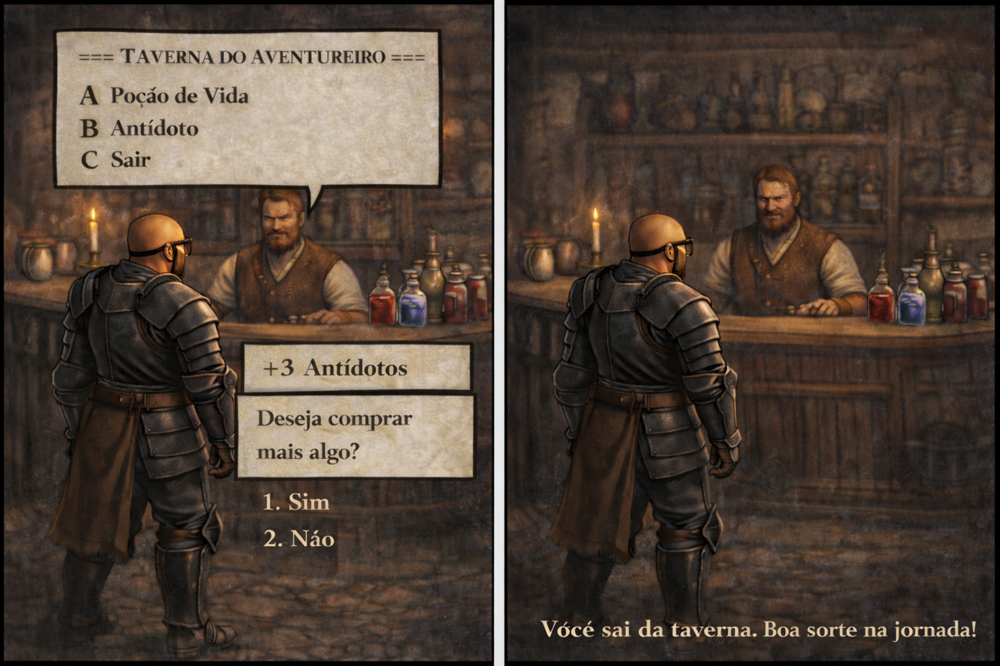

### Tabela Comparativa de Repetições

| **Estrutura** | **Quando usar?** | **Analogia RPG** |
| --- | --- | --- |
| **Para** | Sabe o fim (ex: 10 vezes). | Treinar 10 flechadas no alvo. |
| **Enquanto** | Testa antes (0 ou mais vezes). | Atacar enquanto o HP for > 0. |
| **Repita** | Testa depois (1 ou mais vezes). | Tentar abrir uma fechadura até conseguir. |

### Exercício de fixação

**Qual estrutura você usaria para fazer o Mago lançar meteoros enquanto ele tiver mana suficiente?**

1. Se usar o `Para`, você assume que ele sempre lançará uma quantidade fixa.
2. Se usar o `Enquanto`, ele verifica se tem mana antes de cada meteoro. (Mais seguro!)

## Exercicios do modulo

### **1. Estruturas de repetição nos ajudam a não economizar códigos.**

- [ ]  Verdadeiro
- [ ]  Falso

### **2. As variáveis de controle das estruturas de repetição não têm necessidade de serem declaradas nos blocos de variáveis.**

- [ ]  Verdadeiro
- [ ]  Falso

### **3. Abaixo teremos o início da estrutura de repetição para..faça, informe qual a forma correta de se fazer.**

- [ ]  Para 1 de 1 ate 2 faca
- [ ]  Para variavel de 1 ate 2 faca
- [ ]  Para variavel de 1 ate variável faca
- [ ]  Para 1 de variável até 2 faca

### **4. Abaixo teremos o início da estrutura de repetição enquanto..faça, informe qual a forma correta de se fazer.**

- [ ]  Enquanto (i < 10) faca
- [ ]  Enquanto (faca) i
- [ ]  Enquanto (i)
- [ ]  Enquanto (i < 10)

### **5. Abaixo teremos o início da estrutura de repetição repita..até, informe qual a forma correta de se fazer.**

- [ ]  Repita..ate()
- [ ]  Repita.. I ate(10)
- [ ]  Repita(i<=10)..ate()
- [ ]  Repita..ate(i<=10)

## Variaveis indexadas

Você chegou ao ultimo nivel de sua jornada: os **vetores** (ou Variaveis Indexadas). Se as variaveis comuns são “Slots” individuais de equipamentos, as **VARIAVEIS INDEXADAS** sao seu **Inventario Completo** ou o seu **Grimorio de Magias**.

No RPG, imagine que voce tem uma mochila. Em vez de criar uma variavel para **item1**, **item2**, **item3**… você cria uma unica estrutura chamada **mochila** com varios espeços numerados.

### O que é um Vetor (Variavel Indexada)?

Um vetor é uma lista de elementos do **mesmo tipo guardados sob o mesmo nome.**

Para acessar cada item, usamos um **indice** (numero do endereço).

**Analogia de RPG: A Barra de Atalhos**

Imagine sua barra de magias com 5 espaços:

- Espaço [1]: Bola de Fogo
- Espaço [2]: Cura
- Espaço [3]: Escudo
- Espaço [4]: Teleporte
- Espaço [5]: Invisibilidade

Em ves de 5 variaveis, voce tem um **vetor [1 . . . 5] de caractere**.

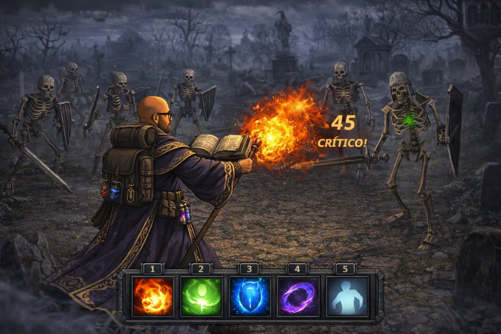

### **Declaração no VisuAlg**

Como voce mostrou, a sintaxe economiza muito espaço. veja a diferença:

**Sem Vetor (trabalhoso):** `item1, item2, item3, item4, item5: caractere`

**Com Vetor (Elegante):** `itens: vetor [1..5] de caractere`

### Acessando os Dados (o “Endereço”)

Para colocar ou tirar algo de um **vetor**, voce deve dizer o nome dele e a posiçao entre colchetes **[ ]**.

**Ex.: Organizando a Equipe**

```java
algoritmo "Equipe_RPG"
var
   membros: vetor [1..3] de caractere
inicio
   // Atribuindo valores por índice
   membros[1] <- "Guerreiro"
   membros[2] <- "Mago"
   membros[3] <- "Arqueiro"
   
   escreval("O líder do grupo é o ", membros[1])
fimalgoritmo
```

### O poder Supremo: Vetores + Estruturas de Repetição

A maior vantagem do vetor é que voce pode usar o **para…faca** para percorrer todos os itens de uma vez. É como se o computador fizesse uma varredura automática em toda a sua mochila.

**Exemplo: Listando o Inventário**

```java
algoritmo "Listar_Mochila"
var
   inventario: vetor [1..4] de caractere
   i: inteiro
inicio
   inventario[1] <- "Poção de Vida"
   inventario[2] <- "Espada Longa"
   inventario[3] <- "Escudo de Madeira"
   inventario[4] <- "Corda de 10m"
   
   escreval("--- ITENS NA MOCHILA ---")
   
   // O contador 'i' vai servir como o índice [1], [2], [3] e [4]
   para i de 1 ate 4 faca
      escreval("Slot ", i, ": ", inventario[i])
   fimpara
fimalgoritmo
```

### Regras de Ouro:

1. **Unicidade:** Todos os itens de um vetor devem ser do mesmo tipo (todos Inteiros, ou todos Caracteres, etc.).
2. **Índice:** O número dentro dos colchetes `[i]` é a localização exata na memória.
3. **Organização:** Use vetores sempre que tiver dados "do mesmo grupo" (notas de alunos, nomes de jogadores, preços de itens).

## Exercicios do módulo

### **1. Qual o jeito correto para imprimir o valor "divisão"?
var 
operacoes: vetor [1..4] de Literaliniciooperacoes[1] <- "soma"operacoes[2] <- "divisão"operacoes[3] <- "subtração"operacoes[4] <- "multiplicação"**

- [ ]  escreval(operacoes)
- [ ]  escreval(operacoes(2))
- [ ]  escreval(operacoes[2])
- [ ]  escreval(operacoes->2)

### **2. Eu preciso de uma variável de 4 índices. Onde é definido isso?**

- [ ]  No meio do algoritmo
- [ ]  Na atribuição do valor para a variável
- [ ]  Na declaração da variável
- [ ]  No final, quando está na estrutura de repetição
- [ ]  

### **3. Quais as vantagens de se utilizar variáveis indexadas? (Questão Múltipla Escolha)**

- [ ]  Não possui
- [ ]  Mais seguro
- [ ]  Menos código
- [ ]  Guardar mais valores

# Nivel  8:Funçoes

### 1. Funções Nativas (Os Itens Consumíveis)

Como você viu, o VisuAlg já te dá alguns "itens" prontos. O mais usado em jogos é o **Randi**, que funciona exatamente como **rolar um dado**.

- **Randi(20) + 1**: Sorteia um número de 1 a 20. É o algoritmo perfeito para um teste de perícia!

---

### 2. Funções do Usuário (Criando seus Próprios Feitiços)

Aqui é onde você vira o mestre. Você define o nome, o que a função precisa para funcionar (Parâmetros) e o que ela devolve (Retorno).

### Exemplo Prático: O Feitiço de Cura

Vamos criar uma função que recebe o valor de uma poção e a vida atual do herói, e devolve a vida nova.

Snippet de código

`algoritmo "Santuario_das_Funcoes"
var
   vida_atual, pocao: inteiro

// --- Declaração da Função (O Pergaminho de Magia) ---
funcao calcular_cura(vida, valor_pocao: inteiro): inteiro
inicio
   // Ela soma os valores e "devolve" (retorna) o resultado
   retorne vida + valor_pocao
fimfuncao

inicio
   vida_atual <- 40
   pocao <- 25
   
   escreval("Vida antes: ", vida_atual)
   
   // Chamando a função (Conjurando o feitiço)
   vida_atual <- calcular_cura(vida_atual, pocao)
   
   escreval("O herói usou uma poção!")
   escreval("Vida depois: ", vida_atual)
fimalgoritmo`

---

### 3. Variáveis Locais vs. Globais (O Escopo)

Isso é muito importante no SENAI!

- **Variável Global:** É como o clima do mapa. Todos os personagens (funções) conseguem ver e sentir.
- **Variável Local:** É como um item dentro de uma casa trancada. Só quem mora lá (quem está dentro da função) pode usar. Quando a função termina, essa variável "desaparece".

[Image showing local versus global scope in programming]

---

### Por que usar Funções? (A Vantagem do Mestre)

1. **Reutilização:** Se você tem 50 monstros, não precisa escrever o código de "dar dano" 50 vezes. Você cria a função `causarDano()` e a chama sempre que precisar.
2. **Organização:** Seu algoritmo principal fica limpo e fácil de ler, como um sumário de um livro.
3. **Manutenção:** Se a regra de dano mudar, você só altera em **um lugar** (dentro da função) e todo o jogo se atualiza sozinho.

---

### 🏆 Desafio de Mestre: A Prova Final

Você concluiu toda a jornada! Agora que você conhece as Funções, o "Troféu de Ouro" está ao seu alcance.

**Para exercitarmos:** Tente criar no seu VisuAlg uma função chamada `verificar_morte`. Ela deve receber a `vida` (inteiro) e retornar um valor **Lógico** (`verdadeiro` se a vida for menor ou igual a zero, e `falso` caso contrário).

# Nivel 9: Revisão

### 1. Representação de Algoritmos (O Mapa da Mina)

O algoritmo é a lógica antes da linguagem. É a estratégia que você traça antes de começar a digitar.

- **Fluxograma:** É a representação **visual**. Cada forma geométrica tem um papel rígido:
    - **Oval:** Início ou Fim do código.
    - **Retângulo:** Processamento ou Ação (ex: calcular dano).
    - **Losango:** Decisão (ex: verificar se o herói tem HP > 0).
- **Pseudocódigo (Portugol):** É a escrita em linguagem humana estruturada. Ele permite focar na lógica sem se preocupar com as regras complexas de linguagens como Java ou C++ em um primeiro momento.

### 2. Tipos de Dados (A Natureza da Informação)

O computador precisa saber quanta memória reservar para cada dado. No mundo dos jogos, cada estatística tem seu tipo:

- **Inteiro (int):** Armazena números exatos, sem casas decimais.
    - *Uso:* Quantidade de flechas, pontos de experiência (XP), nível.
- **Real (float/double):** Números com casas decimais.
    - *Uso:* Peso de itens no inventário, multiplicadores de bônus (1.5x), distância entre personagens.
- **Literal/Caractere (String):** Sequências de letras, números ou símbolos dentro de aspas `" "`.
    - *Uso:* Nome do personagem, descrição de itens, falas de NPCs.
- **Lógico (Boolean):** O tipo mais simples: **Verdadeiro** ou **Falso**.
    - *Uso:* "O personagem está envenenado?", "A porta está trancada?".

### 3. Variáveis e Atribuição (O Inventário Dinâmico)

A variável é um espaço rotulado na memória para guardar dados que podem mudar.

- **Declaração:** No bloco `var`, você "contrata" o espaço de memória dando um nome e um tipo a ele.
- **Atribuição (`<-`):** É o comando de "receber". A variável à esquerda recebe o resultado do que está à direita.
    - `mana <- mana - 10` (Pega o valor atual, subtrai 10 e guarda o novo valor no mesmo lugar).

### 4. Expressões Lógicas e Relacionais (O Teste de Perícia)

- **Operadores Relacionais:** Comparações diretas (`>`, `<`, `=`, `<>`, `>=`, `<=`).
- **Operadores Lógicos (E / OU):**
    - **E (AND):** Rigoroso. Só é verdade se **todas** as condições forem aceitas. (Ex: Nível 10 **E** ter a Chave).
    - **OU (OR):** Flexível. É verdade se **pelo menos uma** condição for aceita. (Ex: Ser Mago **OU** ter um Pergaminho de Magia).

### 5. Estruturas de Condição (A Árvore de Escolhas)

- **Simples:** Executa uma ação apenas se a condição for verdadeira.
- **Composta (`SE... SENAO`):** Cria dois caminhos. Se a condição for falsa, o programa executa obrigatoriamente o bloco `senao`.
- **Encadeada:** Vários testes sequenciais para lidar com múltiplas possibilidades (ex: verificar se o jogador escolheu Guerreiro, Mago ou Arqueiro).

### 6. Estruturas de Repetição (Loops)

- **PARA (For):** Ideal para contagens definidas (ex: disparar 3 flechas).
- **ENQUANTO (While):** Verifica a condição **antes** de agir. Ideal para situações de risco (ex: atacar enquanto o inimigo estiver vivo).
- **REPITA (Until):** Age primeiro e verifica **depois**. Garante que a ação ocorra ao menos uma vez (ex: um menu de loja que aparece antes de perguntar se você quer sair).

### 7. Estruturas Avançadas

- **Vetores (Arrays):** Listas numeradas do mesmo tipo. Em vez de 10 variáveis para itens, você tem um `inventario[1..10]`.
- **Funções:** Blocos de código independentes que executam tarefas específicas.
    - **Parâmetros:** Dados que você envia para a função processar.
    - **Retorno:** O resultado que a função devolve para quem a chamou.

## ⚔️ Desafios de Maestria (RPG Challenge)

### 🥉 Bronze (Easy)

1. **Ficha de Herói:** Peça o nome e a classe do herói e imprima uma mensagem de boas-vindas.
2. **Loja de Itens:** Peça o preço de dois itens e exiba a soma total.
3. **Fronteira:** Verifique se o nível do jogador é maior ou igual a 5 para permitir a passagem por um portão.

### 🥈 Silver (Medium)

1. **Ataques Consecutivos:** Use um `PARA` para solicitar o dano de 3 golpes e mostre o dano acumulado.
2. **Sorteio de Saque:** Use a função de sorteio (`randi`) para gerar um número de 1 a 10. Se sair 10, o jogador encontrou um "Item Lendário".

### 🥇 Gold (Difficult)

1. **Lista de Magias:** Crie um **Vetor** com 4 nomes de magias. Peça ao usuário para escolher um índice (1 a 4) e exiba a magia correspondente.
2. **Drenagem de Vida:** Use um `ENQUANTO` para reduzir a vida de um monstro (inicialmente 100) pedindo o dano do usuário a cada turno até que a vida chegue a 0.

### 💎 Diamond (Difficult Level 2)

1. **Sistema de Combate Profissional:** * Implemente uma **Função** que calcule o dano crítico (recebe dano base e retorna o dobro).
    - Use um **Vetor** para armazenar a vida de 3 inimigos diferentes.
    - Use um **Loop** para percorrer esse vetor e, para cada inimigo, chame a função de dano crítico e subtraia da vida dele até que todos os inimigos no vetor tenham vida menor ou igual a zero.
    - Ao final, use uma **Expressão Literal** para anunciar a vitória do herói pelo nome.

# Desafio Final

### 1. Quais são os 2 tipos de representações mais utilizados em algoritmos?

Escolha uma opção:

- [ ]  Fluxograma e pseudocódigo.
- [ ]  Nenhuma das alternativas.
- [ ]  Fluxograma e programação.
- [ ]  Organograma e código.

### 2. Verifique se a afirmação é verdadeira ou falsa. Uma expressão literal sempre resultará em um tipo literal.

Escolha uma opção:

- [ ]  **Verdadeiro**
- [ ]  **Falso**

### 3. Seguindo a ordem, diga o significado dos seguintes operadores lógicos:

>, <, >=, <=, =, <>

Escolha uma opção:

- [ ]  Menor, maior, menor ou igual, maior ou igual, igual, diferente.
- [ ]  Menor, maior, maior ou igual, menor ou igual, igual, diferente.
- [ ]  Maior, menor, maior ou igual, menor ou igual, igual, diferente.
- [ ]  Maior, menor, menor ou igual, maior ou igual, igual, diferente.

### 4. Informe qual o resultado da expressão aritmética será exibido no algoritmo a seguir:

var

x,y,resultado:Real

inicio

x <- 2

y <- 5

resultado <- x/y*3+(1-8)*x+30

escreva (resultado)

fimalgoritmo

- [ ]  8.2
- [ ]  17.2
- [ ]  16.2
- [ ]  14.2

### 5. Informe qual o resultado da expressão aritmética será exibido no algoritmo a seguir:

resultado <- 1

resultado <- resultado+10

se (resultado = 10) entao

escreval ("SE")

senao

escreval ("SENAO")

fimse

- [ ]  Não entrará em nenhum dos dois
- [ ]  Entrará no SENAO
- [ ]  Entrará nos dois
- [ ]  Entrará no SE

### 6. Abaixo teremos o início da estrutura de repetição para..faça, informe qual a forma correta de se fazer:

- [ ]  Para 1 de variável até 2, faça.
- [ ]  Para 1 de 1 até 2, faça.
- [ ]  Para variável de 1 até 2, faça.
- [ ]  Para variável de 1 até variável, faça.

### 7. Diga o resultado final das duas questões utilizando os seguintes operadores de sentença:

((1=1) ou (2<>2))

(5>2) e (3<>2) e (10 >= 100)

- [ ]  Verdadeiro e verdadeiro.
- [ ]  Verdadeiro e falso.
- [ ]  Falso e falso.
- [ ]  Falso e verdadeiro.

### 8. Observe a seguinte expressão e responda qual será o resultado final:

a <- 8.5

b <- 10.2

((a*4/2)+b > a+b) ?

- [ ]  **Verdadeiro.**
- [ ]  **Falso.**

### 9. Quais as vantagens de se utilizar variáveis indexadas? Analise as afirmativas a seguir:

- [ ]  I. Mais seguro.
- [ ]  II. Guardar mais valores.
- [ ]  III. Menos código.
- [ ]  IV. Não possui.

Assinale a alternativa que apresenta as afirmativas corretas:

- [ ]  II e III.
- [ ]  II e IV.
- [ ]  I e II.
- [ ]  I e IV.
- [ ]  III e IV.

### 10. Informe qual alternativa NÃO é de fato o nome de uma variável aceita no VisuAlg:

- [ ]  tipo_operacao
- [ ]  nota1
- [ ]  meuResultado
- [ ]  1numero
- Material de apoio PDF do curso Lógica de Programação do Senai EAD:
    
    [logicaDeProgramacao.pdf](logicaDeProgramacao.pdf)